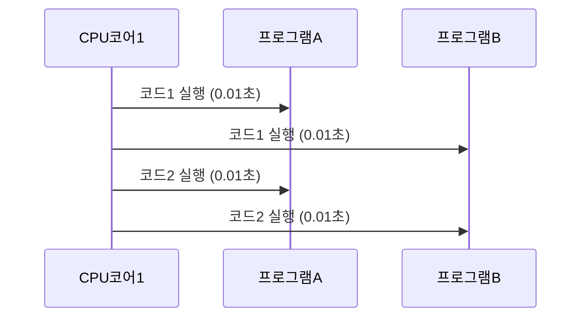
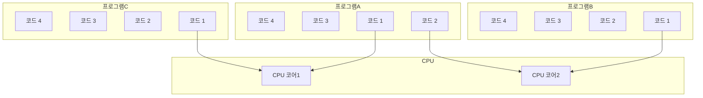

# 🧠 멀티태스킹 / 멀티 프로세싱 핵심 개념 요약
## 1️⃣ 단일 프로그램 실행
- CPU 코어가 1개일 경우, 한 번에 하나의 프로그램만 실행 가능
- 예전 컴퓨터는 음악 프로그램이 끝나야 워드 프로그램을 실행할 수 있었음

## 2️⃣ 멀티태스킹 (Multitasking)
- 단일 CPU 코어가 여러 프로그램을 빠르게 번갈아 실행하여 동시에 실행되는 것처럼 보이게 함
- 시분할(Time Sharing) 방식: 예를 들어 0.01초 단위로 프로그램 A → B → A → B 순으로 반복
- 운영체제가 **스케줄링(Scheduling)** 을 통해 실행 순서와 시간을 결정

## 3️⃣ 멀티프로세싱 (Multiprocessing)
- 두 개 이상의 CPU 코어가 물리적으로 동시에 여러 프로그램을 실행
- 예: 프로그램 A와 B를 각각 다른 코어에서 동시에 실행

## 4️⃣ 멀티태스킹 vs 멀티프로세싱

| 구분             | 멀티태스킹 (Multitasking)                          | 멀티프로세싱 (Multiprocessing)                          | 설명 요약 |
|------------------|-----------------------------------------------------|----------------------------------------------------------|-----------|
| 관점             | 소프트웨어 (운영체제 중심)                         | 하드웨어 (CPU 코어 중심)                                 | 시스템 관점 차이 |
| 실행 방식        | 하나의 CPU 코어가 여러 작업을 빠르게 번갈아 수행   | 여러 CPU 코어가 물리적으로 동시에 작업 수행              | 병렬 vs 시분할 |
| CPU 코어 수      | 1개                                                 | 2개 이상                                                  | 물리적 자원 차이 |
| 처리 방식        | 시간 분할 (Time Sharing)                            | 병렬 처리 (Parallel Execution)                           | 처리 전략 |
| 예시             | 음악 + 워드 프로그램을 번갈아 실행                  | 프로그램 A와 B를 각각 다른 코어에서 동시에 실행          | 실제 상황 |

## 🧠 핵심 요약
- 멀티태스킹: 하나의 CPU 코어가 여러 작업을 빠르게 번갈아 수행 → 동시에 실행되는 것처럼 보임
- 멀티프로세싱: 여러 CPU 코어가 각 작업을 병렬로 처리 → 실제로 동시에 실행됨

## 📌 참고 개념: 프로세스와 스레드
- 프로세스: 실행 중인 프로그램의 독립된 단위 (메모리 공간, 자원 분리)
- 스레드: 프로세스 내부의 실행 흐름. 여러 스레드가 하나의 프로세스 자원을 공유하며 병렬 실행 가능

---

