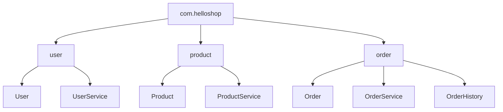

# 📦 패키지란?
- 자바에서 관련된 클래스들을 그룹화하기 위한 기능
- 운영체제의 폴더(디렉토리) 개념과 유사
- 프로그램이 커질수록 기능별로 클래스를 분류할 수 있어 유지보수에 유리

## 🧩 예시: 쇼핑몰 시스템 클래스 분류
### 🔹 작은 프로그램
```
Order
User
Product
```

### 🔹 큰 프로그램
```
User, UserManager, UserHistory
Product, ProductCatalog, ProductImage
Order, OrderService, OrderHistory
ShoppingCart, CartItem
Payment, PaymentHistory
Shipment, ShipmentTracker
```

### 🔹 패키지로 분류
```
user     → User, UserManager, UserHistory  
product  → Product, ProductCatalog, ProductImage  
order    → Order, OrderService, OrderHistory  
cart     → ShoppingCart, CartItem  
payment  → Payment, PaymentHistory  
shipping → Shipment, ShipmentTracker  
```


## 📌 패키지 사용법
### 1️⃣ 패키지 선언
- 클래스 파일의 첫 줄에 패키지 이름을 선언
```java
package pack;
```

### 2️⃣ 클래스 정의
```java
public class Data {
    public Data() {
        System.out.println("패키지 pack Data 생성");
    }
}
```

### 3️⃣ 하위 패키지 사용
```java
package pack.a;

public class User {
    public User() {
        System.out.println("패키지 pack.a 회원 생성");
    }
}
```

### 4️⃣ 다른 클래스에서 사용
```java
package pack;

public class PackageMain1 {
    public static void main(String[] args) {
        Data data = new Data();                 // 같은 패키지 → 경로 생략 가능
        pack.a.User user = new pack.a.User();   // 다른 패키지 → 전체 경로 필요
    }
}
```


## ✅ 실행 결과
```
패키지 pack Data 생성  
패키지 pack.a 회원 생성
```

## 🎯 정리: 자바 패키지 핵심 개념
| 항목               | 설명                                               | 비고                          |
|--------------------|----------------------------------------------------|-------------------------------|
| package 선언        | 클래스 파일의 첫 줄에 패키지 이름을 선언             | `package 패키지명;`           |
| 클래스 분류         | 관련 클래스들을 기능별로 묶어 관리                   | 유지보수와 구조화에 유리       |
| 패키지명.클래스명   | 다른 패키지의 클래스를 사용할 때 전체 경로 필요       | `pack.a.User` 등              |
| public 키워드       | 다른 패키지에서 접근하려면 클래스나 생성자에 필요     | 접근 제어자에서 자세히 다룸    |
| 디렉토리 구조        | 패키지는 실제로 폴더 구조로 매핑됨                   | `pack/a/User.java` 등         |


---

# import

## 💡 핵심 개념 요약
- import는 다른 패키지의 클래스를 사용할 때 코드를 간결하게 만들어줌
- import pack.a.User; → User user = new User(); 가능
- import pack.a.*; → pack.a의 모든 클래스 사용 가능
- 클래스 이름이 중복될 경우: 하나만 import, 나머지는 전체 경로로 사용
- 패키지는 폴더 구조와 반드시 일치해야 하며, 소문자로 작성하는 것이 관례
- 계층 구조처럼 보여도 a, a.b, a.c는 완전히 별개의 패키지


## 🎯 정리: 자바 import와 패키지 구조
| 항목               | 설명                                                                 |
|--------------------|----------------------------------------------------------------------|
| import 사용 목적    | 다른 패키지의 클래스를 사용할 때 전체 경로 생략 가능                    |
| import 위치         | `package` 선언 다음 줄에 작성                                          |
| 전체 경로 생략      | `import pack.a.User` → 코드에서 `User`만 사용 가능                     |
| 와일드카드(*) 사용  | `import pack.a.*` → 해당 패키지의 모든 클래스 사용 가능                 |
| 클래스 이름 중복    | `pack.a.User`, `pack.b.User` → 하나만 import, 나머지는 전체 경로 사용 |
| 패키지 이름 규칙    | 소문자 사용, 도메인 이름을 거꾸로 사용 (`com.company.app`)             |
| 패키지와 폴더 구조  | 패키지 이름과 실제 폴더 위치는 반드시 일치해야 함                       |
| 계층 구조           | `a`, `a.b`, `a.c`는 서로 다른 패키지 → 반드시 import 필요               |


---

# Package 구조도

helloshop 프로젝트의 디렉토리 구조를 트리 형태로 표현한 구조도입니다.  
각 패키지와 클래스가 어떻게 구성되어 있는지 한눈에 파악할 수 있도록 정리:  

## 📦 디렉토리 구조 요약
com.helloshop
  ├── user
  │   ├── User.java
  │   └── UserService.java
  ├── product
  │   ├── Product.java
  │   └── ProductService.java
  └── order
      ├── Order.java
      ├── OrderService.java
      └── OrderHistory.java


## 🧩 샘플 코드: OrderService 사용 예시
```java
// 파일 위치: com/helloshop/order/OrderService.java
package com.helloshop.order;

import com.helloshop.user.User;
import com.helloshop.product.Product;

public class OrderService {
    public void order() {
        // 다른 패키지의 클래스 사용
        User user = new User();
        user.userId = "user123";
        user.name = "JungHwan";

        Product product = new Product();
        product.productId = "prod456";
        product.price = 30000;

        Order order = new Order(user, product);

        System.out.println("주문 생성 완료: " + user.name + " → " + product.productId);
    }
}
```
## 📘 실행 클래스 예시
```java
// 파일 위치: com/helloshop/OrderApp.java
package com.helloshop;

import com.helloshop.order.OrderService;

public class OrderApp {
    public static void main(String[] args) {
        OrderService orderService = new OrderService();
        orderService.order();
    }
}
```


## ✅ 실행 결과 예시
```
주문 생성 완료: JungHwan → prod456
```

## 📌 설명
- com.helloshop은 최상위 패키지이며, 기능별로 user, product, order 하위 패키지로 나뉩니다
- 각 하위 패키지에는 관련된 클래스들이 포함되어 있어 기능 중심의 모듈화가 잘 되어 있습니다
- 이 구조는 유지보수와 확장에 매우 유리하며, 실제 프로젝트에서도 많이 사용되는 패턴입니다


## helloshop 디렉토리 구조 (Mermaid)



### 🧾 설명 요약: helloshop 패키지 구조

| 패키지 이름             | 포함 클래스 목록                          | 설명                                |
|-------------------------|-------------------------------------------|-------------------------------------|
| com.helloshop.user      | User, UserService                         | 사용자 정보 및 사용자 관련 기능 관리 |
| com.helloshop.product   | Product, ProductService                   | 상품 정보 및 상품 관련 기능 관리     |
| com.helloshop.order     | Order, OrderService, OrderHistory         | 주문 처리 및 주문 이력 관리          |


## 🔄 패키지 간 관계
- OrderService는 User, Product, Order를 사용함 → import 필요
- Order 생성자에 public이 붙어 있어야 다른 패키지에서 호출 가능
- 각 패키지는 기능 중심으로 분리되어 있어 유지보수와 확장에 유리함

---

