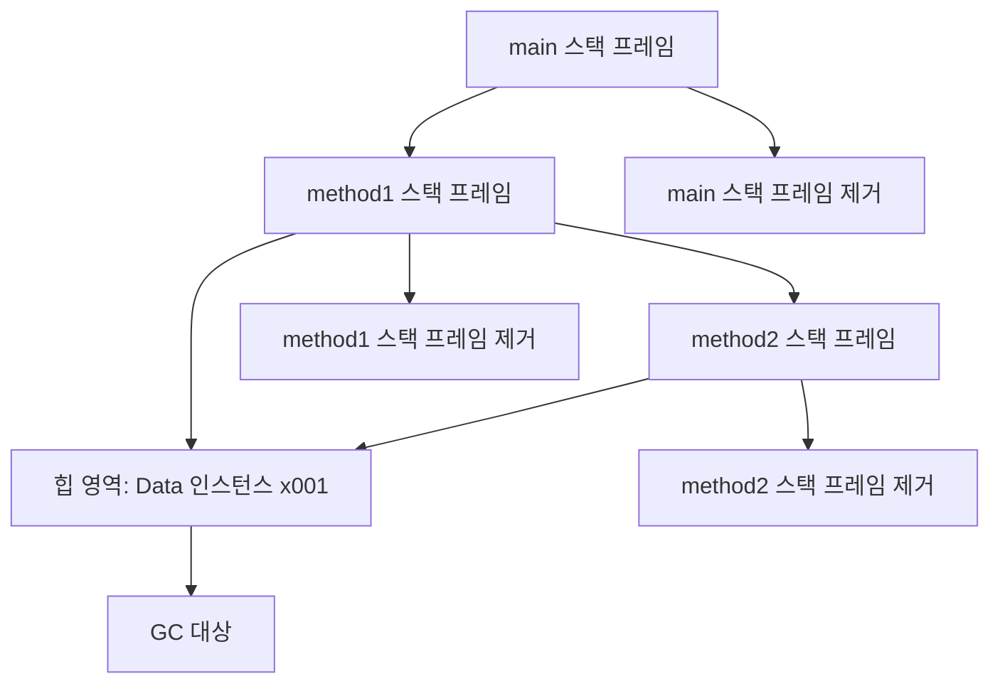
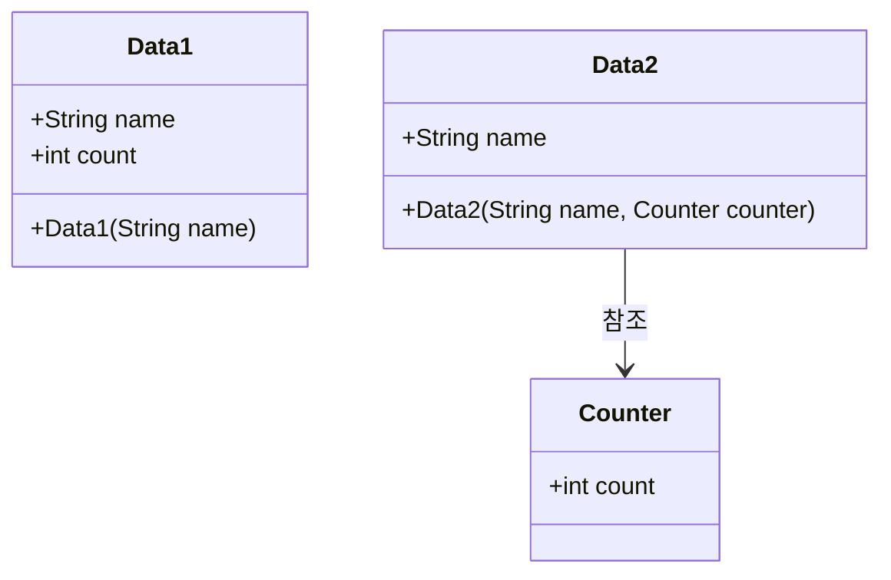
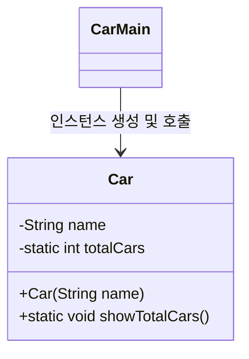
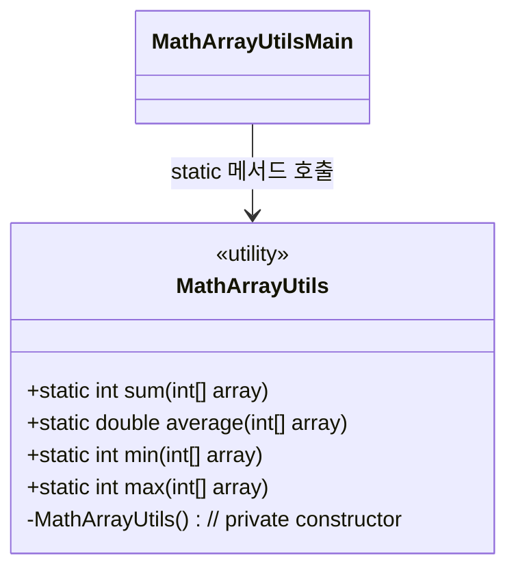

# 🧠 자바 메모리 구조 요약
자바 메모리 구조에 대한 내용을 비유와 실제 구조를 중심으로 깔끔하게 요약:

## 🎨 비유로 이해하는 자바 메모리
| 메모리 영역   | 비유 설명             | 실제 역할                          |
|---------------|------------------------|-------------------------------------|
| 메서드 영역   | 붕어빵 틀              | 클래스 정보 저장                    |
| 스택 영역     | 붕어빵을 굽는 과정     | 메서드 실행 시 스택에 쌓임          |
| 힙 영역       | 완성된 붕어빵 (`new`) | 객체와 배열이 생성되는 공간        


## 🧩 실제 자바 메모리 구조
### 1️⃣ 메서드 영역 (Method Area)
- 클래스의 바이트코드, 필드, 메서드, 생성자 정보 저장
- static 변수 저장 공간 포함
- 런타임 상수 풀: 리터럴 상수 및 공통 데이터 관리
- 모든 쓰레드가 공유
### 2️⃣ 스택 영역 (Stack Area)
- 각 쓰레드마다 하나의 실행 스택 생성
- 스택 프레임: 메서드 호출 시 생성, 종료 시 제거
- 지역 변수, 연산 결과, 호출 정보 저장
### 3️⃣ 힙 영역 (Heap Area)
- 객체와 배열이 생성되는 공간
- new 키워드로 생성된 인스턴스가 위치
- 가비지 컬렉션(GC)이 관리하며, 참조되지 않는 객체는 제거됨

### 📌 메서드 공유 구조
- 같은 클래스로 생성된 여러 인스턴스는 메서드 코드를 공유
- 인스턴스마다 변수는 독립적이지만, 메서드는 메서드 영역에서 공통 실행
- 메서드 호출 시, 실제로는 메서드 영역의 코드를 참조함

---

# 🧠 스택과 큐 자료 구조 요약
 아래는 스택과 큐 자료 구조에 대한 내용을 핵심 개념 중심으로 정리:

## 📦 스택 (Stack)
- 정의: 나중에 넣은 데이터가 먼저 나오는 구조
- 동작 방식: 한쪽 끝에서만 데이터를 넣고 뺌
- 특징:
- 후입 선출 (LIFO: Last In First Out)
- 메서드 호출, 실행 흐름 관리에 적합
### 🔁 예시 흐름
```
1(넣기) → 2(넣기) → 3(넣기) → 3(빼기) → 2(빼기) → 1(빼기)
```


## 📦 큐 (Queue)
- 정의: 먼저 넣은 데이터가 먼저 나오는 구조
- 동작 방식: 앞에서 빼고 뒤에서 넣음
- 특징:
- 선입 선출 (FIFO: First In First Out)
- 대기열, 이벤트 처리 등에 적합

### 🔁 예시 흐름
```
1(넣기) → 2(넣기) → 3(넣기) → 1(빼기) → 2(빼기) → 3(빼기)
```

## 🧩 비교 표
| 자료 구조 | 특징        | 동작 방식       | 활용 예시                     |
|-----------|-------------|----------------|-------------------------------|
| 스택      | 후입 선출   | 위에서 넣고 위에서 뺌 | 메서드 호출, 실행 흐름 관리     |
| 큐        | 선입 선출   | 뒤에서 넣고 앞에서 뺌 | 대기열, 이벤트 처리, 작업 스케줄 |


## 💡 자바와의 연결
- 자바의 스택 영역은 메서드 호출 시 스택 프레임이 쌓이는 구조로, 스택 자료 구조와 동일한 원리로 작동합니다.
- 메서드가 호출되면 스택에 쌓이고, 종료되면 제거됩니다.

## 🧠 자바 스택 영역 요약
### 📌 스택 영역이란?
- 자바에서 메서드 호출 시 생성되는 메모리 공간
- 각 메서드 호출마다 스택 프레임이 생성됨
- 지역 변수와 매개변수는 해당 스택 프레임에 저장됨
- 메서드가 종료되면 스택 프레임과 변수는 제거됨

### 🧪 코드 실행 흐름 (JavaMemoryMain1)
```
main() → method1(10) → method2(20) → method1 종료 → main 종료
```

## 📦 스택 프레임 변화
| 단계 | 스택 프레임 상태                     | 포함된 지역 변수 및 매개변수       |
|------|--------------------------------------|------------------------------------|
| ①    | main()                               | args                               |
| ②    | method1() → main()                   | m1, cal                             |
| ③    | method2() → method1() → main()       | m2                                  |
| ④    | method1() → main()                   | m1, cal                             |
| ⑤    | main()                               | args                                |
| ⑥    | (종료)                                | (모든 스택 프레임 제거됨)           |


```mermaid
sequenceDiagram
    participant JVM
    participant main()
    participant method1()
    participant method2()

    JVM->>main(): 호출 → 스택 프레임 생성 (args)
    main->>method1(): 호출 → 스택 프레임 생성 (m1, cal)
    method1->>method2(): 호출 → 스택 프레임 생성 (m2)
    method2-->>method1(): 종료 → method2 스택 프레임 제거
    method1-->>main(): 종료 → method1 스택 프레임 제거
    main-->>JVM: 종료 → main 스택 프레임 제거
```

## 🧩 핵심 정리
- 자바는 메서드 호출 시마다 스택 프레임을 생성한다.
- 스택 프레임에는 지역 변수와 매개변수가 저장된다.
- 메서드가 종료되면 해당 스택 프레임과 변수는 제거된다.
- 스택 프레임이 모두 제거되면 프로그램도 종료된다.

---


# 🧠 자바 메모리 구조: 스택 영역 + 힙 영역
📦 실행 흐름 요약
- main() 실행 → 스택 프레임 생성 (args)
- method1() 호출 → 스택 프레임 생성 (data1)
- new Data(10) → 힙 영역에 Data 인스턴스 생성 (x001)
- data1 변수는 x001 참조값을 가짐
- method2(data1) 호출 → 스택 프레임 생성 (data2)
- data2도 x001 참조값을 가짐 → 같은 객체를 참조
- method2() 종료 → data2 제거
- method1() 종료 → data1 제거
- main() 종료 → 모든 스택 프레임 제거
- x001 객체는 더 이상 참조되지 않음 → GC 대상

## 🧪 시각화


## 🧩 자바 메모리 구조 요약

| 메모리 영역   | 저장 내용                          | 특징 및 역할                                      |
|---------------|------------------------------------|--------------------------------------------------|
| 메서드 영역   | 클래스 정보, static 변수, 메서드 코드 | 모든 객체가 공유. 프로그램 시작 시 로딩됨         |
| 스택 영역     | 지역 변수, 매개변수, 스택 프레임     | 메서드 호출 시 생성. 메서드 종료 시 제거됨        |
| 힙 영역       | 객체(인스턴스), 배열 (`new` 사용 시) | 참조값으로 접근. GC에 의해 관리됨                 |

## ✅ 핵심 정리
- 지역 변수는 스택 영역에 저장되고, 객체는 힙 영역에 생성됨
- 객체는 참조값을 통해 스택 변수와 연결됨
- 참조가 모두 사라지면 객체는 GC(가비지 컬렉션) 대상이 됨
- 메서드 영역은 클래스 정보와 static 변수, 메서드 코드를 공유함


## 🧠 static 변수의 필요성 요약
```java

public class Data1 {
    public String name;
    public int count;
    public Data1(String name) {
        this.name = name;
        count++;
    }
}
```


### 1️⃣ 인스턴스 변수로 카운트 저장 (Data1)
- 각 객체마다 count 변수가 따로 존재
- 생성자에서 count++ 해도 서로 영향을 주지 않음
- 결과적으로 모든 객체의 count 값은 항상 1
#### ❌ 문제점
- 객체 수를 정확히 세지 못함
- 인스턴스 변수는 객체 간 공유되지 않음


```java
public class Counter {
public int count;
}

public class Data2 {
    public String name;
    public Data2(String name, Counter counter) {
        this.name = name;
        counter.count++;
    }
}
```
### 2️⃣ 외부 객체로 카운트 저장 (Data2 + Counter)
- Counter 객체를 별도로 생성하여 공유
- Data2 생성 시 Counter.count++ 수행
- 모든 Data2 인스턴스가 같은 Counter를 참조
✅ 장점
- 정확한 객체 수 카운팅 가능
- Counter.count 값은 1 → 2 → 3으로 증가
- 
#### ⚠️ 단점
- 별도의 Counter 클래스 필요
- 생성자 매개변수가 늘어나고 코드가 복잡해짐

### 📦 해결 방향
- static 변수를 사용하면 클래스 수준에서 공유 가능
- 별도 객체 없이도 모든 인스턴스가 같은 변수에 접근 가능

### 🧩 시각화



### 💡 핵심 정리
- 인스턴스 변수는 객체마다 따로 존재 → 공유 불가
- static 변수는 클래스 전체에서 공유됨 → 객체 수 카운팅에 적합
- 외부 객체(Counter)를 통해 공유하는 방식은 가능하지만 구조가 복잡해짐

---

# 🧠 static 변수 요약
## 📌 개념 정리
### 📌 static 변수 개념 정리
| 항목             | 설명                                                   |
|------------------|--------------------------------------------------------|
| 저장 위치         | 메서드 영역                                             |
| 접근 방식         | 클래스명으로 직접 접근 (`Data3.count`)                |
| 공유 범위         | 클래스 전체에서 하나만 존재, 모든 인스턴스가 공유함     |
| 생성 시점         | 클래스가 처음 로딩될 때 생성됨                         |
| 인스턴스 필요 여부 | 객체 생성 없이도 접근 가능                             |

### 코드 
```java
public class Data3 {
 public String name;
 public static int count; //static

 public Data3(String name) {
  this.name = name;
  count++;
 }
}
```

### 🧪 코드 흐름 요약
```java
Data3 data1 = new Data3("A"); // count = 1
Data3 data2 = new Data3("B"); // count = 2
Data3 data3 = new Data3("C"); // count = 3
```
- count는 static 변수이므로 모든 인스턴스가 하나의 변수를 공유
- 생성자에서 count++ 호출 시, 메서드 영역의 count 값이 증가됨

### 🧩 클래스 구조
```mermaid
classDiagram
    class Data3 {
        +String name
        +static int count
        +Data3(String name)
    }

    note for Data3::count
        클래스 전체에서 공유됨
        메서드 영역에 저장됨
    end note
```


### 🍞 비유로 이해
- Data3 클래스는 붕어빵 틀
- name은 각 붕어빵(인스턴스)의 이름
- count는 붕어빵 틀이 직접 관리하는 숫자계산기 (하나만 존재)

### ✅ 핵심 요약
- static 변수는 클래스 수준에서 하나만 존재하며 모든 인스턴스가 공유함
- 메서드 영역에 저장되며, 인스턴스 생성과 무관하게 유지됨
- 클래스명으로 직접 접근 가능 (`Data3.count`)
- 객체 수를 세거나 공용 데이터를 관리할 때 유용함

---

## 🧠 static 변수 정리

### 📌 멤버 변수(필드)의 종류
| 변수 종류       | static 키워드 | 저장 위치     | 접근 방식           | 생명주기                  |
|----------------|----------------|----------------|----------------------|----------------------------|
| 인스턴스 변수   | ❌ 없음         | 힙 영역         | 인스턴스를 통해 접근 | 객체 생성 ~ GC 제거 시까지 |
| 클래스 변수     | ✅ 있음         | 메서드 영역     | 클래스명으로 접근    | 클래스 로딩 ~ JVM 종료 시까지 |

### ⏳ 변수의 생명주기
| 변수 종류       | 저장 위치     | 생성 시점                  | 제거 시점                  |
|----------------|----------------|-----------------------------|-----------------------------|
| 지역 변수       | 스택 영역       | 메서드 호출 시              | 메서드 종료 시              |
| 인스턴스 변수   | 힙 영역         | 객체 생성 시                | GC(가비지 컬렉션) 발생 시   |
| 클래스 변수     | 메서드 영역     | 클래스 로딩 시              | JVM 종료 시                 |


### 📦 static 변수의 특징
- 클래스에 소속된 변수 → 객체 없이도 접근 가능
- 프로그램 시작 시 생성되어 JVM 종료 시까지 유지
- 모든 인스턴스가 하나의 static 변수를 공유
- 메서드 영역에 저장되어 가장 긴 생명주기를 가짐

### 🧩 접근 방식 비교
```java
Data3 data4 = new Data3("D");
System.out.println(data4.count);     // 인스턴스를 통한 접근 (비추천)
System.out.println(Data3.count);     // 클래스를 통한 접근 (추천)
```

- 둘 다 같은 static 변수에 접근하지만,
- 클래스를 통한 접근이 더 명확하고 안전함

### 🍞 비유로 이해
- Data3 클래스는 붕어빵 틀
- name은 각 붕어빵(인스턴스)의 이름
- count는 붕어빵 틀이 직접 관리하는 숫자계산기 → 하나만 존재

### 🧪 클래스 구조
```mermaid
classDiagram
    class Data3 {
        +String name
        +static int count
        +Data3(String name)
    }

    note for Data3::count
        클래스 전체에서 공유됨
        메서드 영역에 저장됨
        프로그램 시작 시 생성됨
    end note
```
---

# 🧠 static 메서드 정리
## 📌 개념 비교
| 구분             | 인스턴스 메서드                          | static 메서드 (정적 메서드)               |
|------------------|------------------------------------------|-------------------------------------------|
| 선언 방식        | `public String deco(String str)`         | `public static String deco(String str)`   |
| 호출 방식        | `new 클래스명().메서드()`                 | `클래스명.메서드()`                        |
| 객체 필요 여부   | ✅ 필요 (인스턴스 생성 후 호출)           | ❌ 불필요 (클래스명으로 직접 호출)         |
| 사용 목적        | 인스턴스 변수나 상태를 활용할 때         | 단순 기능 제공, 공용 유틸리티 함수 등      |


## 🧪 예제 흐름 요약
### 예제

```java
public class DecoUtil1 {
 public String deco(String str) {
  String result = "*" + str + "*";
  return result;
 }
}

public class DecoUtil2 {
 public static String deco(String str) {
  String result = "*" + str + "*";
  return result;
 }
}
```

### 1️⃣ 인스턴스 메서드
```java
DecoUtil1 utils = new DecoUtil1();
String deco = utils.deco("hello java");
```

- 객체 생성 후 메서드 호출
- 메서드 내부에서 인스턴스 변수는 사용하지 않음 → 비효율적
### 2️⃣ static 메서드
```java
String deco = DecoUtil2.deco("hello java");
```

- 클래스명으로 직접 호출
- 객체 생성 없이 기능 사용 가능 → 효율적

## 🧩 용어 정리
| 용어             | 설명                                                                 |
|------------------|----------------------------------------------------------------------|
| 인스턴스 메서드   | `static` 없이 선언된 메서드. 객체를 생성해야 호출 가능               |
| static 메서드     | `static` 키워드가 붙은 메서드. 클래스명으로 직접 호출 가능           |
| 클래스 메서드     | static 메서드의 또 다른 표현. 클래스에 소속된 공용 메서드라는 의미     |
| 정적 메서드       | static 메서드의 공식 용어. 프로그램 실행 중 클래스에 고정되어 있음     |

## 💡 핵심 요약
- static 메서드는 객체 없이 클래스명으로 직접 호출 가능
- 인스턴스 변수나 상태를 사용하지 않는 기능은 static 메서드로 만드는 것이 효율적
- static 메서드는 공용 유틸리티 기능, 계산, 변환 등에 자주 사용됨

---

# 🧠 static 메서드 정리
## 📌 static 메서드 개념 요약
| 항목               | 설명                                                                 |
|--------------------|----------------------------------------------------------------------|
| 정의 방식           | `static` 키워드를 붙여 클래스에 직접 소속된 메서드로 선언             |
| 호출 방식           | 클래스명으로 직접 호출 (`클래스명.메서드()`)                          |
| 객체 필요 여부       | ❌ 객체 생성 없이 호출 가능                                            |
| 접근 가능 대상       | 정적 변수, 다른 정적 메서드                                            |
| 접근 불가능 대상     | 인스턴스 변수, 인스턴스 메서드 (객체 참조 없기 때문)                   |

## 🧪 예제 흐름 요약
```java
public class DecoData {
    private int instanceValue;
    private static int staticValue;

    public static void staticCall() {
        //instanceValue++; //인스턴스 변수 접근, compile error
        //instanceMethod(); //인스턴스 메서드 접근, compile error
        staticValue++; //정적 변수 접근
        staticMethod(); //정적 메서드 접근
    }

    public void instanceCall() {
        instanceValue++; //인스턴스 변수 접근
        instanceMethod(); //인스턴스 메서드 접근
        staticValue++; //정적 변수 접근
        staticMethod(); //정적 메서드 접근
    }

    private void instanceMethod() {
        System.out.println("instanceValue=" + instanceValue);
    }
    private static void staticMethod() {
        System.out.println("staticValue=" + staticValue);
    }
}
```

### 클래스: DecoData
```java
private int instanceValue;         // 인스턴스 변수
private static int staticValue;    // 정적 변수

public static void staticCall() {
    staticValue++;                 // ✅ 정적 변수 접근 가능
    staticMethod();                // ✅ 정적 메서드 접근 가능
    // instanceValue++;           // ❌ 컴파일 오류
    // instanceMethod();          // ❌ 컴파일 오류
}

public void instanceCall() {
    instanceValue++;               // ✅ 인스턴스 변수 접근 가능
    instanceMethod();              // ✅ 인스턴스 메서드 접근 가능
    staticValue++;                 // ✅ 정적 변수 접근 가능
    staticMethod();                // ✅ 정적 메서드 접근 가능
}
```

## 📦 실행 결과 요약
```
1.정적 호출         → staticValue = 1
2.인스턴스 호출1    → instanceValue = 1, staticValue = 2
3.인스턴스 호출2    → instanceValue = 1, staticValue = 3
```

- 정적 변수는 모든 인스턴스에서 공유됨
- 인스턴스 변수는 각 객체마다 독립적으로 존재

## 🔍 왜 정적 메서드는 인스턴스 기능을 못 쓰는가?
- 정적 메서드는 클래스명으로 직접 호출되며, 객체 참조값이 없음
- 인스턴스 변수나 메서드를 사용하려면 객체 참조가 필요
- 따라서 정적 메서드 내부에서는 인스턴스 기능을 사용할 수 없음

## ✅ 예외: 참조값을 전달하면 가능
```java
public static void staticCall(DecoData data) {
    data.instanceValue++;       // ✅ 참조값을 통해 인스턴스 변수 접근 가능
    data.instanceMethod();      // ✅ 인스턴스 메서드 호출 가능
}
```

## 🧩 핵심 요약
- 정적 메서드는 클래스에 소속된 공용 기능으로, 객체 없이 호출 가능
- 내부에서는 정적 변수와 정적 메서드만 사용할 수 있음
- 인스턴스 기능을 사용하려면 객체 참조를 매개변수로 전달해야 함
- 정적 메서드는 유틸리티 기능, 계산, 변환 등에 적합

---

# 📚 static import
- 자주 사용하는 정적 메서드나 변수는 import static 으로 간결하게 호출 가능
```java
import static static2.DecoData.*;
// 이후 클래스명 생략 가능
staticCall();
```

- static import는 정적 변수에도 사용 가능

## 🚀 main() 메서드와 static 메서드
- main() 메서드는 프로그램의 시작점이며 정적 메서드이다
- 객체 없이 실행되므로 내부에서 호출하는 메서드도 정적이어야 함
```java
public class ValueDataMain {
    public static void main(String[] args) {
        ValueData valueData = new ValueData();
        add(valueData); // 정적 메서드 호출
    }

    static void add(ValueData valueData) {
        valueData.value++;
        System.out.println("숫자 증가 value=" + valueData.value);
    }
}
```


## ✅ 핵심 요약
- static 메서드는 클래스에 소속된 공용 기능으로, 객체 없이 호출 가능
- 내부에서는 정적 변수와 정적 메서드만 사용할 수 있음
- 인스턴스 기능을 사용하려면 객체 참조를 매개변수로 전달해야 함
- main() 메서드는 대표적인 static 메서드이며, 내부 호출도 static으로 구성해야 함
- static import를 사용하면 코드가 더 간결해짐

---

## 🧩 문제 1: 구매한 자동차 수
### 📌 목표
- Car 객체가 생성될 때마다 차량 수를 카운트
- 총 차량 수를 출력하는 static 메서드 작성
### ✅ 핵심 개념
- totalCars는 클래스 전체에서 공유되는 정적 변수
- showTotalCars()는 객체 없이 호출 가능한 정적 메서드
### 🧪 코드 요약
```java
public class Car {
    private static int totalCars;     // 클래스 변수
    private String name;              // 인스턴스 변수

    public Car(String name) {
        System.out.println("차량 구입, 이름: " + name);
        this.name = name;
        totalCars++;                  // 차량 수 증가
    }

    public static void showTotalCars() {
        System.out.println("구매한 차량 수: " + totalCars);
    }
}
```

### 🖥️ 실행 결과
```
차량 구입, 이름: K3
차량 구입, 이름: G80
차량 구입, 이름: Model Y
구매한 차량 수: 3
```



## 🧩 문제 2: 수학 유틸리티 클래스
### 📌 목표
- 배열을 대상으로 합계, 평균, 최소값, 최대값을 계산하는 유틸리티 클래스 작성
- 객체 생성 없이 사용 가능해야 하며, 실수로 생성하지 못하게 막기
### ✅ 핵심 개념
- 모든 메서드는 static으로 선언
- 생성자를 private으로 선언하여 인스턴스 생성 방지
### 🧪 코드 요약
```java
public class MathArrayUtils {

    private MathArrayUtils() {
        // 인스턴스 생성 방지
    }

    public static int sum(int[] array) {
        int total = 0;
        for (int v : array) total += v;
        return total;
    }

    public static double average(int[] array) {
        return (double) sum(array) / array.length;
    }

    public static int min(int[] array) {
        int min = array[0];
        for (int v : array) if (v < min) min = v;
        return min;
    }

    public static int max(int[] array) {
        int max = array[0];
        for (int v : array) if (v > max) max = v;
        return max;
    }
}
```

### 🖥️ 실행 결과
```
sum=15
average=3.0
min=1
max=5
```


### ✅ 핵심 요약

| 키워드/개념       | 설명                                                   |
|------------------|--------------------------------------------------------|
| static 메서드     | 클래스명으로 직접 호출 가능. 객체 없이 사용 가능         |
| static 변수       | 클래스 전체에서 공유됨. 모든 인스턴스가 하나의 값을 참조 |
| private 생성자    | 유틸리티 클래스의 인스턴스 생성을 방지함                |
| static import     | 클래스명 없이 정적 메서드나 변수에 직접 접근 가능        |

---

