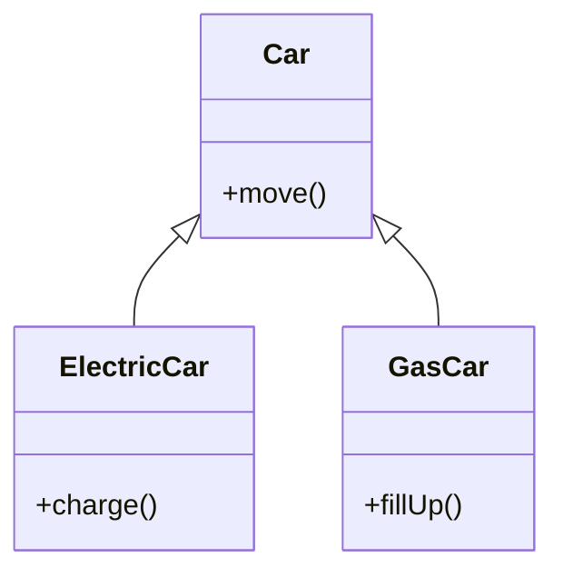

# 상속

## ✅ 왜 상속이 필요한가?

### 코드
```java
public class ElectricCar {
    public void move() {
        System.out.println("차를 이동합니다.");
    }
    public void charge() {
        System.out.println("충전합니다.");
    }
}


public class GasCar {
    public void move() {
        System.out.println("차를 이동합니다.");
    }
    public void fillUp() {
        System.out.println("기름을 주유합니다.");
    }
}

```

### 📌 1. 중복 제거
- ElectricCar와 GasCar 모두 move() 메서드를 가지고 있음.
- 하지만 이 메서드는 완전히 동일한 기능을 수행하죠.
- 이런 중복 코드는 유지보수에 불리하고, 코드 양도 불필요하게 늘어납니다.
  
➡️ 공통 기능을 부모 클래스(Car)에 정의하고, 자식 클래스가 상속받으면 중복 제거 가능!


```java
public class Car {
    public void move() {
        System.out.println("차를 이동합니다.");
    }
}

```

### 📌 2. 추상화와 구조화
- Car는 전기차와 가솔린차를 포괄하는 상위 개념입니다.
- 상속을 통해 Car라는 추상적 개념을 코드 구조에 반영할 수 있음.
  
➡️ 상속은 현실 세계의 관계를 코드로 자연스럽게 모델링하는 도구입니다.

### 📌 3. 다형성 활용 가능
- 상속을 사용하면 Car 타입으로 여러 종류의 자동차를 다룰 수 있음.
```java
Car car1 = new ElectricCar();
Car car2 = new GasCar();

car1.move(); // 전기차 이동
car2.move(); // 가솔린차 이동
```

➡️ 다형성을 통해 코드 유연성과 확장성이 높아집니다.

### 🔧 상속 적용 예시
```java
public class Car {
    public void move() {
        System.out.println("차를 이동합니다.");
    }
}


public class ElectricCar extends Car {
    public void charge() {
        System.out.println("충전합니다.");
    }
}


public class GasCar extends Car {
    public void fillUp() {
        System.out.println("기름을 주유합니다.");
    }
}
```

이렇게 하면 move()는 Car에서 한 번만 정의하고, ElectricCar와 GasCar는 상속받아 사용하면 됩니다.

## 🧠 핵심 요약
| 개념         | 설명                                                                 |
|--------------|----------------------------------------------------------------------|
| 중복 제거     | 공통 기능을 부모 클래스에 정의하여 코드 재사용 가능                   |
| 추상화 구조화 | 상위 개념(Car)으로 하위 개념(ElectricCar, GasCar)을 구조화            |
| 다형성 활용   | 하나의 타입(Car)으로 다양한 객체를 다룰 수 있어 유연한 설계 가능        |
| 유지보수 용이 | 공통 기능 수정 시 부모 클래스만 수정하면 전체 반영 가능                |




---

## 📘 자바 상속 문서 정리
### 1. 상속이란?
- 상속은 객체 지향 프로그래밍(OOP)의 핵심 개념 중 하나로, 기존 클래스의 필드와 메서드를 새로운 클래스에서 재사용할 수 있게 해준다.
- extends 키워드를 사용하여 부모 클래스의 기능을 자식 클래스가 물려받는다.
- 자바는 단일 상속만 지원한다. 즉, 하나의 클래스만 상속 가능하다.

### 📘 2. 용어 정리

| 용어       | 설명                                                                 |
|------------|----------------------------------------------------------------------|
| 부모 클래스 | Car 클래스. 자식 클래스에게 기능을 제공하는 상위 클래스                |
| 자식 클래스 | ElectricCar, GasCar 클래스. Car 클래스를 상속받아 기능을 물려받는 클래스 |
| extends    | 자식 클래스가 부모 클래스를 상속할 때 사용하는 키워드 (`class ElectricCar extends Car`) |


### 3. 코드 구조 예시
#### ✅ 부모 클래스
```java
public class Car {
    public void move() {
        System.out.println("차를 이동합니다.");
    }
}
```

#### ✅ 자식 클래스
```java
public class ElectricCar extends Car {
    public void charge() {
        System.out.println("충전합니다.");
    }
}

public class GasCar extends Car {
    public void fillUp() {
        System.out.println("기름을 주유합니다.");
    }
}
```

#### ✅ 실행 클래스
```java
public class CarMain {
    public static void main(String[] args) {
        ElectricCar electricCar = new ElectricCar();
        electricCar.move();     // 부모 기능
        electricCar.charge();   // 자식 기능

        GasCar gasCar = new GasCar();
        gasCar.move();          // 부모 기능
        gasCar.fillUp();        // 자식 기능
    }
}
```


### 4. 실행 결과
```
차를 이동합니다.
충전합니다.
차를 이동합니다.
기름을 주유합니다.
```

### ✅ 5. 상속의 장점

| 항목           | 설명                                                                 |
|----------------|----------------------------------------------------------------------|
| 코드 재사용     | 공통 기능을 부모 클래스에 정의하여 자식 클래스에서 재사용 가능           |
| 구조화          | 상위 개념(Car) → 하위 개념(ElectricCar, GasCar)로 계층적 설계 가능       |
| 유지보수 용이   | 공통 기능 수정 시 부모 클래스만 수정하면 전체 반영 가능                  |
| 다형성 활용     | 부모 타입(Car)으로 다양한 자식 객체를 다룰 수 있어 유연한 설계 가능       |
| 현실 모델링     | 실제 세계의 관계(예: 자동차 → 전기차, 가솔린차)를 코드로 자연스럽게 표현 가능 |

---

## 📘 자바의 단일 상속과 메모리 구조
### 1. 단일 상속이란?
자바는 클래스의 다중 상속을 지원하지 않으며, 하나의 클래스만 상속받을 수 있습니다.
즉, extends 키워드로 지정할 수 있는 부모 클래스는 오직 하나입니다.
```java
public class ElectricCar extends Car {
    // Car 클래스만 상속 가능
}
```


### 2. 왜 다중 상속을 금지할까?
#### ❌ 다중 상속의 문제점
- 다이아몬드 문제 발생 가능
예: AirplaneCar가 Airplane과 Car를 동시에 상속받을 경우, move() 호출 시 어떤 부모의 메서드를 사용할지 모호함
- 클래스 계층 구조가 복잡해짐
유지보수 어려움, 충돌 가능성 증가  
➡️ 자바는 이러한 문제를 피하기 위해 클래스의 다중 상속을 금지하고, 대신 인터페이스의 다중 구현을 허용합니다.

### 3. 상속과 메모리 구조
객체 생성 시 구조
```java
ElectricCar electricCar = new ElectricCar();
```

- ElectricCar 객체를 생성하면 내부적으로 부모 클래스인 Car도 함께 생성됩니다.
- 참조값은 하나 (x001)이지만, 내부에는 Car와 ElectricCar의 정보가 함께 존재합니다.

## 🧠 메모리 구조 요약
| 참조값 | 내부 구성                          | 설명                                                   |
|--------|-----------------------------------|--------------------------------------------------------|
| x001   | ElectricCar, Car                  | 하나의 객체(x001) 내부에 부모(Car)와 자식(ElectricCar) 정보가 함께 존재 |
|        | ElectricCar의 필드 및 메서드      | 자식 클래스의 고유 기능 (`charge()` 등)               |
|        | Car의 필드 및 메서드              | 부모 클래스의 공통 기능 (`move()` 등)                  |


### 4. 메서드 호출 흐름
#### ✅ electricCar.charge() 호출
- electricCar의 타입은 ElectricCar
- ElectricCar에 charge() 메서드가 있으므로 바로 호출됨
#### ✅ electricCar.move() 호출
- ElectricCar에는 move() 없음
- 상속 관계에 따라 부모 클래스인 Car에서 move()를 찾아 호출

### 🧠 호출 흐름 요약
| 호출 대상         | 탐색 기준                          | 동작 설명                                                                 |
|------------------|-----------------------------------|--------------------------------------------------------------------------|
| 자식 클래스에 존재 | 자식 클래스에서 바로 호출            | `electricCar.charge()` → ElectricCar 내부에서 바로 찾음                   |
| 자식 클래스에 없음 | 부모 클래스에서 탐색                | `electricCar.move()` → ElectricCar에 없으므로 Car로 올라가서 호출         |
| 부모에도 없음      | 상위 부모로 계속 탐색               | 상속 계층을 따라 위로 올라가며 기능 탐색, 끝까지 없으면 컴파일 오류 발생   |
| 호출 기준         | 참조 변수의 타입 기준으로 탐색 시작 | `ElectricCar electricCar = new ElectricCar();` → ElectricCar부터 탐색 시작 |

### ✅ 5. 핵심 요약
| 항목             | 설명                                                                 |
|------------------|----------------------------------------------------------------------|
| 단일 상속         | 자바는 클래스 상속 시 하나의 부모만 지정 가능 (`extends`)             |
| 코드 재사용       | 공통 기능을 부모 클래스에 정의하여 자식 클래스에서 재사용 가능           |
| 구조화            | 상위 개념(Car) → 하위 개념(ElectricCar, GasCar)로 계층적 설계 가능       |
| 메모리 구조 이해   | 객체 생성 시 부모와 자식 클래스가 함께 메모리에 구성됨                   |
| 호출 흐름         | 호출자의 타입 기준으로 기능 탐색, 없으면 부모로 올라가며 기능을 찾음       |

---
