# 🌸 다형성(Polymorphism) 핵심 정리

## 1. 📌 정의
- 다형성은 하나의 객체가 여러 타입으로 참조될 수 있는 능력
- 자바에서는 부모 타입의 변수로 자식 객체를 참조할 수 있음
- 이는 코드의 유연성과 확장성을 높여줌

## 2. 🧠 핵심 이론
| 개념             | 설명                                                                 |
|------------------|----------------------------------------------------------------------|
| 다형적 참조       | `Parent poly = new Child()`<br>부모 타입 변수로 자식 객체를 참조할 수 있음 |
| 메서드 오버라이딩 | 자식 클래스가 부모 클래스의 메서드를 재정의하여 동작을 변경할 수 있음<br>런타임 시 실제 인스턴스의 메서드가 호출됨 |


## 3. 🧪 코드 흐름 요약
```java
Parent parent = new Parent();       // Parent → Parent
Child child = new Child();          // Child → Child
Parent poly = new Child();          // Parent → Child (다형적 참조)
```

- poly.parentMethod() → 호출 가능 (Parent에 정의됨)
- poly.childMethod() → 호출 불가 (Parent에는 없음 → 컴파일 오류)

## 4. ⚠️ 주의점
- 부모 → 자식 방향으로는 호출 불가
- poly.childMethod()는 컴파일 오류
- 자식 → 부모 방향으로는 호출 가능
- child.parentMethod()는 호출 가능
- 자식의 기능을 사용하려면 형변환(casting) 필요:  
    ((Child) poly).childMethod();


## 📐 Mermaid 클래스 다이어그램
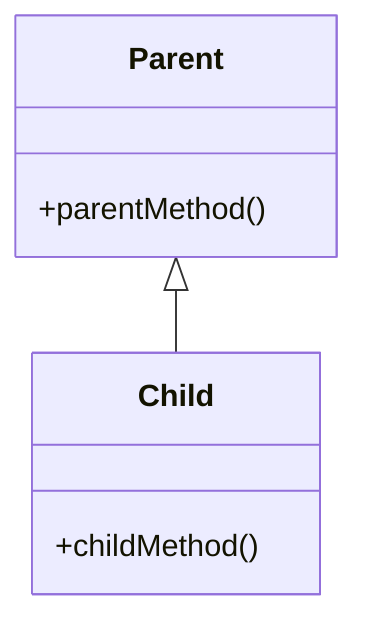

## 🔄 다형적 참조 흐름 다이어그램
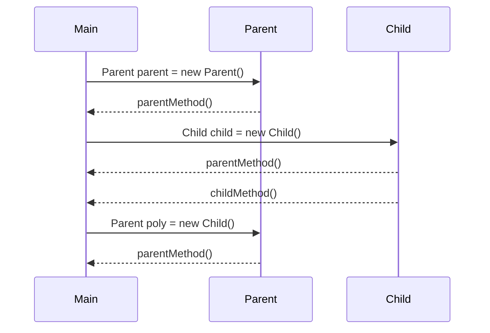

## 🧩 요약
| 코드                             | 호출 가능한 메서드                  |
|----------------------------------|-------------------------------------|
| `Parent parent = new Parent()`   | `parentMethod()`                    |
| `Child child = new Child()`      | `parentMethod()`, `childMethod()`   |
| `Parent poly = new Child()`      | `parentMethod()`                    |
| `poly.childMethod()`             | ❌ 컴파일 오류 (Parent 타입에는 없음) |
| `((Child) poly).childMethod()`   | ✅ `childMethod()` 호출 가능 (형변환) |


--- 

# 업캐스팅과 다운캐스팅

아래는 자바의 업캐스팅과 다운캐스팅 개념을 핵심만 정리한 요약과 함께 다이어그램으로 시각화.

## 🧠 핵심 요약: 업캐스팅 vs 다운캐스팅
| 개념             | 설명 또는 예시                                              |
|------------------|-------------------------------------------------------------|
| 업캐스팅         | 자식 → 부모 타입으로 변환. 자동 변환 가능, 안전함             |
| 다운캐스팅       | 부모 → 자식 타입으로 변환. 명시적 캐스팅 필요, 위험할 수 있음 |
| 캐스팅 문법       | `(타입)` 형식 사용 → `Child child = (Child) parent`         |
| 런타임 오류 가능성 | 잘못된 다운캐스팅 시 `ClassCastException` 발생               |


### ✅ 업캐스팅 예시
```java
Child child = new Child();
Parent parent = child; // 업캐스팅 (자동)
parent.parentMethod(); // 호출 가능
```

### ⚠️ 다운캐스팅 예시
```java
Parent parent = new Child();
Child child = (Child) parent; // 다운캐스팅 (명시적)
child.childMethod(); // 호출 가능
```

### ❌ 잘못된 다운캐스팅
```java
Parent parent = new Parent();
Child child = (Child) parent; // 런타임 오류 발생!
```


## 🎯 클래스 구조 다이어그램


## 🧩 인스턴스 흐름 다이어그램 (다운캐스팅 성공)
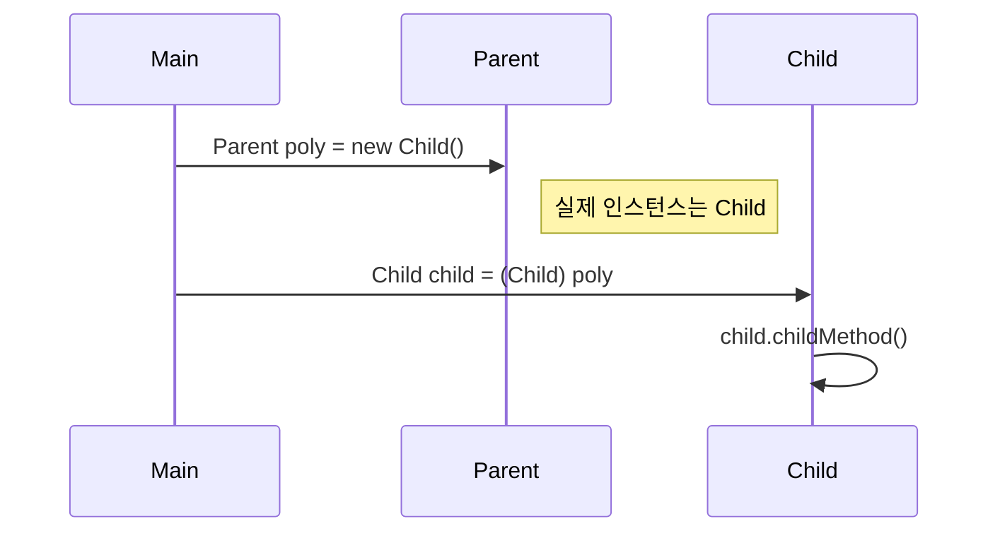


## ❌ 인스턴스 흐름 다이어그램 (다운캐스팅 실패)
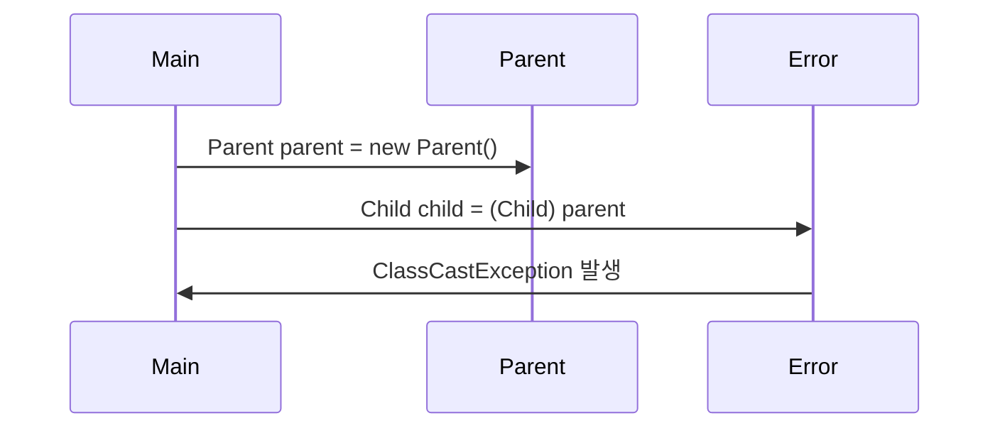


---


# instanceof
instanceof 키워드와 자바 16의 패턴 매칭 기능을 중심으로 다형성과 다운캐스팅의 안전한 처리 방법을 정리한 내용입니다.

## 🧠 핵심 개념 요약: instanceof와 다운캐스팅
| 개념 또는 상황                  | 설명 또는 예시                                               |
|-------------------------------|--------------------------------------------------------------|
| 다형적 참조                    | `Parent p = new Child()` → 부모 타입이 자식 인스턴스를 참조 가능 |
| 잘못된 다운캐스팅              | `ClassCastException` 발생 → 실제 인스턴스가 자식이 아닐 경우   |
| 전통적인 타입 확인             | `if (obj instanceof Child)` → 다운캐스팅 전 안전 확인         |
| instanceof 키워드              | 참조된 인스턴스가 특정 타입인지 확인하는 연산자               |
| 자바 16 패턴 매칭              | `if (obj instanceof Child child)` → 캐스팅 생략 가능, 코드 간결 |


## ✅ 예제: 전통적인 instanceof 사용
```java
if (parent instanceof Child) {
    Child child = (Child) parent;
    child.childMethod();
}
```

- parent가 실제로 Child 인스턴스를 참조할 경우에만 안전하게 다운캐스팅
- 그렇지 않으면 ClassCastException 발생

## 🌟 자바 16 이후: 패턴 매칭 사용
- parent instanceof Child `child`

```java
if (parent instanceof Child child) {
    child.childMethod();
}
```


- instanceof가 true일 경우 자동으로 child 변수에 캐스팅된 인스턴스가 들어감
- 명시적 캐스팅 생략 가능, 코드 간결성 향상

## 🧩 타입 확인 흐름
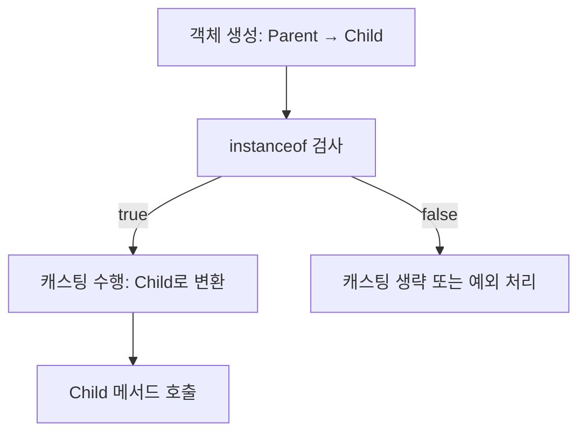

## 🔍 instanceof 결과 예시

| 표현식                          | 결과  | 설명                                               |
|--------------------------------|--------|----------------------------------------------------|
| `new Parent() instanceof Parent` | `true` | Parent 인스턴스는 Parent 타입과 일치               |
| `new Child() instanceof Parent`  | `true` | Child는 Parent를 상속하므로 Parent 타입으로 인식 가능 |
| `new Parent() instanceof Child`  | `false`| Parent 인스턴스는 Child 타입이 아님                |
| `new Child() instanceof Child`   | `true` | Child 인스턴스는 Child 타입과 일치                 |

---

# 🧠 핵심 개념 요약: 다형성과 메서드 오버라이딩
## 🔹 다형적 참조 (Polymorphic Reference)
- 부모 타입 변수는 자식 인스턴스를 참조할 수 있다.
```java
Parent poly = new Child();
```
- 다양한 자식 객체를 하나의 부모 타입으로 다룰 수 있어 유연한 설계가 가능하다.

## 🔹 메서드 오버라이딩 (Method Overriding)
- 자식 클래스에서 부모 클래스의 메서드를 재정의하는 것
```java
@Override
public void method() {
    System.out.println("Child.method");
}
```
- 오버라이딩된 메서드는 항상 우선권을 가진다 → 다형적 참조에서도 자식의 메서드가 호출됨

## 🔹 멤버 변수 vs 메서드
| 항목         | 오버라이딩 여부 | 참조 기준       | 실행 결과 예시                          |
|--------------|------------------|------------------|------------------------------------------|
| 멤버 변수     | ❌ 오버라이딩 안됨 | **참조 변수 타입 기준** | `Parent poly = new Child(); poly.value → "parent"` |
| 메서드        | ✅ 오버라이딩 됨   | **인스턴스 타입 기준** | `Parent poly = new Child(); poly.method() → Child.method` |


## ✅ 실행 결과 분석
| 선언 코드                        | 실제 인스턴스 타입 | value 참조 결과 | method() 호출 결과 |
|----------------------------------|---------------------|------------------|---------------------|
| `Child child = new Child()`      | `Child`             | `"child"`        | `Child.method`      |
| `Parent parent = new Parent()`   | `Parent`            | `"parent"`       | `Parent.method`     |
| `Parent poly = new Child()`      | `Child`             | `"parent"`       | `Child.method`      |


## 📊 클래스 구조 다이어그램
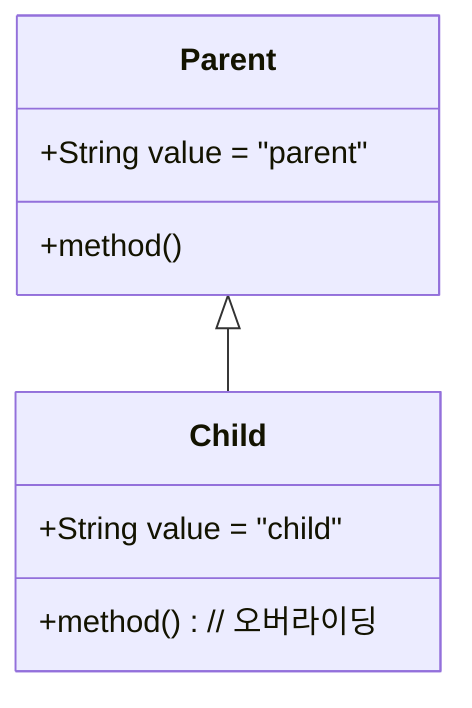


## 🔁 실행 흐름 다이어그램
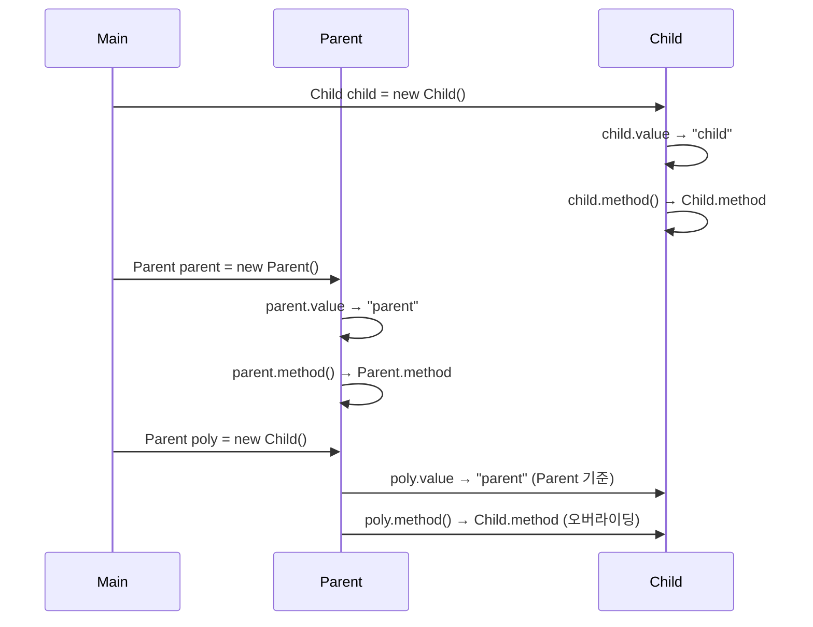

---

# 🧠 다형성 활용 1: 왜 필요한가?

## 🎯 문제 상황

### 코드
```java
public class Dog {
    public void sound() {
        System.out.println("멍멍");
    }
}

public class Cat {
    public void sound() {
        System.out.println("냐옹");
    }
}


public class Caw {
    public void sound() {
        System.out.println("음매");
    }
}

```

- Dog, Cat, Caw 클래스 각각에 sound() 메서드 존재
- AnimalSoundMain에서 각 동물의 소리를 출력하는 코드가 중복됨
- 새로운 동물이 추가될 때마다 출력 코드도 늘어남
- 중복 제거 시도: 메서드 분리, 배열 활용 → 실패  
    → 이유: 타입이 서로 다르기 때문

## ❌ 다형성 없이 작성한 코드의 한계
| 시도 방식               | 문제점 또는 한계 설명                                      |
|------------------------|------------------------------------------------------------|
| `dog.sound()` `cat.sound()` | 각 동물마다 개별 호출 필요 → 코드 중복 증가                     |
| `soundCaw(Caw caw)`        | 특정 타입 전용 메서드 → 다른 동물 타입은 사용 불가              |
| `Caw[] arr = {dog, cat, caw}` | 타입 불일치로 컴파일 오류 → 서로 다른 클래스는 하나의 배열에 담을 수 없음 |


## 🔍 핵심 문제
- Dog, Cat, Caw는 서로 다른 타입
- 공통된 타입이 없기 때문에 공통 메서드 호출 불가
- 중복 제거 및 확장성 부족

## 💡 해결 방향: 다형성 도입
- 공통 부모 클래스 또는 인터페이스 정의 → 예: Animal
- 각 동물 클래스가 Animal을 상속하거나 구현
- Animal[] animals = {new Dog(), new Cat(), new Caw()} 가능
- 반복문으로 sound() 호출 가능 → 중복 제거, 확장성 확보

## 📌 다음 단계 예고
### 다형성을 도입한 개선 버전에서는 다음과 같은 구조로 변경됩니다:
```java
public abstract class Animal {
    public abstract void sound();
}

public class Dog extends Animal {
    public void sound() { System.out.println("멍멍"); }
}

Animal[] animals = {new Dog(), new Cat(), new Caw()};
for (Animal animal : animals) {
    animal.sound();
}
```
→ 모든 동물이 Animal 타입으로 통일되며, 다형적 참조와 오버라이딩을 통해 각자의 sound()가 호출됨

## 클래스 구조도
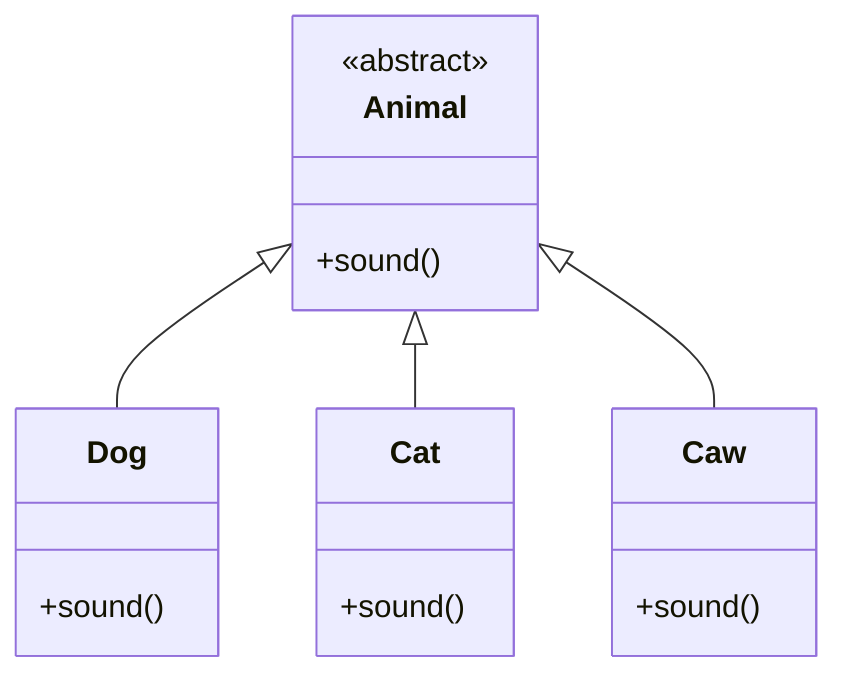

---

# 🧠 다형성 활용: 동물 소리 예제

자바의 다형성 활용 예제를 중심으로 정리한 문서입니다.  
다형성의 개념, 코드 개선 과정, 그리고 추상 클래스의 필요성까지 단계별로 정리

### 1️⃣ 기존 문제점 (다형성 미사용)
- Dog, Cat, Caw 클래스 각각에 sound() 메서드 존재
- 각 클래스마다 개별 호출 → 중복 코드 증가
- 새로운 동물 추가 시마다 출력 코드도 추가해야 함
- 공통 타입이 없어 배열이나 메서드로 처리 불가

### 2️⃣ 다형성 도입: 상속 + 오버라이딩
### 🔧 구조 변경
- 공통 부모 클래스 Animal 생성
- Dog, Cat, Caw는 Animal을 상속
- 각 클래스에서 sound() 메서드 오버라이딩

## 📦 코드 예시
```java
public class Animal {
    public void sound() {
        System.out.println("동물 울음 소리");
    }
}

public class Dog extends Animal {
    @Override
    public void sound() {
        System.out.println("멍멍");
    }
}
```

## ✅ 다형적 참조 + 오버라이딩
```java
private static void soundAnimal(Animal animal) {
    System.out.println("동물 소리 테스트 시작");
    animal.sound(); // 오버라이딩된 메서드 호출
    System.out.println("동물 소리 테스트 종료");
}
```

- Animal 타입 변수로 Dog, Cat, Caw 인스턴스를 참조 가능
- sound() 호출 시 실제 인스턴스의 오버라이딩된 메서드 실행

## 3️⃣ 다형성 활용: 배열 + 반복문
```java
Animal[] animalArr = {new Dog(), new Cat(), new Caw()};
for (Animal animal : animalArr) {
    soundAnimal(animal);
}
```

- 배열로 동물들을 관리
- soundAnimal() 메서드로 중복 제거
- 새로운 동물 추가 시에도 기존 로직 변경 없음

## 4️⃣ 유지보수 관점: 변하는 부분 vs 변하지 않는 부분
| 구분           | 설명                                      |
|----------------|-------------------------------------------|
| 변하는 부분     | `main()` → 새로운 동물 생성 및 배열 구성     |
| 변하지 않는 부분 | `soundAnimal()` → 공통 로직, 코드 변경 없음 |

→ 변경 최소화가 잘 설계된 코드의 핵심


## ⚠️ 남은 문제점
### 1. Animal 클래스 인스턴스 생성 가능
```java
Animal animal = new Animal(); // 의미 없는 인스턴스
```

- Animal은 추상적 개념 → 직접 생성은 부적절
- 실수로 생성 시 기능이 불완전할 수 있음
### 2. 자식 클래스에서 sound() 오버라이딩 누락 가능성
```java
public class Pig extends Animal {
    // 오버라이딩 누락 시 Animal.sound() 호출됨
}
```

- 기대와 다른 동작 발생
- 프로그램은 정상 실행되지만 의도와 다른 결과 출력

## ✅ 해결책: 추상 클래스 + 추상 메서드
```java
public abstract class Animal {
    public abstract void sound(); // 반드시 오버라이딩 필요
}
```

- Animal은 추상 클래스 → 직접 인스턴스 생성 불가
- sound()는 추상 메서드 → 자식 클래스에서 반드시 구현해야 함
- 제약을 통해 실수 방지 + 설계 명확성 확보

## 📊 클래스 구조 다이어그램


---
# Abastract Class

## 🧠 추상 클래스란?
- 정의: 실체가 없는 추상적인 부모 클래스로, 직접 인스턴스를 생성할 수 없음
- 목적: 자식 클래스에게 공통된 인터페이스(기능)를 제공하고, 상속을 통해 기능을 확장하도록 유도
### 🔹 선언 방법
```java
public abstract class AbstractAnimal {
    public abstract void sound(); // 추상 메서드
    public void move() {
        System.out.println("동물이 움직입니다.");
    }
}
```

- abstract 키워드를 클래스와 메서드에 사용
- 추상 메서드는 바디가 없음 → 자식 클래스가 반드시 오버라이딩해야 함
- 일반 메서드는 바디가 있으므로 오버라이딩 선택 가능

## ✅ 추상 클래스의 장점
| 항목 또는 상황                        | 설명 또는 효과                                               |
|-------------------------------------|--------------------------------------------------------------|
| `new AbstractAnimal()`              | ❌ 인스턴스 생성 불가 → 실수 방지, 추상 개념 보호             |
| 추상 메서드                         | 자식 클래스가 반드시 오버라이딩 → 구현 강제, 일관성 확보       |
| `AbstractAnimal animal = new Dog()` | ✅ 다형적 참조 가능 → 유연한 설계, 공통 인터페이스 활용 가능   |
| 일반 메서드 (`move()`)              | 공통 기능 제공 → 자식 클래스에서 재사용 가능, 선택적 오버라이딩 |


## 🧪 예제: 추상 클래스 사용
```java
AbstractAnimal animal = new Dog(); // 다형적 참조
animal.sound(); // Dog의 오버라이딩된 메서드 호출
animal.move();  // 부모 클래스의 일반 메서드 호출
```


## ⚠️ 컴파일 오류 예시
### 1. 추상 클래스 인스턴스 생성 시
```java
AbstractAnimal animal = new AbstractAnimal(); // 오류
```
#### ❌ AbstractAnimal is abstract; cannot be instantiated

### 2. 추상 메서드 오버라이딩 누락 시
```java
public class Dog extends AbstractAnimal {
    // sound() 오버라이딩 누락
}
```
#### ❌ Dog is not abstract and does not override abstract method sound()

---

## 🧠 순수 추상 클래스란?
- 정의: 모든 메서드가 추상 메서드인 클래스
- 역할: 실행 로직 없이 규격만 제공하는 껍데기 클래스
- 자식 클래스는 모든 메서드를 오버라이딩해야 함
### 🔹 예시
```java
public abstract class AbstractAnimal {
    public abstract void sound();
    public abstract void move();
}
```


## 📌 순수 추상 클래스의 특징
| 항목 또는 상황               | 설명 또는 효과                                               |
|----------------------------|--------------------------------------------------------------|
| `new AbstractAnimal()`     | ❌ 인스턴스 생성 불가 → 추상 개념 보호, 실수 방지              |
| 모든 메서드가 추상 메서드   | 실행 로직 없음 → 자식 클래스가 반드시 구현해야 함              |
| 다형성 지원                 | 부모 타입으로 자식 인스턴스를 참조 가능 (`AbstractAnimal animal = new Dog()`) |
| 규격 제공 역할              | 인터페이스처럼 동작 → 기능의 틀을 정의하고 구현은 자식에게 위임 |


## 🎯 인터페이스와의 유사성
- 순수 추상 클래스는 인터페이스처럼 규격을 정의하는 역할
- 예: USB 인터페이스 → 규격에 맞춰 마우스, 키보드 구현
- 자바에서는 실제로 인터페이스를 통해 이 개념을 더 명확하게 표현 가능

## 📊 클래스 구조 다이어그램
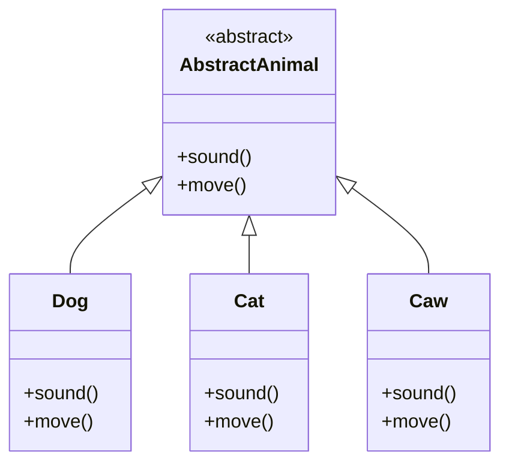

## ✅ 정리
| 개념                   | 핵심 요약                                                                 |
|------------------------|--------------------------------------------------------------------------|
| 추상 클래스             | 인스턴스 생성 불가, 상속 전용, 공통 기능 제공 가능                         |
| 추상 메서드             | 바디 없음, 자식 클래스가 반드시 오버라이딩해야 함                            |
| 순수 추상 클래스         | 모든 메서드가 추상 메서드 → 실행 로직 없음, 규격 제공 역할                     |
| 다형적 참조             | 부모 타입으로 자식 인스턴스를 참조 가능 → 유연한 설계                         |
| 오버라이딩된 메서드 우선권 | 참조 타입과 관계없이 실제 인스턴스의 오버라이딩된 메서드가 실행됨               |
| 유지보수 전략           | 변하는 부분(main)과 변하지 않는 부분(soundAnimal 등)을 분리 → 확장성 확보       |

---

# interface
아래는 자바의 인터페이스 개념과 활용을 중심으로 정리한 문서입니다.    
추상 클래스와의 비교, 다중 구현, 다이아몬드 문제 해결까지 포함해 핵심만 깔끔하게 정리.

## 🧠 인터페이스란?
- 자바에서 순수 추상 클래스를 더 편리하게 사용할 수 있도록 만든 기능
- 모든 메서드는 public abstract이며, 생략 가능
- 인스턴스 생성 불가, 오직 구현을 위한 설계도 역할
## 🔹 선언 예시
```java
public interface InterfaceAnimal {
    void sound(); // public abstract 생략
    void move();
}
```

## ✅ 인터페이스의 특징
| 항목 또는 코드 예시                  | 설명 또는 효과                                                  |
|-------------------------------------|------------------------------------------------------------------|
| `new InterfaceAnimal()`             | ❌ 인스턴스 생성 불가 → 인터페이스는 설계도 역할만 수행             |
| `InterfaceAnimal animal = new Dog()`| ✅ 다형적 참조 가능 → 유연한 설계, 공통 인터페이스 활용 가능         |
| `public static final`               | 인터페이스의 변수는 모두 상수 → 생략 가능, 수정 불가 (`MY_PI = 3.14`) |
| `implements A, B`                   | ✅ 다중 구현 가능 → 여러 인터페이스를 동시에 구현할 수 있음          |

## 🔧 클래스 vs 추상 클래스 vs 인터페이스
| 구분             | 인스턴스 생성 | 메서드 구현 여부         | 상속/구현 키워드 | 다중 상속/구현 | 용도 및 특징                          |
|------------------|----------------|---------------------------|------------------|----------------|---------------------------------------|
| 클래스           | ✅ 가능         | ✅ 필수                    | `extends`        | ❌ 불가능       | 기능 구현 중심, 일반적인 클래스 구조     |
| 추상 클래스       | ❌ 불가         | ✅ 일부 구현 가능, 일부 추상 | `extends`        | ❌ 불가능       | 공통 기능 + 제약 제공, 다형성 지원       |
| 인터페이스       | ❌ 불가         | ❌ 전부 추상 (자바 8 이전 기준) | `implements`     | ✅ 가능         | 규격 제공, 다형성 + 다중 구현 지원       |

---


## 📌 상속 vs 구현
- 클래스 상속: 부모의 기능을 물려받음 (`extends`)
- 인터페이스 구현: 기능을 직접 정의해야 함 (`implements`)
- 인터페이스는 기능이 없는 설계도 → 자식 클래스가 직접 구현

## 🎯 인터페이스를 사용하는 이유
### 1. 제약 (규약 제공)
- 반드시 구현해야 하는 메서드 목록을 정의
- 실수 방지, 일관된 구조 유지
### 2. 다중 구현
- 자바는 클래스의 다중 상속을 허용하지 않음
- 인터페이스는 다중 구현 가능 → 유연한 설계

### ⚠️ 클래스 다중 상속의 문제점
- 다이아몬드 문제: 부모 클래스가 동일한 메서드를 가질 경우, 어떤 메서드를 상속할지 모호함
- 자바는 이를 방지하기 위해 클래스의 다중 상속을 금지

## ✅ 인터페이스 다중 구현 예제
### 🔹 InterfaceA & InterfaceB
```java
public interface InterfaceA {
    void methodA();
    void methodCommon();
}

public interface InterfaceB {
    void methodB();
    void methodCommon();
}
```

### 🔹 Child 클래스
```java
public class Child implements InterfaceA, InterfaceB {
    public void methodA() { System.out.println("Child.methodA"); }
    public void methodB() { System.out.println("Child.methodB"); }
    public void methodCommon() { System.out.println("Child.methodCommon"); }
}
```

### 🔹 실행 코드
```java
InterfaceA a = new Child();
a.methodA();
a.methodCommon();

InterfaceB b = new Child();
b.methodB();
b.methodCommon();
```

### 🔹 실행 결과
```
Child.methodA
Child.methodCommon
Child.methodB
Child.methodCommon
```

→ `methodCommon()` 은 Child에서 구현된 메서드가 호출됨  
→ 다이아몬드 문제 없음, 인터페이스는 구현만 존재하므로 충돌 발생하지 않음  

## 📊 인터페이스 구조 다이어그램
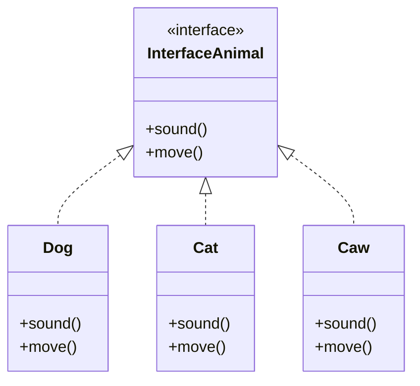

### 💡 설명
- Animal은 일반 클래스 → Dog가 상속 (extends)
- AbstractAnimal은 추상 클래스 → Cat이 상속 (extends)
- InterfaceAnimal은 인터페이스 → Caw가 구현 (implements)
- <|-- : 클래스 상속
- <|.. : 인터페이스 구현

## ✅ 정리
| 개념             | 핵심 요약 및 특징                                               |
|------------------|------------------------------------------------------------------|
| 클래스           | 기능 구현 중심, 인스턴스 생성 가능                              |
| 추상 클래스       | 일부 기능 구현 + 일부 추상 메서드, 인스턴스 생성 불가             |
| 인터페이스       | 모든 메서드 추상화, 규격 제공, 인스턴스 생성 불가                 |
| 상속 키워드       | 클래스/추상 클래스는 `extends`, 인터페이스는 `implements` 사용     |
| 다중 상속/구현    | 클래스는 ❌, 인터페이스는 ✅ → 다중 구현 가능                     |
| 설계 목적         | 클래스: 기능 구현 / 추상 클래스: 공통 기능 + 제약 / 인터페이스: 규격 정의 |

---

# 🧠 클래스와 인터페이스 활용 정리

## 소스
```java
public abstract class AbstractAnimal {
    public abstract void sound();
    public void move() {
        System.out.println("동물이 이동합니다.");
    }
}

public interface Fly {
    void fly();
}


public class Dog extends AbstractAnimal {
    @Override
    public void sound() {
        System.out.println("멍멍");
    }
}

public class Bird extends AbstractAnimal implements Fly {
    @Override
    public void sound() {
        System.out.println("짹짹");
    }
    @Override
    public void fly() {
        System.out.println("새 날기");
    }
}

```

## 1️⃣ 구조 개요
| 클래스/인터페이스     | 역할 및 메서드                          |
|------------------------|------------------------------------------|
| AbstractAnimal         | 추상 클래스: `sound()`(추상), `move()`(일반) |
| Fly                    | 인터페이스: `fly()`                      |
| Dog                    | `AbstractAnimal` 상속                    |
| Bird, Chicken          | `AbstractAnimal` 상속 + `Fly` 구현       |

## 2️⃣ 핵심 메서드 설명
- soundAnimal(AbstractAnimal animal)  
    → 모든 동물의 소리를 출력. 다형적 참조로 Dog, Bird, Chicken 모두 처리 가능
- flyAnimal(Fly fly)  
    → 나는 동물만 처리. Bird, Chicken만 전달 가능

## 3️⃣ 실행 흐름 요약
### 🔹 soundAnimal(bird) 호출 시
- animal은 AbstractAnimal 타입
- 실제 인스턴스는 Bird
- Bird.sound() 오버라이딩된 메서드 실행
### 🔹 flyAnimal(bird) 호출 시
- fly는 Fly 인터페이스 타입
- 실제 인스턴스는 Bird
- Bird.fly() 오버라이딩된 메서드 실행

## 4️⃣ 다중 구현 예시
```java
public class Bird extends AbstractAnimal implements Fly, Swim
```

- 클래스는 하나만 extends 가능
- 인터페이스는 여러 개 implements 가능
- 반드시 extends가 먼저, implements가 뒤에 와야 함

## 📊 클래스 구조도
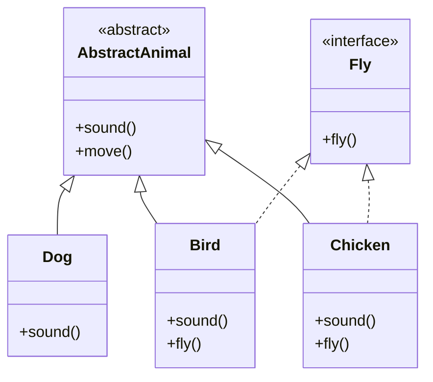

---


