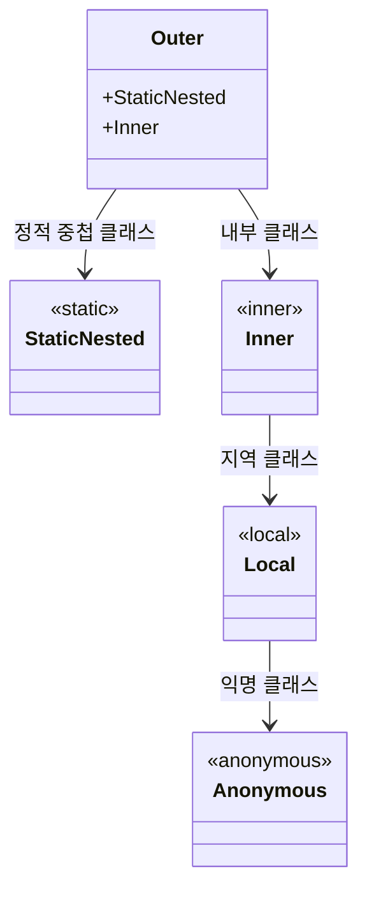
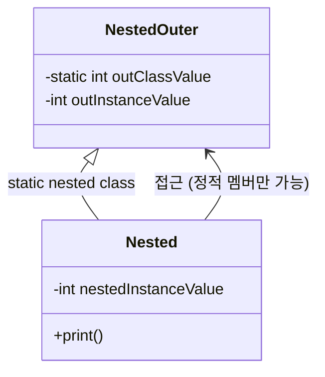
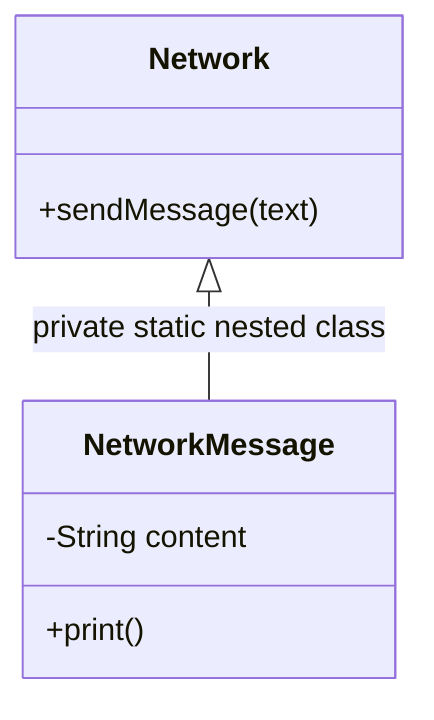
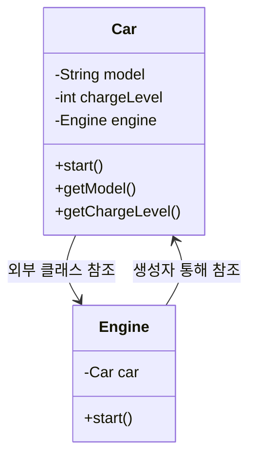
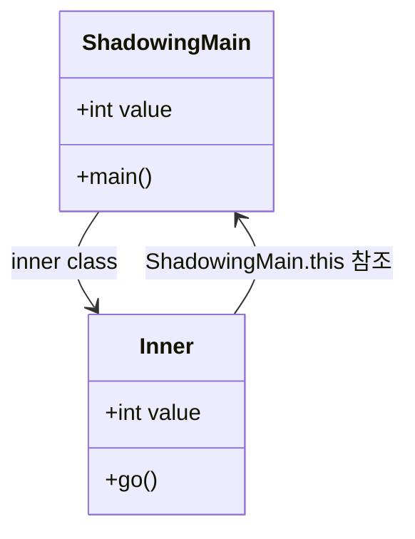

# 🧠 중첩 클래스 vs 내부 클래스 – 핵심 정리

## ✅ 정의
- 중첩 클래스(Nested Class): 클래스 안에 정의된 또 다른 클래스
- 내부 클래스(Inner Class): 중첩 클래스 중 바깥 클래스의 인스턴스에 소속되는 클래스

```java
class Outer {
...
    //정적 중첩 클래스
    static class StaticNested {
    ...
    }
    
    //내부 클래스
    class Inner {
    ...
    }

    public void process() {
        
        //지역 변수
        int lcoalVar = 0;
        
        //지역 클래스
        class Local {...}
        Local local = new Local();
    }
}
```

## ✅ 중첩 클래스 분류
| 클래스 종류        | 설명                         | static 키워드 사용 여부 |
|--------------------|------------------------------|--------------------------|
| static class       | 정적 중첩 클래스              | ✅ 사용함                |
| inner class        | 내부 클래스                   | ❌ 사용하지 않음         |
| local class        | 지역 클래스 (메서드 내부)     | ❌ 사용하지 않음         |
| anonymous class    | 익명 클래스 (이름 없음)       | ❌ 사용하지 않음         |

### 🔍 요약 설명
- static class: 바깥 클래스의 인스턴스와 무관. 독립적으로 동작.
- inner class: 바깥 클래스의 인스턴스에 소속. 멤버 접근 가능.
- local class: 메서드나 블록 내부에서 정의. 지역 변수처럼 동작.
- anonymous class: 이름 없이 정의된 지역 클래스의 특별한 형태.


## ✅ 선언 위치와 변수 대응
| 클래스 종류         | 선언 위치               | 대응되는 변수 종류     | static 키워드 사용 여부 |
|----------------------|--------------------------|--------------------------|--------------------------|
| 정적 중첩 클래스     | 클래스 본문              | 정적 변수 (`static`)     | ✅ 사용함                |
| 내부 클래스          | 클래스 본문              | 인스턴스 변수            | ❌ 사용하지 않음         |
| 지역 클래스          | 메서드 또는 코드 블록 내부 | 지역 변수                | ❌ 사용하지 않음         |
| 익명 클래스          | 메서드 또는 코드 블록 내부 | 지역 변수 (이름 없음)    | ❌ 사용하지 않음         |

### 🔍 핵심 요약
- 정적 중첩 클래스는 클래스 수준에서 정의되며, static 키워드를 사용해 바깥 인스턴스와 독립적으로 동작합니다.
- 내부 클래스는 바깥 클래스의 인스턴스에 소속되며, static 없이 정의됩니다.
- 지역 클래스와 익명 클래스는 메서드나 블록 내부에서 정의되며, 지역 변수처럼 동작합니다.


## ✅ 핵심 차이
| 클래스 종류         | 바깥 클래스 인스턴스와의 관계     | 선언 위치           | static 키워드 사용 여부 |
|----------------------|----------------------------------|----------------------|--------------------------|
| 정적 중첩 클래스     | ❌ 소속되지 않음 (독립적)         | 클래스 본문          | ✅ 사용함                |
| 내부 클래스          | ✅ 소속됨 (멤버 접근 가능)         | 클래스 본문          | ❌ 사용하지 않음         |
| 지역 클래스          | ✅ 소속됨 (지역 변수 접근 가능)     | 메서드/블록 내부     | ❌ 사용하지 않음         |
| 익명 클래스          | ✅ 소속됨 (이름 없이 지역 클래스)   | 메서드/블록 내부     | ❌ 사용하지 않음         |

### 🔍 요약 포인트
- static이 붙으면 바깥 클래스의 인스턴스와 무관하게 동작
- static이 없으면 바깥 클래스의 인스턴스에 소속되어 멤버 접근 가능
- 지역 클래스와 익명 클래스는 코드 블록 내부에서 정의되며, 바깥 인스턴스뿐 아니라 지역 변수에도 접근 가능


## ✅ 실무 팁
- 실무에서는 "중첩 클래스"와 "내부 클래스"를 구분하지 않고 혼용하는 경우가 많음
- 하지만 static이 붙은 클래스는 엄밀히 말해 내부 클래스가 아님
- 중첩 클래스는 논리적 그룹화와 캡슐화를 위해 사용됨
- 외부에서 널리 사용되는 클래스는 중첩 클래스로 만들지 말 것

## 🧭 중첩 클래스 용어 정리
| 용어               | 포함되는 클래스 종류                                | static 키워드 사용 여부 |
|--------------------|-----------------------------------------------------|--------------------------|
| 중첩 클래스         | 정적 중첩 클래스 + 내부 클래스 종류 전체             | 혼합 (있을 수도, 없을 수도 있음) |
| 정적 중첩 클래스     | static class                                        | ✅ 사용함                |
| 내부 클래스         | inner class + local class + anonymous class         | ❌ 사용하지 않음         |
| inner class        | 바깥 클래스의 인스턴스 멤버에 접근 가능              | ❌ 사용하지 않음         |
| local class        | 메서드/블록 내부에서 정의, 지역 변수처럼 동작        | ❌ 사용하지 않음         |
| anonymous class    | 이름 없이 정의된 지역 클래스                         | ❌ 사용하지 않음         |


## 🧬 클래스 다이어그램


---

## 🧠 정적 중첩 클래스 – 핵심 정리
### ✅ 개념 요약
- 정적 중첩 클래스는 static 키워드가 붙은 클래스이며, 바깥 클래스의 인스턴스에 소속되지 않음
- 바깥 클래스의 정적 멤버에는 접근 가능 (private 포함)
- 바깥 클래스의 인스턴스 멤버에는 접근 불가 (인스턴스 참조가 없기 때문)
- 바깥 클래스와 중첩 클래스는 논리적으로만 연결되어 있으며, 실제 인스턴스 간에는 아무런 관계 없음
- 중첩 클래스는 바깥 클래스의 캡슐화를 강화하고, 내부에서만 사용하는 클래스를 숨길 수 있음

### ✅ 활용 목적
- 논리적 그룹화: 특정 클래스가 바깥 클래스 내부에서만 사용될 때
- 캡슐화 강화: private static class로 선언하면 외부에서 접근 불가
- 외부 노출 최소화: 라이브러리 사용자에게 불필요한 클래스를 숨길 수 있음

### 사용 예제
```java
public class NestedOuter {
    private static int outClassValue = 3;
    private int outInstanceValue = 2;
    static class Nested {
        private int nestedInstanceValue = 1;
        public void print() {
            // 자신의 멤버에 접근
            System.out.println(nestedInstanceValue);
            // 바깥 클래스의 인스턴스 멤버에는 접근할 수 없다.
            //System.out.println(outInstanceValue);
            // 바깥 클래스의 클래스 멤버에는 접근할 수 있다. private도 접근 가능
            System.out.println(NestedOuter.outClassValue);
        }
    }
}
```

### 🎯 예제 구조 – 클래스 다이어그램


### 정적 내부 클래스로 리팩토링 시도

#### Refactoring 전 코드

```java
// Network 객체 안에서만 사용
public class NetworkMessage {
    private String content;
    public NetworkMessage(String content) {
        this.content = content;
    }
    public void print() {
        System.out.println(content);
    }
}

public class Network {
    public void sendMessage(String text) {
        NetworkMessage networkMessage = new NetworkMessage(text);
        networkMessage.print();
    }
}

public class NetworkMain {
    public static void main(String[] args) {
        Network network = new Network();
        network.sendMessage("hello java");
    }
}

```

#### Refactoring 후 코드

```java
public class Network {
    public void sendMessage(String text) {
        NetworkMessage networkMessage = new NetworkMessage(text);
        networkMessage.print();
    }
    private static class NetworkMessage {
        private String content;
        public NetworkMessage(String content) {
            this.content = content;
        }
        public void print() {
            System.out.println(content);
        }
    }
}

```

## 🎯 리팩토링 구조

### ✅ 실무적 장점

| 항목                     | 리팩토링 전 (`NetworkMessage` 외부 클래스) | 리팩토링 후 (`NetworkMessage` 정적 중첩 클래스) |
|--------------------------|---------------------------------------------|--------------------------------------------------|
| 클래스 노출               | `Network`, `NetworkMessage` 모두 노출       | `Network`만 노출됨                              |
| 접근 제어 수준            | `NetworkMessage`는 public 또는 package 접근 | `NetworkMessage`는 private static class         |
| 캡슐화 수준               | 낮음                                        | 높음                                             |
| 사용자 혼란 가능성        | 높음 – 어떤 클래스를 써야 할지 고민됨        | 낮음 – `Network`만 사용하면 됨                  |
| 논리적 그룹화             | 약함 – 클래스가 분리되어 있음               | 강함 – 내부에서만 사용되는 클래스로 명확함      |
| 유지보수 및 가독성        | 클래스 간 관계 파악 필요                    | 구조적으로 명확함                               |

### 🔍 핵심 요약
- 외부 노출 최소화: 라이브러리 사용자에게 불필요한 클래스가 보이지 않음
- 캡슐화 강화: private static class로 선언하면 외부 접근 불가
- 의도 명확화: 해당 클래스가 바깥 클래스 내부에서만 사용된다는 의도를 코드 구조로 표현


---

## 🧠 내부 클래스 (Inner Class) – 핵심 정리
### ✅ 개념 요약
- 내부 클래스는 static 키워드 없이 바깥 클래스 내부에 정의된 클래스
- 바깥 클래스의 인스턴스 멤버에 직접 접근 가능
- 바깥 클래스의 private 멤버도 접근 가능 (같은 클래스 내부이므로)
- 내부 클래스는 바깥 클래스의 인스턴스를 참조하고, 그 인스턴스에 소속됨

### ✅ 생성 방식
```java
InnerOuter outer = new InnerOuter();
InnerOuter.Inner inner = outer.new Inner();
```
- outer.new Inner() 방식으로 생성
- 바깥 클래스의 인스턴스가 반드시 먼저 있어야 함

### 🧪 샘플 코드 – 내부 클래스 활용
#### 🔧 리팩토링 전
```java
// 외부 클래스
public class Engine {
    private Car car;
    public Engine(Car car) {
        this.car = car;
    }
    public void start() {
        System.out.println("충전 레벨 확인: " + car.getChargeLevel());
        System.out.println(car.getModel() + "의 엔진을 구동합니다.");
    }
}

public class Car {
    private String model;
    private int chargeLevel;
    private Engine engine;

    public Car(String model, int chargeLevel) {
        this.model = model;
        this.chargeLevel = chargeLevel;
        this.engine = new Engine(this);
    }

    public String getModel() { return model; }
    public int getChargeLevel() { return chargeLevel; }

    public void start() {
        engine.start();
        System.out.println(model + " 시작 완료");
    }
}
```
#### 클래스 구조도


#### 🔧 리팩토링 후 (내부 클래스로 변경)
```java
public class Car {
    private String model;
    private int chargeLevel;
    private Engine engine;

    public Car(String model, int chargeLevel) {
        this.model = model;
        this.chargeLevel = chargeLevel;
        this.engine = new Engine();
    }

    public void start() {
        engine.start();
        System.out.println(model + " 시작 완료");
    }

    private class Engine {
        public void start() {
            System.out.println("충전 레벨 확인: " + chargeLevel);
            System.out.println(model + "의 엔진을 구동합니다.");
        }
    }
}
```

#### ✅ 실행 결과
```
충전 레벨 확인: 100
Model Y의 엔진을 구동합니다.
Model Y 시작 완료
```

### 요약
| 항목                   | 외부 클래스 구조 (Car + Engine) | 내부 클래스 구조 (Engine ⊂ Car) |
|------------------------|----------------------------------|----------------------------------|
| 클래스 구조             | Car, Engine 분리                 | Engine은 Car 내부에 포함         |
| 접근 제어              | Engine은 Car의 private 멤버 접근 불가 | Engine은 Car의 private 멤버 직접 접근 가능 |
| 캡슐화 수준             | 낮음 – getter로 외부 노출 필요     | 높음 – 내부에서 직접 접근 가능   |
| 외부 노출 클래스 수     | 2개 (`Car`, `Engine`)            | 1개 (`Car`)                      |
| 논리적 그룹화           | 약함 – 구조적으로 분리됨          | 강함 – Engine은 Car의 구성 요소  |
| 유지보수 및 가독성      | 클래스 간 의존성 파악 필요         | 구조적으로 명확함                |
| 생성 방식              | `new Engine(car)`                | `new Engine()` (Car 내부에서 생성) |

#### 🧩 핵심 요약
- 내부 클래스는 바깥 클래스의 인스턴스에 소속되며, 바깥 클래스의 모든 멤버에 접근 가능
- 외부에서 사용되지 않는 클래스는 내부 클래스로 정의하면 캡슐화와 구조적 명확성이 향상됨
- 실무에서는 내부 클래스가 바깥 클래스의 구성 요소로 작동할 때 유용함

---

## 🧠 변수 섀도잉(Shadowing) – 핵심 정리
### ✅ 개념
- 섀도잉(Shadowing): 동일한 이름의 변수가 여러 범위(scope)에 존재할 때, 더 가까운 범위의 변수가 다른 범위의 변수를 가리는 현상
- 내부 클래스에서 바깥 클래스와 동일한 이름의 변수를 선언하면, 바깥 변수는 기본적으로 가려진다

### ✅ 예제 구조
```java
public class ShadowingMain {
    public int value = 1; // 바깥 클래스의 인스턴스 변수

    class Inner {
        public int value = 2; // 내부 클래스의 인스턴스 변수

        void go() {
            int value = 3; // 지역 변수
            System.out.println("value = " + value); // 지역 변수
            System.out.println("this.value = " + this.value); // 내부 클래스의 변수
            System.out.println("ShadowingMain.value = " + ShadowingMain.this.value); // 바깥 클래스의 변수
        }
    }

    public static void main(String[] args) {
        ShadowingMain main = new ShadowingMain();
        Inner inner = main.new Inner();
        inner.go();
    }
}
```
### ✅ 실행 결과
```
value = 3
this.value = 2
ShadowingMain.value = 1
```

### 🔍 우선순위 규칙
| 참조 방식                        | 설명                                      | 우선순위 |
|----------------------------------|-------------------------------------------|----------|
| `value`                          | 가장 가까운 지역 변수                     | 🔴 가장 높음 |
| `this.value`                     | 내부 클래스의 인스턴스 변수               | 🟠 중간     |
| `OuterClassName.this.value`      | 바깥 클래스의 인스턴스 변수               | 🟢 가장 낮음 |

### ✅ 해설
- 지역 변수 (value)
메서드 내부에서 선언된 변수. 가장 가까운 범위에 있으므로 우선적으로 참조됨.
- 내부 클래스의 변수 (this.value)
내부 클래스의 인스턴스 멤버. 지역 변수에 가려질 수 있지만 this를 통해 명시적으로 접근 가능.
- 바깥 클래스의 변수 (OuterClassName.this.value)
내부 클래스에서 바깥 클래스의 인스턴스를 참조할 때 사용하는 방식. 가장 바깥 범위에 있으므로 우선순위는 가장 낮음.

### 🧠 프로그래밍 우선순위 원칙
더 가까운 범위, 더 구체적인 참조가 우선된다.  
    → 지역 변수 > 내부 클래스 변수 > 바깥 클래스 변수

프로그래밍에서는 더 가까운 범위, 더 구체적인 참조가 우선권을 가집니다.

### ✅ 해결 방법
- 명확한 참조 사용: this.value, OuterClassName.this.value처럼 범위를 명시
- 이름을 다르게 짓기: 섀도잉을 피하기 위해 변수 이름을 구분
- 캡슐화 강화: 내부 클래스에서 바깥 클래스의 멤버를 사용할 때는 의도적으로 접근해야 함

🧬 클래스 다이어그램



### 🧩 핵심 요약
- 섀도잉은 가독성과 유지보수에 혼란을 줄 수 있으므로 피하는 것이 좋음
- 내부 클래스에서는 바깥 클래스의 인스턴스를 OuterClassName.this로 명확하게 참조 가능
- 명확성은 좋은 코드의 핵심! 이름 충돌은 설계 단계에서 예방하는 것이 가장 좋음

---

