# 🧠 지역 클래스의 핵심 개념
- 정의 위치: 메서드, 생성자, 블록 내부에서 선언됨
## 접근 범위:
- 자신의 필드
- 바깥 클래스의 인스턴스 변수
- 해당 블록의 지역 변수 및 매개변수 (단, final 또는 effectively final이어야 함)
## 제한 사항:
- 접근 제어자 사용 불가
- static 선언 불가

## 생명 주기 차이:
- 지역 변수는 메서드 종료 시 스택에서 제거됨
- 지역 클래스 인스턴스는 힙에 존재하며 GC 전까지 생존 가능

## ✅ 지역 클래스 예제 구조
```java
public class LocalOuter {
    private int outInstanceVar = 3;
    public void process(int paramVar) {
        int localVar = 1;
        class LocalPrinter {
            int value = 0;
            public void printData() {
                System.out.println("value=" + value);
                System.out.println("localVar=" + localVar);
                System.out.println("paramVar=" + paramVar);
                System.out.println("outInstanceVar=" + outInstanceVar);
            }
        }
        LocalPrinter printer = new LocalPrinter();
        printer.printData();
    }
    public static void main(String[] args) {
        LocalOuterV1 localOuter = new LocalOuterV1();
        localOuter.process(2);
    }
}

```

## 📦 메모리 구조 (예제 3 기준)
```mermaid
graph TD
    subgraph Stack 영역
        mainFrame["main() frame"]
        processFrame["process() frame"]
        processFrame --> paramVar["paramVar = 2"]
        processFrame --> localVar["localVar = 1"]
        processFrame --> printerRef["printer = x002"]
    end

    subgraph Heap 영역
        outerObj["LocalOuter 인스턴스 (x001)\noutInstanceVar = 3"]
        printerObj["LocalPrinter 인스턴스 (x002)\nvalue = 0\n바깥 인스턴스 참조 = x001"]
        printerObj --> outerObj
    end

    mainFrame --> printerRef
    printerRef --> printerObj
```


## 🔍 지역 변수 캡처와 생명 주기

| 변수 종류       | 저장 위치     | 생존 범위                          | 지역 클래스에서 접근 가능 여부 |
|----------------|----------------|------------------------------------|-------------------------------|
| 클래스 변수     | 메서드 영역     | 프로그램 종료 시까지               | ✅ 가능                        |
| 인스턴스 변수   | 힙 영역         | 인스턴스가 GC 될 때까지            | ✅ 가능                        |
| 지역 변수       | 스택 영역       | 메서드 종료 시 제거됨              | ✅ 가능 (단, final 또는 effectively final일 경우) |
| 매개변수        | 스택 영역       | 메서드 종료 시 제거됨              | ✅ 가능 (지역 변수와 동일 조건) |


- 지역 클래스는 지역 변수의 값을 복사하여 캡처함
- 따라서 지역 변수는 final 또는 effectively final이어야 함
- 지역 클래스 인스턴스는 힙에 존재하므로 지역 변수보다 오래 생존 가능

### 실행 결과:
```
value=0
localVar=1
paramVar=2
outInstanceVar=3
```


## 📌 핵심 요약

| 항목                     | 설명                                                                 |
|--------------------------|----------------------------------------------------------------------|
| 정의 위치                | 메서드, 생성자, 블록 내부에서 선언됨                                 |
| 접근 가능한 대상         | 자신의 필드, 바깥 클래스의 인스턴스 변수, 지역 변수 및 매개변수         |
| 지역 변수 접근 조건      | final 또는 effectively final일 경우만 접근 가능                        |
| 생명 주기 차이           | 지역 변수는 스택에 존재하며 메서드 종료 시 제거됨, 지역 클래스 인스턴스는 힙에 존재하며 GC 전까지 생존 |
| 접근 제어자 사용 여부    | 지역 클래스는 접근 제어자 사용 불가                                   |
| 상속 및 인터페이스 구현 | 일반 클래스처럼 상속 및 인터페이스 구현 가능                           |


## 🧠 지역 변수 캡처의 핵심 원리
- 지역 변수는 스택에 저장되며 메서드 종료 시 제거됩니다.
- 지역 클래스 인스턴스는 힙에 저장되며 GC 전까지 생존합니다.
- 지역 클래스가 지역 변수에 접근해야 할 경우, 인스턴스 생성 시점에 해당 변수의 값을 복사하여 인스턴스 내부에 저장합니다.
- 이렇게 복사된 변수는 캡처 변수라 하며, 실제로는 스택의 지역 변수가 아닌 힙의 인스턴스 필드를 참조하게 됩니다.

## 📦 지역 클래스 인스턴스 생성 및 캡처 과정

```java
public class LocalOuterV3 {
    private int outInstanceVar = 3;
    public Printer process(int paramVar) {
        int localVar = 1; //지역 변수는 스택 프레임이 종료되는 순간 함께 제거된다.
        class LocalPrinter implements Printer {
            int value = 0;
            @Override
            public void print() {
                System.out.println("value=" + value);
                //인스턴스는 지역 변수보다 더 오래 살아남는다.
                System.out.println("localVar=" + localVar);
                System.out.println("paramVar=" + paramVar);
                System.out.println("outInstanceVar=" + outInstanceVar);
            }
        }
        Printer printer = new LocalPrinter();
        //printer.print()를 여기서 실행하지 않고 Printer 인스턴스만 반환한다.
        return printer;
    }
    public static void main(String[] args) {
        LocalOuterV3 localOuter = new LocalOuterV3();
        Printer printer = localOuter.process(2);
        //printer.print()를 나중에 실행한다. process()의 스택 프레임이 사라진 이후에 실행
        printer.print();
    }
}
```




```mermaid
sequenceDiagram
    participant main
    participant process
    participant heap

    main->>process: process(2) 호출
    process->>heap: LocalPrinter 인스턴스 생성 시도
    process->>heap: paramVar, localVar 값 복사
    heap-->>process: LocalPrinter 인스턴스 생성 완료
    process-->>main: Printer 반환
    main->>heap: printer.print() 호출
    heap->>heap: 캡처된 변수 접근 (paramVar, localVar)
```

## ✅ 캡처 변수 확인 코드 결과

```java
public class LocalOuterV3 {
    private int outInstanceVar = 3;
    public Printer process(int paramVar) {
        int localVar = 1; //지역 변수는 스택 프레임이 종료되는 순간 함께 제거된다.
        class LocalPrinter implements Printer {
            int value = 0;
            @Override
            public void print() {
                System.out.println("value=" + value);
                //인스턴스는 지역 변수보다 더 오래 살아남는다.
                System.out.println("localVar=" + localVar);
                System.out.println("paramVar=" + paramVar);
                System.out.println("outInstanceVar=" + outInstanceVar);
            }
        }
        Printer printer = new LocalPrinter();
        //printer.print()를 여기서 실행하지 않고 Printer 인스턴스만 반환한다.
        return printer;
    }
    public static void main(String[] args) {
        LocalOuterV3 localOuter = new LocalOuterV3();
        Printer printer = localOuter.process(2);
        //printer.print()를 나중에 실행한다. process()의 스택 프레임이 사라진 이후에 실행
        printer.print();
        //추가
        System.out.println("필드 확인");
        Field[] fields = printer.getClass().getDeclaredFields();
        for (Field field : fields) {
            System.out.println("field = " + field);
        }
    }
}
```

```
필드 확인
field = int LocalPrinter.value
field = final int LocalPrinter.val$localVar
field = final int LocalPrinter.val$paramVar
field = final LocalOuterV3 LocalPrinter.this$0
```
- val$localVar, val$paramVar는 캡처된 지역 변수
- this$0는 바깥 클래스 참조

## 🔒 왜 final 또는 effectively final이어야 할까?
- 지역 변수의 값이 변경되면 인스턴스 내부의 캡처 변수와 불일치가 발생
- 이를 해결하려면 양방향 동기화가 필요하지만, 이는 디버깅과 멀티스레드에서 매우 위험
- 자바는 이를 방지하기 위해 지역 클래스가 접근하는 지역 변수는 변경 불가로 제한함

## 📌 핵심 요약

| 항목                     | 설명                                                                 |
|--------------------------|----------------------------------------------------------------------|
| 지역 클래스 정의 위치     | 메서드, 생성자, 블록 내부에서 선언됨                                 |
| 지역 변수 접근 조건      | final 또는 effectively final일 경우만 접근 가능                      |
| 변수 캡처 시점           | 지역 클래스 인스턴스 생성 시점에 필요한 지역 변수의 값을 복사         |
| 캡처 변수 저장 위치      | 힙 영역의 인스턴스 내부 필드로 저장됨                                |
| 생명주기 차이 해결 방식  | 지역 변수 제거 후에도 인스턴스 내부의 복사본(캡처 변수)을 참조함       |
| 캡처 변수의 불변성 이유  | 지역 변수와 인스턴스 간 값 불일치 및 동기화 문제를 방지하기 위함       |
| 바깥 클래스 참조 방식     | 지역 클래스 내부에 바깥 클래스 인스턴스를 참조하는 필드(this$0 등) 포함 |

---


# 🧠 익명 클래스의 핵심 개념
- 익명 클래스란?  
    이름이 없는 지역 클래스이며, 클래스 선언과 인스턴스 생성을 동시에 수행함
- 사용 조건  
    반드시 부모 클래스 상속 또는 인터페이스 구현이 필요함
- 문법 구조  
```java
Type ref = new Type() {
    // 구현 내용
};
```
- 생성자 사용 불가  
    이름이 없기 때문에 생성자 정의 불가, 기본 생성자만 사용됨
- 내부 이름 규칙  
    OuterClass$1, OuterClass$2 등으로 컴파일 시 내부적으로 이름 부여됨

## ✅ 지역 클래스 vs 익명 클래스

| 항목               | LocalPrinter (지역 클래스)         | new Interface() {} (익명 클래스)       |
|--------------------|-------------------------------------|----------------------------------------|
| 클래스 이름         | 있음 (`LocalPrinter`)              | 없음 (`AnonymousOuter$1` 등으로 내부 생성됨) |
| 선언과 생성         | 분리됨 (선언 후 인스턴스 생성)     | 동시에 수행 (`new 인터페이스() {}`)     |
| 생성자 정의         | 가능                                | 불가능 (기본 생성자만 사용됨)          |
| 재사용성           | 여러 번 인스턴스 생성 가능         | 단일 인스턴스만 생성 가능              |
| 코드 간결성         | 상대적으로 복잡                    | 간결함                                 |
| 상속/구현 조건      | 선택적                              | 반드시 부모 클래스 상속 또는 인터페이스 구현 필요 |
| 내부 클래스 이름     | `LocalOuter$1LocalPrinter` 등       | `LocalOuter$1` 등                      |

## 📦 메모리 구조 (익명 클래스 예시)

```java

public interface Printer {
    void print();
}

public class LocalOuterV2 {
    private int outInstanceVar = 3;
    public void process(int paramVar) {
        int localVar = 1;
        class LocalPrinter implements Printer {
            int value = 0;
            @Override
            public void print() {
                System.out.println("value=" + value);
                System.out.println("localVar=" + localVar);
                System.out.println("paramVar=" + paramVar);
                System.out.println("outInstanceVar=" + outInstanceVar);
            }
        }
        Printer printer = new LocalPrinter();
        printer.print();
    }
    public static void main(String[] args) {
        LocalOuterV2 localOuter = new LocalOuterV2();
        localOuter.process(2);
    }
}

```

```mermaid
graph TD
    subgraph Stack 영역
        mainFrame["main() frame"]
        processFrame["process() frame"]
        paramVar["paramVar = 2"]
        localVar["localVar = 1"]
        printerRef["printer = 익명 클래스 인스턴스"]
        processFrame --> paramVar
        processFrame --> localVar
        processFrame --> printerRef
    end

    subgraph Heap 영역
        outerObj["AnonymousOuter 인스턴스 (x001)\noutInstanceVar = 3"]
        anonPrinter["익명 Printer 인스턴스\nvalue = 0\nval$paramVar = 2\nval$localVar = 1\nthis$0 → x001"]
        printerRef --> anonPrinter
        anonPrinter --> outerObj
    end

```

## ✨ 익명 클래스의 장점
- 코드 간결성: 별도 클래스 정의 없이 즉석 구현 가능
- 일회성 로직 처리: 이벤트 핸들러, 콜백 등에서 유용
- 캡처 변수 접근 가능: 지역 변수, 매개변수, 바깥 클래스 멤버 접근 가능

## ⚠️ 익명 클래스의 한계
- 재사용 불가: 여러 번 인스턴스 생성이 필요한 경우 적합하지 않음
- 복잡한 로직에는 부적합: 코드 가독성 저하 가능
- 생성자 정의 불가: 초기화 로직이 제한됨

## 📌 핵심 요약

| 항목                 | 익명 클래스 (new 인터페이스() {})                      |
|----------------------|--------------------------------------------------------|
| 클래스 이름           | 없음 (컴파일 시 내부적으로 OuterClass$1 등으로 생성됨) |
| 선언과 생성           | 동시에 수행됨                                          |
| 생성자 정의           | 불가능 (기본 생성자만 사용됨)                          |
| 상속/구현 조건        | 반드시 부모 클래스 상속 또는 인터페이스 구현 필요       |
| 재사용성             | 단일 인스턴스만 생성 가능                              |
| 캡처 변수 접근        | 지역 변수, 매개변수, 바깥 클래스 멤버 모두 접근 가능     |
| 사용 목적             | 간단한 일회성 로직 처리, 이벤트 핸들러, 콜백 등         |


🧠 핵심 개념: 코드 조각 전달 방식

| 전달 방식         | 설명                                      | 코드 예시                        |
|------------------|-------------------------------------------|----------------------------------|
| 데이터 전달       | 단순한 값(문자열, 숫자 등)을 인자로 전달     | hello("Hello Java")             |
| 인스턴스 전달     | 코드 조각을 포함한 객체를 전달               | hello(new Dice())               |
| 익명 클래스 전달  | 즉석에서 구현한 코드 블럭을 인자로 전달       | hello(new Process() { ... })    |
| 람다 표현식 전달  | 함수형 인터페이스를 람다로 구현하여 전달      | hello(() -> { ... })            |


## ✅ 리팩토링 핵심 흐름

### Refactring 전
```java
import java.util.Random;
public class Ex1Main {

    public static void helloDice() {
        System.out.println("프로그램 시작"); //변하지 않는 부분
        //코드 조각 시작
        int randomValue = new Random().nextInt(6) + 1;
            System.out.println("주사위 = " + randomValue);
        //코드 조각 종료
        System.out.println("프로그램 종료"); //변하지 않는 부분
    }
    public static void helloSum() {
        System.out.println("프로그램 시작"); //변하지 않는 부분
        //코드 조각 시작
        for (int i = 1; i <= 3; i++) {
            System.out.println("i = " + i);
        }
        //코드 조각 종료
        System.out.println("프로그램 종료"); //변하지 않는 부분
    }


    public static void main(String[] args) {
        helloDice();
        helloSum();
    }
}
```


### Refactring 후
```java
import java.util.Random;
//정적 중첩 클래스 사용
public class Ex1RefMainV1 {
    public static void hello(Process process) {
        System.out.println("프로그램 시작");
        //코드 조각 시작
        process.run();
        //코드 조각 종료
        System.out.println("프로그램 종료");
    }
    static class Dice implements Process {
        @Override
        public void run() {
            int randomValue = new Random().nextInt(6) + 1;
            System.out.println("주사위 = " + randomValue);
        }
    }
    static class Sum implements Process {
        @Override
        public void run() {
            for (int i = 1; i <= 3; i++) {
                System.out.println("i = " + i);
            }
        }
    }
    public static void main(String[] args) {
        Process dice = new Dice();
        Process sum = new Sum();
        System.out.println("Hello 실행");
        hello(dice);
        hello(sum);
    }
}
```

### 1. 기존 구조
- 중복된 시작/종료 메시지
- 코드 조각만 다름

### 2. 리팩토링 목표
- 변하지 않는 부분: System.out.println("프로그램 시작");, "프로그램 종료"
- 변하는 부분: 주사위 출력, 반복 출력 등 → 외부에서 전달

### 3. 인터페이스 정의
```java
public interface Process {
    void run();
}
```

- 코드 조각을 담을 수 있는 표준화된 실행 메서드

### 4. 코드 조각을 구현한 클래스

static class Dice implements Process {
    public void run() {
        System.out.println("주사위 = " + new Random().nextInt(6) + 1);
    }
}

static class Sum implements Process {
    public void run() {
        for (int i = 1; i <= 3; i++) {
            System.out.println("i = " + i);
        }
    }
}

### 5. 공통 처리 메서드
public static void hello(Process process) {
    System.out.println("프로그램 시작");
    process.run(); // 코드 조각 실행
    System.out.println("프로그램 종료");
}

### 6. 실행 코드
public static void main(String[] args) {
    hello(new Dice());
    hello(new Sum());
}


### ✨ 실행 결과
```
프로그램 시작
주사위 = 5
프로그램 종료
프로그램 시작
i = 1
i = 2
i = 3
프로그램 종료
```


## 📌 정리
| 항목               | 설명                                                                 |
|--------------------|----------------------------------------------------------------------|
| 목적               | 코드 중복 제거 및 재사용성 향상                                       |
| 전달 방식          | 코드 조각을 인터페이스 구현체로 전달                                  |
| 인터페이스 정의     | `Process` 인터페이스에 `run()` 메서드 선언                            |
| 실행 방식          | `hello(Process process)`에서 `process.run()` 호출                     |
| 구현 방법          | 정적 중첩 클래스, 지역 클래스, 익명 클래스 등으로 `Process` 구현 가능 |
| 다형성 활용        | 전달된 인스턴스에 따라 다른 코드 조각 실행 가능                        |

## 🧠 핵심 개념: 코드 조각을 메서드에 전달하는 방식

| 방식 유형         | 설명                                                                 |
|------------------|----------------------------------------------------------------------|
| 정적 중첩 클래스 | 클래스 외부 또는 내부에 이름 있는 클래스를 정의하고 인스턴스를 전달함 |
| 지역 클래스       | 메서드 내부에서 이름 있는 클래스를 정의하고 인스턴스를 전달함         |
| 익명 클래스       | `new 인터페이스() {}` 형태로 클래스 선언과 인스턴스 생성을 동시에 수행 |
| 직접 전달 방식    | 익명 클래스 인스턴스를 변수 없이 메서드 인자로 바로 전달함            |

## ✅ 코드 구조 비교
### 1. 지역 클래스 사용
```java
class Dice implements Process { ... }
class Sum implements Process { ... }
hello(new Dice());
hello(new Sum());
```

- 클래스 이름 있음
- 재사용 가능
- 코드 구조 명확하지만 다소 길어짐

### 2. 익명 클래스 사용
```java
Process dice = new Process() { ... };
Process sum = new Process() { ... };
hello(dice);
hello(sum);
```

- 클래스 이름 없음
- 선언과 생성 동시에
- 코드 간결하지만 재사용 불가

### 3. 익명 클래스 직접 전달
```java
hello(new Process() { ... });
hello(new Process() { ... });
```

- 가장 간결한 형태
- 변수 선언 생략
- 일회성 로직에 최적화

### ✨ 실행 결과 (공통)
```
Hello 실행
프로그램 시작
주사위 = 5 //랜덤
프로그램 종료
프로그램 시작
i = 1
i = 2
i = 3
프로그램 종료
```


## 📌 정리 요약

| 항목               | 지역 클래스                        | 익명 클래스                        | 익명 클래스 직접 전달             |
|--------------------|-------------------------------------|-------------------------------------|-----------------------------------|
| 클래스 이름         | 있음 (`Dice`, `Sum`)               | 없음 (`Outer$1`, `Outer$2`)         | 없음                              |
| 선언과 생성         | 분리됨                              | 동시에 수행                         | 동시에 수행 + 변수 생략           |
| 재사용성           | ✅ 가능                             | ❌ 단일 인스턴스만 가능              | ❌ 단일 인스턴스만 가능            |
| 코드 간결성         | ❌ 상대적으로 길다                  | ✅ 간결함                            | ✅ 가장 간결함                     |
| 사용 목적           | 반복 사용, 명확한 구조 필요할 때    | 일회성 로직, 간단한 처리에 적합      | 즉석 처리, 이벤트 핸들러에 적합    |


---

# Lambda

이번 내용은 **람다 표현식(Lambda Expression)**을 통해 자바에서 코드 조각을 직접 메서드에 전달할 수 있게 된 혁신적인 변화를 보여주는 예제. 
아래에 핵심 내용을 정리.

## 🧠 람다(Lambda)란?
- 자바 8부터 도입된 문법
- 메서드(또는 함수)의 구현을 값처럼 전달할 수 있음
- 익명 클래스보다 더 간결하고 직관적

## ✅ 기존 방식의 한계
| 전달 방식         | 설명                                      |
|------------------|-------------------------------------------|
| 기본형 타입       | `int`, `double` 등 단순 데이터 전달       |
| 참조형 타입       | `new Process() { ... }` 형태의 인스턴스 전달 |

- 코드 조각을 전달하려면 반드시 클래스를 정의하고 인스턴스를 생성해야 했음

## ✨ 람다 도입 이후
```java
hello(() -> {
    int randomValue = new Random().nextInt(6) + 1;
    System.out.println("주사위 = " + randomValue);
});

```

- 클래스 정의 없이 코드 블럭만 전달
- Process 인터페이스의 run() 메서드를 구현한 익명 함수를 전달한 것과 동일

## 📦 리팩토링 구조 비교

| 방식               | 코드 예시                          | 특징                              | 재사용성 / 간결성            |
|--------------------|-------------------------------------|-----------------------------------|-------------------------------|
| 정적/지역 클래스    | class Dice implements Process {}    | 구조 명확, 클래스 이름 존재       | ✅ 재사용 가능 / ❌ 코드 길다   |
| 익명 클래스         | new Process() { ... }              | 클래스 이름 없음, 즉시 생성       | ❌ 재사용 불가 / ✅ 간결함     |
| 람다 표현식         | () -> { ... }                      | 함수 자체를 값처럼 전달           | ❌ 재사용 불가 / ✅ 가장 간결함 |


## 📌 핵심 요약

| 항목               | 설명                                                                 |
|--------------------|----------------------------------------------------------------------|
| 도입 버전           | Java 8                                                               |
| 문법 형식           | `() -> { 실행 코드 }`                                                |
| 대상 인터페이스     | 함수형 인터페이스 (메서드 1개만 가진 인터페이스)                     |
| 장점               | 코드 간결성, 가독성 향상, 불필요한 클래스 제거                        |
| 사용 예시           | 이벤트 처리, 콜백, 전략 패턴, 스트림 API 등                          |




## 🧠 중첩 클래스 유형 요약

| 분류             | 클래스 유형           | 특징 및 설명                                               |
|------------------|------------------------|-------------------------------------------------------------|
| static           | 정적 중첩 클래스       | 바깥 클래스의 인스턴스 없이 사용 가능. 독립적 기능 수행       |
| non-static       | 내부 클래스            | 바깥 클래스의 인스턴스에 종속. 인스턴스 멤버 접근 가능       |
| non-static       | 지역 클래스            | 메서드 내부에서 선언. 지역 변수 접근 가능 (final 조건 필요)   |
| non-static       | 익명 클래스            | 이름 없이 즉시 구현 및 생성. 일회성 로직에 적합              |

```mermaid
graph TD
    NestedClassTypes["중첩 클래스 유형"]
    NestedClassTypes --> Static["정적 중첩 클래스 (static)"]
    NestedClassTypes --> NonStatic["비정적 중첩 클래스 (non-static)"]
    NonStatic --> Inner["내부 클래스"]
    NonStatic --> Local["지역 클래스"]
    NonStatic --> Anonymous["익명 클래스"]

```



---

# ✅ 문제와 풀이 요약
## 문제 1: 정적 중첩 클래스
```java
public class OuterClass1 {
    // 여기에 NestedClass를 구현해라. 그리고 hello() 메서드를 만들어라.
    static class NestedClass {
        public void hello() {
            System.out.println("NestedClass.hello");
        }
    }
}
```

### 호출 방식:
```java
OuterClass1.NestedClass nested = new OuterClass1.NestedClass();
nested.hello();
```


### 문제 2: 내부 클래스
```java
public class OuterClass2 {
    class InnerClass {
        public void hello() {
            System.out.println("InnerClass.hello");
        }
    }
}
```

### 호출 방식:
```java
OuterClass2 outer = new OuterClass2();
OuterClass2.InnerClass inner = outer.new InnerClass();
inner.hello();
```


### 문제 3: 지역 클래스
```java
public void myMethod() {
    class LocalClass {
        public void hello() {
            System.out.println("LocalClass.hello");
        }
    }
    LocalClass local = new LocalClass();
    local.hello();
}
```


### 문제 4: 익명 클래스
```java
public static void main(String[] args) {
    Hello hello = new Hello() {
        @Override
        public void hello() {
            System.out.println("Hello.hello");
        }
    };
    hello.hello();
}
```


## 📚 도서 관리 시스템 예제
- Library 클래스는 도서 목록을 관리
- Book 클래스는 Library 내부의 정적 중첩 클래스로 선언되어 외부에 노출되지 않음
### 코드
```java
public class Library {
    private Book[] books;
    private int bookCount;

    public Library(int size) {
        books = new Book[size];
        bookCount = 0;`
    }
    public void addBook(String title, String author) {
        if (bookCount < books.length) {
            books[bookCount++] = new Book(title, author);
        } else {
            System.out.println("도서관 저장 공간이 부족합니다.");
        }
    }
    public void showBooks() {
        System.out.println("== 책 목록 출력 ==");
        for (int i = 0; i < bookCount; i++) {
            System.out.println("도서 제목: " + books[i].title + ", 저자: " + books[i].author);
        }
    }
    private static class Book {
        private String title;
        private String author;
        public Book(String title, String author) {
            this.title = title;
            this.author = author;
        }
    }
}
```

###  도서 추가 및 출력:
```java
library.addBook("책1", "저자1");
library.showBooks();
```


### 📦 전체 구조

```mermaid
graph TD
    OuterClass1 --> NestedClass["static class NestedClass"]
    OuterClass2 --> InnerClass["class InnerClass"]
    OuterClass3 --> myMethod["myMethod()"]
    myMethod --> LocalClass["class LocalClass"]
    AnonymousMain --> Hello["interface Hello"]
    Hello --> AnonymousImpl["new Hello() { ... }"]

    Library --> Book["private static class Book"]
    Library --> LibraryMain["LibraryMain 호출"]
```



## 📌 핵심 요약

| 클래스 유형       | 선언 위치         | static 여부 | 바깥 인스턴스 필요 | 사용 목적 및 특징                          |
|------------------|------------------|-------------|--------------------|-------------------------------------------|
| 정적 중첩 클래스 | 클래스 내부       | ✅           | ❌ 필요 없음        | 독립적 기능, 외부 노출 차단, 재사용 가능     |
| 내부 클래스       | 클래스 내부       | ❌           | ✅ 필요함           | 바깥 인스턴스 상태와 강하게 연관됨           |
| 지역 클래스       | 메서드 내부       | ❌           | ✅ 필요함           | 메서드 내 일회성 로직, 지역 변수 접근 가능    |
| 익명 클래스       | 메서드 내부       | ❌           | ✅ 필요함           | 이름 없이 즉시 구현, 일회성 로직에 적합       |
| 람다 표현식       | 메서드 인자 위치  | ❌           | ✅ 필요함           | 함수형 인터페이스 구현, 가장 간결한 코드 전달 |


---
