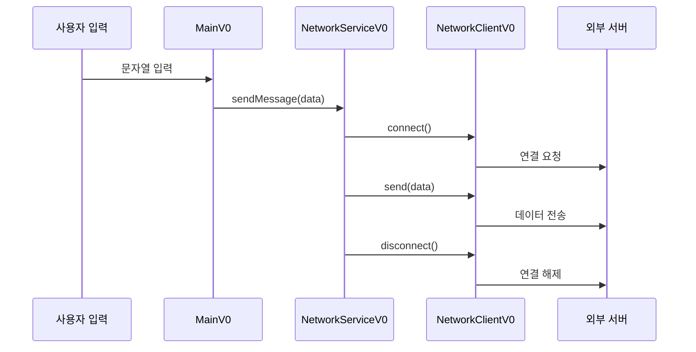
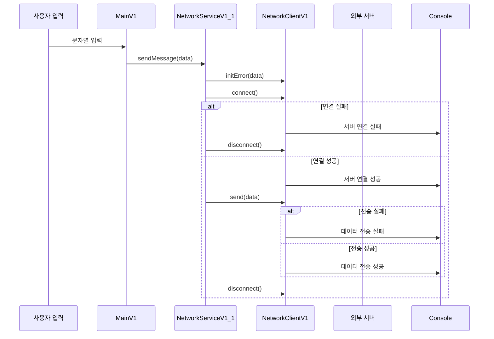
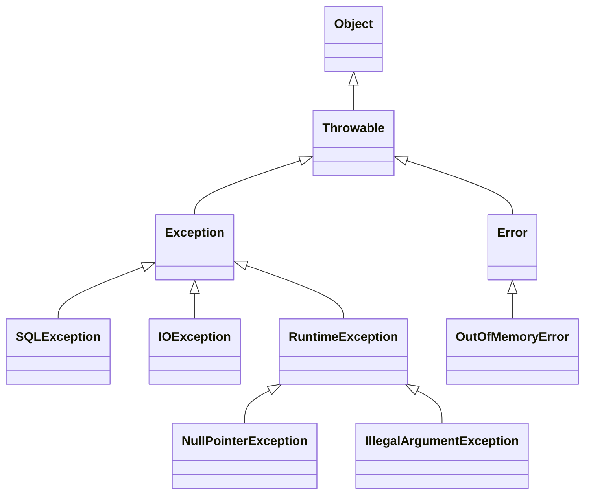
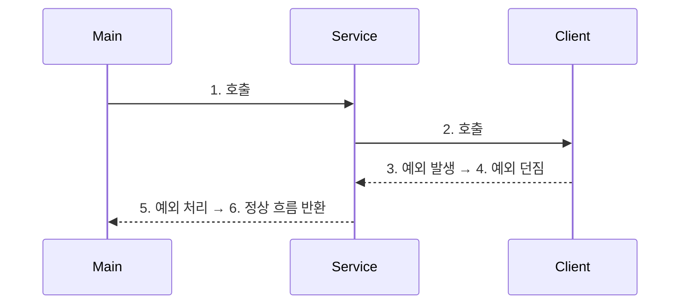
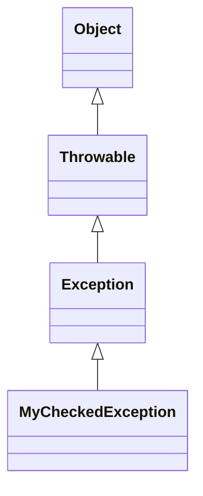
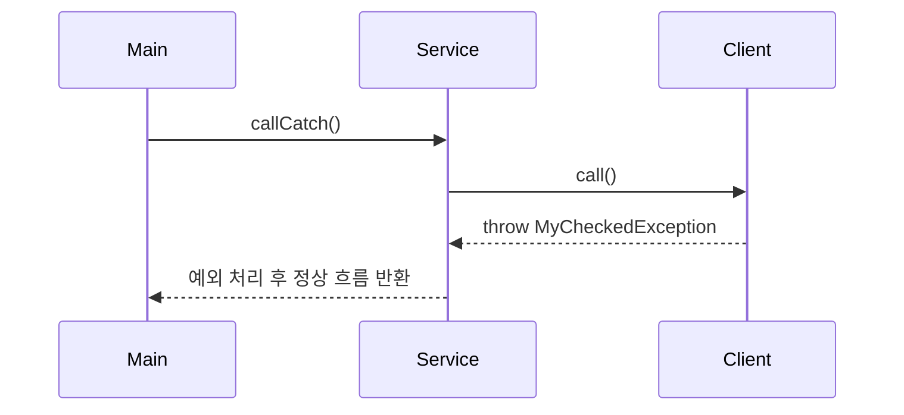
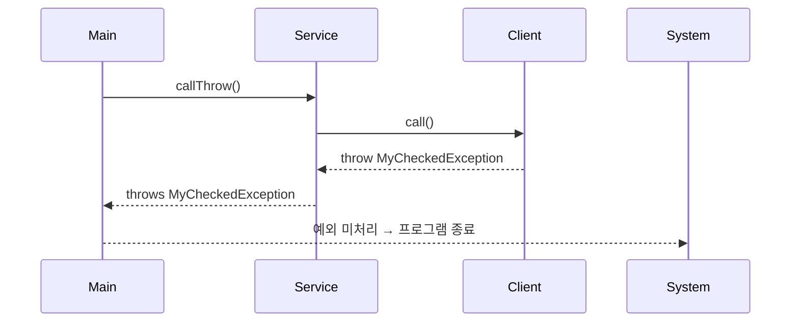
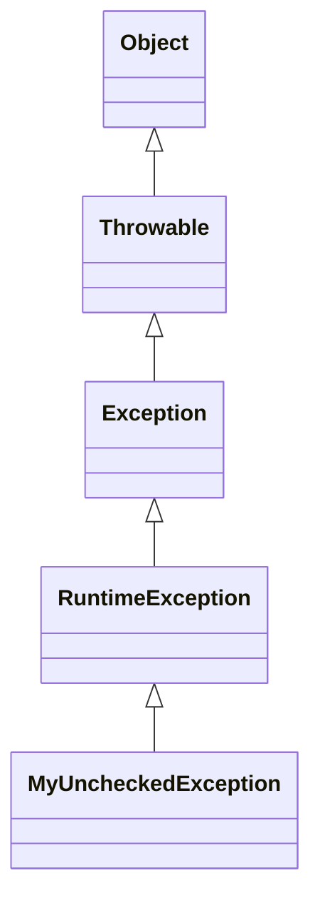
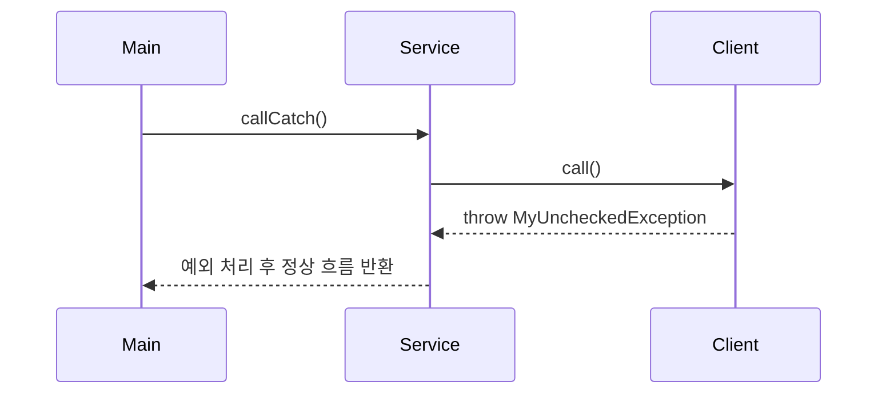
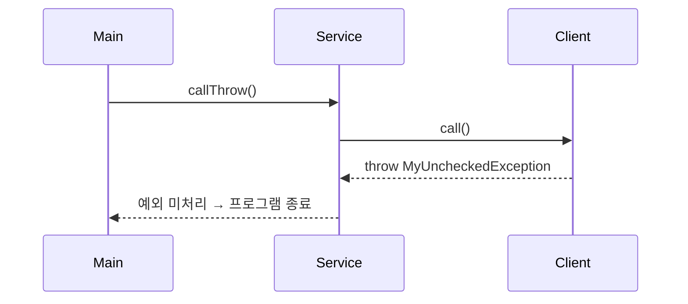

# 예외 처리

## 프로그램 구성

```java
public class NetworkClientV0 {
    private final String address;

    public NetworkClientV0(String address) {
        this.address = address;
    }

    public String connect() {
        //연결 성공
        System.out.println(address + " 서버 연결 성공");
        return "success";
    }

    public String send(String data) {
        //전송 성공
        System.out.println(address + " 서버에 데이터 전송: " + data);
        return "success";
    }

    public void disconnect() {
        System.out.println(address + " 서버 연결 해제");
    }
}

public class NetworkServiceV0 {
    public void sendMessage(String data) {
        String address = "http://example.com";

        NetworkClientV0 client = new NetworkClientV0(address);
        client.connect();
        client.send(data);
        client.disconnect();
    }
}

public class MainV0 {
    public static void main(String[] args) {
        NetworkServiceV0 networkService = new NetworkServiceV0();

        Scanner scanner = new Scanner(System.in);

        while (true) {
            System.out.print("전송할 문자: ");
            String input = scanner.nextLine();
            if (input.equals("exit")) {
                break;
            }
            networkService.sendMessage(input);
            System.out.println();
        }

        System.out.println("프로그램을 정상 종료합니다.");
    }
}
```

## 🧠 프로그램 구성 요약
| 구성 요소         | 연결 대상           | 역할 설명                                           |
|------------------|---------------------|----------------------------------------------------|
| MainV0           | NetworkServiceV0    | 사용자 입력을 받아 서비스에 전달                    |
| NetworkServiceV0 | NetworkClientV0     | 클라이언트를 통해 연결, 전송, 해제 흐름 제어        |
| NetworkClientV0  | 외부 서버           | 실제 연결, 데이터 전송, 연결 해제 수행              |

## ✅ 핵심 흐름
- 사용자 입력을 받음 (Scanner)
- NetworkServiceV0.sendMessage(input) 호출
- 내부에서 NetworkClientV0 생성
- connect() → send(data) → disconnect() 순서대로 호출

## ⚠️ 예외 처리 필요성
- connect() 실패 시 send() 호출하면 안 됨
- send() 중 오류 발생해도 disconnect()는 반드시 호출해야 함
- 예외가 발생하면 흐름이 중단되므로 자원 누수, 연결 미해제 등의 문제가 생길 수 있음

## 📦 실행 예시
```
전송할 문자: hello
http://example.com 서버 연결 성공
http://example.com 서버에 데이터 전송: hello
http://example.com 서버 연결 해제

전송할 문자: exit
프로그램을 정상 종료합니다.
```

## 📌 프로그램 구성도


## 📌 정리
| 단계               | 설명                                                                 |
|--------------------|----------------------------------------------------------------------|
| connect(), send()  | 예외 발생 가능 지점. 연결 실패 또는 전송 오류가 발생할 수 있음         |
| disconnect()       | 반드시 호출해야 함. 오류 발생 여부와 관계없이 자원 정리를 위해 필요     |
| 예외 처리 필요 이유 | 오류 발생 시에도 흐름을 유지하고 자원을 안전하게 해제하기 위함         |
| 개선 방향           | try-catch-finally 또는 try-with-resources 구조로 안정성 확보            |

---

# 예외 처리1 - 이론
사용자 입력에 따라 오류를 유발하고, 그 오류가 제대로 처리되지 않았을 때 발생하는 문제로 샘플 구성.

## 현재 코드
```java
public class NetworkClientV1 {
    private final String address;
    public boolean connectError;
    public boolean sendError;

    public NetworkClientV1(String address) {
        this.address = address;
    }

    public String connect() {
        if (connectError) {
            System.out.println(address + " 서버 연결 실패");
            return "connectError";
        }

        //연결 성공
        System.out.println(address + " 서버 연결 성공");
        return "success";
    }

    public String send(String data) {
        if (sendError) {
            System.out.println(address + " 서버에 데이터 전송 실패: " + data);
            return "sendError";
        }

        //전송 성공
        System.out.println(address + " 서버에 데이터 전송: " + data);
        return "success";
    }

    public void disconnect() {
        System.out.println(address + " 서버 연결 해제");
    }

    public void initError(String data) {
        if (data.contains("error1")) {
            connectError = true;
        }

        if (data.contains("error2")) {
            sendError = true;
        }
    }
}

public class NetworkServiceV1_1 {
    public void sendMessage(String data) {
        String address = "http://example.com";
        NetworkClientV1 client = new NetworkClientV1(address);
        client.initError(data); //추가
        client.connect();
        client.send(data);
        client.disconnect();
    }
}


public class MainV1 {
    public static void main(String[] args) {
        NetworkServiceV1_1 networkService = new NetworkServiceV1_1();
        Scanner scanner = new Scanner(System.in);

        while (true) {
            System.out.print("전송할 문자: ");
            String input = scanner.nextLine();
            if (input.equals("exit")) {
                break;
            }

            networkService.sendMessage(input);
            System.out.println();
        }
        System.out.println("프로그램을 정상 종료합니다.");
    }
}
```

🧠 시나리오 요약
| 입력 값   | 연결 결과               | 전송 결과               | 문제 여부 및 설명                          |
|-----------|------------------------|-------------------------|--------------------------------------------|
| hello     | 연결 성공              | 전송 성공              | ✅ 정상 동작                                |
| error1    | ❌ 연결 실패           | ⛔ 전송 시도됨          | ⚠ 연결 실패했는데도 전송 시도됨 (잘못된 흐름) |
| error2    | 연결 성공              | ❌ 전송 실패           | ⚠ 전송 실패 발생, 오류 로그 없음            |


✅ 현재 코드의 문제점
- 연결 실패 시에도 send()를 호출함
- connect() 결과가 "connectError"인데도 send()를 실행
- 실제 시스템이라면 NullPointerException, IOException 등 발생 가능
- 오류 로그가 없음
- 어떤 오류가 발생했는지 기록되지 않음
- 디버깅 및 유지보수에 불리함

## 📌 개선 방향

| 개선 항목             | 설명                                                                 |
|------------------------|----------------------------------------------------------------------|
| 연결 성공 여부 확인     | `connect()` 결과가 `"success"`일 때만 `send()` 호출                     |
| 흐름 제어 조건 추가     | `if` 조건문 또는 `try-catch-finally`로 오류 발생 시 흐름 분기 처리       |
| 오류 로그 출력         | 오류 발생 시 어떤 오류인지 콘솔에 출력하여 디버깅에 도움 제공            |
| 자원 정리 보장         | 오류 발생 여부와 관계없이 `disconnect()`는 반드시 호출해야 함            |


## 🔧 개선 예시
```java
String result = client.connect();
if (!result.equals("success")) {
    System.out.println("오류 발생: 연결 실패 - 코드: " + result);
    client.disconnect();

    return;
}

result = client.send(data);
if (!result.equals("success")) {
    System.out.println("오류 발생: 전송 실패 - 코드: " + result);
}
client.disconnect();
```


📦 전체 흐름 구조



## 🧠 문제 상황 요약

| 항목                     | 설명                                                                 |
|--------------------------|----------------------------------------------------------------------|
| connect(), send() 호출   | 오류 발생 시에도 흐름이 계속되어 잘못된 동작 발생 가능성 있음          |
| 오류 흐름 분기 없음       | 반환 값 기반 처리로 예외 흐름이 코드에 섞여 있어 가독성 저하            |
| disconnect() 누락 가능성 | 오류 발생 시 `disconnect()`가 호출되지 않아 자원 누수 위험               |
| 외부 자원 해제 필요       | GC로 메모리는 정리되지만, 네트워크 연결 같은 외부 자원은 수동 해제 필요   |


## ✅ 개선 흐름 요약
### NetworkServiceV1_2
```java
public class NetworkServiceV1_2 {
    public void sendMessage(String data) {
        NetworkClientV1 client = new NetworkClientV1("http://example.com");
        client.initError(data);
        String connectResult = client.connect();
        if (isError(connectResult)) {
            System.out.println("[네트워크 오류 발생] 오류 코드: " + connectResult);
            return;
        }
        String sendResult = client.send(data);
        if (isError(sendResult)) {
            System.out.println("[네트워크 오류 발생] 오류 코드: " + sendResult);
            return;
        }
        client.disconnect();
    }

    private static boolean isError(String resultCode) {
        return !resultCode.equals("success");
    }
}
```
- connect()와 send() 결과를 문자열로 받아 오류 여부 판단
- 오류 발생 시 return으로 흐름 중단
- 문제: disconnect()가 호출되지 않을 수 있음
  
### NetworkServiceV1_3
```java
public class NetworkServiceV1_3 {
    public void sendMessage(String data) {
        NetworkClientV1 client = new NetworkClientV1("http://example.com");
        client.initError(data);
        String connectResult = client.connect();
        if (isError(connectResult)) {
            System.out.println("[네트워크 오류 발생] 오류 코드: " + connectResult);
        } else {
            String sendResult = client.send(data);
            if (isError(sendResult)) {
                System.out.println("[네트워크 오류 발생] 오류 코드: " + sendResult);
            }
        }
        client.disconnect();
    }   
    private static boolean isError(String resultCode) {
        return !resultCode.equals("success");
    }
}

```

- return 제거, if-else 분기로 흐름 제어
- 오류 발생 여부와 관계없이 disconnect()는 항상 호출
- 문제 해결: 자원 정리 보장됨

## 📌 예외 처리 방식의 한계 (반환 값 기반)
| 항목                     | 설명                                                                 |
|--------------------------|----------------------------------------------------------------------|
| 흐름 분기 증가            | 정상 흐름과 예외 흐름이 섞여 있어 코드 가독성이 떨어짐                 |
| 오류 정보 부족            | 반환 값만으로는 예외의 원인, 위치, 상세 정보 파악이 어려움              |
| 자원 정리 누락 위험       | 오류 발생 시 `disconnect()` 같은 자원 해제가 누락될 수 있음             |
| 유지보수 어려움           | 예외 처리 코드가 분산되어 있어 수정 시 실수 가능성 높음                 |
| 확장성 부족               | 다양한 예외 상황을 세분화하거나 공통 처리하기 어려움                    |


## ✨ 예외 처리 메커니즘의 필요성
- 정상 흐름과 예외 흐름을 명확히 분리
- try-catch-finally 구조로 예외 발생 시 흐름 제어 가능
- throw를 통해 예외를 명시적으로 발생시킬 수 있음
- catch에서 예외 객체를 통해 상세 정보 확인 가능
- finally에서 자원 정리를 보장할 수 있음

## 📦 흐름 구조
```mermaid
flowchart TD
    A[MainV1 Input] --> B[NetworkServiceV1_2]
    B --> C[client.connect()]
    C --> D[Connect_Successful]
    D -->|No| E[Log Error and Return]
    D -->|Yes| F[client.send(data)]
    F --> G[Send_Successful]
    G -->|No| H[Log Error and Return]
    G -->|Yes| I[client.disconnect()]
    H --> I
    E --> I
```

## 🧠 자바 예외 처리 핵심 요약  
### 🔑 주요 키워드
| 키워드   | 설명                                                                 |
|----------|----------------------------------------------------------------------|
| try      | 예외가 발생할 수 있는 코드를 감싸는 블록                              |
| catch    | 발생한 예외를 잡아서 처리하는 블록                                   |
| finally  | 예외 발생 여부와 관계없이 항상 실행되는 블록 (자원 정리 등)           |
| throw    | 예외 객체를 직접 발생시킬 때 사용                                     |
| throws   | 해당 메서드가 예외를 던질 수 있음을 선언                             |

## 🧱 예외 계층 구조
| 계층 단계         | 설명                                                                 |
|------------------|----------------------------------------------------------------------|
| Object           | 자바의 모든 클래스의 최상위 부모 클래스                              |
| Throwable        | 모든 예외와 오류의 최상위 클래스. 예외 처리 대상의 루트 클래스         |
| Exception        | 애플리케이션에서 처리 가능한 예외. 대부분의 예외가 이 계층에 속함       |
| RuntimeException | 컴파일러가 체크하지 않는 예외. NullPointerException 등 런타임 오류 포함 |
| Error            | 시스템 수준의 심각한 오류. 애플리케이션에서 처리하지 않음              |


## ✅ 체크 예외 vs 언체크 예외
| 구분               | Exception (체크 예외)                     | RuntimeException (언체크 예외)             |
|--------------------|-------------------------------------------|--------------------------------------------|
| 컴파일러 체크 여부 | ✅ 반드시 예외 처리 필요 (`try-catch` 또는 `throws`) | ❌ 예외 처리 선택 가능 (컴파일러가 강제하지 않음) |
| 처리 방식          | 명시적으로 처리하지 않으면 컴파일 오류 발생 | 처리하지 않아도 컴파일 가능                  |
| 대표 예시          | `IOException`, `SQLException`             | `NullPointerException`, `IllegalArgumentException` |

### ⚠️ 주의 사항
- Throwable을 catch하면 Error까지 잡히므로 애플리케이션에서는 Exception만 처리해야 함
- 부모 타입으로 예외를 잡거나 던지면 자식 예외도 함께 처리됨

---

## 🔁 예외 흐름 요약
- Main → Service 호출
- Service → Client 호출
- Client에서 예외 발생
- Client는 예외를 Service로 던짐
- Service가 예외를 처리
- 정상 흐름으로 복귀

## 📌 예외 처리 기본 규칙
| 규칙 번호 | 설명                                                                 |
|-----------|----------------------------------------------------------------------|
| 1         | 예외는 반드시 처리하거나 던져야 한다 (`try-catch` 또는 `throws`)     |
| 2         | 부모 타입으로 예외를 처리하거나 던지면 자식 예외도 함께 포함된다       |


## 📊 예외 계층 구조



## 🔄 예외 흐름 구조

## 🧠 체크 예외 핵심 요약
| 항목               | 체크 예외 (Exception)             | 언체크 예외 (RuntimeException)       |
|--------------------|-----------------------------------|--------------------------------------|
| 예외 종류           | 컴파일러가 체크함                 | 컴파일러가 체크하지 않음             |
| 처리 방식           | 반드시 try-catch 또는 throws 필요 | 선택적으로 처리 가능                 |
| 처리 키워드         | try-catch, throws                 | 필요 시 catch 또는 throws 사용 가능  |
| 다형성 적용         | catch(Exception), throws(Exception) 가능 | catch(RuntimeException) 가능         |

## ✅ 주요 키워드 정리
| 키워드   | 설명                                                                 |
|----------|----------------------------------------------------------------------|
| throw    | 예외 객체를 생성하고 직접 발생시킬 때 사용 (`throw new 예외`)         |
| throws   | 해당 메서드가 예외를 던질 수 있음을 선언 (`method() throws 예외`)     |
| try      | 예외가 발생할 수 있는 코드를 감싸는 블록                              |
| catch    | 발생한 예외를 잡아서 처리하는 블록                                   |


## 📦 예외 흐름 구조
### 예외를 잡아서 처리하는 흐름 (callCatch())
```java
try {
    client.call(); // 예외 발생
} catch (MyCheckedException e) {
    System.out.println("예외 처리, message=" + e.getMessage());
}
System.out.println("정상 흐름");
```

- 예외 발생 → catch에서 처리 → 정상 흐름 복귀

### 예외를 밖으로 던지는 흐름 (callThrow())
```java
public void callThrow() throws MyCheckedException {
    client.call(); // 예외 발생 → 호출한 곳으로 던짐
}
```

- 예외 발생 → throws로 던짐 → 호출한 메서드에서 처리 필요

## 📊 예외 클래스 계층 구조



## 🔁 예외 흐름 시퀀스
### 예외를 잡아서 처리하는 흐름



### 예외를 던지고 처리하지 않는 흐름


## 📌 체크 예외의 장단점
| 항목   | 장점                                                                 | 단점                                                                 |
|--------|----------------------------------------------------------------------|----------------------------------------------------------------------|
| 안정성 | 컴파일러가 예외 누락을 방지해줌. 예외 발생 가능성을 명확히 파악 가능 | 모든 예외를 명시적으로 처리해야 하므로 코드가 번거로워질 수 있음       |
| 가시성 | API 사용 시 어떤 예외가 발생할 수 있는지 명확히 드러남               | 불필요하거나 사소한 예외까지도 처리해야 해서 개발 흐름이 방해받을 수 있음 |
| 유지보수 | 예외 처리 경로가 명확하여 디버깅과 유지보수에 유리함                 | 예외 전파가 복잡해질 경우 코드 가독성과 관리가 어려워질 수 있음         |

## 🧩 최종 정리
- 체크 예외는 반드시 잡거나 던져야 한다.
- 예외를 잡으면 정상 흐름으로 복귀할 수 있고, 던지면 호출한 쪽에서 처리해야 한다.
- 예외도 객체이므로 다형성이 적용된다 (catch Exception, throws Exception 가능).
- 실무에서는 의미 있는 예외만 체크 예외로 만들고, 불필요한 예외는 런타임 예외로 처리하는 전략이 중요하다.

---

## 언체크 예외

이번 내용은 자바의 **언체크 예외(Unchecked Exception)** 에 대한 구조와 특징을 체크 예외와 비교하며 설명한 예제.

## 🧠 언체크 예외 핵심 요약

| 항목               | Exception (체크 예외)                     | RuntimeException (언체크 예외)             |
|--------------------|-------------------------------------------|--------------------------------------------|
| 예외 처리 방식       | 반드시 try-catch 또는 throws 필요           | 생략 가능. 선택적으로 처리 가능             |
| throws 선언 여부     | 필수                                       | 선택 (있어도 되고 없어도 됨)                |
| 컴파일러 체크 여부   | ✅ 컴파일러가 예외 처리 여부를 검사함         | ❌ 컴파일러가 검사하지 않음                 |
| 대표 예시            | IOException, SQLException                 | NullPointerException, IllegalArgumentException |

## ✅ 언체크 예외 정의 및 사용
### 예외 클래스 정의
```java
public class MyUncheckedException extends RuntimeException {
    public MyUncheckedException(String message) {
        super(message);
    }
}
```

### 예외 발생
```java
public void call() {
    throw new MyUncheckedException("ex");
}
```

### 예외 처리 (callCatch())
```java
try {
    client.call();
} catch (MyUncheckedException e) {
    System.out.println("예외 처리, message=" + e.getMessage());
}
System.out.println("정상 로직");
```

### 예외 던지기 (callThrow())
```java
public void callThrow() {
    client.call(); // throws 선언 없이 자동으로 던져짐
}
```


## 📊 예외 클래스 계층 구조



## 🔁 예외 흐름 시퀀스 (Mermaid)
### 예외를 잡아서 처리하는 흐름



### 예외를 던지고 처리하지 않는 흐름



## 📌 언체크 예외의 장단점

| 항목         | 장점                                                                 | 단점                                                                 | 비고                         |
|--------------|----------------------------------------------------------------------|----------------------------------------------------------------------|------------------------------|
| 선언 유무     | `throws` 생략 가능 → 코드 간결함                                      | `throws` 생략 시 예외 발생 여부를 파악하기 어려움                     | 선언은 선택 사항             |
| 개발 편의성   | 신경 쓰고 싶지 않은 예외를 무시할 수 있음                             | 실수로 예외를 놓칠 수 있어 안정성 저하 가능성 있음                    | IDE 도움으로 보완 가능       |
| 코드 가독성   | 핵심 로직에 집중 가능                                                | 예외 흐름이 명확히 드러나지 않아 유지보수 시 혼란 가능                | 중요한 예외는 선언 권장      |
| 컴파일러 체크 | 컴파일러가 강제하지 않음 → 자유로운 설계 가능                         | 컴파일러가 누락을 잡아주지 않음 → 실수 방지 장치 부족                 | 체크 예외와 대비되는 특징     |


## 🧩 최종 정리
- 언체크 예외는 RuntimeException을 상속받아 정의하며, 컴파일러가 강제하지 않음
- 예외를 잡아서 처리할 수도 있고, 처리하지 않으면 자동으로 상위로 던져짐
- throws 선언은 선택 사항이며, IDE에서 예외 인지를 돕기 위해 명시적으로 선언할 수도 있음
- 실무에서는 복잡한 예외는 체크 예외로, 단순하거나 비핵심적인 예외는 언체크 예외로 처리하는 전략이 자주 사용됨

---

# 예외 종류

자바의 Checked 예외, Unchecked 예외, Error 클래스 주요 항목 리스트입니다.

## ✅ Checked Exception (컴파일러가 체크하는 예외)
이 예외들은 반드시 try-catch로 처리하거나 throws로 선언해야 합니다.

| 예외 클래스                  | 설명                                                                 |
|-----------------------------|----------------------------------------------------------------------|
| IOException                 | 입출력 작업 중 오류 발생 시 사용                                      |
| FileNotFoundException       | 지정한 파일을 찾을 수 없을 때 발생 (`IOException`의 하위 클래스)     |
| SQLException                | 데이터베이스 접근 중 오류 발생 시 사용                               |
| ClassNotFoundException      | 클래스 로딩 시 해당 클래스를 찾을 수 없을 때                          |
| InterruptedException        | 스레드가 인터럽트 되었을 때 발생                                     |
| NoSuchMethodException       | 리플렉션으로 존재하지 않는 메서드에 접근할 때                        |
| NoSuchFieldException        | 리플렉션으로 존재하지 않는 필드에 접근할 때                          |
| IllegalAccessException      | 접근 권한이 없는 필드나 메서드에 접근할 때                           |
| InstantiationException      | 추상 클래스나 인터페이스 인스턴스화 시도 시 발생                     |
| ReflectiveOperationException| 리플렉션 작업 중 발생 가능한 예외들의 상위 클래스                     |


## ⚠️ Unchecked Exception (컴파일러가 체크하지 않는 예외)
RuntimeException을 상속하며, throws 선언 없이도 던질 수 있습니다.

| 예외 클래스                        | 설명                                                                 |
|-----------------------------------|----------------------------------------------------------------------|
| NullPointerException              | null 객체를 참조할 때 발생                                           |
| IllegalArgumentException          | 메서드에 잘못된 인자를 전달했을 때 발생                             |
| ArithmeticException               | 0으로 나누기 등 산술 오류 발생 시                                   |
| ArrayIndexOutOfBoundsException    | 배열 인덱스가 범위를 벗어났을 때 발생                               |
| StringIndexOutOfBoundsException   | 문자열 인덱스가 범위를 벗어났을 때 발생                             |
| ClassCastException                | 잘못된 형변환 시 발생                                               |
| IllegalStateException             | 객체 상태가 적절하지 않을 때 메서드 호출 시 발생                    |
| NumberFormatException             | 문자열을 숫자로 변환할 때 형식이 잘못되었을 때 발생                 |
| UnsupportedOperationException     | 지원되지 않는 기능을 호출했을 때 발생                               |
| SecurityException                 | 보안 위반이 발생했을 때 발생                                        |


## ❌ Error (복구 불가능한 시스템 오류)
Error는 애플리케이션에서 처리하지 않는 것이 원칙입니다.
| 오류 클래스              | 설명                                                                 |
|--------------------------|----------------------------------------------------------------------|
| OutOfMemoryError         | JVM 힙 메모리가 부족할 때 발생                                       |
| StackOverflowError       | 메서드의 재귀 호출이 너무 깊어져 스택이 넘칠 때 발생                 |
| VirtualMachineError      | JVM 자체의 심각한 오류 발생 시 사용되는 상위 클래스                   |
| AssertionError           | `assert` 문이 실패했을 때 발생                                       |
| LinkageError             | 클래스 로딩 중 연결 오류 발생 시 사용되는 상위 클래스                 |
| NoClassDefFoundError     | 클래스 정의를 찾을 수 없을 때 발생 (`ClassNotFoundException`과 다름) |

---


