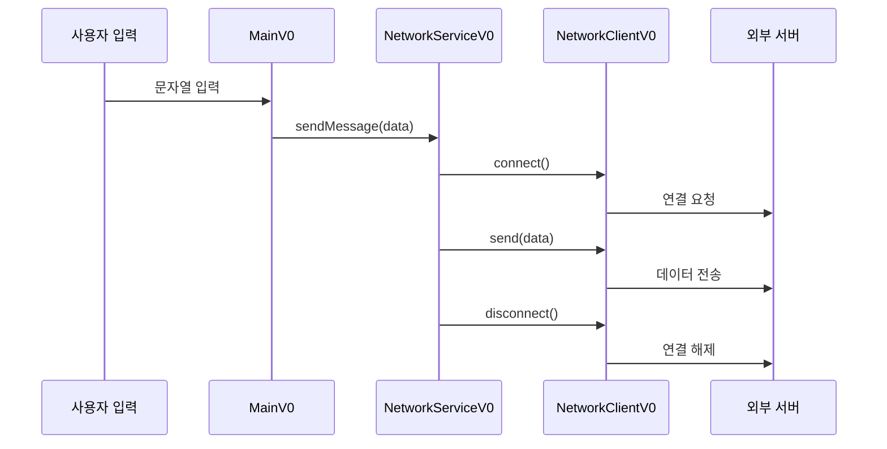

# 예외 처리

## 프로그램 구성

```java
public class NetworkClientV0 {
    private final String address;
    public NetworkClientV0(String address) {
        this.address = address;
    }
    public String connect() {
        //연결 성공
        System.out.println(address + " 서버 연결 성공");
        return "success";
    }
    public String send(String data) {
        //전송 성공
        System.out.println(address + " 서버에 데이터 전송: " + data);
        return "success";
    }
    public void disconnect() {
        System.out.println(address + " 서버 연결 해제");
    }
}

public class NetworkServiceV0 {
    public void sendMessage(String data) {
        String address = "http://example.com";
        NetworkClientV0 client = new NetworkClientV0(address);
        client.connect();
        client.send(data);
        client.disconnect();
    }
}

public class MainV0 {
    public static void main(String[] args) {
        NetworkServiceV0 networkService = new NetworkServiceV0();
        Scanner scanner = new Scanner(System.in);
        while (true) {
            System.out.print("전송할 문자: ");
            String input = scanner.nextLine();
            if (input.equals("exit")) {
                break;
            }
            networkService.sendMessage(input);
            System.out.println();
        }
        System.out.println("프로그램을 정상 종료합니다.");
    }
}
```

## 🧠 프로그램 구성 요약
| 구성 요소         | 연결 대상           | 역할 설명                                           |
|------------------|---------------------|----------------------------------------------------|
| MainV0           | NetworkServiceV0    | 사용자 입력을 받아 서비스에 전달                    |
| NetworkServiceV0 | NetworkClientV0     | 클라이언트를 통해 연결, 전송, 해제 흐름 제어        |
| NetworkClientV0  | 외부 서버           | 실제 연결, 데이터 전송, 연결 해제 수행              |

## ✅ 핵심 흐름
- 사용자 입력을 받음 (Scanner)
- NetworkServiceV0.sendMessage(input) 호출
- 내부에서 NetworkClientV0 생성
- connect() → send(data) → disconnect() 순서대로 호출

## ⚠️ 예외 처리 필요성
- connect() 실패 시 send() 호출하면 안 됨
- send() 중 오류 발생해도 disconnect()는 반드시 호출해야 함
- 예외가 발생하면 흐름이 중단되므로 자원 누수, 연결 미해제 등의 문제가 생길 수 있음

## 📦 실행 예시
```
전송할 문자: hello
http://example.com 서버 연결 성공
http://example.com 서버에 데이터 전송: hello
http://example.com 서버 연결 해제

전송할 문자: exit
프로그램을 정상 종료합니다.
```

## 📌 프로그램 구성도


## 📌 정리
| 단계               | 설명                                                                 |
|--------------------|----------------------------------------------------------------------|
| connect(), send()  | 예외 발생 가능 지점. 연결 실패 또는 전송 오류가 발생할 수 있음         |
| disconnect()       | 반드시 호출해야 함. 오류 발생 여부와 관계없이 자원 정리를 위해 필요     |
| 예외 처리 필요 이유 | 오류 발생 시에도 흐름을 유지하고 자원을 안전하게 해제하기 위함         |
| 개선 방향           | try-catch-finally 또는 try-with-resources 구조로 안정성 확보            |

---


