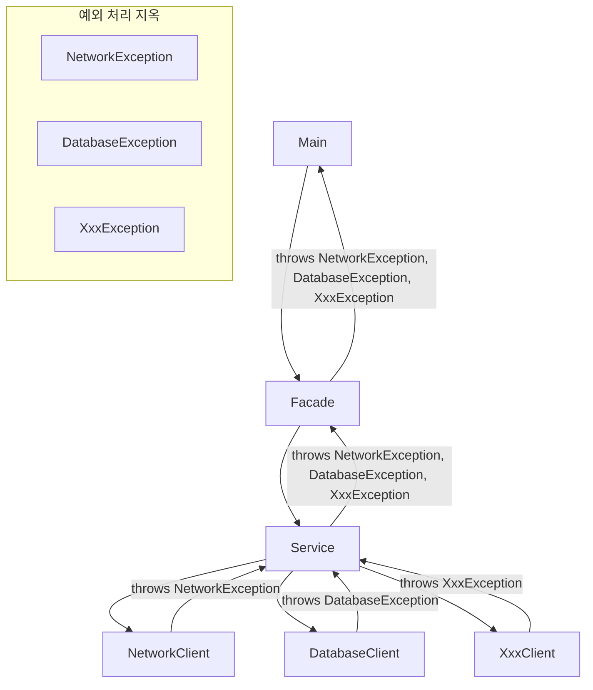

# 예외 처리 도입
아래는 예외 처리 도입 1단계의 핵심 내용을 정리한 요약.  
이 단계에서는 반환값 기반 오류 처리 → 예외 기반 처리로 전환하면서 코드의 가독성과 구조를 개선하려는 목적.

---

# 📌 예외 처리 도입 1단계 요약
## ✅ 기존 문제점 (반환값 기반 처리)
- 정상 흐름과 예외 흐름이 섞여 있어 코드 가독성이 떨어짐
- 예외 처리 코드가 많아져서 정상 흐름이 묻힘
- 실무에서는 예외 처리 로직이 훨씬 복잡해짐

## ✅ 개선 방향: 예외 객체 기반 처리
### 1. 사용자 정의 예외 클래스
```java
public class NetworkClientExceptionV2 extends Exception {
    private String errorCode;
    public NetworkClientExceptionV2(String errorCode, String message) {
        super(message);
        this.errorCode = errorCode;
    }
    public String getErrorCode() {
        return errorCode;
    }
}
```

- 예외도 객체이므로 오류 코드와 메시지를 필드로 포함 가능
- 오류 코드: 어떤 종류의 오류인지 구분
- 메시지: 개발자가 이해할 수 있는 설명

### 2. 예외를 던지는 클라이언트 코드
```java
public void connect() throws NetworkClientExceptionV2 {
    if (connectError) {
        throw new NetworkClientExceptionV2("connectError", "서버 연결 실패");
    }
    System.out.println("서버 연결 성공");
}
```

- 오류 발생 시 throw로 예외 객체를 던짐
- 반환값 없이 void로 처리 → 정상 흐름과 실패 흐름이 명확히 분리됨

###  3. 서비스 계층: 예외를 던지기만 함
```java
public void sendMessage(String data) throws NetworkClientExceptionV2 {
    client.connect();
    client.send(data);
    client.disconnect();
}
```

- 예외를 직접 처리하지 않고 throws로 상위에 위임

###  4. 메인 프로그램: 예외를 처리하지 않음
```java
public static void main(String[] args) throws NetworkClientExceptionV2 {
    networkService.sendMessage(input);
}
```

- 예외가 발생하면 main() 밖으로 던져짐 → JVM이 예외 메시지와 스택 트레이스를 출력하고 종료

### ⚠️ 실행 결과 요약
| 입력값   | 결과 요약                                                       |
|----------|------------------------------------------------------------------|
| hello    | 연결 성공 → 데이터 전송 성공 → 연결 해제 → 정상 종료            |
| error1   | 연결 실패 → `connect()`에서 예외 발생 → 예외 출력 후 프로그램 종료 |
| error2   | 연결 성공 → 전송 실패 → `send()`에서 예외 발생 → 예외 출력 후 종료 |


## 🧩 남은 문제
- 예외는 던졌지만 복구하지 않음 → 프로그램이 종료됨
- 예외 발생 시에도 disconnect()가 호출되지 않음 → 자원 누수 가능성
- 다음 단계에서는 try-catch-finally를 통해 예외 복구와 자원 정리를 도입해야 함


---

# 예외 처리 도입 2단계

예외 복구의 핵심 내용을 정리한 요약.  
이 단계에서는 예외를 직접 try-catch로 잡아서 프로그램이 중단되지 않도록 복구하는 구조를 도입.

## 📌 예외 처리 도입 2단계 요약

## ✅ 목적
- 예외 발생 시 프로그램이 종료되지 않도록 복구 처리
- try-catch를 사용해 예외를 잡고, 정상 흐름으로 되돌아감

## ✅ 변경된 구조

### 수정 소스
```java
public class NetworkServiceV2_2 {
    public void sendMessage(String data) {
        String address = "http://example.com";
        NetworkClientV2 client = new NetworkClientV2(address);
        client.initError(data);
        try {
            client.connect();
        } catch (NetworkClientExceptionV2 e) {
            System.out.println("[오류] 코드: " + e.getErrorCode() + ", 메시지: " + e.getMessage());
            return;
        }
        try {
            client.send(data);
        } catch (NetworkClientExceptionV2 e) {
            System.out.println("[오류] 코드: " + e.getErrorCode() + ", 메시지: " +
            e.getMessage());
            return;
        }
        client.disconnect();
    }
}


public static void main(String[] args) throws NetworkClientExceptionV2 {
    NetworkServiceV2_2 networkService = new NetworkServiceV2_2();
    ...
}

```
### 1. NetworkServiceV2_2 클래스
- connect()와 send()에서 발생할 수 있는 예외를 각각 try-catch로 처리
- 예외 발생 시 오류 코드와 메시지를 출력하고 return으로 메서드 종료
- 예외가 없으면 disconnect()를 호출해 연결 해제
### 2. MainV2 클래스
- NetworkServiceV2_2를 사용하도록 변경
- throws 선언은 남아 있지만, 예외는 내부에서 처리되므로 프로그램은 종료되지 않음

### ✅ 실행 결과 요약
| 입력값   | 결과 요약                                                       |
|----------|------------------------------------------------------------------|
| hello    | 연결 성공 → 전송 성공 → 연결 해제 → 정상 종료                   |
| error1   | 연결 실패 → 예외 메시지 출력 → 메서드 종료 → 프로그램 계속 실행 |
| error2   | 연결 성공 → 전송 실패 → 예외 메시지 출력 → 메서드 종료         |
| exit     | 루프 종료 → 프로그램 정상 종료                                   |


## ✅ 해결된 문제
- 예외를 직접 잡아서 복구함
- 프로그램이 중단되지 않고 계속 실행됨
- 사용자에게 친절한 오류 메시지 제공

## ⚠️ 남은 문제 요약

| 문제 항목           | 설명                                                                 |
|----------------------|----------------------------------------------------------------------|
| 코드 가독성 저하      | 정상 흐름과 예외 흐름이 섞여 있어 읽기 어려움                       |
| 자원 정리 누락 가능성 | 예외 발생 시 `disconnect()`가 호출되지 않아 연결이 해제되지 않을 수 있음 |

이번 단계에서는 try-catch를 통해 정상 흐름과 예외 흐름을 명확히 분리.
하지만 여전히 남은 핵심 문제는 바로 자원 정리 누락, 특히 disconnect()가 예외 발생 시 호출되지 않는다는 점.

## ⚠️ 남은 문제: 자원 정리 누락
- disconnect()는 try 블록 안에 있기 때문에 connect() 또는 send()에서 예외가 발생하면 실행되지 않음
- 네트워크 연결, 파일 스트림, DB 커넥션 등은 자동으로 해제되지 않음
- 따라서 예외가 발생해도 반드시 자원은 반납해야 함

---

# 📌 예외 처리 도입 4단계 요약
## ✅ 현재 구조
```java
try {
    client.connect();
    client.send(data);
} catch (NetworkClientExceptionV2 e) {
    System.out.println("[오류] 코드: " + e.getErrorCode() + ", 메시지: " + e.getMessage());
}
client.disconnect(); // 예외 처리 후 호출
```

- NetworkClientExceptionV2만 처리
- 예외가 발생하지 않으면 disconnect()는 정상적으로 호출됨
- NetworkClientExceptionV2가 발생해도 catch 후 disconnect() 호출됨

## ⚠️ 문제 발생 상황
- send()에서 RuntimeException 발생 시 catch에서 잡지 못함
- 예외가 밖으로 던져지면서 disconnect()가 호출되지 않음
- 결과적으로 자원 누수 발생 가능성

## 🧠 핵심 문제 요약
| 항목               | 설명                                                                 |
|--------------------|----------------------------------------------------------------------|
| catch 한계          | 지정한 예외만 처리 → 다른 예외는 놓칠 수 있음                         |
| disconnect() 누락   | 예외가 발생하면 호출되지 않을 수 있음 → 자원 누수 가능성               |
| catch 의존 구조     | 예외 종류가 늘어날수록 catch 블록이 복잡해지고 유지보수 어려움 증가     |


## ✅ 해결 방향
- 모든 예외 상황에서도 자원 정리를 보장해야 함
- 자바에서는 이를 위해 finally 블록을 사용
### 📦 개선 예시
```java
try {
    client.connect();
    client.send(data);
} catch (NetworkClientExceptionV2 e) {
    System.out.println("[오류] 코드: " + e.getErrorCode() + ", 메시지: " + e.getMessage());
} finally {
    client.disconnect(); // 항상 호출됨
}
```
- finally는 예외 발생 여부와 관계없이 항상 실행됨
- RuntimeException이 발생해도 disconnect()는 호출됨

## 💡 핵심 교훈
- 예외가 발생해도 자원은 반드시 반납해야 한다
- finally는 자원 정리를 위한 안전한 보장 장치
- 예외 종류가 다양해질수록 catch보다 finally의 역할이 더 중요해짐

---

# 예외 처리 도입 5단계

아래는 예외 처리 도입 5단계 – finally 블록 활용의 핵심 내용을 정리한 요약.  
이 단계에서는 예외 발생 여부와 관계없이 자원 정리를 보장하는 구조를 완성.

## 📌 예외 처리 도입 5단계 요약
## ✅ 핵심 구조: try ~ catch ~ finally
```java
try {
    // 정상 흐름
} catch (예외 타입) {
    // 예외 흐름
} finally {
    // 마무리 흐름 (자원 정리)
}
```

- try: 정상적인 작업 수행
- catch: 예외 발생 시 복구 처리
- finally: 예외 발생 여부와 관계없이 항상 실행됨

## ✅ 개선된 코드 예시
```java
try {
    client.connect();
    client.send(data);
} catch (NetworkClientExceptionV2 e) {
    System.out.println("[오류] 코드: " + e.getErrorCode() + ", 메시지: " + e.getMessage());
} finally {
    client.disconnect(); // 항상 호출됨
}
```

- RuntimeException처럼 catch에서 잡지 못하는 예외가 발생해도 finally는 실행됨
- 자원 누수 없이 서버 연결 해제 보장

## ⚠️ 예외 종류별 흐름
| 예외 상황               | 흐름 설명                                                       |
|------------------------|------------------------------------------------------------------|
| 정상 실행              | try → finally → 종료                                            |
| 처리 가능한 예외 발생   | try → catch → finally → 종료                                    |
| 처리 불가능한 예외 발생 | try → 예외 발생 → finally → 예외가 밖으로 던져짐 → 종료         |


### ✅ try ~ finally 단독 사용 (예외를 처리 하지 않음)
```java
try {
    client.connect();
    client.send(data);
} finally {
    client.disconnect();
}
```
- 예외를 직접 처리하지 않고 밖으로 던지되, 자원 정리는 보장
- 예외 처리 책임을 상위로 위임하면서도 자원 누수 방지

### 💡 핵심 효과: try-catch-finally 구조
| 블록     | 역할 설명                                                                 |
|----------|---------------------------------------------------------------------------|
| try      | 예외가 발생할 수 있는 정상 흐름 코드 작성                                  |
| catch    | 특정 예외를 잡아서 복구하거나 메시지 출력                                  |
| finally  | 예외 발생 여부와 관계없이 항상 실행 → 자원 정리, 연결 해제 등 마무리 작업 |

## 🧠 정리
- finally는 자바 예외 처리에서 자원 정리의 안전장치
- 정상 흐름과 예외 흐름을 분리해 코드 가독성 향상
- 예외가 발생해도 자원은 반드시 반환되도록 보장

---

# 예외 계층화 도입 1단계

아래는 예외 계층화 도입 1단계의 핵심 내용을 정리한 요약.  
이 단계에서는 예외를 단순한 오류 코드가 아닌 객체 계층 구조로 설계함으로써 더 세밀하고 유연한 예외 처리를 가능하게 만듬.

## 📌 예외 계층화 도입 1단계 요약

### 예외 클래스 선언
```java
public class NetworkClientExceptionV3 extends Exception {
    public NetworkClientExceptionV3(String message) {
        super(message);
    }
}

public class ConnectExceptionV3 extends NetworkClientExceptionV3 {
    private final String address;
    public ConnectExceptionV3(String address, String message) {
        super(message);
        this.address = address;
    }
    public String getAddress() {
        return address;
    }
}

public class SendExceptionV3 extends NetworkClientExceptionV3 {
    private final String sendData;
    public SendExceptionV3(String sendData, String message) {
        super(message);
        this.sendData = sendData;
    }
    public String getSendData() {
        return sendData;
    }
}
```

### ✅ 예외 클래스 계층 구조
| 예외 클래스               | 설명 및 고유 필드                         |
|---------------------------|-------------------------------------------|
| NetworkClientExceptionV3 | `NetworkClient` 관련 모든 예외의 부모 클래스 |
| ConnectExceptionV3       | 연결 실패 예외. 연결 주소 `address` 포함     |
| SendExceptionV3          | 전송 실패 예외. 전송 데이터 `sendData` 포함  |

- 모든 예외는 exception.ex3.exception 패키지에 분리하여 관리
- 예외 객체는 상속을 통해 계층화되어 있음

✅ 예외 계층화의 장점
- 부모 예외로 전체를 포괄하거나, 자식 예외로 세부 처리 가능
- 각 예외 클래스가 고유한 정보 필드를 가짐 → 예외 상황에 맞는 정보 출력 가능
- 예외를 의미 있는 객체로 다루기 때문에 코드의 의도와 흐름이 명확해짐

##  예외 발생 및 처리 흐름

### Client
```java
public class NetworkClientV3 {
    
    private final String address;
    public boolean connectError;
    public boolean sendError;
    
    public NetworkClientV3(String address) {
        this.address = address;
    }

    public void connect() throws ConnectExceptionV3 {
        if (connectError) {
            throw new ConnectExceptionV3(address, address + " 서버 연결 실패");
        }
        System.out.println(address + " 서버 연결 성공");
    }

    public void send(String data) throws SendExceptionV3 {
        if (sendError) {
            throw new SendExceptionV3(data, address + " 서버에 데이터 전송 실패: " + data);
        }
        System.out.println(address + " 서버에 데이터 전송: " + data);
    }

    public void disconnect() {
        System.out.println(address + " 서버 연결 해제");
    }

    public void initError(String data) {
        if (data.contains("error1")) {
            connectError = true;
        }
        if (data.contains("error2")) {
            sendError = true;
        }
    }
}
```

### Service
```java
try {
    client.connect(); // ConnectExceptionV3 발생 가능
    client.send(data); // SendExceptionV3 발생 가능
} catch (ConnectExceptionV3 e) {
    System.out.println("[연결 오류] 주소: " + e.getAddress() + ", 메시지: " + e.getMessage());
} catch (SendExceptionV3 e) {
    System.out.println("[전송 오류] 전송 데이터: " + e.getSendData() + ", 메시지: " + e.getMessage());
} finally {
    client.disconnect(); // 항상 호출됨
}
```
- 예외 종류에 따라 각기 다른 catch 블록에서 처리
- finally 블록으로 자원 정리 보장

## ✅ 실행 결과 요약
| 입력값   | 결과 설명                                                                 |
|----------|----------------------------------------------------------------------------|
| hello    | 연결 성공 → 전송 성공 → 연결 해제 → 정상 종료                             |
| error1   | 연결 실패 → ConnectExceptionV3 발생 → 연결 해제                            |
| error2   | 연결 성공 → 전송 실패 → SendExceptionV3 발생 → 연결 해제                   |
| exit     | 루프 종료 → 프로그램 정상 종료                                             |

## 💡 핵심 요약
- 예외를 계층화하면 더 세밀하고 의미 있는 예외 처리가 가능
- 각 예외 클래스는 상황에 맞는 정보와 기능을 제공
- catch 블록에서 예외 타입별로 분리된 로직 작성 가능
- finally 블록으로 자원 정리 보장

----

# 예외 계층화 도입 2단계

활용의 핵심 내용을 정리.  
이 단계에서는 예외 계층을 활용해 세분화된 예외 처리와 공통 예외 처리 전략을 구현.

## 📌 예외 계층화 활용 요약
### ✅ 예외 처리 전략
| 예외 클래스                 | 처리 메시지 예시                              |
|----------------------------|-----------------------------------------------|
| ConnectExceptionV3         | [연결 오류] 주소: ...                         |
| NetworkClientExceptionV3   | [네트워크 오류] 메시지: ...                   |
| Exception                  | [알 수 없는 오류] 메시지: ...                 |

- 예외를 계층적으로 처리하여 각 상황에 맞는 메시지를 출력
- catch 블록은 자식 → 부모 → 최상위 순서로 배치해야 정확하게 작동

### ✅ 예외 흐름 예시
| 발생 예외             | 처리 위치                                |
|------------------------|-------------------------------------------|
| ConnectExceptionV3     | catch (ConnectExceptionV3)                |
| SendExceptionV3        | catch (NetworkClientExceptionV3)          |
| RuntimeException       | catch (Exception)                         |

### ✅ 여러 예외를 한 번에 처리 (| 연산자)
```java
catch (ConnectExceptionV3 | SendExceptionV3 e) {
    System.out.println("[연결 또는 전송 오류] 메시지: " + e.getMessage());
}
```

- 여러 예외를 하나의 catch 블록에서 처리
- 단, 공통 부모 타입의 기능만 사용 가능 (getMessage() 등)

## 💡 핵심 효과
| 항목                     | 설명                                                                 |
|--------------------------|----------------------------------------------------------------------|
| 예외별 세분화 처리 가능    | 예외 종류에 따라 맞춤형 메시지와 로직을 적용할 수 있음                |
| 공통 예외 묶음 처리 가능   | 부모 예외를 통해 여러 자식 예외를 한 번에 처리 가능                   |
| 예외 흐름 가독성 향상      | catch 블록을 계층적으로 구성해 흐름이 명확하고 읽기 쉬움              |
| 유지보수성과 확장성 증가   | 새로운 예외 추가 시 구조 변경 없이 catch 블록만 확장하면 됨           |
| 자원 정리 보장             | finally 블록을 통해 예외 발생 여부와 관계없이 자원 해제 가능           |

## ✅ 실행 결과 요약
| 입력값   | 결과 설명                                                                 |
|----------|----------------------------------------------------------------------------|
| hello    | 연결 성공 → 전송 성공 → 연결 해제 → 정상 종료                             |
| error1   | 연결 실패 → `[연결 오류]` 메시지 출력 → 연결 해제                          |
| error2   | 전송 실패 → `[네트워크 오류]` 메시지 출력 → 연결 해제                      |
| 기타 예외 | `[알 수 없는 오류]` 메시지 출력 → 연결 해제                                |

예외 계층을 활용하면 정확한 예외 분류 + 공통 처리 + 자원 정리까지 모두 깔끔하게 해결할 수 있음.  

---

# 실무 예외 처리 방안 1단계

아래는 실무 예외 처리 방안 1단계의 핵심 내용을 정리한 요약,  
예외 전파 구조를 시각화한 내용.

## ✅ 실무 예외 처리 방안 1단계 요약
### 📌 핵심 문제
| 문제 항목               | 설명                                                                 |
|--------------------------|----------------------------------------------------------------------|
| 처리할 수 없는 예외       | 시스템 오류 등 복구 불가능한 예외가 많아, 잡아도 해결되지 않음         |
| 예외 전파의 확산          | 처리 불가능한 예외를 계속 throws로 던지며 Service → Facade → Main으로 전파됨 |
| throws의 번거로움         | 체크 예외를 일일이 명시해야 하므로 코드가 복잡하고 유지보수 어려움         |
| throws Exception의 남용   | 모든 예외를 포괄하지만 컴파일러의 체크 기능이 무력화되어 중요한 예외를 놓칠 수 있음 |


### 📦 예외 처리 전략 제안
- 복구 불가능한 예외는 잡지 말고 로그만 남기고 사용자에게 오류 메시지 제공
- 복구 가능한 예외만 선택적으로 처리
- 불필요한 예외 전파를 줄이기 위해 예외 래핑 또는 공통 예외 처리 구조 도입 고려
- throws Exception은 최후의 수단으로만 사용

### 🧠 예외 전파 구조 (Mermaid 다이어그램)

## 💡 결론
- 실무에서는 모든 예외를 다 잡으려 하지 말고, 복구 가능한 예외만 선별적으로 처리하는 것이 현실적인 전략
- 예외 계층화 + 공통 처리 구조 + 로깅을 통해 예외 처리의 복잡도를 줄이고 유지보수성을 높일 수 있음

---

## ✅ 실무 예외 처리 방안 2단계 요약
### 📌 핵심 전략
| 전략 요소                          | 설명                                                                 |
|-----------------------------------|----------------------------------------------------------------------|
| RuntimeException 기반 예외         | 복구 불가능한 예외는 언체크 예외로 선언 → throws 생략 가능             |
| 필요한 예외만 catch                | 복구 가능한 예외만 선택적으로 처리 → 나머지는 공통 처리로 위임         |
| Main에서 catch(Exception) 처리     | 최상위에서 모든 예외를 포괄 처리 → 사용자 메시지 + 개발자 로그 출력     |
| 공통 처리 메서드 exceptionHandler() | 예외 객체를 전달받아 사용자 메시지와 디버깅 정보 출력                   |
| instanceof 활용                    | 예외 타입별로 분기 처리 가능 → 추가 정보 출력 및 세분화된 로깅 가능     |

### 공통 에러 처리
```java
public class MainV4 {
    public static void main(String[] args) 
    {
        NetworkServiceV4 networkService = new NetworkServiceV4();
        Scanner scanner = new Scanner(System.in);
        while (true) {
            System.out.print("전송할 문자: ");
            String input = scanner.nextLine();
            if (input.equals("exit")) {
                break;
            }
            try {
                networkService.sendMessage(input);
            } catch (Exception e) { // 모든 예외를 잡아서 처리
                exceptionHandler(e);
            }
            System.out.println();
        }
        System.out.println("프로그램을 정상 종료합니다.");
    }
    
    //공통 예외 처리
    private static void exceptionHandler(Exception e) 
    {
        //공통 처리
        System.out.println("사용자 메시지: 죄송합니다. 알 수 없는 문제가 발생했습니다.");
        System.out.println("==개발자용 디버깅 메시지==");
        e.printStackTrace(System.out); // 스택 트레이스 출력
        //e.printStackTrace(); // System.err에 스택 트레이스 출력
        //필요하면 예외 별로 별도의 추가 처리 가능
        if (e instanceof SendExceptionV4 sendEx) {
            System.out.println("[전송 오류] 전송 데이터: " + sendEx.getSendData());
        }
    }
}

```

### ✅ 공통 처리 방식의 장점
- Service, Facade 등 중간 계층이 예외에 집중하지 않아도 됨
- 코드가 깔끔해지고 유지보수 용이
- 예외 로그를 한 곳에서 관리 가능
- 사용자 경험과 개발자 디버깅을 동시에 만족

### 🧠 예외 흐름 구조 (Mermaid 다이어그램)
```mermaid
flowchart TD
    Main -->|입력| NetworkServiceV4
    NetworkServiceV4 --> NetworkClientV4
    NetworkClientV4 -->|throw ConnectExceptionV4| NetworkServiceV4
    NetworkClientV4 -->|throw SendExceptionV4| NetworkServiceV4
    NetworkServiceV4 -->|예외 발생| Main
    Main -->|catch(Exception)| exceptionHandler

    subgraph 공통 예외 처리
        exceptionHandler --> 사용자메시지
        exceptionHandler --> 개발자로그
        exceptionHandler -->|instanceof| 추가처리
    end
```

## 💡 실행 흐름 예시
| 입력값         | 예외 발생 위치             | 처리 흐름 설명                                   |
|----------------|----------------------------|--------------------------------------------------|
| hello          | 없음                        | 정상 흐름 → 연결 성공 → 전송 성공 → 연결 해제     |
| error1         | ConnectExceptionV4          | Service에서 예외 발생 → Main에서 catch → 공통 처리 |
| error2         | SendExceptionV4             | Service에서 예외 발생 → Main에서 catch → 공통 처리 |
| 기타 예외      | RuntimeException 등         | Service에서 예외 발생 → Main에서 catch → 공통 처리 |

## 💡 흐름 요약
- 예외는 Service 내부에서 발생하지만 복구하지 않고 Main으로 전파
- Main에서 **catch(Exception)** 로 모든 예외를 포괄 처리
- 공통 처리 메서드 exceptionHandler()에서 사용자 메시지 + 개발자 로그 출력
- 특정 예외는 instanceof로 분기하여 추가 정보 출력 가능


## ✅ 결론
- 언체크 예외를 사용하면 복구 불가능한 예외를 간결하게 처리할 수 있음
- 공통 처리 구조를 도입하면 예외 흐름이 단순화되고 유지보수성이 향상
- 실무에서는 로그 라이브러리를 통해 예외 정보를 파일 기반으로 기록하는 방식이 일반적

---

# Try-with-resources

아래는 Try-with-resources 기능의 핵심 개념과 실무 적용 예시를 정리한 요약.  
자바 7부터 도입된 이 기능은 외부 자원 관리의 안정성과 코드 품질을 크게 향상.

## ✅ Try-with-resources 요약
### 📌 개념
- 외부 자원: 파일, 네트워크, DB 연결 등 반드시 해제해야 하는 자원
- 기존 방식: try → catch → finally 구조에서 finally에서 자원 해제
- 개선 방식: try-with-resources를 사용하면 try 블록이 끝나는 시점에 close() 자동 호출

### ✅ 사용 조건
- 자원이 AutoCloseable 인터페이스를 구현해야 함
- close() 메서드에서 자원 해제 로직 작성
```java
try (Resource resource = new Resource()) {
    // 자원 사용
}
// 자동으로 resource.close() 호출됨
```
### AutoCloseable 샘플 예제

```java
public class NetworkClientV5 implements AutoCloseable {
    private final String address;
    public boolean connectError;
    public boolean sendError;
    
    public NetworkClientV5(String address) {
        this.address = address;
    }
    
    public void connect() {
        if (connectError) {
            throw new ConnectExceptionV4(address, address + " 서버 연결 실패");
        }
        System.out.println(address + " 서버 연결 성공");
    }

    public void send(String data) {
        if (sendError) {
            throw new SendExceptionV4(data, address + " 서버에 데이터 전송 실패: " + data);
        }
        System.out.println(address + " 서버에 데이터 전송: " + data);
    }

    public void disconnect() {
        System.out.println(address + " 서버 연결 해제");
    }

    public void initError(String data) {
        if (data.contains("error1")) {
            connectError = true;
        }
        if (data.contains("error2")) {
            sendError = true;
        }
    }

    @Override
    public void close() {
        System.out.println("NetworkClientV5.close");
        disconnect();
    }
}
```

```java
public class NetworkServiceV5 {
    public void sendMessage(String data) {
        String address = "https://example.com";
        try (NetworkClientV5 client = new NetworkClientV5(address)) {
            client.initError(data);
            client.connect();
            client.send(data);
        } catch (Exception e) {
            System.out.println("[예외 확인]: " + e.getMessage());
            throw e;
        }
    }
}

```

### 🧠 구조 흐름
```mermaid
flowchart TD
    Main --> NetworkServiceV5
    NetworkServiceV5 -->|try-with-resources| NetworkClientV5
    NetworkClientV5 -->|connect/send| 외부 서버
    NetworkClientV5 -->|예외 발생 시| Exception
    Exception -->|catch| NetworkServiceV5
    NetworkClientV5 -->|try 종료 시 자동| close()
    close() --> disconnect()
```

## 💡 실행 흐름 예시
| 입력값     | 흐름 설명                                                                 |
|------------|--------------------------------------------------------------------------|
| hello      | 연결 성공 → 전송 성공 → try 종료 → close() 호출 → 연결 해제               |
| error1     | 연결 실패 → 예외 발생 → close() 호출 → 연결 해제 → 예외 메시지 출력        |
| error2     | 전송 실패 → 예외 발생 → close() 호출 → 연결 해제 → 예외 메시지 + 추가 로그 |
| exit       | 루프 종료 → 프로그램 정상 종료                                            |

## ✅ 핵심 포인트
- close()는 예외 발생 여부와 관계없이 항상 호출됨
- 자원 해제 시점이 try 블록 종료 직후로 명확하게 보장됨
- 예외가 발생해도 자원 누수 없이 안정적인 종료 처리 가능

## ✨ Try-with-resources 장점
| 요소            | 장점 설명                                                                 |
|-----------------|--------------------------------------------------------------------------|
| close()         | 자원 해제를 자동으로 보장 → 누락 방지, 안정성 향상                         |
| finally         | 명시적으로 작성하지 않아도 자원 정리 가능 → 코드 간결성 증가               |
| try             | 자원 사용 범위가 명확히 제한됨 → 유지보수 용이, 스코프 관리 쉬움            |
| catch           | 예외 발생 시에도 자원 정리 보장 → 예외 흐름과 자원 관리가 분리되어 깔끔함     |

## ✅ 결론
- AutoCloseable을 구현하면 자바가 자원 해제를 자동으로 보장
- 실수로 disconnect()를 빼먹는 문제를 구조적으로 예방
- 실무에서는 파일, DB, 네트워크 등 자원 관리에 필수적으로 사용되는 패턴

