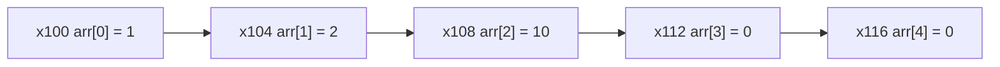

# 🧠 자바 배열 정리
## 📌 배열이란?
- **배열(Array)** 은 동일한 타입의 데이터를 연속된 메모리 공간에 저장하는 자료 구조입니다.
- 자바에서는 int[], String[] 등 다양한 타입의 배열을 사용할 수 있습니다.

## ⚙️ 배열의 특징
| 연산 종류     | 예시 코드       | 설명                          | 시간 복잡도 |
|--------------|------------------|-------------------------------|--------------|
| 인덱스 입력   | `arr[2] = 10`     | 2번 위치에 값 10 저장          | O(1)         |
| 인덱스 조회   | `arr[2]`          | 2번 위치의 값 읽기             | O(1)         |
| 인덱스 변경   | `arr[2] = 20`     | 2번 위치의 값을 20으로 수정    | O(1)         |
| 순차 검색     | `for` 루프 사용   | 배열 전체를 순회하며 값 찾기   | O(n)         |
| 첫 위치 삽입  | `addFirst(arr, x)`| 모든 요소를 뒤로 밀고 삽입     | O(n)         |
| 중간 삽입     | `addAtIndex(...)`| 해당 위치 이후 요소를 밀고 삽입| O(n)         |
| 마지막 삽입   | `addLast(arr, x)` | 마지막 위치에 직접 삽입        | O(1)         |


## 🧮 배열 인덱스 계산 공식
배열은 메모리상에 연속적으로 배치되며, 각 요소의 주소는 다음과 같이 계산됩니다:  
주소 = 배열 시작 주소 + (자료 크기 * 인덱스)


### 예를 들어, int는 4바이트이므로:
```
arr[0] → x100 + (4 * 0) = x100
arr[1] → x100 + (4 * 1) = x104
arr[2] → x100 + (4 * 2) = x108
```


## 🧠 배열 메모리 구조



## 💻 배열 삽입 예제 코드
```java
public class ArrayMain2 {
    public static void main(String[] args) {
        int[] arr = new int[5];
        arr[0] = 1;
        arr[1] = 2;
        System.out.println(Arrays.toString(arr));

        System.out.println("배열의 첫번째 위치에 3 추가 O(n)");
        addFirst(arr, 3);
        System.out.println(Arrays.toString(arr));

        System.out.println("배열의 index(2) 위치에 4 추가 O(n)");
        addAtIndex(arr, 2, 4);
        System.out.println(Arrays.toString(arr));

        System.out.println("배열의 마지막 위치에 5 추가 O(1)");
        addLast(arr, 5);
        System.out.println(Arrays.toString(arr));
    }

    private static void addLast(int[] arr, int newValue) {
        arr[arr.length - 1] = newValue;
    }

    private static void addFirst(int[] arr, int newValue) {
        for (int i = arr.length - 1; i > 0; i--) {
            arr[i] = arr[i - 1];
        }
        arr[0] = newValue;
    }

    private static void addAtIndex(int[] arr, int index, int newValue) {
        for (int i = arr.length - 1; i > index; i--) {
            arr[i] = arr[i - 1];
        }
        arr[index] = newValue;
    }
}
```


## ⚠️ 배열의 한계
- 크기 고정: 배열은 생성 시 크기를 정해야 하며, 이후 변경할 수 없습니다.
- 동적 확장 불가: 실시간으로 데이터가 추가되는 상황에서는 유연성이 부족합니다.
- 메모리 낭비 가능성: 너무 큰 배열을 만들면 메모리 낭비, 너무 작으면 부족

## ✅ 대안: 컬렉션 프레임워크
자바는 배열의 한계를 극복하기 위해 다양한 컬렉션 클래스를 제공합니다:
- ArrayList: 동적으로 크기 조절 가능
- LinkedList: 삽입/삭제에 유리
- HashSet, HashMap: 검색/저장에 특화

---

# 📦 왜 ArrayList가 필요한가?

## 🔧 배열의 한계
| 문제점                     | 설명                                                                 |
|----------------------------|----------------------------------------------------------------------|
| 크기 고정                  | 배열은 생성 시 크기를 정해야 하며, 이후 변경할 수 없음                     |
| 삽입/삭제 불편             | 중간에 데이터를 넣거나 빼려면 직접 요소를 이동시켜야 함                    |
| 동적 확장 불가             | 실시간으로 데이터가 늘어날 경우 대응이 어려움                              |
| 예외 발생 가능             | 크기를 초과해 데이터를 추가하면 `ArrayIndexOutOfBoundsException` 발생 |


- ➡️ 이런 불편함을 해결하기 위해 동적으로 크기를 조절할 수 있는 자료 구조, 즉 **리스트(List)** 가 필요합니다.

## 📚 리스트란?
- 순서가 있고 중복을 허용하는 자료 구조
- 배열과 유사하지만 크기가 동적으로 변함
- 자바에서는 ArrayList, LinkedList 등 다양한 리스트 구현체 제공

## 배열 vs 리스트 비교
| 자료 구조   | 순서 유지 | 중복 허용 | 크기 조절 | 삽입/삭제 성능 | 대표 구현체         |
|-------------|-----------|------------|------------|------------------|----------------------|
| 배열 (Array) | ✅        | ✅         | ❌ (고정)  | 불편함 (O(n))     | `int[]`, `String[]` |
| 리스트 (List)| ✅        | ✅         | ✅ (동적)  | 유연함 (O(1)~O(n))| `ArrayList`, `LinkedList` |

## 🛠️ 직접 구현: MyArrayListV1
### 🎯 목표
- 배열 기반 리스트를 직접 구현해보고, 배열의 한계를 체험
- 고정 크기 배열을 사용하여 add, get, set, indexOf 기능 제공

### 소스 코드
```java
public class MyArrayListV1 {
    private static final int DEFAULT_CAPACITY = 5;
    private Object[] elementData;
    private int size = 0;
    public MyArrayListV1() {
        elementData = new Object[DEFAULT_CAPACITY];
    }

    public MyArrayListV1(int initialCapacity) {
        elementData = new Object[initialCapacity];
    }

    public int size() {
        return size;
    }

    public void add(Object e) {
        elementData[size] = e;
        size++;
    }

    public Object get(int index) {
        return elementData[index];
    }

    public Object set(int index, Object element) {
        Object oldValue = get(index);
        elementData[index] = element;
        return oldValue;
    }

    public int indexOf(Object o) {
        for (int i = 0; i < size; i++) {
            if (o.equals(elementData[i])) {
                return i;
            }
        }
        return -1;
    }
    @Override
    public String toString() {
        return Arrays.toString(Arrays.copyOf(elementData, size)) + " size=" +
        size + ", capacity=" + elementData.length;
    }
}
```
```java
public static void main(String[] args) {
    MyArrayListV1 list = new MyArrayListV1();

    System.out.println("==데이터 추가==");
    System.out.println(list);
    
    list.add("a");
    System.out.println(list);
    
    list.add("b");
    System.out.println(list);
    
    list.add("c");
    System.out.println(list);
    
    System.out.println("==기능 사용==");
    System.out.println("list.size(): " + list.size());
    System.out.println("list.get(1): " + list.get(1));
    System.out.println("list.indexOf('c'): " + list.indexOf("c"));
    System.out.println("list.set(2, 'z'), oldValue: " + list.set(2, "z"));
    System.out.println(list);
    
    System.out.println("==범위 초과==");
    list.add("d");
    System.out.println(list);
    
    list.add("e");
    System.out.println(list);
    
    //범위 초과, capacity가 늘어나지 않으면 예외 발생
    list.add("f");
    System.out.println(list);
}
```

### 🔍 핵심 코드 요약
```java
public void add(Object e) {
    elementData[size] = e;
    size++;
}
```

- elementData: 내부 배열
- size: 실제 데이터 개수
- capacity: 배열의 크기 (고정)

### 🧪 실행 결과
```
[a, b, c] size=3, capacity=5
[a, b, z, d, e] size=5, capacity=5
Exception: Index 5 out of bounds
```

- ➡️ 배열의 크기를 초과하면 예외 발생. 이 한계를 해결해야 진짜 리스트가 된다!

## 🔄 개선: MyArrayListV2 (동적 배열)
### 🎯 목표
- 배열의 크기를 자동으로 늘릴 수 있도록 개선
- grow() 메서드를 통해 배열 확장

### 소스 코드
```java
public void add(Object e) {
    //코드 추가
    if (size == elementData.length) {
        grow();
    }
    elementData[size] = e;
    size++;
}
```

### 🔍 핵심 코드
```java
private void grow() {
    int newCapacity = elementData.length * 2;
    elementData = Arrays.copyOf(elementData, newCapacity);
}
```

- add() 시 size == capacity이면 grow() 호출
- 배열을 2배로 늘리고 기존 데이터를 복사
### 🧪 실행 결과
```
[a, b] size=2, capacity=2
[a, b, c] size=3, capacity=4
[a, b, c, d, e] size=5, capacity=8
```

- ➡️ 이제 크기 초과 시 자동으로 확장되며 예외 없이 동작!

## ➕ 기능 확장: MyArrayListV3
### 🎯 목표
- add(index, element) : 중간 삽입
- remove(index) : 중간 삭제

### 소스 코드
```java
//코드 추가
public void add(int index, Object e) {
    if (size == elementData.length) {
        grow();
    }
    shiftRightFrom(index);
    elementData[index] = e;
    size++;
}

//코드 추가, 요소의 마지막부터 index까지 오른쪽으로 밀기
private void shiftRightFrom(int index) {
    for (int i = size; i > index; i--) {
        elementData[i] = elementData[i - 1];
    }
}

public Object remove(int index) {
    Object oldValue = get(index);
    shiftLeftFrom(index);
    size--;
    elementData[size] = null;
    return oldValue;
}

//코드 추가, 요소의 index부터 마지막까지 왼쪽으로 밀기
private void shiftLeftFrom(int index) {
    for (int i = index; i < size - 1; i++) {
        elementData[i] = elementData[i + 1];
    }
}
```


### 🔍 삽입/삭제 시간 복잡도

| 연산 종류         | 설명                                      | 시간 복잡도 |
|------------------|-------------------------------------------|--------------|
| `add(e)`         | 리스트의 마지막에 데이터 추가               | O(1)         |
| `add(index, e)`  | 중간 또는 앞에 삽입 → 요소 이동 필요        | O(n)         |
| `remove(size-1)` | 마지막 요소 삭제 → 이동 없음                | O(1)         |
| `remove(index)`  | 중간 또는 앞에 삭제 → 요소 왼쪽으로 이동 필요| O(n)         |

- ➡️ 배열 기반 리스트는 삽입/삭제 위치에 따라 성능이 달라짐

### 🧠 정리: 직접 구현을 통해 얻는 이해

| 단계       | 구현 내용               | 핵심 개념 이해             | 주요 기능/포인트     |
|------------|--------------------------|-----------------------------|----------------------|
| V1         | 고정 크기 배열 기반 리스트 | 배열의 한계 체험            | `add`, `get`, `set`, `indexOf` |
| V2         | 동적 배열 확장            | 크기 자동 조절의 필요성     | `grow()`로 배열 2배 확장 |
| V3         | 삽입/삭제 기능 추가       | 요소 이동의 시간 복잡도 이해 | `add(index, e)`, `remove(index)` |

- ➡️ 직접 구현을 통해 ArrayList가 왜 필요한지, 어떻게 동작하는지, 어떤 성능 특성이 있는지를 몸으로 느낄 수 있음

---


## 🛠️ 직접 구현: MyArrayListV1 → V2 → V3
### ✅ V1: 고정 크기 배열 기반 리스트
```java
public void add(Object e) {
    elementData[size] = e;
    size++;
}
```

- 배열 크기 초과 시 예외 발생
- 삽입/삭제는 단순하지만 확장 불가

### ✅ V2: 동적 배열 확장
```java
private void grow() {
    int newCapacity = elementData.length * 2;
    elementData = Arrays.copyOf(elementData, newCapacity);
}
```

- add() 시 배열이 꽉 차면 grow() 호출
- 배열을 2배로 확장하고 기존 데이터 복사

### ✅ V3: 삽입/삭제 기능 추가
```java
public void add(int index, Object e) {
    shiftRightFrom(index);
    elementData[index] = e;
    size++;
}

public Object remove(int index) {
    Object oldValue = get(index);
    shiftLeftFrom(index);
    size--;
    return oldValue;
}
```

- 중간 삽입/삭제 시 요소 이동 필요 → O(n)
- 마지막 삽입/삭제는 빠름 → O(1)
| 연산 종류         | 설명                                      | 시간 복잡도 |
|------------------|-------------------------------------------|--------------|
| `add(e)`         | 리스트의 마지막에 데이터 추가               | O(1)         |
| `add(index, e)`  | 중간 또는 앞에 삽입 → 요소 이동 필요        | O(n)         |
| `remove(size-1)` | 마지막 요소 삭제 → 이동 없음                | O(1)         |
| `remove(index)`  | 중간 또는 앞에 삭제 → 요소 왼쪽으로 이동 필요| O(n)         |


### 🚨 문제 발생: 타입 안전성 부족
```java
numberList.add(1);
numberList.add("문자3"); // 실수로 문자 입력
Integer num3 = (Integer) numberList.get(2); // ClassCastException 발생
```

- ➡️ Object 기반 리스트는 모든 타입을 허용하므로 타입 오류 발생 가능성이 있음

### ✅ 해결: 제네릭 도입 (MyArrayListV4<E>)
```java
public class MyArrayListV4<E> {
    private Object[] elementData;
    public void add(E e) {
        elementData[size] = e;
        size++;
    }
    @SuppressWarnings("unchecked")
    public E get(int index) {
        return (E) elementData[index];
    }
}
```

- E 타입으로 입력/출력 → 타입 안정성 확보
- Object[]는 그대로 사용 (제네릭 배열 생성 불가)
```java
MyArrayListV4<String> stringList = new MyArrayListV4<>();
stringList.add("a");
String str = stringList.get(0); // 안전하게 반환
```

---

## 🧠 제네릭과 Object 배열의 관계
```java
Object[] elementData;
void add(String e) {
    elementData[size] = e;
}
String get(int index) {
    return (String) elementData[index];
}
```

- Object[]에 저장하지만, E 타입으로만 접근
- 컴파일 시 타입 체크, 런타임에 안전한 다운캐스팅

## ⚠️ MyArrayList의 단점
| 단점                          | 설명                                                                 |
|-------------------------------|----------------------------------------------------------------------|
| 메모리 낭비 가능성            | 배열 크기를 넉넉히 잡으면 사용되지 않는 공간이 생김                     |
| 중간 삽입/삭제 성능 저하      | 요소를 한 칸씩 이동해야 하므로 O(n)                                   |
| 제네릭 배열 생성 불가         | `new E[]`는 불가능 → `Object[]`로 대체                                |


## 📊 ArrayList의 빅오 정리
| 연산 종류         | 시간 복잡도 |
|------------------|--------------|
| 마지막에 추가     | O(1)         |
| 앞/중간에 추가    | O(n)         |
| 마지막에 삭제     | O(1)         |
| 앞/중간에 삭제    | O(n)         |
| 인덱스 조회       | O(1)         |
| 데이터 검색       | O(n)         |


- ➡️ 순차적 추가/조회에 최적화된 구조
- ➡️ 중간 삽입/삭제가 많다면 LinkedList 고려 필요

----

## 샘플 코드
```java
public class MyArrayListV4<E> {
    private static final int DEFAULT_CAPACITY = 5;
    private Object[] elementData;
    private int size = 0;
    
    public MyArrayListV4() {
        elementData = new Object[DEFAULT_CAPACITY];
    }
    
    public MyArrayListV4(int initialCapacity) {
        elementData = new Object[initialCapacity];
    }
    
    public int size() {
        return size;
    }
    
    public void add(E e) {
        if (size == elementData.length) {
            grow();
        }
        elementData[size] = e;
        size++;
    }
    
    public void add(int index, E e) {
        if (size == elementData.length) {
            grow();
        }
        shiftRightFrom(index);
        elementData[index] = e;
        size++;
    }
    
    //요소의 마지막부터 index까지 오른쪽으로 밀기
    private void shiftRightFrom(int index) {
        for (int i = size; i > index; i--) {
            elementData[i] = elementData[i - 1];
        }
    }

    @SuppressWarnings("unchecked")
    public E get(int index) {
        return (E) elementData[index];
    }

    public E set(int index, E element) {
        E oldValue = get(index);
        elementData[index] = element;
        return oldValue;
    }

    public E remove(int index) {
        E oldValue = get(index);
        shiftLeftFrom(index);
        size--;
        elementData[size] = null;
        return oldValue;
    }

    //요소의 index부터 마지막까지 왼쪽으로 밀기
    private void shiftLeftFrom(int index) {
        for (int i = index; i < size - 1; i++) {
            elementData[i] = elementData[i + 1];
        }
    }
    
    public int indexOf(E o) {
        for (int i = 0; i < size; i++) {
            if (o.equals(elementData[i])) {
                return i;
            }
        }
        return -1;
    }
    
    private void grow() {
        int oldCapacity = elementData.length;
        int newCapacity = oldCapacity * 2;
        elementData = Arrays.copyOf(elementData, newCapacity);
    }

    @Override
    public String toString() {
        return Arrays.toString(Arrays.copyOf(elementData, size)) + " size=" +
        size + ", capacity=" + elementData.length;
    }
}

public class MyArrayListV4Main {
    public static void main(String[] args) {
        
        MyArrayListV4<String> stringList = new MyArrayListV4<>();
        stringList.add("a");
        stringList.add("b");
        stringList.add("c");
        String string = stringList.get(0);
        System.out.println("string = " + string);
        
        MyArrayListV4<Integer> intList = new MyArrayListV4<>();
        intList.add(1);
        intList.add(2);
        intList.add(3);
        Integer integer = intList.get(0);
        System.out.println("integer = " + integer);
    }
}
```
### 실행 결과
```
string = a
integer = 1
```

---
