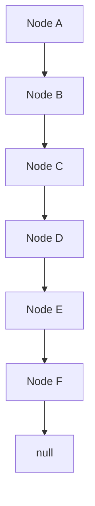
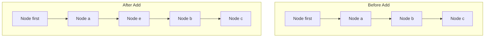
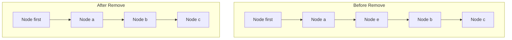

# LinkedList 도입

## 📦 배열 리스트의 단점
- 공간 낭비: 배열은 크기를 미리 정해야 하며, 사용하지 않는 공간이 생길 수 있음
- 중간 삽입/삭제 비효율: 중간에 데이터를 삽입하거나 삭제할 때 많은 요소를 이동시켜야 함

## 🔗 연결 리스트의 구조
- 각 노드는 item과 next 필드를 가짐
- next는 다음 노드를 참조함
- 필요할 때마다 노드를 생성하고 연결함

## 🧱 Node 클래스
```java
public class Node {
    Object item;
    Node next;

    public Node(Object item) {
        this.item = item;
    }

    @Override
    public String toString() {
        StringBuilder sb = new StringBuilder();
        Node x = this;
        sb.append("[");
        while (x != null) {
            sb.append(x.item);
            if (x.next != null) sb.append("->");
            x = x.next;
        }
        sb.append("]");
        return sb.toString();
    }
}
```


### 🧪 NodeMain1: 노드 생성 및 연결
```java
Node first = new Node("A");
first.next = new Node("B");
first.next.next = new Node("C");

Node x = first;
while (x != null) {
    System.out.println(x.item);
    x = x.next;
}
```

### 🖨️ 출력 결과
```
A
B
C
```


## 🧠 연결 구조 시각화
```mermaid
graph TD
    A[Node A (item A)] --> B[Node B (item B)]
    B --> C[Node C (item C)]
    C --> D[null]
```


## 🧪 toString()으로 연결 구조 출력
```java
System.out.println(first); // [A->B->C]
```

---

## 🧪 기능 확장
### 기능 목록
- 모든 노드 탐색
- 마지막 노드 조회
- 특정 인덱스 노드 조회
- 노드 추가
```java
add(first, "D");
add(first, "E");
add(first, "F");
System.out.println(first); // [A->B->C->D->E->F]
```

```java
private static void printAll(Node node) {
    Node x = node;
    while (x != null) {
        System.out.println(x.item);
        x = x.next;
    }
}

private static Node getLastNode(Node node) {
    Node x = node;
    while (x.next != null) {
        x = x.next;
    }
    return x;
}

private static Node getNode(Node node, int index) {
    Node x = node;
    for (int i = 0; i < index; i++) {
        x = x.next;
    }
    return x;
}

private static void add(Node node, String param) {
    Node lastNode = getLastNode(node);
    lastNode.next = new Node(param);
}
```


## 🧠 전체 연결 구조 시각화



## 📌 핵심 요약: 사용자 정의 Linked List 기능 정리

| 기능             | 설명 또는 출력 예시           |
|------------------|-------------------------------|
| `Node`           | 데이터와 다음 노드 참조를 저장 |
| `toString()`     | `[A->B->C]` 형식으로 연결 구조 출력 |
| `printAll()`     | 모든 노드를 순회하며 `item` 출력 |
| `getLastNode()`  | 마지막 노드 반환 (`next == null`) |
| `getNode(index)` | 특정 인덱스 위치의 노드 반환   |
| `add()`          | 마지막 노드 뒤에 새 노드 연결  |


## 🧠 연결 리스트란?
- 리스트(List): 순서가 있고 중복을 허용하는 자료구조
- 연결 리스트(LinkedList): 배열 대신 노드와 참조를 통해 데이터를 연결하는 방식
- 장점: 배열 리스트의 단점(공간 낭비, 중간 삽입/삭제 성능 저하)을 개선

### MyLinkedListV1 클래스
```java

public class MyLinkedListV1 {
    private Node first;
    private int size = 0;

    public void add(Object e) {
    Node newNode = new Node(e);
        if (first == null) {
            first = newNode;
        } else {
            Node lastNode = getLastNode();
            lastNode.next = newNode;
        }
        size++;
    }

    private Node getLastNode() {
        Node x = first;
        while (x.next != null) {
            x = x.next;
        }
        return x;
    }

    public Object set(int index, Object element) {
        Node x = getNode(index);
        Object oldValue = x.item;
        x.item = element;
        return oldValue;
    }

    public Object get(int index) {
        Node node = getNode(index);
        return node.item;
    }

    private Node getNode(int index) {
        Node x = first;
        for (int i = 0; i < index; i++) {
            x = x.next;
        }
        return x;
    }

    public int indexOf(Object o) {
        int index = 0;
        for (Node x = first; x != null; x = x.next) {
            if (o.equals(x.item))
                return index;
            index++;
        }
        return -1;
    }

    public int size() {
        return size;
    }

    @Override
    public String toString() {
        return "MyLinkedListV1{" +
            "first=" + first +
            ", size=" + size +
            '}';
    }
}
```


### 🧪 주요 기능 설명

| 메서드                  | 기능 설명                                           | 반환값 예시 또는 동작 | 시간 복잡도 |
|--------------------------|----------------------------------------------------|------------------------|--------------|
| `add(Object e)`          | 마지막 노드 뒤에 새 노드를 추가                    | 리스트에 "a" 추가 → [a] | O(n)         |
| `get(int index)`         | 특정 위치의 데이터를 반환                          | `get(1)` → "b"         | O(n)         |
| `set(int index, Object)` | 특정 위치의 데이터를 변경하고 기존 값 반환         | `set(2, "z")` → "c"    | O(n)         |
| `indexOf(Object o)`      | 특정 데이터를 검색하고 인덱스 반환                 | `indexOf("c")` → 2     | O(n)         |
| `size()`                 | 리스트의 현재 크기 반환                            | `size()` → 3           | O(1)         |


### 📈 실행 예시
```java
list.add("a"); // [a]
list.add("b"); // [a->b]
list.add("c"); // [a->b->c]
list.set(2, "z"); // [a->b->z]
list.add("d"); // [a->b->z->d]
list.add("e"); // [a->b->z->d->e]
list.add("f"); // [a->b->z->d->e->f]
```

### 출력 결과
```

==데이터 추가==
MyLinkedListV1{first=null, size=0}
MyLinkedListV1{first=[a], size=1}
MyLinkedListV1{first=[a->b], size=2}
MyLinkedListV1{first=[a->b->c], size=3}

==기능 사용==
list.size(): 3
list.get(1): b
list.indexOf('c'): 2
list.set(2, 'z'), oldValue: c
MyLinkedListV1{first=[a->b->z], size=3}

==범위 초과==
MyLinkedListV1{first=[a->b->z->d], size=4}
MyLinkedListV1{first=[a->b->z->d->e], size=5}
MyLinkedListV1{first=[a->b->z->d->e->f], size=6}
```


### 📌 연결 리스트 vs 배열 리스트

| 항목                         | ArrayList                              | LinkedList                              |
|------------------------------|----------------------------------------|------------------------------------------|
| 내부 구조                    | 배열 기반 (동적 배열)                  | 노드 기반 (참조로 연결된 구조)           |
| 메모리 사용                  | 고정 크기 확보 → 공간 낭비 가능       | 필요한 만큼만 동적 생성 → 효율적         |
| 인덱스 접근 속도             | 빠름 (O(1))                            | 느림 (O(n))                              |
| 중간 삽입/삭제              | 느림 (요소 이동 필요)                 | 빠름 (참조만 변경)                       |
| 마지막 요소 추가             | 빠름 (O(1))                            | 느림 (마지막 노드 탐색 필요 → O(n))     |
| 검색 (indexOf 등)           | 빠름 (O(n), 캐시 활용 가능)           | 느림 (O(n))                              |
| 메모리 오버헤드              | 적음                                   | 노드마다 참조 필드 필요 → 오버헤드 있음 |
| 사용 용도                    | 읽기/검색 중심 작업에 적합            | 삽입/삭제 중심 작업에 적합               |


## 🧠 정리
- 연결 리스트는 노드 기반의 동적 구조로, 배열의 고정 크기 문제를 해결
- 각 노드는 item과 next를 가지며, next를 통해 다음 노드와 연결됨
- 직접 구현한 MyLinkedListV1은 add, get, set, indexOf 등 기본 기능을 제공
- 성능은 배열 리스트보다 일부 연산에서 느릴 수 있지만, 삽입/삭제 유연성이 뛰어남


## 연결 리스트에서의 인덱스란?
- 연결 리스트는 배열처럼 실제 인덱스가 존재하지 않음
- 노드의 연결 순서를 기준으로 인덱스를 가정함
- 예: 첫 번째 노드 → index 0, 두 번째 노드 → index 1 …

## ✚ 데이터 추가 기능: add(int index, Object e)
### 1️⃣ 첫 번째 위치에 추가 (index == 0)
- 기존 리스트: [a->b->c]
- 추가 후: [d->a->b->c]
#### 처리 순서
- 신규 노드 생성 (newNode)
- newNode.next = first
- first = newNode
#### 시간 복잡도
- O(1) → 매우 빠름 (참조만 변경)

### 2️⃣ 중간 위치에 추가 (index > 0)
- 기존 리스트: [a->b->c]
- 추가 후 (index 1): [a->e->b->c]
#### 처리 순서
- prev = getNode(index - 1)
- newNode.next = prev.next
- prev.next = newNode
#### 시간 복잡도
- O(n) → 위치 탐색 O(n) + 연결 O(1)

## ❌ 데이터 삭제 기능: remove(int index)
### 1️⃣ 첫 번째 위치 삭제 (index == 0)
- 기존 리스트: [d->a->b->c]
- 삭제 후: [a->b->c]
#### 처리 순서
- removeNode = first
- first = removeNode.next
- removeNode.item = null, removeNode.next = null
#### 시간 복잡도
- O(1) → 매우 빠름

### 2️⃣ 중간 위치 삭제 (index > 0)
- 기존 리스트: [a->e->b->c]
- 삭제 후 (index 1): [a->b->c]
#### 처리 순서
- prev = getNode(index - 1)
- removeNode = prev.next
- prev.next = removeNode.next
- removeNode.item = null, removeNode.next = null
#### 시간 복잡도
- O(n) → 위치 탐색 O(n) + 연결 O(1)

## 📊 성능 비교 요약
| 연산                        | ArrayList 성능 | LinkedList 성능 | 설명                                       |
|-----------------------------|----------------|------------------|--------------------------------------------|
| 인덱스 기반 조회 (`get`)    | O(1)           | O(n)             | ArrayList는 배열 기반이라 즉시 접근 가능     |
| 마지막에 추가 (`add`)       | O(1)           | O(n)             | LinkedList는 마지막 노드 탐색 필요           |
| 중간에 추가 (`add(index)`) | O(n)           | O(n)             | 둘 다 위치 탐색 필요, ArrayList는 데이터 이동 |
| 중간에 삭제 (`remove(index)`) | O(n)         | O(n)             | 둘 다 위치 탐색 필요, ArrayList는 데이터 이동 |
| 첫 번째에 추가/삭제         | O(n)           | O(1)             | LinkedList는 참조만 변경하면 됨              |
| 전체 순회 (`forEach`)       | O(n)           | O(n)             | 동일                                        |


아래는 연결 리스트에서 노드 추가와 삭제가 어떻게 이루어지는지를 시각적으로 보여주는 다이어그램입니다.  
각 단계별로 리스트의 상태가 어떻게 변화하는지 표현.

### ✚ 노드 추가: 첫 번째 위치에 "d" 추가 (add(0, "d"))


- Start는 리스트의 시작점 (first)
- "d"가 맨 앞에 추가되며 기존 노드들이 뒤로 밀림

###  ❌ 노드 삭제: 첫 번째 노드 "d" 삭제 (remove(0))

- "d" 노드가 제거되고 first가 "a"를 가리키게 됨
- "d"는 더 이상 참조되지 않으며 GC 대상이 됨

### ✚ 중간 위치에 "e" 추가 (add(1, "e"))


- "e"가 "a"와 "b" 사이에 삽입됨
- prev.next = newNode, newNode.next = removeNode.next 방식으로 연결

### ❌ 중간 위치 "e" 삭제 (remove(1))


- "e" 노드가 제거되고 "a"가 "b"를 직접 가리킴
- "e"는 참조되지 않아 GC 대상이 됨


## ✅ 정리
- 연결 리스트는 참조 변경만으로 구조를 수정할 수 있어 삽입/삭제가 유연함
- 배열 리스트는 데이터 이동이 필요해 삽입/삭제에 비용이 큼
- 중간 위치 작업은 두 구조 모두 O(n)이지만, 연결 리스트는 구조적으로 더 단순하고 직관적

---


## 🔁 확장 방향
### ✅ 이중 연결 리스트 (Doubly Linked List)
```java
public class Node {
    Object item;
    Node next; // 다음 노드
    Node prev; // 이전 노드
}
```

- 양방향 탐색 가능
- 삭제 시 이전 노드 참조로 더 빠르게 처리 가능
### ✅ 마지막 노드 참조 추가
```java
public class LinkedList {
    private Node first;
    private Node last; // 마지막 노드 참조
    private int size = 0;
}
```

- 마지막 노드에 직접 접근 가능 → 뒤쪽 삽입/삭제 O(1)로 개선


## 🧠 결론
- 앞쪽 삽입/삭제가 많다면 → 연결 리스트가 유리
- 조회/검색이 많고, 뒤쪽 삽입이 많다면 → 배열 리스트가 유리
- 자바의 LinkedList는 이중 연결 리스트 + 마지막 노드 참조로 성능 최적화됨

---


## 🧠 핵심 개념 요약
### ✅ 제네릭 도입 (<E>)
- Object 대신 타입 매개변수 <E> 사용
- 컴파일 시점에 타입 체크 가능 → 타입 안정성 확보
- 다양한 타입의 리스트를 하나의 클래스 구조로 처리 가능
### ✅ 중첩 클래스 사용 (static class Node<E>)
- Node는 리스트 내부에서만 사용되므로 외부 노출 불필요
- MyLinkedListV3 내부에 Node를 정적 중첩 클래스로 선언
- 구조적으로 깔끔하고 캡슐화 효과

### 🔧 주요 기능 정리

| 메서드                      | 기능 설명                                      | 반환 타입 | 시간 복잡도 |
|-----------------------------|-----------------------------------------------|------------|--------------|
| `add(E e)`                  | 마지막 노드 뒤에 새 노드 추가                 | `void`     | O(n)         |
| `add(int index, E e)`       | 특정 위치에 새 노드 삽입                     | `void`     | O(n)         |
| `remove(int index)`         | 특정 위치의 노드 제거                         | `E`        | O(n)         |
| `get(int index)`            | 특정 위치의 데이터 조회                       | `E`        | O(n)         |
| `set(int index, E element)` | 특정 위치의 데이터 변경 후 기존 값 반환      | `E`        | O(n)         |
| `indexOf(E o)`              | 특정 데이터를 검색하고 인덱스 반환            | `int`      | O(n)         |
| `size()`                    | 현재 리스트 크기 반환                         | `int`      | O(1)         |


### 소스 코드
```java
public class MyLinkedListV3<E> {
    private Node<E> first;
    private int size = 0;
    
    public void add(E e) {
        Node<E> newNode = new Node<>(e);
        if (first == null) {
            first = newNode;
        } else {
            Node<E> lastNode = getLastNode();
            lastNode.next = newNode;
        }
        size++;
    }

    private Node<E> getLastNode() {
        Node<E> x = first;
        while (x.next != null) {
            x = x.next;
        }
        return x;
    }

    public void add(int index, E e) {
        Node<E> newNode = new Node<>(e);
        if (index == 0) {
            newNode.next = first;
            first = newNode;
        } else {
            Node<E> prev = getNode(index - 1);
            newNode.next = prev.next;
            prev.next = newNode;
        }
        size++;
    }

    public E set(int index, E element) {
        Node<E> x = getNode(index);
        E oldValue = x.item;
        x.item = element;
        return oldValue;
    }

    public E remove(int index) {
        Node<E> removeNode = getNode(index);
        E removedItem = removeNode.item;
        if (index == 0) {
            first = removeNode.next;
        } else {
            Node<E> prev = getNode(index - 1);
            prev.next = removeNode.next;
        }
        removeNode.item = null;
        removeNode.next = null;
        size--;
        return removedItem;
    }


    public E get(int index) {
        Node<E> node = getNode(index);
        return node.item;
    }

    private Node<E> getNode(int index) {
        Node<E> x = first;
        for (int i = 0; i < index; i++) {
            x = x.next;
        }
        return x;
    }

    public int indexOf(E o) {
        int index = 0;
        for (Node<E> x = first; x != null; x = x.next) {
            if (o.equals(x.item))
            return index;
            index++;
        }
        return -1;
    }

    public int size() {
        return size;
    }

    @Override
    public String toString() {
        return "MyLinkedListV3{" +
            "first=" + first +
            ", size=" + size +
            '}';
    }

    private static class Node<E> {
        E item;
        Node<E> next;
        public Node(E item) {
            this.item = item;
        }
        @Override
        public String toString() {
            StringBuilder sb = new StringBuilder();
            Node<E> temp = this;
            sb.append("[");
            while (temp != null) {
                sb.append(temp.item);
                if (temp.next != null) {
                    sb.append("->");
                }
                temp = temp.next;
            }
            sb.append("]");
            return sb.toString();
        }
    }
}
```


### 🧪 실행 예시
```java
MyLinkedListV3<String> stringList = new MyLinkedListV3<>();
stringList.add("a");
stringList.add("b");
stringList.add("c");
System.out.println("string = " + stringList.get(0)); // string = a

MyLinkedListV3<Integer> intList = new MyLinkedListV3<>();
intList.add(1);
intList.add(2);
intList.add(3);
System.out.println("integer = " + intList.get(0)); // integer = 1
```


### 📌 장점 요약

| 요소            | 설명 또는 효과                                           |
|-----------------|----------------------------------------------------------|
| `<E>`           | 제네릭 도입으로 타입 안정성 확보, 형변환 불필요          |
| `Node<E>`       | 중첩 클래스로 외부 노출 방지, 구조적 캡슐화              |
| 타입별 인스턴스 | `MyLinkedListV3<String>`, `MyLinkedListV3<Integer>` 등 다양한 타입 지원 |
| 출력 구조       | `[a->b->c]` 형식으로 연결 상태 직관적으로 확인 가능      |


## 🧠 결론
- MyLinkedListV3는 타입 안정성 + 구조적 명확성을 갖춘 사용자 정의 연결 리스트
- 자바의 컬렉션 프레임워크처럼 제네릭 기반 자료구조를 직접 구현한 좋은 예시
- 중첩 클래스를 통해 내부 전용 구조를 은닉하고, 유지보수성과 가독성을 높임

---

