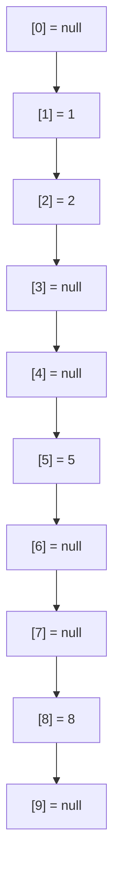
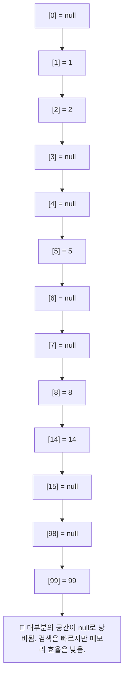

# Set 구조 이해

## 📚 List vs Set 자료구조 비교

| 항목         | List (리스트)                                      | Set (셋, 세트)                                      |
|--------------|----------------------------------------------------|-----------------------------------------------------|
| 정의         | 순차적 요소의 컬렉션                               | 중복 없는 유일한 요소의 컬렉션                      |
| 순서         | 요소 추가 순서 유지                                | 일반적으로 순서 없음 (HashSet 기준)                |
| 중복         | 허용됨                                              | 허용되지 않음                                       |
| 접근 방식     | 인덱스로 직접 접근 가능 (`list[0]`)                | 인덱스 없음, 포함 여부만 확인 (`set.contains(x)`)   |
| 용도         | 순서가 중요하고 중복 허용이 필요한 경우            | 고유한 값만 저장하고 빠른 검색이 필요한 경우        |
| 예시         | 장바구니, 이벤트 로그                               | 회원 ID, 고유 태그 집합                             |


## 🛠 직접 구현한 Set: MyHashSetV0
### ✅ 핵심 기능
- add(value): 중복 없이 값 추가
- contains(value): 값 존재 여부 확인
- toString(): 현재 저장된 요소 출력

### 📦 Java 코드 예시
```java
package collection.set;
import java.util.Arrays;

public class MyHashSetV0 {
    private int[] elementData = new int[10];
    private int size = 0;

    // O(n)
    public boolean add(int value) {
        if (contains(value)) {
            return false;
        }
        elementData[size] = value;
        size++;
        return true;
    }

    // O(n)
    public boolean contains(int value) {
        for (int data : elementData) {
            if (data == value) {
                return true;
            }
        }
        return false;
    }

    public int getSize() {
        return size;
    }

    @Override
    public String toString() {
        return "MyHashSetV0{" +
                "elementData=" + Arrays.toString(Arrays.copyOf(elementData, size)) +
                ", size=" + size +
                '}';
    }
}
```

### ▶️ 실행 예시: MyHashSetV0Main
```java
package collection.set;

public class MyHashSetV0Main {
    public static void main(String[] args) {
        MyHashSetV0 set = new MyHashSetV0();
        set.add(1); // O(1)
        set.add(2); // O(n)
        set.add(3); // O(n)
        set.add(4); // O(n)
        System.out.println(set);

        boolean result = set.add(4); // 중복 데이터 저장
        System.out.println("중복 데이터 저장 결과 = " + result);
        System.out.println(set);

        System.out.println("set.contains(3): " + set.contains(3)); // true
        System.out.println("set.contains(99): " + set.contains(99)); // false
    }
}
```

### 🧪 실행 결과
```
MyHashSetV0{elementData=[1, 2, 3, 4], size=4}
중복 데이터 저장 결과 = false
MyHashSetV0{elementData=[1, 2, 3, 4], size=4}
set.contains(3): true
set.contains(99): false
```

## 📊 성능 분석: MyHashSetV0

| 기능             | 시간 복잡도 | 설명                                               |
|------------------|--------------|----------------------------------------------------|
| `add(value)`     | O(n)         | 중복 확인을 위해 전체 배열을 순회해야 함           |
| `contains(value)`| O(n)         | 배열 전체를 탐색하며 값 존재 여부를 확인           |
| 저장 구조        | 배열         | 고정 크기 배열 사용, 크기 초과 시 확장 불가        |
| 확장성           | 낮음         | 배열 크기 제한으로 인해 대량 데이터 처리에 부적합  |

## 🧠 정리 및 개선 방향
- 현재 구현은 단순하지만 성능이 좋지 않음 (특히 add()가 O(n))
- 중복 확인이 전체 순회 방식이라 데이터가 많을수록 성능 저하
- 개선하려면 해시 기반 구조로 변경 필요 → HashSet처럼 해시 테이블 사용

---

## ✅ 해시 알고리즘 핵심 요약

| 항목             | 설명                                                                 |
|------------------|----------------------------------------------------------------------|
| 목적             | 검색 성능을 O(n) → O(1)로 획기적으로 개선                            |
| 핵심 아이디어    | 데이터를 배열의 인덱스로 직접 매핑하여 빠르게 조회                   |
| 저장 방식        | `array[value] = value` 형태로 저장                                    |
| 조회 방식        | `array[value]`로 직접 접근하여 O(1) 성능 확보                         |
| 장점             | 매우 빠른 검색, 단순한 구현                                           |
| 단점             | 값의 범위만큼 배열 크기 필요 → 공간 낭비 발생 가능                   |

## 📘 Java 예제 코드 정리

### 🔍 기존 방식 (O(n))
```java
Integer[] inputArray = new Integer[4];
inputArray[0] = 1;
inputArray[1] = 2;
inputArray[2] = 5;
inputArray[3] = 8;

int searchValue = 8;
for (int inputValue : inputArray) {
    if (inputValue == searchValue) {
        System.out.println(inputValue);
    }
}
```

### ⚡ 개선된 방식 (O(1))
```java
Integer[] inputArray = new Integer[10];
inputArray[1] = 1;
inputArray[2] = 2;
inputArray[5] = 5;
inputArray[8] = 8;

int searchValue = 8;
Integer result = inputArray[searchValue]; // O(1)
System.out.println(result);
```


## 🧠 성능 비교

| 자료구조         | 검색 성능 (`contains`) | 추가 성능 (`add`) | 중복 허용 | 공간 효율성 |
|------------------|------------------------|-------------------|------------|--------------|
| `ArrayList`      | O(n)                   | O(1) (뒤에 추가)  | 허용       | 높음         |
| `LinkedList`     | O(n)                   | O(1) (앞에 추가)  | 허용       | 높음         |
| `Set` (HashSet)  | O(1) (평균)            | O(1) (평균)       | 불허       | 높음         |
| `배열 기반 해시` | O(1)                   | O(1)              | 불허       | 낮음 (공간 낭비) |
| `직접 구현 Set`  | O(n)                   | O(n)              | 불허       | 높음         |

## 🧠 해설 요약
- ArrayList, LinkedList는 중복 허용하지만 검색 성능은 느림
- HashSet은 해시 알고리즘을 활용해 평균 O(1)의 빠른 검색과 추가 성능 제공
- 배열 기반 해시는 인덱스를 값으로 활용해 O(1) 성능 확보 가능하지만, 값의 범위만큼 배열 크기를 잡아야 하므로 공간 낭비가 큼


## 🧠 스타일 메모리 상태


- 배열의 인덱스와 값이 일치하는 구조를 시각적으로 보여줍니다.  
    값이 존재하는 인덱스만 채워지고, 나머지는 null로 남아 있어 공간 낭비가 발생하는 구조입니다.

## 📌 결론
- 해시 알고리즘의 핵심은 값을 인덱스로 변환하여 직접 접근하는 방식
- 이 방식은 검색 성능을 O(1)로 끌어올릴 수 있지만, 공간 효율성이 떨어짐
- 실제 해시 테이블은 이 문제를 해결하기 위해 해시 함수 + 충돌 처리를 사용함

---


## ✅ 해시 알고리즘3 핵심 요약

| 항목               | 설명                                                                 |
|--------------------|----------------------------------------------------------------------|
| 저장 방식           | `inputArray[value] = value` 형태로 저장                              |
| 검색 방식           | `inputArray[value]`로 직접 조회 → O(1) 성능 확보                     |
| 장점               | 매우 빠른 검색 속도 (O(1)), 구현이 단순함                            |
| 단점               | 값의 범위만큼 배열 크기 필요 → 메모리 낭비 심각                      |
| 예시               | 값 6개 저장하려고 크기 100 배열 사용 → 대부분 공간이 null로 낭비됨   |
| 확장 시 문제점      | `int` 전체 범위 사용 시 약 42억 크기의 배열 필요 → 약 17GB 메모리 소모 |
| 결론               | 범위가 좁을 때만 유효, 범위가 넓으면 해시 함수 기반 구조가 필요       |

## 📊 메모리 낭비 시각화


## 🧠 실무적 인사이트
- 이 방식은 정수 키가 작고 범위가 제한적일 때만 유효
- 실제 해시 테이블은 해시 함수를 통해 값 → 인덱스로 변환하며,  
    충돌 처리(체이닝, 오픈 어드레싱 등)를 통해 공간 효율성과 성능을 모두 확보

---

## ✅ 해시 알고리즘4 핵심 요약
| 항목               | 설명                                                                 |
|--------------------|----------------------------------------------------------------------|
| 해시 함수           | `value % CAPACITY`를 통해 해시 인덱스 생성                           |
| 저장 방식           | `inputArray[hashIndex] = value` 형태로 배열에 저장                   |
| 조회 방식           | `inputArray[hashIndex]`로 직접 접근하여 값 조회                      |
| 성능               | 저장 O(1), 조회 O(1)                                                  |
| 장점               | 빠른 검색 속도, 메모리 절약                                          |
| 한계               | 서로 다른 값이 같은 인덱스를 가질 수 있음 → 해시 충돌 발생 가능       |

## 📘 예시 해시 인덱스 계산
1 % 10 = 1 → inputArray[1] = 1
2 % 10 = 2 → inputArray[2] = 2
5 % 10 = 5 → inputArray[5] = 5
8 % 10 = 8 → inputArray[8] = 8
14 % 10 = 4 → inputArray[4] = 14
99 % 10 = 9 → inputArray[9] = 99


## 📊 메모리 시각화
```mermaid
flowchart TD
    subgraph 입력값
        D1["입력값: 1"]
        D2["입력값: 2"]
        D5["입력값: 5"]
        D8["입력값: 8"]
        D14["입력값: 14"]
        D99["입력값: 99"]
    end

    subgraph 해시 인덱스 계산
        H1["1 % 10 = 1"]
        H2["2 % 10 = 2"]
        H5["5 % 10 = 5"]
        H8["8 % 10 = 8"]
        H14["14 % 10 = 4"]
        H99["99 % 10 = 9"]
    end

    subgraph 배열(CAPACITY = 10)
        A0["[0] = null"]
        A1["[1] = 1"]
        A2["[2] = 2"]
        A3["[3] = null"]
        A4["[4] = 14"]
        A5["[5] = 5"]
        A6["[6] = null"]
        A7["[7] = null"]
        A8["[8] = 8"]
        A9["[9] = 99"]
    end

    D1 --> H1 --> A1
    D2 --> H2 --> A2
    D5 --> H5 --> A5
    D8 --> H8 --> A8
    D14 --> H14 --> A4
    D99 --> H99 --> A9

    subgraph 조회 흐름
        Q14["조회값: 14 → 14 % 10 = 4 → inputArray[4] = 14"]
        Q99["조회값: 99 → 99 % 10 = 9 → inputArray[9] = 99"]
    end

    Q14 --> A4
    Q99 --> A9
```


## 🔍 다음 단계 예고
- 현재 방식은 해시 충돌이 발생할 수 있음 (1 % 10 = 1, 11 % 10 = 1)
- 다음 시간에는 해시 충돌 해결 전략 (예: 체이닝, 오픈 어드레싱 등)을 알아볼 예정입니다

---


## ✅ 해시 알고리즘5 핵심 요약

| 항목               | 설명                                                                 |
|--------------------|----------------------------------------------------------------------|
| 해시 함수           | `hashIndex = value % CAPACITY`                                       |
| 해시 충돌 예시      | `99 % 10 = 9`, `9 % 10 = 9` → 같은 해시 인덱스                        |
| 충돌 저장 방식      | `inputArray[hashIndex] = List.of(99, 9)`                             |
| 조회 방식           | `inputArray[hashIndex]` 내부 리스트에서 값 비교                      |
| 성능               | 평균 O(1), 최악의 경우 O(n)                                          |
| 해결 전략           | 배열 슬롯에 리스트를 저장하여 여러 값 수용 (체이닝 방식)             |


## 🧠 시각화: 해시 충돌과 해결 방식
```mermaid
flowchart TD
    subgraph 입력값
        V99["입력값: 99"]
        V9["입력값: 9"]
    end

    subgraph 해시 인덱스 계산
        H99["99 % 10 = 9"]
        H9["9 % 10 = 9"]
    end

    subgraph 배열(CAPACITY = 10)
        A0["[0] = null"]
        A1["[1] = null"]
        A2["[2] = null"]
        A3["[3] = null"]
        A4["[4] = null"]
        A5["[5] = null"]
        A6["[6] = null"]
        A7["[7] = null"]
        A8["[8] = null"]
        A9["[9] = [99, 9]"]
    end

    V99 --> H99 --> A9
    V9 --> H9 --> A9

    subgraph 조회 흐름
        Q99["조회: 99 → 해시 인덱스 9 → 리스트에서 99 검색"]
        Q9["조회: 9 → 해시 인덱스 9 → 리스트에서 9 검색"]
    end

    Q99 --> A9
    Q9 --> A9

    note over A9: 해시 충돌 발생 시\n같은 인덱스에 여러 값을 리스트로 저장
```


## 🧠 시각화: 최악의 충돌 시나리오

해시 알고리즘의 최악의 충돌 시나리오를 시각화한 예입니다.  
값 9, 19, 29, 99가 모두 같은 해시 인덱스 9로 매핑되어 하나의 배열 슬롯에 저장되는 상황을 보여줍니다.

```mermaid
flowchart TD
    subgraph 입력값
        V9["입력값: 9"]
        V19["입력값: 19"]
        V29["입력값: 29"]
        V99["입력값: 99"]
    end

    subgraph 해시 인덱스 계산
        H9["9 % 10 = 9"]
        H19["19 % 10 = 9"]
        H29["29 % 10 = 9"]
        H99["99 % 10 = 9"]
    end

    subgraph 배열(CAPACITY = 10)
        A0["[0] = null"]
        A1["[1] = null"]
        A2["[2] = null"]
        A3["[3] = null"]
        A4["[4] = null"]
        A5["[5] = null"]
        A6["[6] = null"]
        A7["[7] = null"]
        A8["[8] = null"]
        A9["[9] = [9, 19, 29, 99]"]
    end

    V9 --> H9 --> A9
    V19 --> H19 --> A9
    V29 --> H29 --> A9
    V99 --> H99 --> A9

    subgraph 조회 흐름
        Q["조회: 해시 인덱스 9 → 리스트에서 값 하나씩 비교 (O(n))"]
    end

    Q --> A9

    note over A9: 해시 충돌이 심하게 발생하면\n하나의 인덱스에 모든 값이 몰려 O(n) 성능으로 저하됨

```

## 🔍 요약
- 모든 값이 value % 10 = 9로 계산되어 인덱스 9에 저장됨
- 배열의 슬롯 하나에 여러 값이 리스트 형태로 저장됨
- 조회 시 리스트 내부를 순차적으로 비교해야 하므로 최악의 경우 O(n) 성능 발생
- 하지만 일반적으로는 해시 값이 고르게 분포되어 평균 O(1) 성능을 기대할 수 있음


## 🔍 실무적 인사이트
- 해시 충돌은 피할 수 없지만, 리스트나 연결 리스트를 활용하면 안전하게 해결 가능
- Java에서는 HashMap<Integer, List<Value>> 또는 LinkedList를 활용해 체이닝 방식으로 처리
- Kotlin에서도 mutableMapOf<Int, MutableList<Value>>() 형태로 구현 가능

---

## ✅ 해시 알고리즘6 핵심 요약
Java 코드 기반으로 해시셋을 개선하며, 충돌을 처리하는 방식과 성능 분석까지 포함해 정리.

| 항목                  | 설명                                                              |
|-----------------------|-------------------------------------------------------------------|
| 저장 구조             | `buckets` 배열 내부에 `LinkedList`를 사용                         |
| 해시 인덱스 계산      | `hashIndex = value % CAPACITY`                                    |
| 데이터 저장 방식      | `buckets[hashIndex].add(value)` (중복 확인 후 저장)               |
| 데이터 조회 방식      | `buckets[hashIndex].contains(value)`                              |
| 충돌 처리 방식        | 같은 인덱스에 여러 값을 리스트로 저장 (체이닝 방식)               |
| 성능 (평균)           | 저장 O(1), 조회 O(1)                                              |
| 성능 (최악)           | 저장 O(n), 조회 O(n)                                              |
| 충돌 확률 관리        | CAPACITY를 데이터 수 대비 75% 이상 확보하면 충돌 확률 낮아짐      |


## 🧠 구조 설명
- 배열의 각 요소는 LinkedList로 구성된 버킷(bucket) 역할
- 해시 인덱스를 통해 해당 버킷에 접근
- 버킷 내부에서 중복 여부 확인 후 저장
- 조회 시에도 해당 버킷에서 순차적으로 비교
```java
LinkedList<Integer>[] buckets = new LinkedList[CAPACITY];
for (int i = 0; i < CAPACITY; i++) {
    buckets[i] = new LinkedList<>();
}
```


## 📊 CAPACITY별 충돌 예시

| CAPACITY | 해시 버킷 상태                                      | 충돌 여부        |
|----------|-----------------------------------------------------|------------------|
| 1        | [[1, 2, 5, 8, 14, 99, 9]]                           | 모든 값 충돌     |
| 5        | [[5], [1], [2], [8], [14, 99, 9]]                   | 자주 충돌        |
| 10       | [[], [1], [2], [], [14], [5], [], [], [8], [99, 9]] | 가끔 충돌        |
| 11       | [[99], [1], [2], [14], [], [5], [], [], [8], [9], []] | 거의 없음     |
| 15       | [[], [1], [2], [], [], [5], [], [], [8], [99, 9], [], [], [], [], [14]] | 드물게 충돌 |

## 🧠 해설 요약
- CAPACITY = 1: 모든 값이 같은 인덱스에 저장되어 최악의 충돌 발생
- CAPACITY = 5: 데이터 수보다 작아 충돌 빈번
- CAPACITY = 10: 데이터 수 대비 약간 여유 있어 충돌이 줄어듦
- CAPACITY = 11~15: 충돌 확률이 낮아지고, 대부분의 값이 분산 저장됨


## 🧠 해시 충돌 처리 구조
```mermaid
flowchart TD
    subgraph 입력값
        V1["입력값: 1"]
        V2["입력값: 2"]
        V5["입력값: 5"]
        V8["입력값: 8"]
        V14["입력값: 14"]
        V99["입력값: 99"]
        V9["입력값: 9"]
    end

    subgraph 해시 인덱스 계산
        H1["1 % 10 = 1"]
        H2["2 % 10 = 2"]
        H5["5 % 10 = 5"]
        H8["8 % 10 = 8"]
        H14["14 % 10 = 4"]
        H99["99 % 10 = 9"]
        H9["9 % 10 = 9"]
    end

    subgraph buckets[배열(CAPACITY = 10)]
        B0["[0] = []"]
        B1["[1] = [1]"]
        B2["[2] = [2]"]
        B3["[3] = []"]
        B4["[4] = [14]"]
        B5["[5] = [5]"]
        B6["[6] = []"]
        B7["[7] = []"]
        B8["[8] = [8]"]
        B9["[9] = [99, 9]"]
    end

    V1 --> H1 --> B1
    V2 --> H2 --> B2
    V5 --> H5 --> B5
    V8 --> H8 --> B8
    V14 --> H14 --> B4
    V99 --> H99 --> B9
    V9 --> H9 --> B9

    subgraph 조회 흐름
        Q9["조회: 9 → 해시 인덱스 9 → 리스트에서 비교"]
    end

    Q9 --> B9

    note over B9: 해시 충돌 발생 시\n같은 인덱스에 여러 값을 리스트로 저장
```


## 🧠 실무적 인사이트
- 해시셋 구현 시 충돌 처리는 필수
- 체이닝 방식은 구현이 간단하고 확장성 좋음
- CAPACITY는 데이터 수 대비 1.3~1.5배 정도 확보하면 안정적
- Java에서는 HashSet, HashMap, Kotlin에서는 mutableSetOf, mutableMapOf로 내부적으로 이 구조를 사용

---

