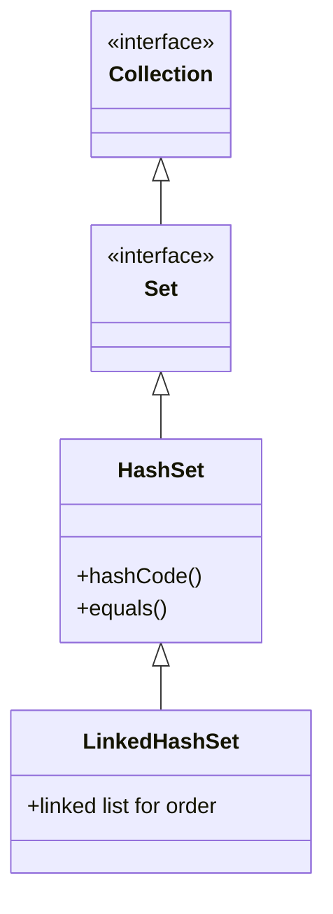
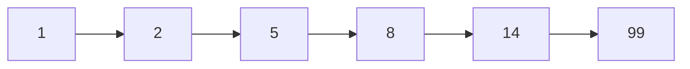
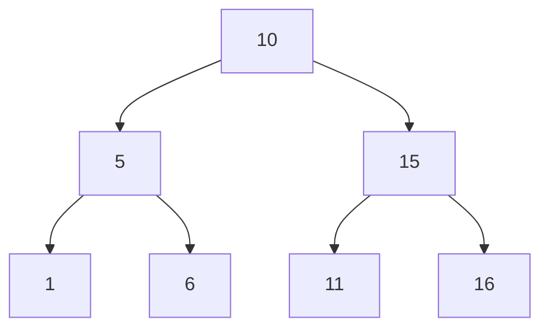

# 🧠 Java Set 구조 요약
## 📌 Set 자료 구조란?
- 중복을 허용하지 않는 데이터 집합
- 순서가 보장되지 않음 (HashSet 기준)
- 수학적 집합 개념을 기반으로 함

## 📦 Collection 인터페이스
- 자바 컬렉션 프레임워크의 최상위 인터페이스
- 주요 하위 인터페이스: List, Set, Queue
- 데이터를 그룹으로 다루기 위한 공통 메서드 정의

## 📦 Set 인터페이스
- Collection을 확장한 인터페이스
- 중복 없는 요소 집합을 표현
- 주요 구현체: HashSet, LinkedHashSet, TreeSet
## 📦 Set 주요 메서드 요약

| 메서드                          | 설명                                                   |
|----------------------------------|--------------------------------------------------------|
| `remove(Object o)`              | 지정된 객체를 세트에서 제거                            |
| `removeAll(Collection<?> c)`    | 주어진 컬렉션에 포함된 모든 요소를 세트에서 제거       |
| `retainAll(Collection<?> c)`    | 주어진 컬렉션에 포함된 요소만 유지하고 나머지는 제거   |
| `clear()`                       | 세트의 모든 요소를 제거                                |
| `size()`                        | 세트에 포함된 요소의 개수를 반환                       |
| `isEmpty()`                     | 세트가 비어 있는지 여부를 반환                         |
| `iterator()`                    | 세트의 요소를 순회할 수 있는 반복자 반환               |
| `toArray()`                     | 세트의 모든 요소를 Object 배열로 반환                  |
| `toArray(T[] a)`                | 지정된 타입의 배열로 세트 요소를 반환                  |


## ✅ 주요 메서드 샘플 코드
### 1. remove(Object o)
```java
Set<String> fruits = new HashSet<>();
fruits.add("apple");
fruits.add("banana");
fruits.remove("apple"); // "apple" 제거
System.out.println(fruits); // [banana]
```


### 2. removeAll(Collection<?> c)
```java
Set<String> fruits = new HashSet<>(List.of("apple", "banana", "cherry"));
fruits.removeAll(List.of("banana", "cherry")); // 여러 요소 제거
System.out.println(fruits); // [apple]
```


### 3. retainAll(Collection<?> c)
```java
Set<String> fruits = new HashSet<>(List.of("apple", "banana", "cherry"));
fruits.retainAll(List.of("banana", "kiwi")); // "banana"만 유지
System.out.println(fruits); // [banana]
```

### 4. clear()
```java
Set<String> fruits = new HashSet<>(List.of("apple", "banana"));
fruits.clear(); // 모든 요소 제거
System.out.println(fruits); // []
```
### 5. size()
```java
Set<String> fruits = new HashSet<>(List.of("apple", "banana", "cherry"));
System.out.println(fruits.size()); // 3
```
### 6. isEmpty()
```java
Set<String> fruits = new HashSet<>();
System.out.println(fruits.isEmpty()); // true
```
### 7. iterator()
```java
Set<String> fruits = new HashSet<>(List.of("apple", "banana", "cherry"));
Iterator<String> it = fruits.iterator();
while (it.hasNext()) {
    System.out.println(it.next());
}
```

### 8. toArray()
```java
Set<String> fruits = new HashSet<>(List.of("apple", "banana"));
Object[] arr = fruits.toArray();
System.out.println(Arrays.toString(arr)); // [apple, banana]
```


## 9. toArray(T[] a)
```java
Set<String> fruits = new HashSet<>(List.of("apple", "banana"));
String[] arr = fruits.toArray(new String[0]);
System.out.println(Arrays.toString(arr)); // [apple, banana]
```


## 🧩 HashSet
- 구현 방식: 해시 테이블 기반
- 순서: 저장 순서 보장 안 됨
- 시간 복잡도: 평균 O(1) (추가, 삭제, 검색)
- 특징: hashCode()와 equals()를 기반으로 동작
- 용도: 유일성만 중요하고 순서가 필요 없는 경우

## 🧩 LinkedHashSet
- 구현 방식: HashSet + 연결 리스트
- 순서: 삽입 순서 유지
- 시간 복잡도: 평균 O(1) (추가, 삭제, 검색)
- 특징: 내부적으로 양방향 링크 유지
- 용도: 유일성과 함께 순서가 중요한 경우

## 🧬 클래스 구조


## 🔗 LinkedHashSet 내부 연결 구조 (삽입 순서 유지)

- 실제로는 양방향 연결이지만, 이해를 돕기 위해 단방향으로 표현했습니다.

---


# TreeSet

Java의 TreeSet에 대한 핵심 개념을 정리한 요약과 함께, 트리 구조를 시각적으로 이해할 수 있도록 다이어그램으로 표현한 내용입니다.

## 🌳 TreeSet 요약 정리
### 📌 TreeSet이란?
- Set 인터페이스의 구현체 중 하나
- 내부적으로 레드-블랙 트리(균형 이진 탐색 트리)를 사용
- 중복 허용 안 함, 자동 정렬됨
- 정렬 기준은 기본 Comparable 또는 사용자 정의 Comparator

## ⚙️ TreeSet 주요 특징

| 항목             | 설명                                                                 |
|------------------|----------------------------------------------------------------------|
| 정렬 기준        | 기본 정렬 또는 사용자 정의 `Comparator` 사용 가능                    |
| 시간 복잡도      | 삽입, 삭제, 검색 모두 평균 `O(log n)`                                |
| 내부 구조        | 레드-블랙 트리 기반 (균형 이진 탐색 트리)                            |
| 중복 허용 여부   | 중복 불허 (Set 특성 유지)                                            |
| 순서 유지 방식   | 입력 순서가 아닌 **값의 정렬 순서**로 유지                           |
| 범위 검색 지원   | `subSet()`, `headSet()`, `tailSet()` 등으로 범위 기반 조회 가능       |
| Null 허용 여부   | `null` 요소는 허용되지 않음 (비교 불가능하므로 예외 발생)             |


## 🧠 TreeSet vs HashSet

| 항목             | TreeSet                              | HashSet                             |
|------------------|---------------------------------------|-------------------------------------|
| 내부 구조        | 레드-블랙 트리 (균형 이진 탐색 트리) | 해시 테이블                         |
| 정렬 여부        | 자동 정렬됨                           | 정렬되지 않음                       |
| 정렬 기준        | `Comparable` 또는 `Comparator`        | 없음                                |
| 시간 복잡도      | `O(log n)`                            | 평균 `O(1)`                         |
| 순서 유지 방식   | 값의 정렬 순서                        | 순서 없음                           |
| 중복 허용 여부   | 허용하지 않음                         | 허용하지 않음                       |
| Null 허용 여부   | `null` 허용 안 함                     | `null` 1개 허용                     |
| 범위 검색        | `subSet()`, `headSet()` 등 지원       | 지원하지 않음                       |
| 용도             | 정렬된 집합이 필요할 때               | 유일성만 필요할 때                  |


### 🧬 이진 탐색 트리 구조 예시
입력 순서: 10 → 5 → 15 → 1 → 6 → 11 → 16



### 🔍 중위 순회 결과
중위 순회(in-order traversal)는 오름차순 정렬된 결과를 반환합니다.
```
1 → 5 → 6 → 10 → 11 → 15 → 16
```

- 순회 순서: 왼쪽 → 현재 노드 → 오른쪽


### 📈 성능 분석: O(log n)
- 트리의 높이가 log₂(n)이므로 검색/삽입/삭제 시 최대 비교 횟수는 log₂(n)
- 예: 1024개의 데이터 → 최대 10번 비교로 탐색 가능
```
log₂(2) = 1
log₂(4) = 2
log₂(8) = 3
log₂(16) = 4
...
log₂(1024) = 10
```

### ⚠️ 주의: 트리 균형이 깨질 경우
- 입력 순서가 정렬되어 있으면 트리가 한쪽으로 치우쳐서 성능 저하 (O(n)까지)
- TreeSet은 레드-블랙 트리를 사용해 자동으로 균형을 유지함

### 🧪 TreeSet 사용 예시
```java
TreeSet<Integer> set = new TreeSet<>();
set.add(10);
set.add(5);
set.add(15);
set.add(1);
set.add(6);
set.add(11);
set.add(16);

System.out.println(set); // [1, 5, 6, 10, 11, 15, 16]
```

## 🧠 Set 인터페이스와 구현체 개요

자바의 `Set` 인터페이스는 중복을 허용하지 않는 집합 구조를 정의합니다. 대표적인 구현체는 다음과 같습니다:

| 구현체           | 성능 (검색/삽입/삭제) | 내부 구조 또는 상속 관계     |
|------------------|------------------------|------------------------------|
| `HashSet`        | `O(1)` 평균            | 해시 테이블 기반             |
| `LinkedHashSet`  | `O(1)` 평균            | `HashSet` + 연결 리스트      |
| `TreeSet`        | `O(log n)`             | 레드-블랙 트리 (이진 탐색 트리) |


### 🔍 예제 코드 분석
```java
public class JavaSetMain {
    public static void main(String[] args) {
        run(new HashSet<>());         // 순서 없음
        run(new LinkedHashSet<>());   // 입력 순서 유지
        run(new TreeSet<>());         // 자동 정렬
    }

    private static void run(Set<String> set) {
        System.out.println("set = " + set.getClass());
        set.add("C");
        set.add("B");
        set.add("A");
        set.add("1");
        set.add("2");

        Iterator<String> iterator = set.iterator();
        while (iterator.hasNext()) {
            System.out.print(iterator.next() + " ");
        }
        System.out.println();
    }
}
```

### ✅ 단계별 설명
- Set 구현체를 바꿔가며 실행
- run() 메서드는 Set<String> 타입을 받아서 공통 로직을 수행
- HashSet, LinkedHashSet, TreeSet을 각각 전달
- 데이터 추가
- "C", "B", "A", "1", "2"를 추가
- 중복이 없으므로 모두 저장됨
- 반복자(iterator) 사용
- iterator()로 요소를 순회
- hasNext() → 다음 요소 존재 여부 확인
- next() → 다음 요소 반환

### 🧪 실행 결과 분석
```
set = class java.util.HashSet
A 1 B 2 C
```
```
set = class java.util.LinkedHashSet
C B A 1 2
```

```
set = class java.util.TreeSet
1 2 A B C
```

## 📦 Set 구현체 비교

| 구현체         | 순서 유지 여부       | 정렬 여부         | 정렬 기준            |
|----------------|----------------------|--------------------|----------------------|
| `HashSet`      | ❌ (순서 없음)        | ❌ (정렬 안 됨)     | 없음                 |
| `LinkedHashSet`| ✅ (입력 순서 유지)   | ❌ (정렬 안 됨)     | 없음                 |
| `TreeSet`      | ❌ (입력 순서 무시)   | ✅ (자동 정렬됨)    | `Comparable` 또는 `Comparator` |


## 📦 TreeSet의 정렬 기준
- 기본 타입 (String, Integer)은 Comparable을 구현하고 있어 자동 정렬됨
- 사용자 정의 객체 (Member, User 등)는 직접 정렬 기준을 제공해야 함

### ✅ 방법 1: Comparable 구현
```java
public class Member implements Comparable<Member> {
    private String name;
    public int compareTo(Member other) {
        return this.name.compareTo(other.name);
    }
}
```

### ✅ 방법 2: Comparator 전달
```java
Set<Member> members = new TreeSet<>(Comparator.comparing(Member::getName));
```

## 🔗 Set 구현체 요약 비교

| 구현체           | 순서 유지 여부       | 정렬 여부         | 성능 (검색/삽입/삭제) | 내부 구조             | 정렬 기준                     |
|------------------|----------------------|--------------------|------------------------|------------------------|-------------------------------|
| `HashSet`        | ❌ (순서 없음)        | ❌ (정렬 안 됨)     | `O(1)` 평균            | 해시 테이블            | 없음                          |
| `LinkedHashSet`  | ✅ (입력 순서 유지)   | ❌ (정렬 안 됨)     | `O(1)` 평균            | 해시 테이블 + 링크드 리스트 | 없음                          |
| `TreeSet`        | ❌ (입력 순서 무시)   | ✅ (자동 정렬됨)    | `O(log n)`             | 레드-블랙 트리         | `Comparable` 또는 `Comparator` |


# 최적화 전략

HashSet이 제공하는 최적화 메커니즘과 실무에서의 활용 전략을 체계적으로 정리한 내용입니다.

## 🧠 자바 HashSet의 최적화 전략
### 📌 기본 구조
- HashSet은 내부적으로 해시 테이블을 사용
- 각 요소는 hashCode()를 기반으로 배열 인덱스에 저장됨
- 기본 배열 크기: 16

### ⚙️ HashSet 최적화 동작 원리

| 조건 또는 상황                     | 동작 또는 결과                                      |
|-----------------------------------|-----------------------------------------------------|
| 데이터 수가 배열 크기의 75% 초과  | 성능 저하 시작 (해시 충돌 증가)                    |
| 충돌 발생                         | 같은 인덱스에 여러 요소 저장 → 검색 시 O(n)        |
| 해결 방법                         | 배열 크기 2배 증가 + 재해싱(rehashing) 수행        |
| 재해싱이란                        | 모든 요소의 해시 인덱스를 새 배열 크기에 맞게 재계산 |
| 반복 조건                         | 다시 75% 초과 시 → 또다시 2배 증가 + 재해싱 반복    |


### 🔁 재해싱 과정 요약
- 배열 크기 16 → 데이터 13개 입력 (약 81%) → 재해싱 발생
- 배열 크기 32로 증가
- 기존 요소들의 hashCode()를 다시 계산하여 새 인덱스에 재배치
- 충돌 확률 감소 → 성능 회복

### 📦 실무 활용 전략

| 상황 또는 목적                      | 구현체           | 성능 (검색/삽입/삭제) | 특징 및 추천 이유                                 |
|------------------------------------|------------------|------------------------|--------------------------------------------------|
| 중복 제거만 필요, 순서 무관        | `HashSet`        | `O(1)` 평균            | 가장 빠름, 기본 선택                             |
| 입력 순서를 유지해야 할 때         | `LinkedHashSet`  | `O(1)` 평균            | 순서 보존 + 해시 기반                            |
| 정렬된 데이터가 필요할 때          | `TreeSet`        | `O(log n)`             | 자동 정렬, 범위 검색 가능                        |


### 🔍 요약 포인트
- HashSet은 빠른 성능을 제공하지만, 충돌 관리가 핵심
- 자바는 75% 이상 채워지면 자동으로 확장 + 재해싱을 수행
- 이 덕분에 HashSet은 동적 확장성과 안정적인 성능을 유지함
- 실무에서는 Set이 필요할 때 기본적으로 HashSet을 우선 고려하고, 상황에 따라 LinkedHashSet 또는 TreeSet을 선택


# 문제 풀이
자바의 Set 인터페이스를 활용한 문제들을 단계별로 정리한 풀이 요약과 함께,  
각 문제에 대한 최종 소스 코드를 깔끔하게 정리한 내용입니다.  
중복 제거, 순서 유지, 정렬, 집합 연산, 객체 비교까지 Set의 핵심 기능을 모두 담고 있어요.

## 🧠 문제와 풀이 1: 중복 제거 및 출력 방식
### ✅ 문제 1: 중복 제거 (순서 무관)
핵심 포인트: HashSet 사용 → 중복 제거, 순서 보장 안 됨
```java
public class UniqueNamesTest1 {
    public static void main(String[] args) {
        Integer[] inputArr = {30, 20, 20, 10, 10};
        Set<Integer> set = new HashSet<>();
        for (Integer s : inputArr) {
            set.add(s);
        }
        for (Integer s : set) {
            System.out.println(s);
        }
    }
}
```


### ✅ 문제 2: 중복 제거 + 입력 순서 유지
핵심 포인트: LinkedHashSet 사용 → 중복 제거 + 입력 순서 유지
```java
public class UniqueNamesTest2 {
    public static void main(String[] args) {
        Integer[] inputArr = {30, 20, 20, 10, 10};
        Set<Integer> set = new LinkedHashSet<>(List.of(inputArr));
        for (Integer s : set) {
            System.out.println(s);
        }
    }
}
```


### ✅ 문제 3: 중복 제거 + 값 기준 정렬
핵심 포인트: TreeSet 사용 → 중복 제거 + 자동 정렬
```java
public class UniqueNamesTest3 {
    public static void main(String[] args) {
        Set<Integer> set = new TreeSet<>(List.of(30, 20, 20, 10, 10));
        for (Integer s : set) {
            System.out.println(s);
        }
    }
}
```


## 🧠 문제와 풀이 2: 집합 연산 및 객체 비교
### ✅ 문제 4: 합집합, 교집합, 차집합
핵심 포인트: Set의 addAll, retainAll, removeAll 메서드 활용
```java
public class SetOperationsTest {
    public static void main(String[] args) {
        Set<Integer> set1 = new HashSet<>(List.of(1, 2, 3, 4, 5));
        Set<Integer> set2 = new HashSet<>(List.of(3, 4, 5, 6, 7));

        Set<Integer> union = new HashSet<>(set1);
        union.addAll(set2);

        Set<Integer> intersection = new HashSet<>(set1);
        intersection.retainAll(set2);

        Set<Integer> difference = new HashSet<>(set1);
        difference.removeAll(set2);

        System.out.println("합집합: " + union);
        System.out.println("교집합: " + intersection);
        System.out.println("차집합: " + difference);
    }
}
```

### ✅ 문제 5: 객체 비교 (equals, hashCode)
핵심 포인트: HashSet에서 객체 중복 제거를 위해 equals()와 hashCode() 재정의
```java
public class Rectangle {
    private int width;
    private int height;

    public Rectangle(int width, int height) {
        this.width = width;
        this.height = height;
    }

    @Override
    public boolean equals(Object o) {
        if (this == o) return true;
        if (o == null || getClass() != o.getClass()) return false;
        Rectangle rectangle = (Rectangle) o;
        return width == rectangle.width && height == rectangle.height;
    }

    @Override
    public int hashCode() {
        return Objects.hash(width, height);
    }

    @Override
    public String toString() {
        return "Rectangle{" +
                "width=" + width +
                ", height=" + height +
                '}';
    }
}

public class RectangleTest {
    public static void main(String[] args) {
        Set<Rectangle> rectangleSet = new HashSet<>();
        rectangleSet.add(new Rectangle(10, 10));
        rectangleSet.add(new Rectangle(20, 20));
        rectangleSet.add(new Rectangle(20, 20)); // 중복 제거됨

        for (Rectangle rectangle : rectangleSet) {
            System.out.println("rectangle = " + rectangle);
        }
    }
}
```

## 📦 핵심 요약

| 문제 번호 | 사용된 Set 구현체 | 목적 또는 특징                     |
|-----------|-------------------|------------------------------------|
| 문제 1    | `HashSet`         | 중복 제거, 순서 무관               |
| 문제 2    | `LinkedHashSet`   | 중복 제거, 입력 순서 유지          |
| 문제 3    | `TreeSet`         | 중복 제거, 값 기준 자동 정렬       |
| 문제 4    | `HashSet`         | 집합 연산 (합집합, 교집합, 차집합) |
| 문제 5    | `HashSet`         | 사용자 정의 객체 중복 제거         |


## ✅ 선택 기준 요약
- HashSet: 가장 빠르고 기본적인 중복 제거용
- LinkedHashSet: 순서가 중요한 경우
- TreeSet: 정렬된 결과가 필요한 경우
- 모든 경우에서 Set은 중복을 자동으로 제거해줌

---


