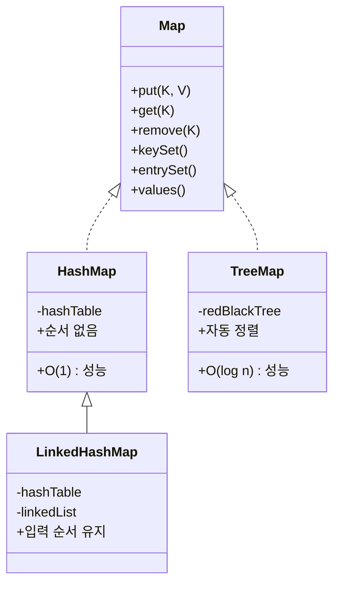

# 📦 Map 인터페이스 개요
## 🔑 Map 구현체 특징 요약

| 항목               | HashMap                  | LinkedHashMap              | TreeMap                    |
|--------------------|--------------------------|-----------------------------|----------------------------|
| 순서 유지 여부     | ❌ 유지 안 됨             | ✅ 입력 순서 유지           | ❌ 입력 순서 무시, 값 기준 정렬 |
| 정렬 여부          | ❌ 없음                  | ❌ 없음                     | ✅ 자동 정렬됨             |
| 성능               | `O(1)` 평균              | `O(1)` 평균                 | `O(log n)`                 |
| 내부 구조          | 해시 테이블              | 해시 테이블 + 링크드 리스트 | 레드-블랙 트리             |
| 키 중복 여부       | ❌ 중복 불가             | ❌ 중복 불가                | ❌ 중복 불가               |
| 값 중복 여부       | ✅ 중복 가능             | ✅ 중복 가능                | ✅ 중복 가능               |
| 주요 용도          | 빠른 검색, 기본 맵       | 순서 유지가 필요한 경우     | 정렬된 맵, 범위 검색 필요 시 |


## 🧪 주요 메서드별 샘플과 설명
### 1. put(K key, V value)
키-값 저장 (같은 키면 값 덮어쓰기)
```java
Map<String, Integer> map = new HashMap<>();
map.put("A", 100);
map.put("A", 200); // 기존 값 덮어쓰기
System.out.println(map); // {A=200}
```


### 2. putIfAbsent(K key, V value)
키가 없을 때만 저장
```java
map.putIfAbsent("A", 300); // 이미 있으므로 무시
map.putIfAbsent("B", 400); // 없으므로 저장
System.out.println(map); // {A=200, B=400}
```


### 3. get(Object key)
키로 값 조회
```java
Integer score = map.get("A");
System.out.println(score); // 200
```


### 4. getOrDefault(Object key, V defaultValue)
키가 없으면 기본값 반환
```java
Integer score = map.getOrDefault("C", 0);
System.out.println(score); // 0
```


### 5. remove(Object key)
키-값 제거
```java
map.remove("A");
System.out.println(map); // {B=400}
```


### 6. clear()
모든 데이터 제거
```java
map.clear();
System.out.println(map); // {}
```


### 7. containsKey(Object key)
키 존재 여부 확인
```java
boolean exists = map.containsKey("B");
System.out.println(exists); // true
```


### 8. containsValue(Object value)
값 존재 여부 확인
```java
boolean hasValue = map.containsValue(400);
System.out.println(hasValue); // true
```


### 9. keySet()
모든 키 조회 (Set 반환)
```java
Set<String> keys = map.keySet();
for (String key : keys) {
    System.out.println("key = " + key);
}
```


### 10. values()
모든 값 조회 (Collection 반환)
```java
Collection<Integer> values = map.values();
for (Integer value : values) {
    System.out.println("value = " + value);
}
```


### 11. entrySet()
키-값 쌍 조회 (Set<Map.Entry<K,V>> 반환)
```java
Set<Map.Entry<String, Integer>> entries = map.entrySet();
for (Map.Entry<String, Integer> entry : entries) {
    System.out.println("key = " + entry.getKey() + ", value = " + entry.getValue());
}
```


### 12. size() / isEmpty()
크기 확인 / 비어 있는지 확인
```java
System.out.println(map.size());     // 2
System.out.println(map.isEmpty());  // false
```

## 🧠 Map 구현체 비교 요약

| 구현체           | 순서 유지 여부       | 정렬 여부         | 성능 (검색/삽입/삭제) | 내부 구조             | 특징 및 용도                          |
|------------------|----------------------|--------------------|------------------------|------------------------|---------------------------------------|
| `HashMap`        | ❌ (순서 없음)        | ❌ (정렬 안 됨)     | `O(1)` 평균            | 해시 테이블            | 가장 많이 사용됨, 빠른 성능           |
| `LinkedHashMap`  | ✅ (입력 순서 유지)   | ❌ (정렬 안 됨)     | `O(1)` 평균            | 해시 테이블 + 링크드 리스트 | 순서 유지 필요 시 사용               |
| `TreeMap`        | ❌ (입력 순서 무시)   | ✅ (자동 정렬됨)    | `O(log n)`             | 레드-블랙 트리         | 정렬된 키-값 저장, 범위 검색 가능     |


## ✅ 실무 팁
- 중복 없는 키-값 저장: putIfAbsent()
- 기본값 처리: getOrDefault()
- 전체 순회: entrySet() 사용
- 정렬 필요: TreeMap 사용
- 입력 순서 유지: LinkedHashMap 사용


--- 

# Map 정리

🧬 Map 구현체 구조



## ✅ 실무 팁
- 기본적으로 HashMap을 사용
- 순서가 중요하면 LinkedHashMap
- 정렬이나 범위 검색이 필요하면 TreeMap
- Set과 Map은 구조적으로 유사하며, Set은 Map의 키만 사용하는 형태로 이해하면 쉬움

---


# 🧠 스택(Stack) 자료 구조 요약
## 🔁 기본 개념
- 스택은 데이터를 한쪽 방향으로만 넣고 빼는 자료 구조
- 후입 선출(LIFO): 나중에 넣은 데이터가 먼저 나온다
- 대표적인 동작:
- push: 데이터를 스택에 넣기
- pop: 데이터를 스택에서 꺼내기
- peek: 가장 위의 데이터를 꺼내지 않고 조회

### 📦 동작 예시
```
push(1) → push(2) → push(3)
pop() → 3
pop() → 2
pop() → 1

넣은 순서: 1 → 2 → 3
꺼낸 순서: 3 → 2 → 1
```


## 🧪 자바 Stack 클래스 사용 예제
```java
Stack<Integer> stack = new Stack<>();
stack.push(1);
stack.push(2);
stack.push(3);

System.out.println(stack);           // [1, 2, 3]
System.out.println(stack.peek());   // 3
System.out.println(stack.pop());    // 3
System.out.println(stack.pop());    // 2
System.out.println(stack.pop());    // 1
System.out.println(stack);          // []
```

## ⚠️ Stack 클래스 사용 주의

| 항목               | 구현체 또는 구조         | 설명 및 특징                                  |
|--------------------|--------------------------|-----------------------------------------------|
| 스택 클래스        | `Stack` (`Vector` 기반)  | 오래된 구조, 동기화됨 → 성능 저하 가능성 있음 |
| 내부 구조          | `Vector`                 | 자바 1.0 시절 구조, 현재는 사용 권장되지 않음  |
| 권장 대안          | `Deque` (`ArrayDeque`)   | 더 빠르고 유연한 구조, 스택/큐 모두 지원      |
| 사용 권장 여부     | `Stack`: ❌ 사용 지양     | `Deque`: ✅ 실무에서 권장                      |

### ✅ 요약 포인트
- Stack은 내부적으로 Vector를 사용 → 동기화로 인해 성능 저하 가능
- Deque는 ArrayDeque 구현체를 통해 스택처럼 push, pop을 지원하면서 더 빠름
- 실무에서는 Deque를 사용하여 스택을 구현하는 것이 표준


## ✅ 실무 권장: Deque로 스택 구현
```java
Deque<Integer> stack = new ArrayDeque<>();
stack.push(1);
stack.push(2);
stack.push(3);

System.out.println(stack.pop()); // 3
System.out.println(stack.pop()); // 2
System.out.println(stack.pop()); // 1
```
- Deque는 양방향 자료 구조지만 push/pop을 사용하면 스택처럼 동작함

## 📌 요약 포인트
- 스택은 후입 선출(LIFO) 구조
- 자바의 Stack 클래스는 사용하지 않는 것이 좋음
- 대신 Deque 인터페이스의 구현체인 ArrayDeque를 사용하면 더 안전하고 빠름

---

# 🧠 큐(Queue) 자료 구조 요약
## 🔁 기본 개념
- **큐(Queue)** 는 데이터를 선입 선출(FIFO) 방식으로 처리하는 자료 구조
- 먼저 들어온 데이터가 먼저 나간다
- 대표적인 동작:
- offer: 큐에 데이터 추가
- poll: 큐에서 데이터 꺼내기
- peek: 큐의 맨 앞 데이터 조회 (꺼내지 않음)

## 📦 동작 예시
```
offer(1) → offer(2) → offer(3)
poll() → 1
poll() → 2
poll() → 3

넣은 순서: 1 → 2 → 3
꺼낸 순서: 1 → 2 → 3
```

## 📌 Queue 주요 메서드 정리

| 메서드           | 설명                                 | 반환값 예시       |
|------------------|--------------------------------------|-------------------|
| `offer(E e)`     | 큐에 요소 추가                        | `true` 또는 `false` |
| `poll()`         | 큐에서 요소 제거 및 반환              | 가장 앞의 요소     |
| `peek()`         | 큐의 가장 앞 요소 조회 (제거 안 함)   | 가장 앞의 요소     |
| `isEmpty()`      | 큐가 비어 있는지 확인                 | `true` 또는 `false` |
| `size()`         | 큐에 저장된 요소 개수 반환            | `int` 값           |


## 🧪 메서드별 샘플 코드
### 1. offer(E e) – 요소 추가
```java
Queue<String> queue = new ArrayDeque<>();
queue.offer("A");
queue.offer("B");
System.out.println(queue); // [A, B]
```


### 2. poll() – 요소 제거 및 반환
```java
String item = queue.poll();
System.out.println("poll = " + item); // poll = A
System.out.println(queue);            // [B]
```


### 3. peek() – 요소 조회 (제거 안 함)
```java
String front = queue.peek();
System.out.println("peek = " + front); // peek = B
System.out.println(queue);             // [B]
```


### 4. isEmpty() – 큐 비어 있는지 확인
```java
System.out.println(queue.isEmpty()); // false
queue.poll(); // B 제거
System.out.println(queue.isEmpty()); // true
```


### 5. size() – 큐 크기 확인
```java
queue.offer("X");
queue.offer("Y");
System.out.println(queue.size()); // 2
```


## ✅ 실무 팁
- ArrayDeque는 큐 구현에 가장 많이 사용됨 (빠르고 가볍고 동기화 없음)
- LinkedList도 큐로 사용 가능하지만, 일반적으로 ArrayDeque이 성능 면에서 더 우수
- 큐는 작업 순서 관리, 이벤트 처리, BFS 탐색 등에 자주 사용됨

---

# 🧠 Deque 자료 구조 요약
## 🔁 기본 개념
- Deque는 양쪽 끝에서 데이터를 추가하거나 제거할 수 있는 자료 구조
- 스택(LIFO)과 큐(FIFO) 기능을 모두 포함
- 자바에서는 Deque 인터페이스를 통해 제공되며, 대표 구현체는:
- ArrayDeque (추천)
- LinkedList

## 📌 Deque 주요 메서드 요약

| 메서드             | 설명                                | 방향       |
|--------------------|-------------------------------------|------------|
| `offerFirst(E e)`  | 앞쪽에 요소 추가                     | 입력 (앞)  |
| `offerLast(E e)`   | 뒤쪽에 요소 추가                     | 입력 (뒤)  |
| `pollFirst()`      | 앞쪽 요소 제거 및 반환               | 출력 (앞)  |
| `pollLast()`       | 뒤쪽 요소 제거 및 반환               | 출력 (뒤)  |
| `peekFirst()`      | 앞쪽 요소 조회 (제거 안 함)          | 조회 (앞)  |
| `peekLast()`       | 뒤쪽 요소 조회 (제거 안 함)          | 조회 (뒤)  |
| `isEmpty()`        | 비어 있는지 확인                     | 상태 확인  |
| `size()`           | 저장된 요소 개수 반환                | 상태 확인  |


## 🧪 메서드별 샘플 코드
### 1. offerFirst() – 앞쪽에 요소 추가
```java
Deque<String> deque = new ArrayDeque<>();
deque.offerFirst("A");
System.out.println(deque); // [A]
```


### 2. offerLast() – 뒤쪽에 요소 추가
```java
deque.offerLast("B");
System.out.println(deque); // [A, B]
```


### 3. peekFirst() / peekLast() – 앞/뒤 조회
```java
System.out.println(deque.peekFirst()); // A
System.out.println(deque.peekLast());  // B
```


### 4. pollFirst() / pollLast() – 앞/뒤 제거
```java
System.out.println(deque.pollFirst()); // A
System.out.println(deque.pollLast());  // B
System.out.println(deque);             // []
```


### 5. isEmpty() / size() – 상태 확인
```java
System.out.println(deque.isEmpty()); // true
deque.offerLast("X");
deque.offerLast("Y");
System.out.println(deque.size());    // 2
```


## 🚀 성능 비교 요약

| 구현체         | 입력 성능 (100만 건) | 조회 성능 (100만 건) | 시간 복잡도 | 내부 구조             | 특징 및 추천 이유                          |
|----------------|----------------------|------------------------|--------------|------------------------|-------------------------------------------|
| `ArrayDeque`   | 110ms                | 9ms                    | `O(1)` 평균  | 배열 기반 + 원형 큐    | 빠르고 캐시 친화적, 실무에서 가장 많이 사용 |
| `LinkedList`   | 480ms                | 20ms                   | `O(1)` 평균  | 노드 기반 링크드 리스트 | 삽입/삭제 많을 때 이론적으로 유리           |

## ✅ 요약 포인트
- ArrayDeque는 배열 기반으로 메모리 접근이 빠르고 CPU 캐시 최적화에 유리
- LinkedList는 노드 기반으로 삽입/삭제가 자주 발생할 때 이론적으로 유리하지만 실제 성능은 느릴 수 있음
- 실무에서는 대부분 ArrayDeque를 사용하며, 큐와 스택 모두 구현 가능
- 실제 환경에서는 ArrayDeque가 메모리 접근 최적화 덕분에 더 빠른 성능을 보이는 경우가 많음.


## ✅ 실무 팁
- 스택처럼 사용: push(), pop() → 내부적으로 offerFirst, pollFirst와 동일
- 큐처럼 사용: offerLast(), pollFirst() → 일반적인 FIFO 처리
- 양방향 처리: 앞/뒤 모두 자유롭게 조작 가능 → 캐시, 슬라이딩 윈도우, 트리 탐색 등에 활용

# 슬라이딩
Deque를 이용한 슬라이딩 윈도우 최대값 알고리즘은 O(n) 시간 복잡도로 각 윈도우의 최대값을 빠르게 구할 수 있는 효율적인 방법입니다.  
핵심은 Deque를 이용해 윈도우 내에서 최대값 후보만 유지하는 것입니다.

## 🧠 문제 정의
- 입력: 정수 배열 nums, 윈도우 크기 k
- 목표: 배열을 왼쪽에서 오른쪽으로 k 크기의 슬라이딩 윈도우로 이동시키며, 각 윈도우의 최대값을 구함
- 예시:
```
nums = [1, 3, -1, -3, 5, 3, 6, 7], k = 3
결과 = [3, 3, 5, 5, 6, 7]
```

## ⚙️ Deque를 이용한 핵심 아이디어
- Deque에는 인덱스만 저장하며, 항상 값이 큰 순서대로 유지
- 윈도우를 오른쪽으로 이동할 때:
- 현재 값보다 작은 값의 인덱스는 뒤에서 제거 → 최대값 후보만 유지
- 현재 인덱스를 뒤에 추가
- 윈도우 범위를 벗어난 인덱스는 앞에서 제거
- 윈도우가 k 크기에 도달하면 맨 앞 인덱스의 값이 최대값

## 🧪 자바 코드 예시
```java
public List<Integer> maxSlidingWindow(int[] nums, int k) {
    List<Integer> result = new ArrayList<>();
    Deque<Integer> deque = new ArrayDeque<>();

    for (int i = 0; i < nums.length; i++) {
        // 1. 윈도우 범위 밖 인덱스 제거
        if (!deque.isEmpty() && deque.peekFirst() <= i - k) {
            deque.pollFirst();
        }

        // 2. 현재 값보다 작은 값 제거
        while (!deque.isEmpty() && nums[deque.peekLast()] < nums[i]) {
            deque.pollLast();
        }

        // 3. 현재 인덱스 추가
        deque.offerLast(i);

        // 4. 윈도우가 k 크기일 때 결과 추가
        if (i >= k - 1) {
            result.add(nums[deque.peekFirst()]);
        }
    }

    return result;
}
```


## ✅ 시간 복잡도 분석
- 각 요소는 최대 1번 Deque에 들어가고 1번 나옴 → O(n)
- 공간 복잡도는 최대 k개의 인덱스를 저장 → O(k)

## 📌 실무 활용 팁
- 슬라이딩 윈도우 최대값은 모니터링 시스템, 주식 가격 분석, 센서 데이터 처리 등에 자주 사용됨
- Deque를 활용하면 우선순위 큐보다 빠르고 메모리 효율적

---


# 🧠 Deque = Stack + Queue
## 🔁 기본 개념
- Deque는 양쪽 끝에서 데이터 삽입/삭제가 가능한 자료 구조
- Stack처럼 사용 → 앞쪽에서 push, pop
- Queue처럼 사용 → 뒤쪽에서 offer, 앞쪽에서 poll
- 자바에서는 ArrayDeque를 가장 많이 사용함

## 📦 Deque 주요 메서드 요약

| 역할      | 메서드           | 설명                          | 방향       |
|-----------|------------------|-------------------------------|------------|
| Stack     | `push(E e)`      | 앞쪽에 요소 추가              | 입력 (앞)  |
| Stack     | `pop()`          | 앞쪽 요소 제거 및 반환        | 출력 (앞)  |
| Stack     | `peek()`         | 앞쪽 요소 조회 (제거 안 함)   | 조회 (앞)  |
| Queue     | `offer(E e)`     | 뒤쪽에 요소 추가              | 입력 (뒤)  |
| Queue     | `poll()`         | 앞쪽 요소 제거 및 반환        | 출력 (앞)  |
| Queue     | `peek()`         | 앞쪽 요소 조회 (제거 안 함)   | 조회 (앞)  |


## 🧪 Stack 방식 샘플 (push, pop, peek)
```java
Deque<Integer> deque = new ArrayDeque<>();
deque.push(1);
deque.push(2);
deque.push(3);
System.out.println(deque);           // [3, 2, 1]
System.out.println(deque.peek());   // 3
System.out.println(deque.pop());    // 3
System.out.println(deque.pop());    // 2
System.out.println(deque.pop());    // 1
System.out.println(deque);          // []
```
- 후입 선출 (LIFO): 나중에 넣은 3이 먼저 나옴


## 🧪 Queue 방식 샘플 (offer, poll, peek)
```java
Deque<Integer> deque = new ArrayDeque<>();
deque.offer(1);
deque.offer(2);
deque.offer(3);
System.out.println(deque);           // [1, 2, 3]
System.out.println(deque.peek());   // 1
System.out.println(deque.poll());   // 1
System.out.println(deque.poll());   // 2
System.out.println(deque.poll());   // 3
System.out.println(deque);          // []
```
- 선입 선출 (FIFO): 먼저 넣은 1이 먼저 나옴


## ✅ 실무 팁
- Deque는 Stack과 Queue를 모두 구현할 수 있는 유연한 구조
- ArrayDeque는 빠르고 가볍고 캐시 친화적이므로 실무에서 가장 많이 사용됨
- LinkedList도 Deque을 구현하지만 성능 면에서는 ArrayDeque가 우수

---

# 실전 문제
아래는 자바의 Map을 활용한 실전 문제들을 문제 유형별로 정리한 요약표와 함께,  
각 문제의 핵심 개념과 실무 활용 포인트를 깔끔하게 정리한 내용입니다.  
Map의 기본 사용부터 고급 활용까지 단계적으로 구성.

## 🧠 Map 활용 문제 요약

| 문제 번호 | 주제                     | 핵심 자료 구조 / 반환형         | 주요 메서드 및 기능                          |
|-----------|--------------------------|-------------------------------|---------------------------------------------|
| 문제 1    | 배열을 Map으로 변환       | `Map<String, Integer>`        | `put()`, `Integer.valueOf()`                |
| 문제 2    | 공통 키의 값 합산         | `Map<String, Integer>`        | `containsKey()`, `get()`                    |
| 문제 3    | 단어 빈도 계산            | `Map<String, Integer>`        | `split()`, `getOrDefault()`                 |
| 문제 4    | 값으로 키 검색            | `List<String>`                | `entrySet()`, `equals()`                    |
| 문제 5    | 영어 사전 만들기          | `Map<String, String>`         | `Scanner`, `put()`, `get()`, `containsKey()`|
| 문제 6    | 회원 저장소               | `Map<String, Member>`         | `put()`, `get()`, `remove()`, `values()`    |


## 📦 핵심 기능별 정리
### ✅ 문제 1: 배열을 Map으로 변환
- 입력: String[][] productArr
- 출력: Map<String, Integer>
- 포인트: 배열의 첫 번째 요소를 키, 두 번째 요소를 값으로 변환
```java
for (String[] product : productArr) {
    productMap.put(product[0], Integer.valueOf(product[1]));
}
```


## ✅ 문제 2: 공통 키의 값 합산
- 입력: map1, map2
- 출력: 공통 키의 값 합을 담은 Map
- 포인트: containsKey()로 공통 키 확인 후 get()으로 값 합산
```java
if (map2.containsKey(key)) {
    result.put(key, map1.get(key) + map2.get(key));
}
```


## ✅ 문제 3: 단어 빈도 계산
- 입력: 문자열
- 출력: 각 단어의 등장 횟수
- 포인트: split(" ")으로 단어 분리 후 getOrDefault()로 누적
```java
map.put(word, map.getOrDefault(word, 0) + 1);
```


## ✅ 문제 4: 값으로 키 검색
- 입력: Map<String, Integer>
- 출력: 특정 값에 해당하는 키 목록
- 포인트: entrySet()으로 반복하며 value 비교
```java
if (entry.getValue().equals(1000)) {
    list.add(entry.getKey());
}
```


## ✅ 문제 5: 영어 사전 만들기
- 입력: 사용자 입력 (영어 단어, 한글 뜻)
- 출력: 단어 검색 결과
- 포인트: Scanner로 입력 받고 Map에 저장 및 검색
```java
dictionary.put(englishWord, koreanMeaning);
if (dictionary.containsKey(searchWord)) {
    System.out.println(searchWord + "의 뜻: " + dictionary.get(searchWord));
}
```


## ✅ 문제 6: 회원 관리 저장소
- 입력: Member 객체
- 출력: ID 또는 이름으로 회원 조회
- 포인트: Map<String, Member>로 저장, values()로 이름 검색
```java
memberMap.put(member.getId(), member);
for (Member member : memberMap.values()) {
    if (member.getName().equals(name)) {
        return member;
    }
}
```


## ✅ 실무 활용 팁
- Map.of()는 불변 Map 생성에 유용하지만 수정 불가
- getOrDefault()는 빈도 계산, 기본값 처리에 매우 유용
- entrySet()은 키와 값을 동시에 다룰 때 필수
- 객체 저장 시 Map<Id, Object> 패턴은 관리 시스템에 자주 사용됨

---
