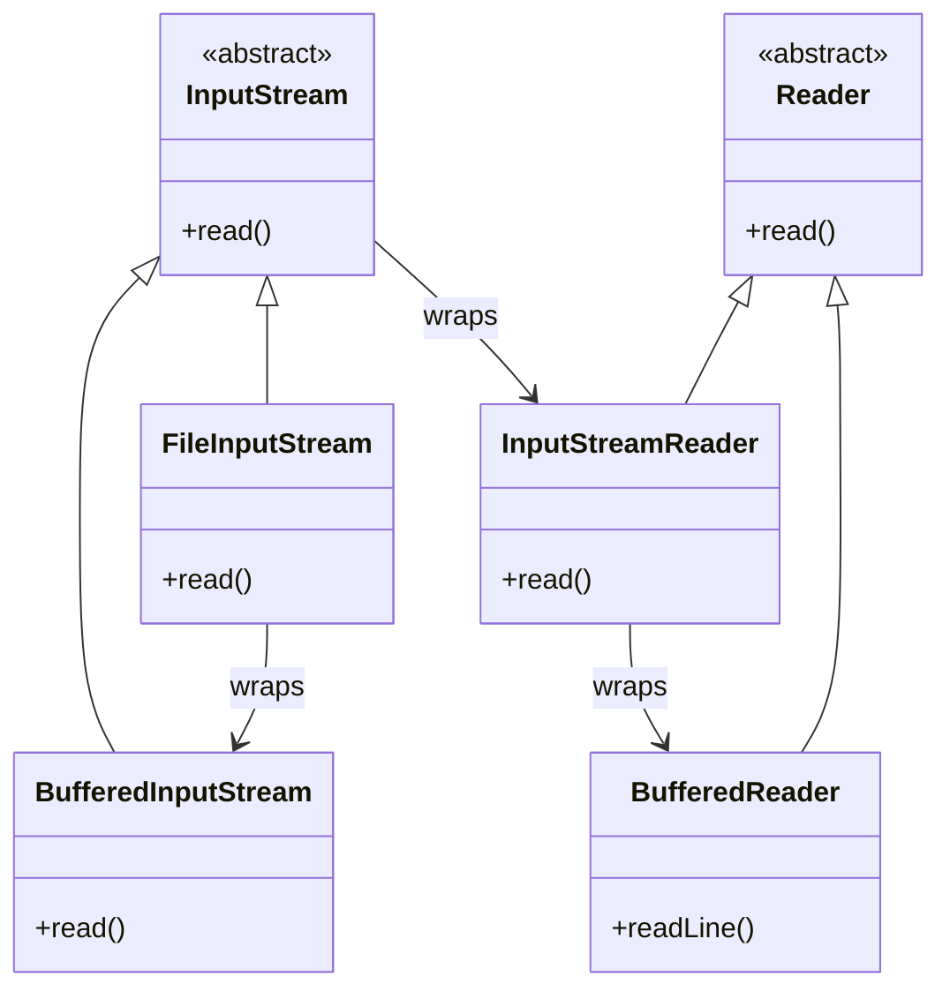
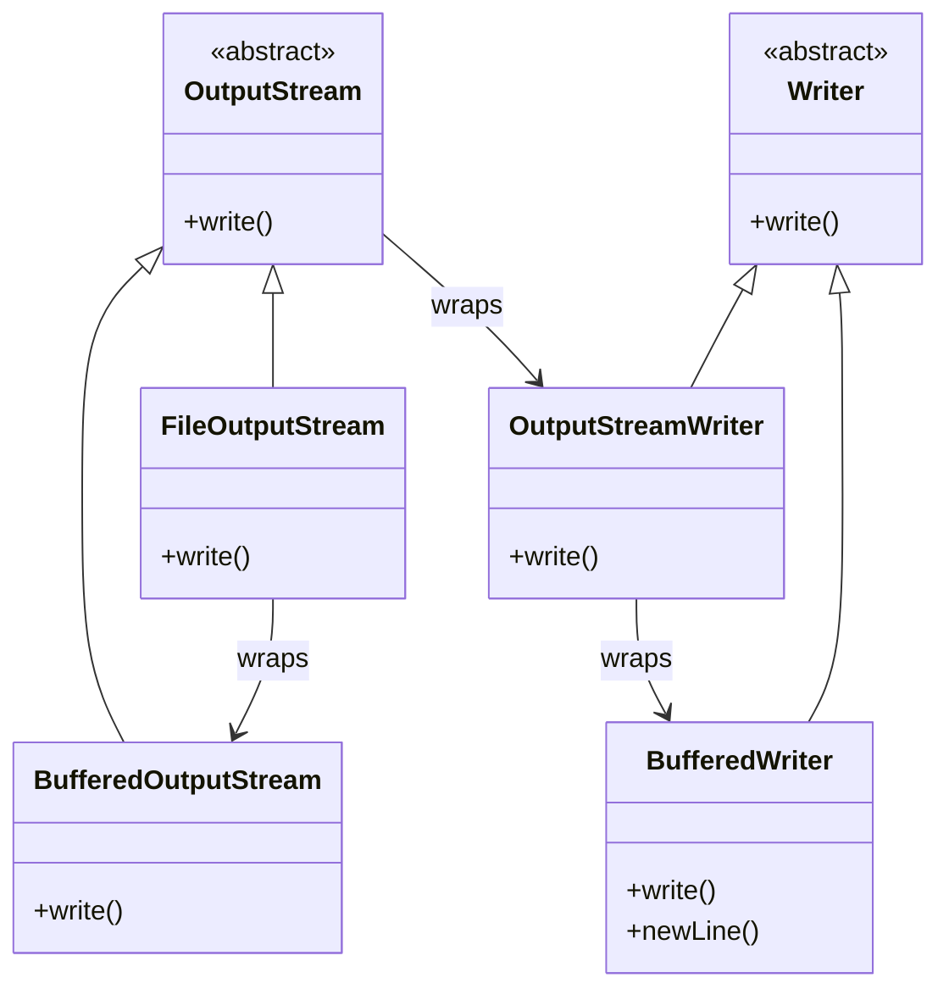

# IO Stream

이 코드는 Java의 입출력 스트림(IO Stream) 구조를 잘 보여주는 예제.  
아래에 Writer/Reader의 상속 관계와 함께, 두 소스 파일을 단계적으로 정리.

## 📚 Java IO 스트림 계층 구조
### [Character 기반]
```
Writer (추상 클래스)
├── FileWriter
├── BufferedWriter
└── PrintWriter
```

```
Reader (추상 클래스)
├── FileReader
├── BufferedReader
└── InputStreamReader
```

### [Byte 기반]
```
OutputStream (추상 클래스)
├── FileOutputStream
├── BufferedOutputStream
```

```
InputStream (추상 클래스)
├── FileInputStream
├── BufferedInputStream
```

- Writer / Reader: 문자(char) 기반 스트림
- OutputStream / InputStream: 바이트(byte) 기반 스트림
- PrintWriter: 문자 기반 출력에 특화된 고급 클래스

## 🧾 InputStreamTest.java 단계별 설명

### 전체 소스
```java
import java.io.*;
public class InputStreamTest {

    public static void main(String[] args){

        try(FileWriter fw = new FileWriter("Output.txt");
            BufferedWriter bw = new BufferedWriter(fw);
            PrintWriter out = new PrintWriter(bw)){
            out.println("the text");
            out.println("more text");
        }catch (IOException e){
            e.printStackTrace();
        }

        try {
            
            InputStream inputStream = new FileInputStream("Output.txt");
            String strRet = inputStreamToString(inputStream);
            System.out.println(strRet);
        }
        catch (Exception e){
            e.printStackTrace();
        }
    }

    public static String inputStreamToString(InputStream inputStream) throws Exception{

        StringWriter writer = new StringWriter();
        char[] buffer = new char[1024];

        try(Reader reader = new BufferedReader(new InputStreamReader(inputStream, "UTF-8"))){
            int n;
            while((n = reader.read(buffer)) != -1){
                writer.write(buffer, 0, n);
            }
        }

        return writer.toString();
    }
}


import java.io.*;
public class OutputStreamTest {
    public static void main(String[] args){

        File myFile = new File("Output2.txt");
        try(PrintWriter writer = new PrintWriter(new BufferedOutputStream(new FileOutputStream(myFile)))){
            writer.println("Sample");
        }catch (IOException e){
            e.printStackTrace();
        }
    }
}

```

### [1] 파일에 문자열 쓰기
```java
FileWriter fw = new FileWriter("Output.txt");         // 문자 기반 파일 출력
BufferedWriter bw = new BufferedWriter(fw);           // 버퍼링으로 성능 향상
PrintWriter out = new PrintWriter(bw);                // println 등 편리한 출력 지원

out.println("the text");                              // 파일에 문자열 쓰기
out.println("more text");
```

### [2] 파일에서 문자열 읽기
```java
InputStream inputStream = new FileInputStream("Output.txt"); // 바이트 기반 입력 스트림
String strRet = inputStreamToString(inputStream);     // InputStream → String 변환
System.out.println(strRet);                           // 출력
```

### [3] inputStreamToString 메서드

```java
Reader reader = new BufferedReader(
    new InputStreamReader(inputStream, "UTF-8")
); // 바이트 → 문자 변환 + 버퍼링

while ((n = reader.read(buffer)) != -1) {
    writer.write(buffer, 0, n);  // 문자 버퍼에 저장
}

return writer.toString();        // 최종 문자열 반환

```


## 🧾 OutputStreamTest.java 단계별 설명
### [1] 파일 객체 생성
```java
File myFile = new File("Output2.txt");
```

### [2] 바이트 기반 출력 스트림 생성
```java
FileOutputStream fos = new FileOutputStream(myFile);  // 바이트 출력
BufferedOutputStream bos = new BufferedOutputStream(fos); // 버퍼링
PrintWriter writer = new PrintWriter(bos);            // 문자 출력 기능 추가
```

### [3] 파일에 문자열 쓰기
```java
writer.println("Sample");   // 파일에 "Sample" 저장
```


## 📌 핵심 요약
- 문자 기반 출력: FileWriter → BufferedWriter → PrintWriter
- 바이트 기반 입력: FileInputStream → InputStreamReader → BufferedReader
- 바이트 기반 출력: FileOutputStream → BufferedOutputStream → PrintWriter
- PrintWriter는 문자 기반이지만 바이트 스트림에도 연결 가능


---
# flush / close

flush()와 close()는 Java의 입출력 스트림에서 매우 중요한 메서드입니다. 

## [1] flush()
- 목적: 버퍼에 저장된 데이터를 강제로 출력 대상에 밀어 넣음
- 사용 시점: 데이터를 출력했지만 아직 파일이나 네트워크로 전달되지 않았을 때
- 예시:
```java
    BufferedWriter bw = new BufferedWriter(new FileWriter("file.txt"));
    bw.write("Hello");
    bw.flush(); // "Hello"가 실제 파일에 기록됨
```

- 주의: flush()는 스트림을 닫지 않음. 계속 쓸 수 있음

## [2] close()
- 목적: 스트림을 닫고, 시스템 자원을 해제함
- 포함 기능: 내부적으로 flush()도 호출됨
- 사용 시점: 더 이상 스트림을 사용하지 않을 때
- 예시:
```java
    BufferedWriter bw = new BufferedWriter(new FileWriter("file.txt"));
    bw.write("Hello");
    bw.close(); // flush + 자원 해제
```

- 주의: close() 후에는 해당 스트림에 write/read 불가


## 📌 요약
- flush() → 버퍼 비우기 (데이터 강제 전송)
- close() → flush + 스트림 닫기 (자원 해제)

둘 다 중요하지만, close()는 항상 마지막에 호출해야 하고, flush()는 중간에 데이터 전송이 필요할 때 사용.  
PrintWriter나 BufferedWriter처럼 버퍼를 사용하는 클래스에서는 특히 중요합니다.

---

# IO 클래스 구조는 계층

자바의 IO 클래스 구조는 계층이 깊고 다양해서 한눈에 보기 어렵지만, FileInputStream,  
BufferedInputStream, InputStreamReader, BufferedReader 등으로 이어지는 데이터 흐름의 구조 정리.

## 🧭 자바 IO 클래스 상속 및 조합 구조



## 🧵 사용 흐름 예시
```java
BufferedReader reader = new BufferedReader(
    new InputStreamReader(
        new BufferedInputStream(
            new FileInputStream("file.txt")
        )
    )
);
```

- FileInputStream: 파일에서 바이트를 읽음
- BufferedInputStream: 버퍼를 통해 성능 향상
- InputStreamReader: 바이트 → 문자로 변환
- BufferedReader: 줄 단위로 읽기 가능

## 📌 요약
- 자바 IO는 데코레이터 패턴을 활용해 기능을 조합
- InputStream과 Reader는 각각 바이트/문자 기반 추상 클래스
- Buffered 계열은 성능 향상을 위한 래퍼 클래스
- mermaid 구조로 보면 상속과 조합 흐름이 명확하게 보임


## 🧭 자바 OutputStream 클래스 상속 및 조합 구조



## 🧵 사용 흐름 예시
```java
BufferedWriter writer = new BufferedWriter(
    new OutputStreamWriter(
        new BufferedOutputStream(
            new FileOutputStream("output.txt")
        )
    )
);
```

- FileOutputStream: 파일에 바이트를 씀
- BufferedOutputStream: 버퍼를 통해 성능 향상
- OutputStreamWriter: 바이트 → 문자로 변환
- BufferedWriter: 줄 단위로 쓰기 가능

## 📌 요약
- OutputStream은 바이트 기반 추상 클래스
- Writer는 문자 기반 추상 클래스
- Buffered 계열은 성능 향상을 위한 래퍼
- OutputStreamWriter는 바이트 → 문자 변환 브리지
- BufferedWriter는 줄 단위 쓰기와 버퍼링 지원

---

# 🎯 데코레이터 기반 자바 IO의 장단점

## ✅ 자바 IO 데코레이터 패턴의 장점

| 장점 | 설명 | 관련 클래스 |
|------|------|--------------|
| 유연한 기능 조합 | 필요한 기능만 선택적으로 덧붙일 수 있음 | BufferedOutputStream, DataOutputStream, ObjectOutputStream, PrintStream |
| 성능 향상 | 버퍼링을 통해 시스템 호출 횟수 감소 | BufferedOutputStream |
| 객체 직렬화 | 객체를 파일이나 네트워크로 전송 가능 | ObjectOutputStream |
| 다양한 출력 형식 | 텍스트, 숫자, 객체 등 다양한 타입 출력 가능 | DataOutputStream, PrintStream |
| 단일 책임 원칙 | 각 클래스가 하나의 역할만 수행 → 유지보수 용이 | 모든 데코레이터 클래스 |


## ❌ 자바 IO 데코레이터 패턴의 단점

| 단점 | 설명 | 관련 상황 |
|------|------|--------------|
| 구조 복잡성 | 여러 클래스를 중첩해서 사용해야 하므로 흐름 파악이 어려움 | Buffered → Writer → OutputStream 등 중첩 |
| 기억하기 어려움 | 어떤 클래스가 어떤 기능을 제공하는지 매번 기억해야 함 | BufferedReader vs InputStreamReader 혼동 |
| 디버깅 어려움 | 중첩된 래퍼 구조 때문에 문제 발생 시 원인 추적이 복잡함 | IOException 발생 시 원인 추적 |
| 학습 곡선 | 초보자에게는 추상 클래스, 인터페이스, 데코레이터 개념이 부담스러움 | InputStream/Reader 구조 이해 필요 |
| 코드 가독성 저하 | 중첩된 생성자 호출로 인해 코드가 길고 복잡해짐 | new BufferedWriter(new OutputStreamWriter(...)) |


## 🧵 흐름을 기억하는 팁
- 다이어그램으로 시각화 → 상속과 래핑 구조를 한눈에 파악
- 기능별 분류표 만들기 → 어떤 클래스가 어떤 기능을 제공하는지 정리
- 자주 쓰는 조합을 템플릿화 → 예: BufferedReader(new InputStreamReader(new FileInputStream(...)))
- IDE 자동완성 적극 활용 → 구조를 기억하기보다 IDE 도움 받기

## 📌 요약
- 자바 IO는 데코레이터 패턴으로 유연하지만, 흐름을 기억하기 어렵고 중첩 구조가 복잡함
- 구조를 시각화하거나 템플릿화하면 기억과 사용이 훨씬 쉬워짐

---


## 자바 IO 데코레이터 클래스 요약

| 클래스명              | 주요 메서드             | 역할 설명 |
|----------------------|-------------------------|-----------|
| BufferedReader       | readLine(), close()     | 문자 입력을 버퍼링하여 줄 단위로 읽기 |
| InputStreamReader    | read(), close()         | 바이트 → 문자 변환 (인코딩 처리) |
| BufferedInputStream  | read(), close()         | 바이트 입력을 버퍼링하여 성능 향상 |
| FileInputStream      | read(), close()         | 파일에서 바이트 단위로 읽기 |
| BufferedWriter       | write(), newLine(), close() | 문자 출력 버퍼링, 줄 단위 쓰기 |
| OutputStreamWriter   | write(), close()        | 문자 → 바이트 변환 (인코딩 처리) |
| BufferedOutputStream | write(), flush(), close() | 바이트 출력 버퍼링으로 성능 향상 |
| FileOutputStream     | write(), close()        | 파일에 바이트 단위로 쓰기 |
| PrintWriter          | println(), print(), write() | 편리한 텍스트 출력 (자동 flush 가능) |


## 🧪 클래스별 간단 샘플 코드
### 1️⃣ BufferedReader
```java
BufferedReader reader = new BufferedReader(
    new InputStreamReader(new FileInputStream("input.txt"))
);
String line = reader.readLine();
reader.close();
```


### 2️⃣ BufferedWriter
```java
BufferedWriter writer = new BufferedWriter(
    new OutputStreamWriter(new FileOutputStream("output.txt"))
);
writer.write("Hello, JungHwan!");
writer.newLine();
writer.close();
```


### 3️⃣ BufferedInputStream
```java
BufferedInputStream bis = new BufferedInputStream(
    new FileInputStream("image.jpg")
);
int data = bis.read();
bis.close();
```


### 4️⃣ BufferedOutputStream
```java
BufferedOutputStream bos = new BufferedOutputStream(
    new FileOutputStream("copy.jpg")
);
bos.write(255); // 예시 바이트
bos.flush();
bos.close();
```


### 5️⃣ PrintWriter
```java
PrintWriter pw = new PrintWriter("log.txt");
pw.println("로그 기록 시작");
pw.close();
```

---


