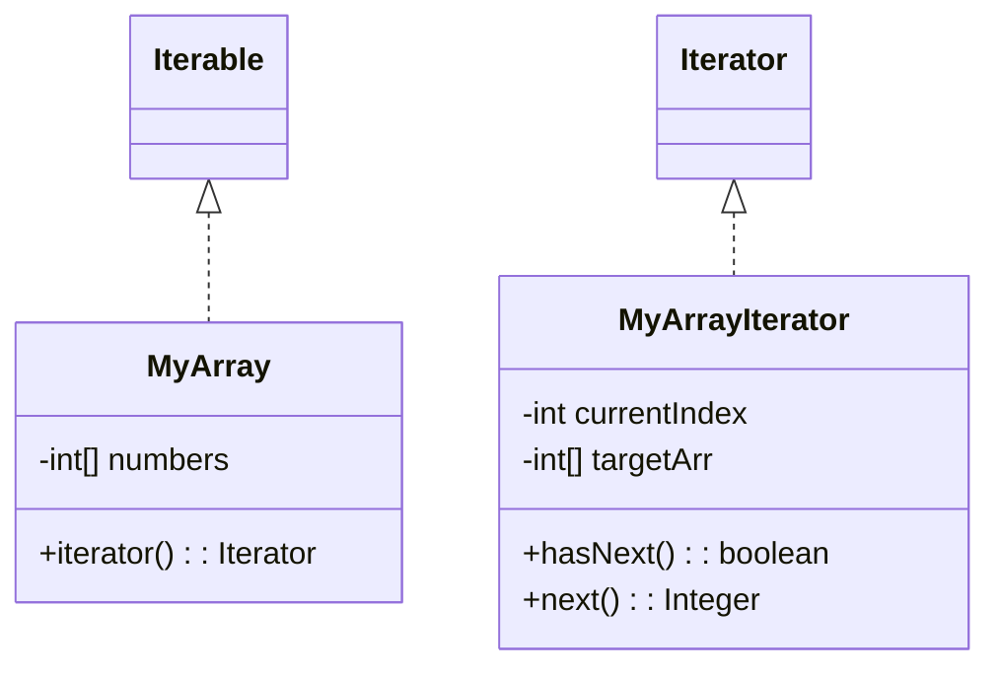
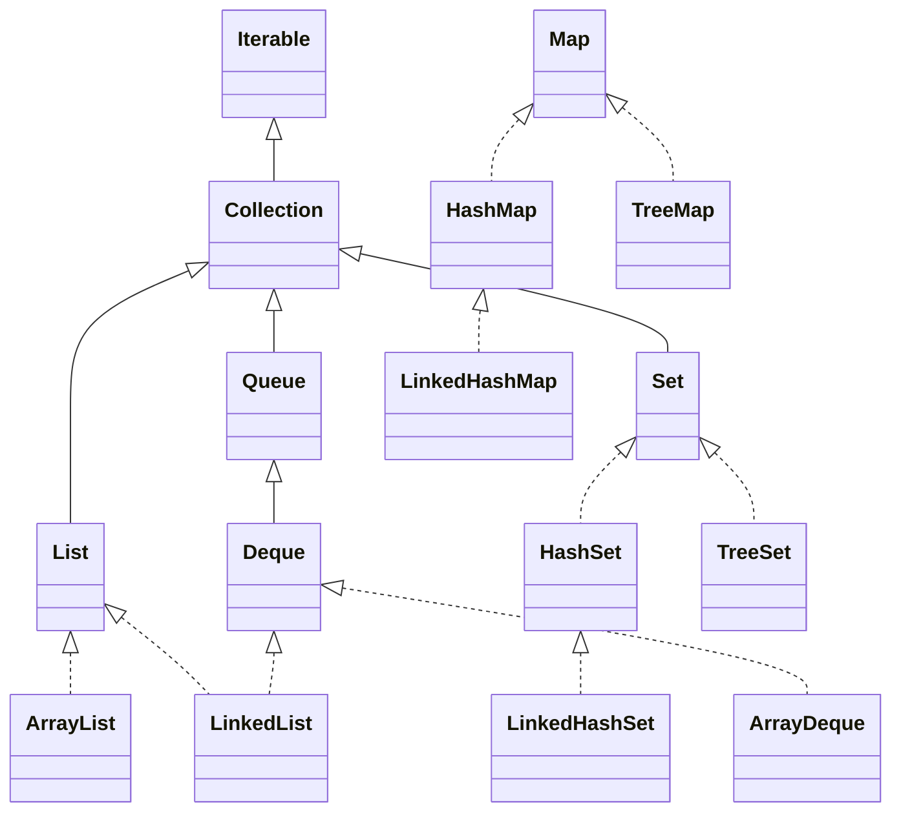

# Iterable / Iterator

## 🧠 Iterable vs Iterator 개념 요약

- Iterable은 반복자를 반환하는 인터페이스
- Iterator는 반복자의 동작을 정의하는 인터페이스

| 인터페이스 | 의미            | 주요 기능 설명                     | 핵심 메서드                  |
|------------|------------------|------------------------------------|------------------------------|
| `Iterable` | 반복 가능한 객체 | 반복자를 반환하여 순회를 시작함     | `iterator()`                 |
| `Iterator` | 반복자           | 실제 순회 동작 수행                | `hasNext()`, `next()`        |

## ✅ 요약 포인트
- Iterable은 반복 가능한 객체를 의미하며, for-each 문에서 사용 가능
- Iterator는 반복자의 동작을 정의하며, hasNext()로 다음 요소 확인, next()로 요소 반환
- Iterable을 구현하면 Iterator를 통해 일관된 방식으로 순회 가능


## 🔁 순회 방식 통일의 필요성
- 배열 리스트: index 기반 순회
- 연결 리스트: node.next 기반 순회
- 다양한 자료 구조마다 순회 방식이 다름 → 개발자가 구조를 몰라도 순회할 수 있게 Iterable과 Iterator 제공

## 🧪 직접 구현 예제 흐름
### 1. MyArrayIterator – 반복자 구현
```java
public class MyArrayIterator implements Iterator<Integer> {
    private int currentIndex = -1;
    private int[] targetArr;

    public MyArrayIterator(int[] targetArr) {
        this.targetArr = targetArr;
    }

    public boolean hasNext() {
        return currentIndex < targetArr.length - 1;
    }

    public Integer next() {
        return targetArr[++currentIndex];
    }
}
```

- `hasNext()` → 다음 요소 존재 여부 확인
- `next()` → 다음 요소 반환 + 내부 인덱스 이동

### 2. MyArray – 순회 대상 자료 구조
```java
public class MyArray implements Iterable<Integer> {
    private int[] numbers;

    public MyArray(int[] numbers) {
        this.numbers = numbers;
    }

    public Iterator<Integer> iterator() {
        return new MyArrayIterator(numbers);
    }
}
```

- Iterable 구현 → iterator() 메서드로 반복자 반환
- 내부 배열을 MyArrayIterator에 전달

### 3. MyArrayMain – 순회 실행
```java
MyArray myArray = new MyArray(new int[]{1, 2, 3, 4});
Iterator<Integer> iterator = myArray.iterator();

while (iterator.hasNext()) {
    Integer value = iterator.next();
    System.out.println("value = " + value);
}
```

### 실행 결과
```
value = 1
value = 2
value = 3
value = 4
```

## 🧬 클래스 구조도



## 🧠 작동 흐름 요약
- MyArray는 Iterable을 구현 → iterator() 호출 시 MyArrayIterator 반환
- MyArrayIterator는 내부 배열을 참조하며 hasNext()와 next()로 순회
- currentIndex는 -1부터 시작 → next() 호출 시 0부터 시작해 순차적으로 증가

## ✅ 실무 팁
- Iterable을 구현하면 for-each 문에서도 사용할 수 있음
- 사용자 정의 자료 구조에 순회 기능을 추가할 때 매우 유용
- Iterator는 상태를 가지므로 반복 중간에 제어 가능

---


# 향상된 for 문

## 🧠 핵심 개념 요약

| 개념        | 설명                                   | 주요 메서드 / 문법                     |
|-------------|----------------------------------------|----------------------------------------|
| `Iterable`  | 반복 가능한 객체                        | `iterator()` → `Iterator` 반환         |
| `Iterator`  | 반복자, 실제 순회 동작 수행             | `hasNext()`, `next()`                  |
| 향상된 for문| `Iterable` 구현 객체에 대한 순회 문법   | `for (T item : iterable)`              |


## 🔁 순회 방식의 통일
- 다양한 자료 구조(배열, 연결 리스트, 셋 등)는 내부 구조가 달라 순회 방식도 다름
- Iterable과 Iterator를 구현하면 일관된 방식으로 순회 가능
- 개발자는 자료 구조의 내부를 몰라도 hasNext() / next() 또는 for-each로 순회 가능

## 🧪 직접 구현 예제 흐름
### 1. MyArrayIterator – 반복자 구현
```java
public class MyArrayIterator implements Iterator<Integer> {
    private int currentIndex = -1;
    private int[] targetArr;

    public MyArrayIterator(int[] targetArr) {
        this.targetArr = targetArr;
    }

    public boolean hasNext() {
        return currentIndex < targetArr.length - 1;
    }

    public Integer next() {
        return targetArr[++currentIndex];
    }
}
```


### 2. MyArray – 순회 대상 자료 구조
```java
public class MyArray implements Iterable<Integer> {
    private int[] numbers;

    public MyArray(int[] numbers) {
        this.numbers = numbers;
    }

    public Iterator<Integer> iterator() {
        return new MyArrayIterator(numbers);
    }
}
```


### 3. MyArrayMain – 순회 실행
```java
MyArray myArray = new MyArray(new int[]{1, 2, 3, 4});

// 일반 Iterator 사용
Iterator<Integer> iterator = myArray.iterator();
while (iterator.hasNext()) {
    System.out.println("value = " + iterator.next());
}

// 향상된 for문 사용
for (int value : myArray) {
    System.out.println("value = " + value);
}
```

- 두 방식은 컴파일 시점에 동일한 코드로 변환됨


## 📦 자바 컬렉션에서의 활용
- Collection 인터페이스는 Iterable을 상속 → 모든 컬렉션(List, Set, Queue)은 순회 가능
- Map은 직접 Iterable을 구현하지 않지만, keySet(), values(), entrySet()을 통해 순회 가능
```java
Map<String, Integer> map = new HashMap<>();
for (String key : map.keySet()) { ... }
for (Integer value : map.values()) { ... }
for (Map.Entry<String, Integer> entry : map.entrySet()) { ... }
```

## 🧬 클래스 구조도 (요약)


## ✅ 실무 팁
- Iterable을 구현하면 for-each 문 사용 가능 → 코드 간결성 향상
- Iterator는 상태를 가지므로 반복 중간에 제어 가능
- printAll(Iterator) / foreach(Iterable)처럼 다형성을 활용하면 다양한 자료 구조에 대응 가능
- Iterator 디자인 패턴은 내부 구조를 숨기고 순회 기능을 제공 → 캡슐화와 재사용성 향상


---
# Comparable / Comparator

## 🧠 정렬 핵심 개념 요약

| 항목             | Comparable<T>                   | Comparator<T>                        |
|------------------|----------------------------------|--------------------------------------|
| 구현 위치        | 객체 내부                        | 외부에서 별도로 구현                 |
| 인터페이스       | `Comparable<T>`                 | `Comparator<T>`                     |
| 비교 메서드      | `compareTo(T o)`                | `compare(T o1, T o2)`               |
| 정렬 방식        | 기본 정렬 (자연 순서)            | 커스텀 정렬                          |
| 우선 순위        | `Comparator`가 있으면 우선 사용  | `Comparable`은 기본 정렬로 사용됨    |
| 정렬 호출 방식   | `Arrays.sort(array)`            | `Arrays.sort(array, comparator)`    |

## ✅ 요약 포인트
- Comparable은 객체가 스스로 정렬 기준을 정의할 때 사용
- Comparator는 외부에서 다양한 기준으로 정렬할 때 사용
- Comparator가 전달되면 Comparable은 무시됨
- 배열뿐 아니라 List.sort()에서도 동일하게 사용 가능


## 🔢 기본 정렬: 배열 + Comparable
```java
Integer[] array = {3, 2, 1};
Arrays.sort(array); // 오름차순 정렬
System.out.println(Arrays.toString(array)); // [1, 2, 3]
```


## 🔁 커스텀 정렬: 배열 + Comparator
```java
Arrays.sort(array, new Comparator<Integer>() {
    public int compare(Integer o1, Integer o2) {
        return o2 - o1; // 내림차순
    }
});
System.out.println(Arrays.toString(array)); // [3, 2, 1]
```


## 👤 사용자 정의 객체 정렬: Comparable
### 1. 클래스 정의
```java
public class MyUser implements Comparable<MyUser> {
    private String id;
    private int age;

    public MyUser(String id, int age) {
        this.id = id;
        this.age = age;
    }

    public String getId() { return id; }
    public int getAge() { return age; }

    @Override
    public int compareTo(MyUser o) {
        return Integer.compare(this.age, o.age); // 나이 오름차순
    }

    @Override
    public String toString() {
        return "MyUser{id='" + id + "', age=" + age + "}";
    }
}
```

### 2. 정렬 예제
```java
MyUser[] users = {
    new MyUser("a", 30),
    new MyUser("b", 20),
    new MyUser("c", 10)
};
Arrays.sort(users); // 나이 기준 오름차순
System.out.println(Arrays.toString(users));
```


## 🧭 사용자 정의 객체 정렬: Comparator
### 1. 아이디 기준 정렬
```java
public class IdComparator implements Comparator<MyUser> {
    public int compare(MyUser o1, MyUser o2) {
        return o1.getId().compareTo(o2.getId()); // 아이디 오름차순
    }
}
```

### 2. 정렬 예제
```java
Arrays.sort(users, new IdComparator()); // 아이디 기준 정렬
Arrays.sort(users, new IdComparator().reversed()); // 아이디 내림차순
```


## 📋 리스트 정렬: List + Comparable / Comparator
```java
List<MyUser> list = new ArrayList<>();
list.add(new MyUser("a", 30));
list.add(new MyUser("b", 20));
list.add(new MyUser("c", 10));

list.sort(null); // Comparable 기준 정렬
list.sort(new IdComparator()); // Comparator 기준 정렬
```


## ⚠️ 예외 주의
```java
Arrays.sort(customObjects); // Comparable 미구현 시
// java.lang.ClassCastException 발생
```


## ✅ 실무 팁
- Comparable은 객체가 기본적으로 정렬 기준을 가질 때 사용
- Comparator는 다양한 기준으로 정렬할 때 유용 (예: 이름, 날짜, 점수 등)
- list.sort()는 자바 8 이상에서 사용 가능하며 Collections.sort()보다 더 직관적
- Comparator.comparing()와 thenComparing()을 활용하면 다중 기준 정렬도 가능

## 🧪 추가 샘플: 다중 기준 정렬
```java
list.sort(Comparator.comparing(MyUser::getAge).thenComparing(MyUser::getId));
```

나이 오름차순 → 같은 나이일 경우 아이디 오름차순

----

# Tree Comparable / Comparator

## 🌳 Tree 구조와 정렬 요약
### 🔁 기본 개념
- TreeSet, TreeMap은 이진 탐색 트리 기반의 자료 구조
- 데이터를 저장할 때 자동으로 정렬됨
- 정렬 기준이 없으면 비교할 수 없기 때문에 반드시 정렬 기준 제공 필요
- Comparable 구현
- 또는 Comparator 전달

## 🧠 정렬 기준 설정 방식

| 생성 방식                    | 정렬 기준 인터페이스 | 설명                                      |
|-----------------------------|-----------------------|-------------------------------------------|
| `new TreeSet<>()`           | `Comparable`          | 객체가 직접 정렬 기준을 구현해야 함       |
| `new TreeSet<>(Comparator)` | `Comparator`          | 외부에서 정렬 기준을 전달함               |

## ✅ 요약 포인트
- TreeSet 또는 TreeMap은 데이터를 자동으로 정렬하면서 저장함
- 정렬 기준이 없으면 비교 불가 → 반드시 Comparable 또는 Comparator 필요
- Comparator가 전달되면 Comparable은 무시됨
- 정렬 기준만 제공하면 자바가 내부적으로 이진 탐색 트리 구조를 통해 정렬된 상태로 유지


## ⚠️ 예외 주의
- Comparable도 없고 Comparator도 없으면 ClassCastException 발생
```
java.lang.ClassCastException: MyUser cannot be cast to Comparable
```


## 🧪 예제 코드 요약
### 1. 기본 정렬 (Comparable 사용)
```java
TreeSet<MyUser> treeSet1 = new TreeSet<>();
treeSet1.add(new MyUser("a", 30));
treeSet1.add(new MyUser("b", 20));
treeSet1.add(new MyUser("c", 10));
System.out.println(treeSet1);
```

MyUser 클래스가 Comparable을 구현해야 함
정렬 기준: 나이 오름차순


### 2. 커스텀 정렬 (Comparator 사용)
```java
TreeSet<MyUser> treeSet2 = new TreeSet<>(new IdComparator());
treeSet2.add(new MyUser("a", 30));
treeSet2.add(new MyUser("b", 20));
treeSet2.add(new MyUser("c", 10));
System.out.println(treeSet2);
```

- IdComparator는 아이디 기준으로 정렬
- Comparable 구현 여부와 관계없이 Comparator가 우선 적용됨


## 📦 클래스 구조 예시
### MyUser 클래스 (Comparable 구현)
```java
public class MyUser implements Comparable<MyUser> {
    private String id;
    private int age;

    public int compareTo(MyUser o) {
        return Integer.compare(this.age, o.age); // 나이 기준
    }

    public String toString() {
        return "MyUser{id='" + id + "', age=" + age + "}";
    }
}
```

### IdComparator 클래스
```java
public class IdComparator implements Comparator<MyUser> {
    public int compare(MyUser o1, MyUser o2) {
        return o1.getId().compareTo(o2.getId()); // 아이디 기준
    }
}
```


## ✅ 실무 팁
- TreeSet, TreeMap은 자동 정렬이 필요한 경우 유용
- Comparable은 객체의 기본 정렬 기준을 정의할 때 사용
- Comparator는 다양한 정렬 기준을 외부에서 설정할 때 사용
- Comparator를 전달하면 Comparable은 무시됨
- 정렬 기준만 제공하면 자바가 내부적으로 최적화된 정렬 알고리즘을 자동 적용

---
# Collection Utility

## 🧠 자바 컬렉션 유틸리티 기능 요약  
### 📦 정렬 관련 메서드 (Collections 클래스)
| 메서드       | 설명                                      |
|--------------|-------------------------------------------|
| `max()`      | 컬렉션에서 가장 큰 요소 반환               |
| `min()`      | 컬렉션에서 가장 작은 요소 반환             |
| `shuffle()`  | 컬렉션의 요소들을 무작위로 섞음            |
| `sort()`     | 컬렉션을 오름차순으로 정렬                 |
| `reverse()`  | 컬렉션의 요소 순서를 반대로 뒤집음         |


### 샘플 코드
```java
List<Integer> list = Arrays.asList(1, 2, 3, 4, 5);
Collections.shuffle(list);
Collections.sort(list);
Collections.reverse(list);
```


## 🧊 불변 컬렉션 생성 (List.of(), Set.of(), Map.of())

| 메서드         | 설명                                      |
|----------------|-------------------------------------------|
| `List.of(...)` | 불변 리스트 생성. 요소 추가/삭제 불가     |
| `Set.of(...)`  | 불변 집합 생성. 중복 요소 불가             |
| `Map.of(...)`  | 불변 맵 생성. 키 중복 불가                 |

### 특징
- 요소 추가/삭제 불가 → UnsupportedOperationException 발생
- 자바 9 이상에서 사용 가능
### 샘플 코드
```java
List<Integer> list = List.of(1, 2, 3);
Set<String> set = Set.of("A", "B");
Map<Integer, String> map = Map.of(1, "one", 2, "two");
```


## 🔄 불변 ↔ 가변 컬렉션 전환

| 전환 방향             | 사용 방법                                      |
|------------------------|------------------------------------------------|
| 불변 → 가변            | `new ArrayList<>(불변리스트)`                 |
| 가변 → 불변            | `Collections.unmodifiableList(가변리스트)`    |

## ✅ 요약 포인트
- 불변 → 가변: List.of()로 만든 불변 리스트를 수정하려면 new ArrayList<>(...)로 복사
- 가변 → 불변: 수정이 불가능한 안전한 리스트로 만들고 싶다면 Collections.unmodifiableList(...) 사용
- Collections.unmodifiableXxx()는 List, Set, Map 모두 지원

### 샘플 코드
```java
List<Integer> immutable = List.of(1, 2, 3);
List<Integer> mutable = new ArrayList<>(immutable);
mutable.add(4);

List<Integer> locked = Collections.unmodifiableList(mutable);
// locked.add(5); → 예외 발생
```

## 🧪 빈 컬렉션 생성

| 컬렉션 종류     | 생성 방법                                | 특징                          |
|----------------|-------------------------------------------|-------------------------------|
| 가변 리스트     | `new ArrayList<>()`, `new LinkedList<>()`| 크기 및 요소 변경 가능        |
| 불변 리스트     | `Collections.emptyList()`                | 자바 5 이상, 요소 변경 불가   |
| 불변 리스트     | `List.of()`                              | 자바 9 이상, 요소 변경 불가   |

## ✅ 요약 포인트
- 가변 리스트는 직접 구현체를 생성 → 자유롭게 추가/삭제 가능
- 불변 리스트는 변경 불가 → add(), remove() 호출 시 예외 발생
- List.of()는 자바 9 이상에서 사용 가능하며, 간결하고 일관된 문법 제공
- Collections.emptyList()는 자바 5부터 제공되는 안정적인 방식

### 샘플 코드
```java
List<Integer> mutable1 = new ArrayList<>();
List<Integer> mutable2 = new LinkedList<>();

List<Integer> immutable1 = Collections.emptyList();
List<Integer> immutable2 = List.of();
```


## 🔁 Arrays.asList() vs List.of()

| 항목               | `Arrays.asList()`                         | `List.of()`                              |
|--------------------|--------------------------------------------|------------------------------------------|
| 자바 버전          | 자바 1.2 이상                              | 자바 9 이상                              |
| 리스트 크기 변경   | ❌ (불가)                                  | ❌ (불가)                                 |
| 요소 변경          | ✅ `set()` 가능                            | ❌ `set()` 불가                           |
| 요소 추가/삭제     | ❌ `add()`, `remove()` 불가                | ❌ `add()`, `remove()`, `set()` 모두 불가 |
| 예외 발생 메서드   | `add()`, `remove()`                        | `add()`, `remove()`, `set()`             |
| 추천 여부          | 하위 호환 필요 시 사용                    | 최신 자바에서는 `List.of()` 권장         |

## ✅ 요약 포인트
- Arrays.asList()는 고정 크기 리스트로 요소 변경은 가능하지만 크기 변경은 불가
- List.of()는 완전한 불변 리스트로 요소 변경도 불가
- 최신 자바에서는 List.of()를 사용하는 것이 더 안전하고 일관성 있음
- 두 방식 모두 UnsupportedOperationException 예외를 발생시킬 수 있으므로 주의 필요


## 🔐 멀티스레드 동기화

| 기능                          | 설명                                      |
|-------------------------------|-------------------------------------------|
| `Collections.synchronizedList()` | 리스트를 동기화된 버전으로 감싸줌         |
| 클래스 이름                   | `Collections$SynchronizedRandomAccessList`|

## ✅ 요약 포인트
- Collections.synchronizedList()는 기존 리스트를 스레드 안전하게 감싸는 래퍼를 생성
- 동기화 처리가 되어 여러 스레드가 동시에 접근해도 안전
- 내부적으로 synchronized 키워드를 사용해 동기화
- 성능은 일반 리스트보다 느릴 수 있음
- 멀티스레드 환경에서 공유 리스트를 사용할 때 유용

### 샘플 코드
```java
List<Integer> list = new ArrayList<>();
List<Integer> syncList = Collections.synchronizedList(list);
```
- 멀티스레드 환경에서 안전하지만 성능은 일반 리스트보다 느릴 수 있음


## ✅ 실무 활용 팁
- 정렬, 최대/최소값, 랜덤 섞기 등은 Collections 클래스에서 간편하게 처리
- 불변 컬렉션은 안전한 데이터 공유에 유용
- List.of()는 간결하고 일관된 불변 컬렉션 생성 방식
- Arrays.asList()는 요소 변경이 필요한 경우에만 사용
- 멀티스레드 환경에서는 synchronizedList()로 동기화 처리

---

# 🧠 자바 컬렉션 프레임워크 요약
## 📦 개요
- 컬렉션(Collection): 객체의 집합을 저장하고 처리하는 구조
- 프레임워크 구성: 인터페이스, 구현체, 알고리즘
- 핵심 인터페이스: Collection, List, Set, Queue, Map

## 🔧 Collection 인터페이스의 역할

| 항목             | 설명                                      |
|------------------|-------------------------------------------|
| 핵심 메서드       | `add()`, `remove()`, `iterator()` 등      |
| 주요 기능         | 요소 추가, 제거, 순회, 포함 여부 확인 등  |
| 상위 인터페이스   | `Iterable`                               |
| 하위 인터페이스   | `List`, `Set`, `Queue`                   |
| 대표 구현체       | `ArrayList`, `HashSet`, `LinkedList` 등  |

## ✅ 요약 포인트
- Collection은 자바 컬렉션 프레임워크의 루트 인터페이스
- 모든 컬렉션은 Collection을 구현하거나 확장하여 일관된 동작을 제공
- iterator() 메서드를 통해 모든 컬렉션을 순회할 수 있음
- Map은 Collection을 상속하지 않음 → 별도 구조로 관리됨


## 주요 메서드
- add(E e), remove(Object o), size(), isEmpty(), contains(Object o), iterator(), clear()

## 🧩 주요 인터페이스와 구현체

| 인터페이스 | 특징                          | 대표 구현체                                      |
|------------|-------------------------------|--------------------------------------------------|
| `List`     | 순서 O, 중복 허용              | `ArrayList`, `LinkedList`                        |
| `Set`      | 순서 X, 중복 허용 X            | `HashSet`, `LinkedHashSet`, `TreeSet`            |
| `Queue`    | 선입선출, 처리 전 보관         | `ArrayDeque`, `LinkedList`, `PriorityQueue`      |
| `Map`      | 키-값 쌍 저장, 순서/중복 X     | `HashMap`, `LinkedHashMap`, `TreeMap`            |

## ✅ 요약 포인트
- List: 인덱스로 접근 가능, 순서 유지, 중복 허용
- Set: 중복 허용하지 않음, 순서 유지 여부는 구현체에 따라 다름
- Queue: FIFO 구조, Deque는 양방향 큐로 스택처럼도 사용 가능
- Map: 키를 기준으로 값 저장, 키 중복 불가, 순서 및 정렬은 구현체에 따라 다름

## 🧠 선택 가이드

| 상황 또는 목적                          | 추천 컬렉션                          |
|----------------------------------------|--------------------------------------|
| 순서가 중요하고 중복 허용              | `ArrayList`, `LinkedList`           |
| 중복 허용하지 않고 순서 무관           | `HashSet`                           |
| 중복 허용하지 않고 순서 유지           | `LinkedHashSet`                     |
| 중복 허용하지 않고 정렬된 순서 필요     | `TreeSet`                           |
| 키-값 저장, 순서 무관                  | `HashMap`                           |
| 키-값 저장, 입력 순서 유지             | `LinkedHashMap`                     |
| 키-값 저장, 키 기준 정렬 필요          | `TreeMap`                           |
| 큐 또는 스택 구조 필요                 | `ArrayDeque`                        |
| 우선순위 기반 처리 필요                | `PriorityQueue`                     |

## ✅ 요약 포인트
- ArrayList는 대부분의 일반적인 리스트 작업에 적합
- HashSet은 빠른 검색과 중복 제거에 유리
- TreeSet과 TreeMap은 정렬된 결과가 필요할 때 사용
- ArrayDeque는 큐와 스택을 모두 지원하며 성능이 뛰어남
- PriorityQueue는 우선순위 기반 작업에 특화됨


🧬 자바 컬렉션 프레임워크 구조


## 🧠 알고리즘 지원
- Collections 클래스: sort, shuffle, reverse, max, min 등
- Arrays 클래스: 배열 기반 컬렉션 처리
- 알고리즘은 컬렉션 타입과 상관없이 일관된 방식으로 제공됨

---

# 연습 문제

## 🧠 카드 게임 문제 요약
### 🎯 게임 규칙
- 총 52장의 카드: 숫자 1~13 × 문양 4종(♠, ♥, ♦, ♣)
- 두 명의 플레이어가 각자 5장씩 카드를 뽑음
- 카드는 숫자 오름차순 → 같은 숫자는 문양 순서(♠ < ♥ < ♦ < ♣)로 정렬
- 각 플레이어의 카드 합계를 비교해 승자 결정
- 합계가 같으면 무승부

## 🧩 클래스 구성
### 1. Suit (문양 열거형)
```java
public enum Suit {
    SPADE("♠"), HEART("♥"), DIAMOND("♦"), CLUB("♣");
    private String icon;
    Suit(String icon) { this.icon = icon; }
    public String getIcon() { return icon; }
}
```

- Enum 타입으로 문양 정의
- ordinal() 순서에 따라 정렬 기준 제공

### 2. Card (카드 객체)
```java
public class Card implements Comparable<Card> {
    private final int rank;
    private final Suit suit;

    public int compareTo(Card anotherCard) {
        if (this.rank != anotherCard.rank) {
            return Integer.compare(this.rank, anotherCard.rank);
        } else {
            return this.suit.compareTo(anotherCard.suit);
        }
    }

    public int getRank() {
        return rank;
    }

    public String toString() {
        return rank + "(" + suit.getIcon() + ")";
    }
}
```

- 숫자 → 문양 순으로 정렬
- Comparable 구현으로 Collections.sort()에 사용 가능

### 3. Deck (카드 덱)
```java
public class Deck {
    private List<Card> cards = new ArrayList<>();

    public Deck() {
        initCard();
        shuffle();
    }

    private void initCard() {
        for (int i = 1; i <= 13; i++) {
            for (Suit suit : Suit.values()) {
                cards.add(new Card(i, suit));
            }
        }
    }

    private void shuffle() {
        Collections.shuffle(cards);
    }

    public Card drawCard() {
        return cards.remove(0);
    }
}
```

- 52장의 카드 생성 및 섞기
- drawCard()로 카드 한 장씩 꺼내기

### 4. Player (플레이어)
```java
public class Player {
    private String name;
    private List<Card> hand = new ArrayList<>();

    public void drawCard(Deck deck) {
        hand.add(deck.drawCard());
    }

    public int rankSum() {
        return hand.stream().mapToInt(Card::getRank).sum();
    }

    public void showHand() {
        hand.sort(null);
        System.out.println(name + "의 카드: " + hand + ", 합계: " + rankSum());
    }
}
```

- 카드 5장 뽑기
- 손패 정렬 및 합계 계산

### 5. CardGameMain (게임 실행)
```java
public class CardGameMain {
    public static void main(String[] args) {
        Deck deck = new Deck();
        Player player1 = new Player("플레이어1");
        Player player2 = new Player("플레이어2");

        for (int i = 0; i < 5; i++) {
            player1.drawCard(deck);
            player2.drawCard(deck);
        }

        player1.showHand();
        player2.showHand();

        Player winner = getWinner(player1, player2);
        if (winner != null) {
            System.out.println(winner.getName() + " 승리");
        } else {
            System.out.println("무승부");
        }
    }

    private static Player getWinner(Player p1, Player p2) {
        int sum1 = p1.rankSum();
        int sum2 = p2.rankSum();
        return sum1 > sum2 ? p1 : sum1 < sum2 ? p2 : null;
    }
}
```

- 덱 생성 → 카드 섞기 → 플레이어가 카드 뽑기
- 손패 출력 → 합계 비교 → 승자 출력

## ✅ 학습 포인트
- Enum을 활용한 정렬 기준 설정
- Comparable을 통한 사용자 정의 객체 정렬
- Collections.shuffle()과 sort() 활용
- 객체 지향 설계: 역할별 클래스 분리
- List<Card>를 활용한 컬렉션 처리

---
