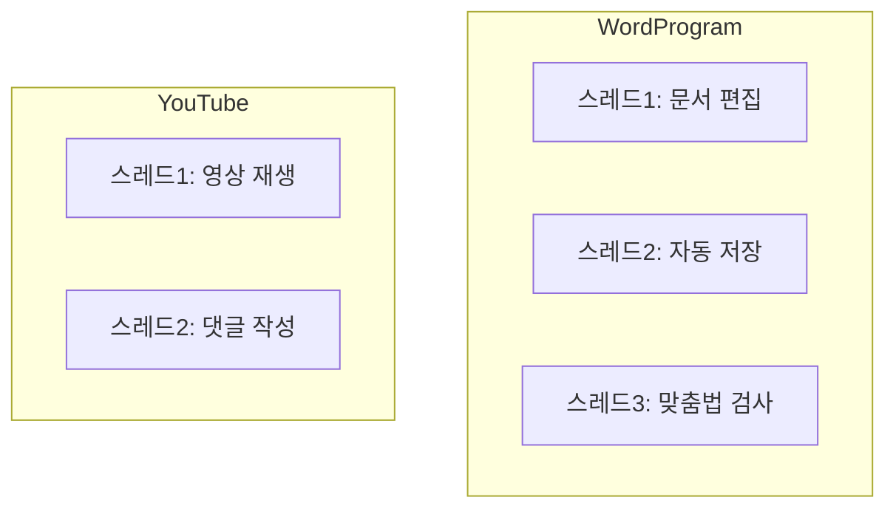

# 🧠 프로세스 / 스레드 핵심 개념 요약

## ✅ 프로세스란?
- 실행 중인 프로그램의 인스턴스
- 운영체제가 관리하는 독립된 작업 단위
- 각 프로세스는 자신만의 메모리 공간을 가짐
- 하나의 프로세스가 충돌해도 다른 프로세스에 영향 없음

## ✅ 프로세스의 메모리 구성

| 메모리 영역     | 설명                                      | 스레드와의 관계               |
|----------------|-------------------------------------------|-------------------------------|
| 코드 섹션      | 실행할 프로그램의 명령어(기계어)가 저장됨 | 모든 스레드가 공유            |
| 데이터 섹션    | 전역 변수, 정적 변수 등이 저장됨          | 모든 스레드가 공유            |
| 힙(Heap)       | 동적으로 할당되는 메모리 공간             | 모든 스레드가 공유            |
| 스택(Stack)    | 함수 호출 시 생성되는 지역 변수, 반환 주소 | 각 스레드가 개별적으로 보유   |
| 기타           | 운영체제가 관리하는 추가 정보 등          | 상황에 따라 공유 또는 분리됨  |

## 🧠 핵심 요약
- 공유 영역: 코드, 데이터, 힙 → 모든 스레드가 함께 사용
- 개별 영역: 스택 → 각 스레드가 자신만의 스택을 가짐
- 스레드가 실행 흐름이라면, 프로세스는 그 흐름이 움직일 수 있는 자원과 환경을 제공하는 컨테이너 역할

## ✅ 스레드란?
- 프로세스 내에서 코드를 실행하는 흐름
- 하나의 프로세스에는 최소 하나의 스레드가 존재
- 여러 스레드가 있을 경우 멀티스레드
- 스레드는 코드, 힙, 데이터 섹션을 공유, 스택은 개별 보유

## 🧩 프로세스와 스레드 구조
```mermaid
graph TD
    OS[운영체제]

    subgraph ProcessA
        A_Code[코드]
        A_Heap[힙(메모리)]
        A_Other[기타]
        A_Thread1[스레드1]
        A_Stack1[스택]
        A_Thread1 --> A_Stack1
    end

    subgraph ProcessB
        B_Code[코드]
        B_Heap[힙(메모리)]
        B_Other[기타]
        B_Thread1[스레드1]
        B_Thread2[스레드2]
        B_Thread3[스레드3]
        B_Stack1[스택]
        B_Stack2[스택]
        B_Stack3[스택]
        B_Thread1 --> B_Stack1
        B_Thread2 --> B_Stack2
        B_Thread3 --> B_Stack3
    end

    OS --> ProcessA
    OS --> ProcessB

```

## 🧩 멀티스레드 활용 예시


## ✅ 운영체제 핵심 개념 정리

| 개념             | 설명                                                                 | 키포인트                         |
|------------------|----------------------------------------------------------------------|----------------------------------|
| 멀티태스킹       | 하나의 CPU 코어가 여러 작업을 빠르게 번갈아 수행                     | 시분할 방식, 소프트웨어 관점     |
| 멀티프로세싱     | 여러 CPU 코어가 물리적으로 동시에 여러 작업을 수행                   | 병렬 처리, 하드웨어 관점         |
| 프로세스         | 실행 중인 프로그램의 인스턴스. 독립된 메모리 공간을 가짐             | 격리된 자원, 안정성              |
| 스레드           | 프로세스 내에서 코드를 실행하는 흐름. 최소 1개 이상 존재              | 실행 단위, 메모리 공유           |
| 단일 스레드      | 하나의 스레드만 존재하는 구조                                         | 순차적 실행                      |
| 멀티 스레드      | 여러 스레드가 동시에 작업 수행                                        | 병렬 작업, 자원 공유             |
| 메모리 구성      | 코드, 데이터, 힙은 공유 / 스택은 스레드마다 개별                     | 공유 vs 개별 메모리 구분         |

---
