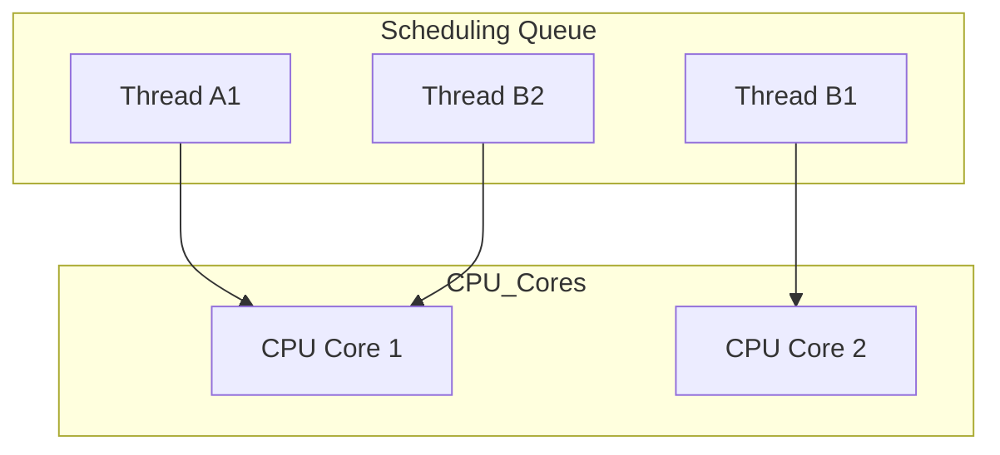

# 스케줄링
단일 코어와 멀티 코어 스케줄링, 그리고 프로세스와 스레드 개념을 중심으로 핵심 내용을 정리한 요약:

## 🧠 운영체제의 스케줄링 개념 정리
### ✅ 1. 단일 코어 스케줄링
- 운영체제는 스케줄링 큐를 통해 실행할 스레드를 관리함
- 예: 스레드 A1, B1, B2가 큐에 대기
- 운영체제는 A1을 꺼내 CPU에서 실행 → 연산 수행
- 일정 시간이 지나면 A1을 다시 큐에 넣고 B1을 실행
- 이런 방식으로 하나의 CPU 코어가 스레드를 번갈아 실행함

### ✅ 2. 멀티 코어 스케줄링
- CPU에 2개 이상의 코어가 있을 경우, 여러 스레드를 동시에 실행 가능
- 예: A1, B1, B2가 큐에 대기 → A1과 B1을 병렬로 실행
- A1이 멈추면 다시 큐에 넣고, B2를 다른 코어에서 실행
- 각 코어는 독립적으로 스레드를 실행하며, 운영체제가 전체 흐름을 조율함

### ✅ 3. 스케줄링의 목적과 방식
- 스케줄링(Scheduling)은 CPU 자원을 효율적으로 분배하는 과정
- 단순히 시간만 나누는 것이 아니라, 우선순위, 최적화 기법 등을 활용
- 목표는 CPU를 최대한 활용하면서 작업이 공정하고 효율적으로 수행되도록 하는 것

## 🧩 프로세스와 스레드 개념
### ✅ 프로세스 (Process)
- 실행 중인 프로그램의 인스턴스
- 독립적인 메모리 공간과 자원을 가짐
- 운영체제에서 컨테이너 역할을 하며, 직접 실행되지는 않음
### ✅ 스레드 (Thread)
- 프로세스 내에서 실행되는 작업 단위
- 여러 스레드는 코드, 데이터, 자원을 공유함
- 실제로 CPU에서 실행되는 것은 스레드임

## 🧵 멀티태스킹과 스레드 스케줄링
- 멀티태스킹: 여러 작업을 동시에 수행하는 것
- 운영체제는 스케줄링을 통해 CPU 시간을 **작업 단위(스레드)** 에 나눠줌
- 하나의 프로세스에 하나의 스레드만 있을 수도 있고, 여러 스레드가 있을 수도 있음

##  Core Scheduling Visualization

## 📌 핵심 요약

| 개념               | 설명                                                                 |
|--------------------|----------------------------------------------------------------------|
| 스케줄링 큐        | 운영체제가 실행 대기 중인 스레드를 관리하는 큐                         |
| 단일 코어 스케줄링 | 하나의 CPU 코어가 스레드를 번갈아 실행하며, 동시에 하나만 수행 가능       |
| 멀티 코어 스케줄링 | 여러 CPU 코어가 병렬로 스레드를 실행하여 실제 동시 수행 가능             |
| 프로세스           | 실행 중인 프로그램의 인스턴스로, 독립된 메모리 공간과 자원을 가짐        |
| 스레드             | 프로세스 내에서 실행되는 단위로, 실제 CPU에서 실행되는 주체              |
| 멀티태스킹         | 여러 작업을 동시에 수행하는 방식으로, 스케줄링을 통해 CPU 시간을 분배     |
| 스케줄링 목적      | CPU 자원을 효율적으로 분배하고, 작업이 공정하고 최적화되도록 관리        |

---

