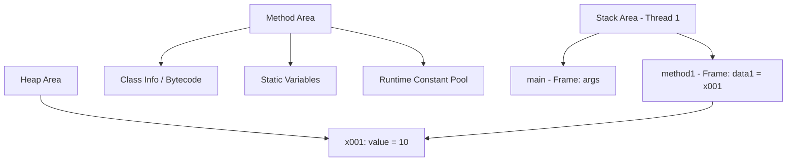

# 🧠 자바 메모리 구조
## ✅ 1. 메서드 영역 (Method Area)
- 프로그램 전체에서 공유되는 영역
- 클래스 정보: 바이트코드, 필드, 메서드, 생성자 등
- static 변수 저장
- 런타임 상수 풀: 리터럴 상수 저장
## ✅ 2. 스택 영역 (Stack Area)
- 각 스레드마다 하나씩 생성됨
- 메서드 호출 시 스택 프레임이 쌓이고, 종료 시 제거됨
- 지역 변수, 연산 결과, 호출 정보 포함
## ✅ 3. 힙 영역 (Heap Area)
- 객체와 배열이 생성되는 공간
- GC(Garbage Collection) 대상
- 참조되지 않는 객체는 제거됨

## ✅ Java Memory Structure

---

