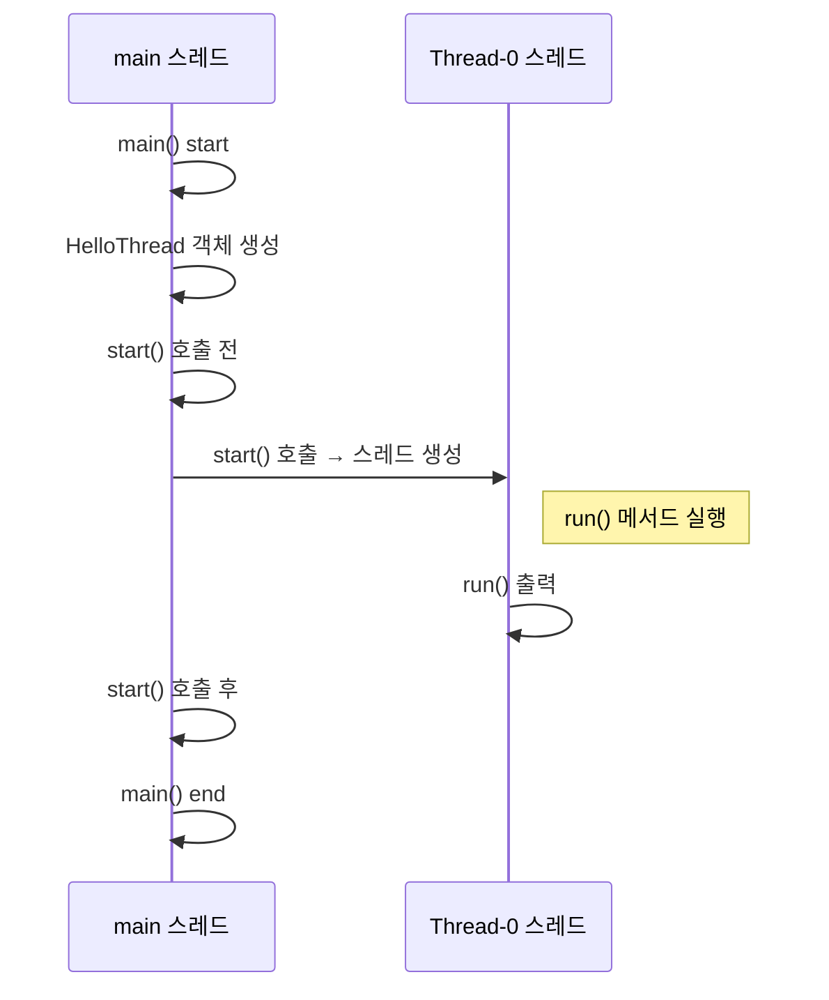

# 🧠 자바 스레드 생성 및 실행 흐름

## 자바 코드
```java
public class HelloThread extends Thread {
    @Override
    public void run() {
        System.out.println(Thread.currentThread().getName() + ": run()");
    }
}
```
```java
package thread.start;
public class HelloThreadMain {
    public static void main(String[] args) {
        System.out.println(Thread.currentThread().getName() + ": main() start");

        HelloThread helloThread = new HelloThread();
        System.out.println(Thread.currentThread().getName() + ": start() 호출 전");

        helloThread.start();

        System.out.println(Thread.currentThread().getName() + ": start() 호출 후");
        System.out.println(Thread.currentThread().getName() + ": main() end");
    }
}
```

## ✅ 핵심 흐름
- main 스레드가 시작됨 → main() 메서드 실행
- HelloThread 객체 생성
- start() 호출 → 새로운 스레드(Thread-0) 시작
- Thread-0 스레드가 run() 메서드 실행
- main 스레드는 계속 진행 → main() 종료
- main과 Thread-0은 동시에 실행되며, 실행 순서는 보장되지 않음

## ✅Thread Creation & Execution



## 🔍 실행 결과 예시 (순서가 달라질 수 있음)
### 예시 1: main이 먼저 종료
```
main: main() start  
main: start() 호출 전  
main: start() 호출 후  
main: main() end  
Thread-0: run()
```

### 예시 2: Thread-0이 먼저 실행
```
main: main() start  
main: start() 호출 전  
Thread-0: run()  
main: start() 호출 후  
main: main() end
```

### 예시 3: 중간에 Thread-0 실행
```
main: main() start  
main: start() 호출 전  
main: start() 호출 후  
Thread-0: run()  
main: main() end
```

## 📌 핵심 포인트
- start()를 호출해야 별도의 스레드에서 run()이 실행됨
- main 스레드는 단지 실행 지시만 하고, 직접 run()을 호출하지 않음
- 스레드 간 실행 순서와 타이밍은 보장되지 않음
- 멀티스레드는 병렬성과 비결정성이 핵심


## 🧠 start() vs run() 핵심 요약

| 항목                  | start() 호출                          | run() 직접 호출                          |
|-----------------------|----------------------------------------|------------------------------------------|
| 실행 방식             | 새로운 스레드 생성 후 run() 실행       | 현재 스레드(main)에서 run() 실행         |
| 병렬 실행 여부        | 병렬 실행 가능                         | 병렬 실행 불가능                         |
| 스택 구조             | 별도의 스택 공간 생성                  | 기존 스택에 run() 프레임 추가            |
| 멀티스레드 효과       | 진짜 멀티스레드 구현 가능              | 단순한 메서드 호출, 멀티스레드 아님      |
| 실행 결과             | Thread-0: run() 출력 가능              | main: run() 출력                         |
| 사용 목적             | 스레드 시작을 위한 공식적인 방법       | 테스트나 실수로 호출되는 경우가 많음     |

## ✅ run() 직접 호출 흐름
```mermaid
graph TD
    MainThread[main 스레드]
    HelloThread[HelloThread 인스턴스]
    RunFrame[run() 스택 프레임]

    MainThread --> HelloThread: 객체 생성
    HelloThread --> RunFrame: run() 직접 호출
    RunFrame --> MainThread: 실행 완료 후 복귀
```

## ✅ 실행 흐름 요약
- main() 스레드가 시작됨
- HelloThread 객체 생성
- run() 메서드를 직접 호출 → main 스레드에서 실행됨
- run() 스택 프레임이 main 스레드의 스택에 올라감
- 병렬 실행 없이 main 스레드가 모든 작업을 처리함

---
