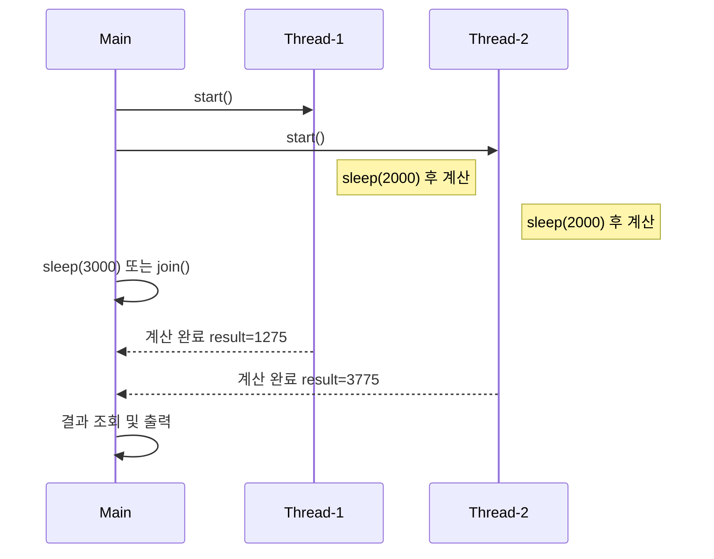
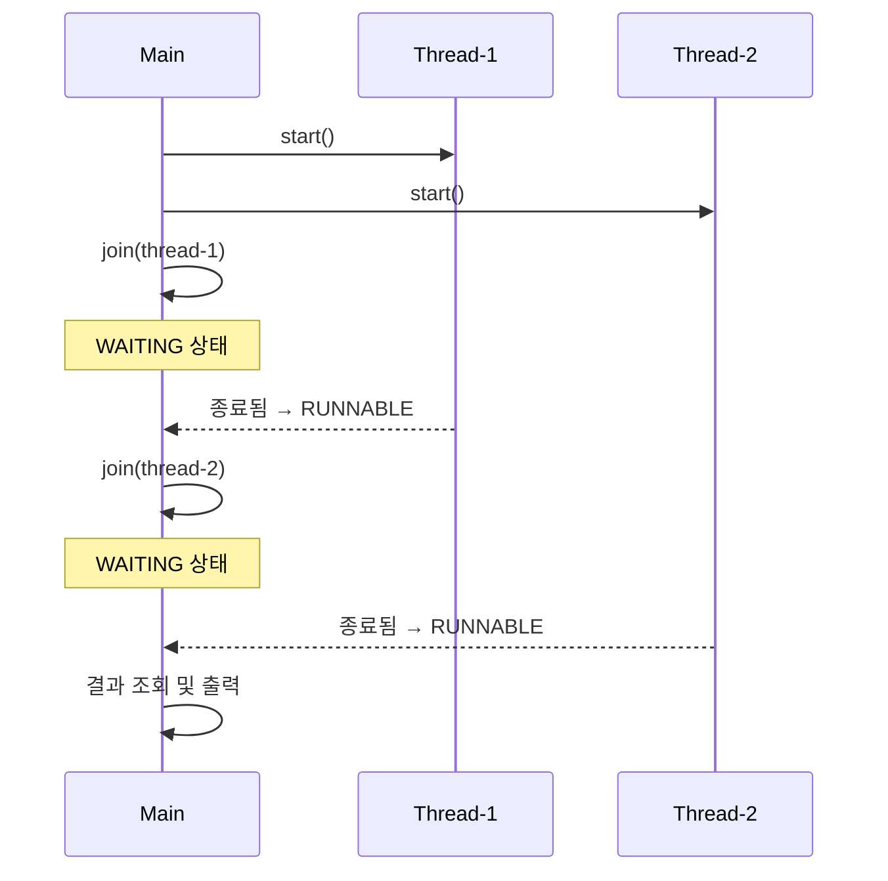
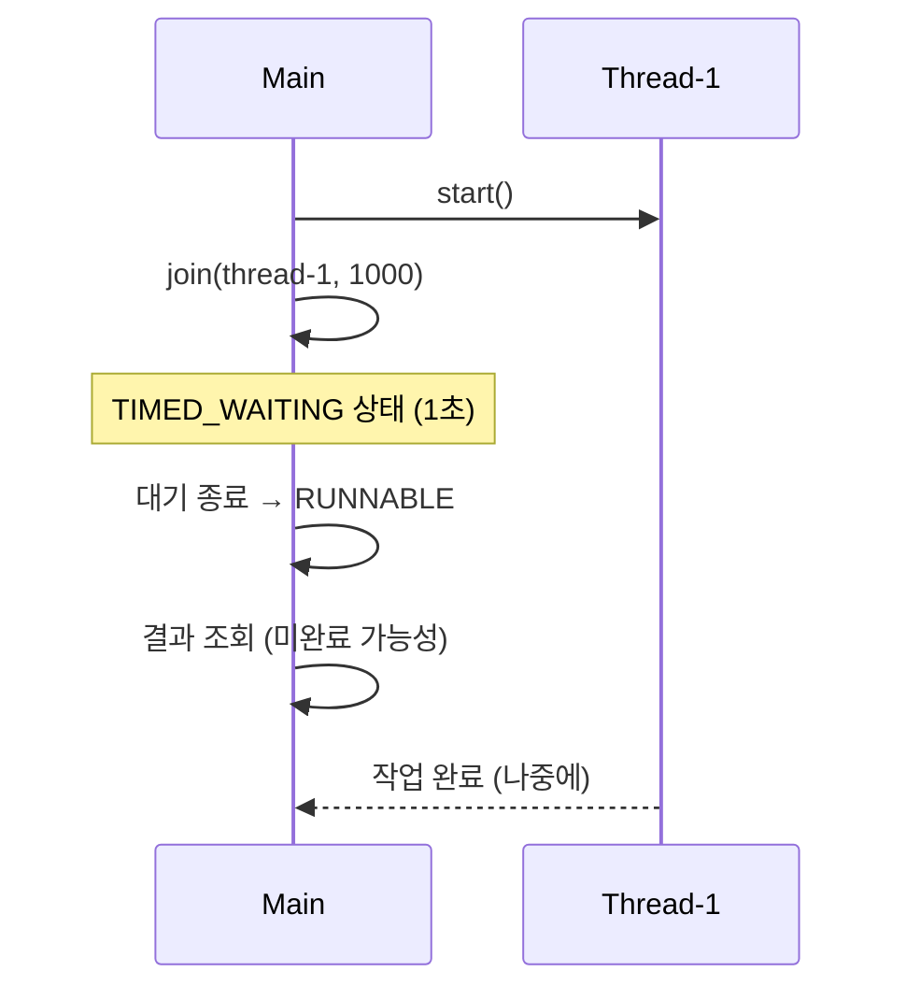

# join 필요성

아래는 join()이 필요한 이유와 그 흐름을 정리한 내용입니다.  
main 스레드가 다른 스레드의 작업이 끝날 때까지 기다려야 하는 상황을 이해하고,  
sleep() 방식과 join() 방식의 차이를 명확히 보여줍니다.

## ✅ 정리: 왜 join()이 필요한가?
### 🔹 문제 상황
- main 스레드는 thread-1, thread-2를 start()만 하고 바로 결과를 조회함
- 두 스레드는 아직 계산을 완료하지 않았기 때문에 result는 0으로 출력됨
- main이 너무 빨리 종료되므로 결과를 제대로 활용할 수 없음

### 🔹 해결 방법
#### 1. sleep() 방식
- main 스레드를 일정 시간 대기시켜서 결과가 준비되도록 유도
- 단점: 정확한 대기 시간 예측이 어려움, 낭비 발생 가능
#### 2. join() 방식
- main 스레드가 thread-1, thread-2의 종료를 정확히 기다림
- 장점: 불필요한 대기 없이 정확하게 동기화 가능
thread1.join();
thread2.join();

## 📊 스레드 실행 흐름 비교

## 📌 핵심 요약: main 스레드의 대기 방식 비교

| 방법       | 설명                                                             |
|------------|------------------------------------------------------------------|
| `main`     | 다른 스레드를 실행만 하고 바로 다음 코드 실행                     |
| `sleep()`  | 일정 시간 대기 후 결과 조회 (정확한 타이밍 맞추기 어려움)         |
| `join()`   | 대상 스레드가 종료될 때까지 정확하게 기다림                      |
| 추천 방식  | `join()` 사용 → 불필요한 대기 없이 정확한 동기화 가능             |

## ✅ join() vs join(ms) 정리

### 🔹 개념 요약

| 메서드       | 스레드 상태       |
|--------------|-------------------|
| `join()`     | `WAITING`         |
| `join(ms)`   | `TIMED_WAITING`   |

## 🔹 동작 흐름 요약

| 메서드       | main 스레드 상태 전이         | 설명                                 |
|--------------|-------------------------------|--------------------------------------|
| `join()`     | `WAITING → RUNNABLE`          | 대상 스레드가 종료될 때까지 무기한 대기 |
| `join(ms)`   | `TIMED_WAITING → RUNNABLE`    | 지정된 시간만큼만 대기 후 다음 코드 실행 |

## 📊 join()과 join(ms) 흐름 비교
### 1. join() 사용 흐름

### 2. join(ms) 사용 흐름

## 📌 핵심 요약: join() vs join(ms)

| 메서드       | main 스레드 상태           |
|--------------|-----------------------------|
| `join()`     | `WAITING`                   |
| `join(ms)`   | `TIMED_WAITING`             |
| 상태 전이     | `WAITING` / `TIMED_WAITING` → `RUNNABLE` |
| 동기화 방식   | `join()` 또는 `join(ms)`로 스레드 종료까지 대기 |

---
