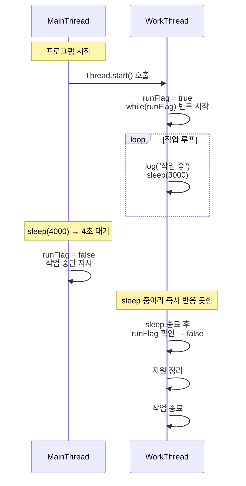

# 인터럽트 1
main 스레드와 work 스레드 간의 실행 타이밍과 runFlag를 통한 작업 중단 흐름을 시퀀스 다이어그램으로 정리.

## 코드
```java
public class ThreadStopMainV1 {
    public static void main(String[] args) {
        MyTask task = new MyTask();
        Thread thread = new Thread(task, "work");
        thread.start();
        sleep(4000);
        log("작업 중단 지시 runFlag=false");
        task.runFlag = false;
    }

    static class MyTask implements Runnable {
        volatile boolean runFlag = true;
        @Override
        public void run() {
            while (runFlag) {
                log("작업 중");
                sleep(3000);
            }
            log("자원 정리");
            log("작업 종료");
        }
    }
}
```

## 🧵  다이어그램



## 🔍 핵심 흐름 요약
- WorkThread는 sleep(3000)으로 3초마다 깨어나 runFlag를 확인
- MainThread는 4초 후 runFlag=false로 중단 지시
- WorkThread가 두 번째 sleep() 중일 때 중단 지시가 들어오므로, 즉시 반응하지 못하고 2초 후 종료
