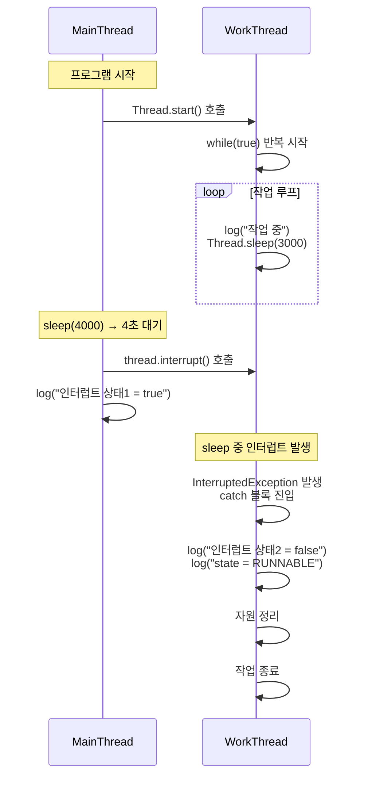

# 인터럽트 2

## 코드
```java
public class ThreadStopMainV2 {
    public static void main(String[] args) {
        MyTask task = new MyTask();
        Thread thread = new Thread(task, "work");
        thread.start();
        sleep(4000);

        log("작업 중단 지시 thread.interrupt()");
        thread.interrupt();
        log("work 스레드 인터럽트 상태1 = " + thread.isInterrupted());
    }

    static class MyTask implements Runnable {
        @Override
        public void run() {
            try {
                while (true) {
                    log("작업 중");
                    Thread.sleep(3000);
                }
            } catch (InterruptedException e) {

                log("work 스레드 인터럽트 상태2 = " +
                Thread.currentThread().isInterrupted());
                log("interrupt message=" + e.getMessage());

                log("state=" + Thread.currentThread().getState());
            }
            log("자원 정리");
            log("작업 종료");
        }
    }
}
```

## 🧵 인터럽트 기반 스레드 종료 흐름



## 🔍 핵심 흐름 요약
- WorkThread는 Thread.sleep(3000) 중이었고, MainThread가 4초 후 interrupt() 호출
- WorkThread는 즉시 InterruptedException을 받아 catch 블록으로 진입
- catch 블록에서 자원 정리 후 종료
- 인터럽트 상태는 예외 발생과 함께 자동으로 false로 초기화됨

## ✅ 인터럽트 방식의 장점

| 항목                     | 설명                                  | 관련 코드 위치        |
|--------------------------|---------------------------------------|------------------------|
| 즉시 반응 가능           | `sleep()` 중에도 바로 깨어날 수 있음  | `Thread.sleep()`       |
| 예외 기반 흐름 제어      | `InterruptedException`으로 흐름 분기  | `catch` 블록           |
| 자원 정리 가능           | 종료 직전에 정리 코드 실행 가능       | `log("자원 정리")`     |
| 상태 복구                | 인터럽트 상태가 자동으로 초기화됨     | `isInterrupted() == false` |
| 명확한 종료 시점         | 예외 발생 즉시 종료 흐름으로 진입     | `log("작업 종료")`     |

- 이 방식은 runFlag 방식보다 훨씬 반응성이 뛰어나고,  
    예외 흐름을 통해 자원 정리까지 명확하게 처리할 수 있음.
