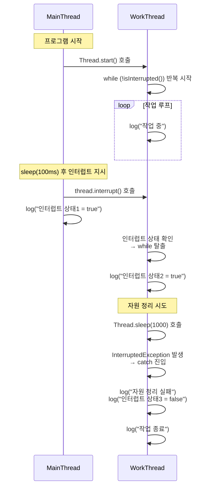

# 인터럽트 3

## 코드
```java
public class ThreadStopMainV2 {
    public static void main(String[] args) {
        MyTask task = new MyTask();
        Thread thread = new Thread(task, "work");
        thread.start();
        sleep(4000);

        log("작업 중단 지시 thread.interrupt()");
        thread.interrupt();
        log("work 스레드 인터럽트 상태1 = " + thread.isInterrupted());
    }
    
    static class MyTask implements Runnable {
        @Override
        public void run() {
            try {
                while (true) {
                    log("작업 중");
                    Thread.sleep(3000);
                }
            } catch (InterruptedException e) {
                log("work 스레드 인터럽트 상태2 = " +
                Thread.currentThread().isInterrupted());
                log("interrupt message=" + e.getMessage());
                log("state=" + Thread.currentThread().getState());
            }
            log("자원 정리");
            log("작업 종료");
        }
    }
}
```

## 🧵인터럽트 상태 직접 확인 + 자원 정리 실패 흐름



## 🔍 핵심 흐름 요약
- work 스레드는 isInterrupted()로 인터럽트 상태를 직접 확인하고 반복문 탈출
- 하지만 인터럽트 상태가 true로 유지된 채 자원 정리 코드(sleep())를 실행
- 그 결과 InterruptedException이 발생하여 자원 정리에 실패
- 예외 발생 후 인터럽트 상태는 자동으로 false로 초기화됨


## ✅ 교훈 및 개선 포인트

| 항목                     | 설명                                                                 | 관련 위치 또는 메서드             |
|--------------------------|----------------------------------------------------------------------|-----------------------------------|
| isInterrupted()          | 현재 스레드의 인터럽트 상태를 확인하지만 상태를 초기화하지 않음       | while 조건문, 반복문 탈출용       |
| sleep()                  | 인터럽트 상태일 경우 예외 발생 → 자원 정리 중 예외로 실패 가능         | 자원 정리 단계에서 Thread.sleep() |
| Thread.interrupted()     | 인터럽트 상태를 확인하고 동시에 상태를 초기화함                        | 자원 정리 전에 호출해 상태 복구   |
| InterruptedException     | 예외 발생 시 인터럽트 상태가 자동으로 false로 초기화됨                 | catch 블록                        |


## 🔍 핵심 요약
- isInterrupted()는 상태를 확인만 하므로, 이후 sleep() 같은 코드에서 예외가 발생할 수 있음
- 자원 정리 전에 Thread.interrupted()를 호출하면 상태를 초기화해서 예외를 방지할 수 있음
- InterruptedException이 발생하면 상태는 자동으로 false로 돌아오므로 catch 블록에서 안전하게 처리 가능


