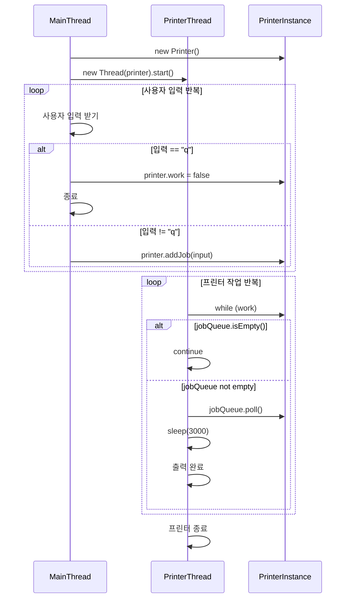

# 인터럽트 실전 예제 1
이 예제는 멀티스레드 환경에서 사용자 입력을 처리하고 프린터 작업을 수행하는 구조를 보여주며,  
`volatile` 과 `ConcurrentLinkedQueue` 를 활용한 기본적인 스레드 협업 구조를 잘 설명하고 있음.  
아래에 다이어그램과 함께 코드 흐름을 단계별로 정리.

## 소스 코드
```java
public class MyPrinterV1 {
    public static void main(String[] args) throws InterruptedException {
        Printer printer = new Printer();
        Thread printerThread = new Thread(printer, "printer");
        printerThread.start();
        Scanner userInput = new Scanner(System.in);
        while (true) {
            log("프린터할 문서를 입력하세요. 종료 (q): ");
            String input = userInput.nextLine();
            if (input.equals("q")) {
                printer.work = false;
                break;
            }
            printer.addJob(input);
        }
    }

    static class Printer implements Runnable {
        volatile boolean work = true;
        Queue<String> jobQueue = new ConcurrentLinkedQueue<>();
        
        @Override
        public void run() {
            
            while (work) {
                if (jobQueue.isEmpty()) {
                    continue;
                }

                String job = jobQueue.poll();
                log("출력 시작: " + job + ", 대기 문서: " + jobQueue);
                sleep(3000); //출력에 걸리는 시간
                log("출력 완료: " + job);
            }

            log("프린터 종료");
        }
        
        public void addJob(String input) {
            jobQueue.offer(input);
        }
    }
}
```

## 🧵 다이어그램: 프린터 예제 V1 흐름



## 🧩 코드 흐름 단계별 설명
### 1️⃣ 사용자 입력 처리 (main 스레드)
```java
while (true) {
    log("프린터할 문서를 입력하세요. 종료 (q): ");
    String input = userInput.nextLine();
    if (input.equals("q")) {
        printer.work = false;
        break;
    }
    printer.addJob(input);
}
```

- 사용자 입력을 받아 jobQueue에 추가
- "q" 입력 시 work = false로 설정하여 프린터 종료 유도

### 2️⃣ 프린터 작업 처리 (printer 스레드)
```java
while (work) {
    if (jobQueue.isEmpty()) {
        continue;
    }
    String job = jobQueue.poll();
    log("출력 시작: " + job + ", 대기 문서: " + jobQueue);
    sleep(3000); // 출력 시간
    log("출력 완료: " + job);
}
log("프린터 종료");
```

- jobQueue가 비어 있으면 continue로 대기
- 작업이 있으면 꺼내서 3초간 출력 처리
- work == false가 되면 반복 종료

## ⚠️ 문제점 요약

| 항목                     | 설명                                                                 | 영향 또는 결과                         |
|--------------------------|----------------------------------------------------------------------|----------------------------------------|
| sleep(3000) 중 work 체크 불가 | `printer` 스레드가 sleep 상태일 때는 `work` 값을 확인할 수 없음        | 종료 지시 후 최대 3초 대기 발생         |
| "q" 입력 후 즉시 반응 불가   | `main` 스레드가 `work = false`로 설정해도 `printer` 스레드는 즉시 반응 못함 | 사용자 경험 저하, 종료 지연             |
| while 조건 체크 지연        | `sleep()`이 끝나야 while 조건을 다시 확인함                            | 반복문 탈출까지 불필요한 시간 소요       |


## 🔍 핵심 문제
- sleep()은 스레드를 TIMED_WAITING 상태로 만들기 때문에, 그 시간 동안은 조건 체크가 불가능
- "q" 입력으로 종료를 지시해도, printer 스레드는 다음 루프까지 기다려야 반응
- 결과적으로 최대 3초의 종료 지연이 발생함

---


