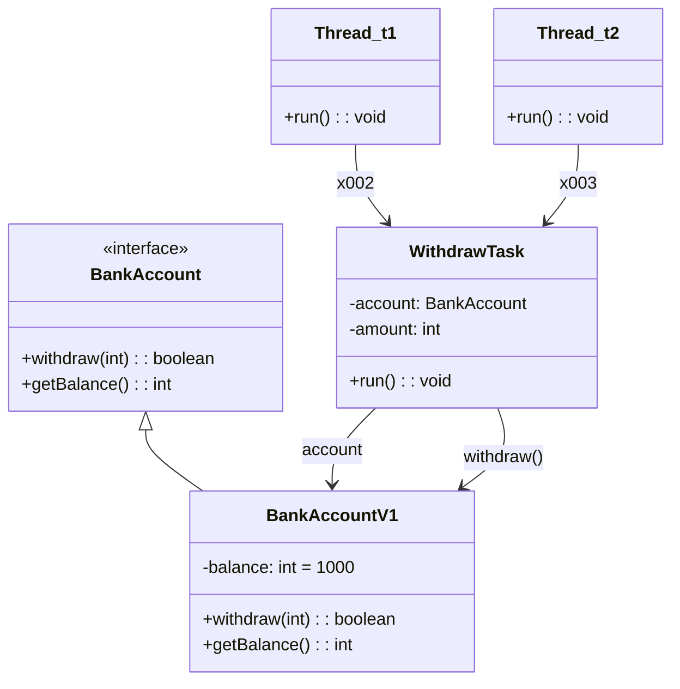

# 동기화 문제
## 🧠 핵심 요약: 동기화 문제의 원인
## 소스 코드
```java
public interface BankAccount {
    boolean withdraw(int amount);
    int getBalance();
    }
```
```java
public class BankAccountV1 implements BankAccount {
    private int balance;
    //volatile private int balance;
    public BankAccountV1(int initialBalance) {
        this.balance = initialBalance;
    }

    @Override
    public boolean withdraw(int amount) {

        log("거래 시작: " + getClass().getSimpleName());
        log("[검증 시작] 출금액: " + amount + ", 잔액: " + balance);
        if (balance < amount) {
            log("[검증 실패] 출금액: " + amount + ", 잔액: " + balance);
            return false;
        }

        log("[검증 완료] 출금액: " + amount + ", 잔액: " + balance);
        sleep(1000); // 출금에 걸리는 시간으로 가정

        balance = balance - amount;

        log("[출금 완료] 출금액: " + amount + ", 변경 잔액: " + balance);
        log("거래 종료");

        return true;
    }

    @Override
    public int getBalance() {
        return balance;
    }
}
```
```java
public class WithdrawTask implements Runnable {
    private BankAccount account;
    private int amount;

    public WithdrawTask(BankAccount account, int amount) {
        this.account = account;
        this.amount = amount;
    }

    @Override
    public void run() {
        account.withdraw(amount);
    }
}
```
```java
public class BankMain {
    public static void main(String[] args) throws InterruptedException {
        BankAccount account = new BankAccountV1(1000);
        Thread t1 = new Thread(new WithdrawTask(account, 800), "t1");
        Thread t2 = new Thread(new WithdrawTask(account, 800), "t2");
        t1.start();
        t2.start();

        sleep(500); // 검증 완료까지 잠시 대기

        log("t1 state: " + t1.getState());
        log("t2 state: " + t2.getState());
        t1.join();
        t2.join();
        log("최종 잔액: " + account.getBalance());
    }
}
```
## 🔁 문제 상황
- 두 개의 스레드 t1, t2가 동시에 같은 BankAccountV1 인스턴스에 대해 withdraw(800)을 호출
- balance = 1000인 상태에서 두 스레드가 거의 동시에 검증을 통과함
- 출금이 완료되면 balance = -600이 되는 비정상적인 결과 발생

### 🔓 문제 원인
- withdraw() 메서드가 동기화되지 않음
- balance 필드는 공유 자원이며, 동시에 접근하면 Race Condition 발생
- volatile 키워드로는 해결되지 않음 → 이는 메모리 가시성만 보장하고 원자성은 보장하지 않음

🧩 다이어그램: 메모리 구조 시각화



## 💥 실행 결과 요약
```
[t1] 거래 시작 → 검증 완료 → 출금 완료 → 잔액: 200
[t2] 거래 시작 → 검증 완료 → 출금 완료 → 잔액: -600
[main] 최종 잔액: -600
```

## ⚠️ 기대 결과와 다른 이유
- t1과 t2가 **검증 단계에서 동일한 잔액(1000)** 을 보고 출금을 진행
- sleep(1000)으로 인해 출금이 지연되면서 두 스레드가 동시에 출금을 완료
- 동기화가 없기 때문에 잔액이 음수가 되는 비정상적인 결과 발생

---

