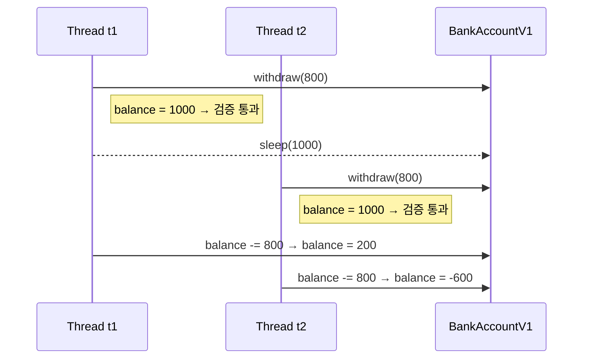
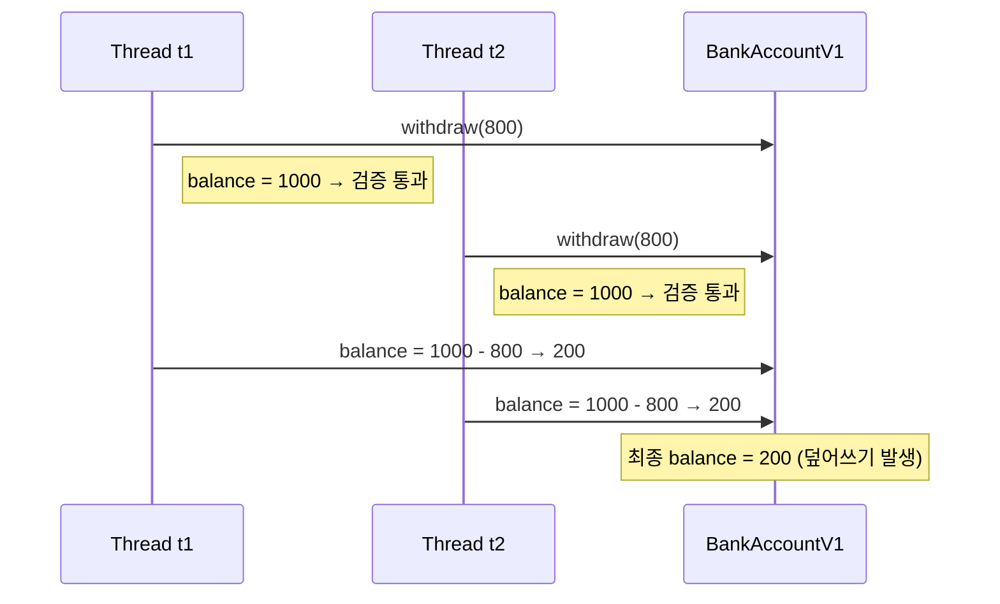

# 동시성 발생 문제 상세 설명
이 문제는 멀티스레드 환경에서 발생하는 동시성 문제의 전형적인 사례입니다.  
아래에 두 가지 시나리오를 소스 기반으로 단계별로 설명하고, 각각의 상황을 다이어그램으로 시각화.

## 🧩 시나리오 1: 잔액 음수 발생
### 🔄 실행 흐름
- t1이 먼저 실행되어 balance = 1000을 확인하고 검증 통과
- t1이 출금 전 sleep(1000)으로 대기
- t2가 실행되어 동일하게 balance = 1000을 확인하고 검증 통과
- t1이 출금하여 balance = 200으로 변경
- t2도 출금하여 balance = -600으로 변경
### 💥 문제 요약
- 두 스레드가 검증 로직을 동시에 통과
- balance가 음수로 떨어짐
- 은행 시스템에서는 절대 허용될 수 없는 상황

### ✅ 관련 코드
```java
if (balance < amount) {
    return false;
}
sleep(1000); // 출금 지연
balance = balance - amount;
```

## 🧩 시나리오 2: 잔액 덮어쓰기 발생
### 🔄 실행 흐름
- t1, t2가 거의 동시에 실행
- 둘 다 balance = 1000을 확인하고 검증 통과
- 둘 다 1000 - 800 = 200 계산
- 둘 다 balance = 200으로 덮어씀

### 💥 문제 요약
- 총 1600원이 출금되었지만, 잔액은 200원
- 800원이 사라진 것처럼 보임
- 이는 **원자성(atomicity)** 이 깨졌기 때문

### 🧠 해결 방법 (추후에 상세하게 설명)
- withdraw() 메서드에 synchronized 키워드 추가
```java
@Override
public synchronized boolean withdraw(int amount) {
    if (balance < amount) {
        return false;
    }
    sleep(1000);
    balance = balance - amount;
    return true;
}
```
- 또는 ReentrantLock 사용으로 명시적 락 처리

## 🖼 다이어그램: 동시성 문제 시각화
### 시나리오 1.

### 시나리오 2.

- 이제 이 문제를 해결하려면 **임계 영역(critical section)** 을 보호해야 합니다.


---
