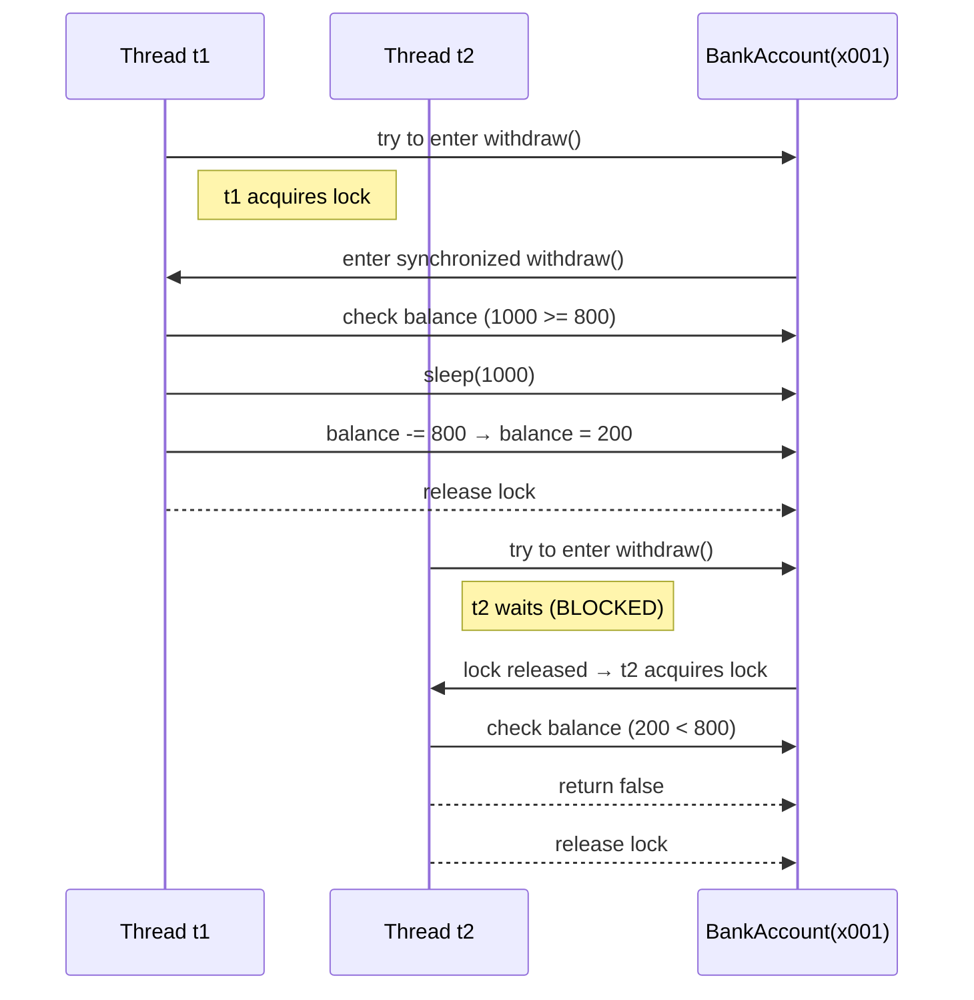

# 임계 영역 보호 (synchronized)

## 🔐 시퀀스 다이어그램: synchronized를 통한 임계 영역 보호


## 🧠 핵심 개념 요약
### 🔄 임계 영역 흐름
- t1이 먼저 withdraw() 진입 → 락 획득
- t2는 withdraw() 진입 시도 → BLOCKED 상태
- t1이 출금 완료 후 락 반납
- t2가 락 획득 후 진입 → 잔액 부족으로 출금 실패

### 🔐 락(lock)의 역할
- 모든 객체는 **모니터 락(monitor lock)** 을 내장
- synchronized 메서드 진입 시 해당 객체의 락 필요
- 락이 없으면 스레드는 BLOCKED 상태로 대기
- 락을 획득한 스레드만 임계 영역을 실행 가능

### ✅ 결과
- t1: 800원 출금 성공 → 잔액 200원
- t2: 잔액 부족으로 출금 실패
- 최종 잔액: 200원 → 정확한 결과

---
# synchronized
synchronized 키워드 하나만으로도 자바에서 **임계 영역(critical section)** 이 안전하게 보호되는 이유는  
자바의 **모니터 락(monitor lock)** 과 **자바 메모리 모델(Java Memory Model)** 이 함께 작동하기 때문입니다.  
아래에 그 원리를 단계별로 상세하게 설명.

## 🔐 synchronized가 임계 영역을 보호하는 이유
### 1️⃣ 모든 객체는 고유한 락(lock)을 가진다
- 자바의 모든 객체는 **내부적으로 하나의 모니터 락(monitor lock)** 을 가지고 있음.
- 이 락은 synchronized 메서드나 블록을 사용할 때 자동으로 사용됩니다.
- 예를 들어 `synchronized withdraw()` 는 `this` 객체의 `락` 을 의미합니다.

### 2️⃣ 락을 획득해야만 진입 가능
- 어떤 스레드가 synchronized 메서드에 진입하려면 해당 객체의 락을 먼저 획득해야 합니다.
- 락을 이미 다른 스레드가 가지고 있다면, 다른 스레드는 `BLOCKED` 상태로 대기합니다.
- 이로 인해 한 번에 하나의 스레드만 임계 영역을 실행할 수 있게 됩니다.

### 3️⃣ 락을 획득한 스레드만 실행
- 락을 획득한 스레드는 withdraw() 메서드의 검증 → 계산 → 저장 단계를 중간에 방해받지 않고 실행합니다.
- 다른 스레드는 락을 반납할 때까지 절대 진입할 수 없습니다.

### 4️⃣ 메모리 가시성도 보장된다
- synchronized는 락을 획득할 때 이전 스레드의 변경 내용을 메모리에서 읽어오도록 보장합니다.
- 즉, `volatile` 없이도 `메모리 가시성` 문제를 해결합니다.
- 락을 반납할 때는 `변경된 값` 을 메인 `메모리에 반영` 하고, `다음 스레드` 는 `최신 값` 을 읽습니다.

### 📦 예시: BankAccountV2의 synchronized 메서드
```java
public synchronized boolean withdraw(int amount) {
    if (balance < amount) return false;
    sleep(1000);
    balance -= amount;
    return true;
}
```

- withdraw() 전체가 임계 영역입니다.
- balance는 공유 자원이므로, 이 메서드에 synchronized를 붙이면 `검증과 계산이 원자적` 으로 실행됩니다.
- sleep()으로 인해 지연이 발생해도 다른 스레드는 진입 불가합니다.

## 🧠 핵심 요약: synchronized가 임계 영역을 보호하는 이유

| 개념             | 설명                                                         |
|------------------|--------------------------------------------------------------|
| 객체의 락        | 자바의 모든 객체는 고유한 모니터 락(monitor lock)을 가짐     |
| 락 획득          | synchronized 메서드 진입 시 해당 객체의 락을 먼저 획득해야 함 |
| BLOCKED 상태     | 락을 획득하지 못한 스레드는 BLOCKED 상태로 대기함            |
| 원자성 보장      | 검증 → 계산 → 저장까지 중간에 방해받지 않고 실행됨           |
| 메모리 가시성    | 락을 통해 최신 값을 읽고 쓰는 메모리 동기화가 자동으로 보장됨 |

---


