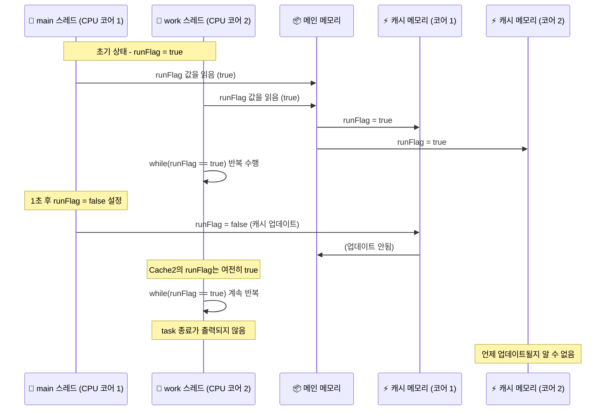

# 메모리 가시성 2
## 🧠 메모리 가시성 문제 단계별 다이어그램



## 🔍 핵심 요약
- 각 CPU 코어는 자신만의 캐시 메모리를 사용함
- main 스레드가 runFlag = false로 변경해도 자신의 캐시만 갱신
- work 스레드는 자신의 캐시에서 여전히 true를 참조
- 결과적으로 while(runFlag) 루프를 탈출하지 못함
- 이 현상이 바로 메모리 가시성 문제

## ✅ 해결 방법
- runFlag에 volatile 키워드 추가:
```java
volatile boolean runFlag = true;
```
- volatile은 다음을 보장함:
- 모든 스레드가 메인 메모리의 최신 값을 참조
- 캐시 불일치 방지
- 변경 즉시 다른 스레드에 반영

---

# volatile
- volatile 키워드가 어떻게 메모리 가시성을 확보하는지를 조금 더 깊이 있게 설명.

## 🔍 메모리 가시성 문제란?
멀티스레드 환경에서 한 스레드가 변경한 변수의 값이 다른 스레드에서 즉시 보이지 않는 현상을 말합니다.  
이는 CPU가 성능을 높이기 위해 사용하는 캐시 메모리 때문입니다.

### 예를 들어:
- main 스레드가 runFlag = false로 변경
- 하지만 work 스레드는 자신의 캐시에서 runFlag = true를 계속 참조
- 결과적으로 while(runFlag) 루프를 탈출하지 못함

### ✅ volatile의 역할
자바에서 volatile 키워드는 메모리 가시성을 보장하는 도구입니다. 아래와 같은 방식으로 작동합니다:

### 1. 캐시 무시
- volatile 변수는 CPU 캐시를 사용하지 않고, 항상 메인 메모리에서 값을 읽고 씁니다
- 즉, 어떤 스레드가 값을 변경하면 다른 스레드도 즉시 최신 값을 확인할 수 있음

### 2. 메모리 배리어(Memory Barrier)
- volatile은 내부적으로 메모리 배리어를 삽입합니다
- 이는 컴파일러나 CPU가 명령어 순서를 재배치하지 못하게 막는 장치입니다
- 덕분에 volatile 변수의 읽기/쓰기 순서가 보장됩니다

### 3. 변경 즉시 전파
- 한 스레드가 volatile 변수의 값을 변경하면,
- 해당 변경은 즉시 메인 메모리에 반영
- 다른 스레드가 즉시 최신 값을 읽음

## 🔁 일반 변수 vs volatile 변수

| 항목             | 일반 변수                                | volatile 변수                              |
|------------------|-------------------------------------------|--------------------------------------------|
| 읽기 위치         | CPU 캐시 또는 메인 메모리                  | 항상 메인 메모리에서 읽음                   |
| 쓰기 위치         | CPU 캐시에 먼저 저장될 수 있음             | 즉시 메인 메모리에 저장됨                   |
| 메모리 가시성     | 다른 스레드가 변경 사항을 즉시 볼 수 없음   | 모든 스레드가 변경 사항을 즉시 확인 가능     |
| 명령어 재배치     | 컴파일러/CPU가 재배치할 수 있음            | 메모리 배리어로 재배치 방지됨               |
| 동기화 수준       | 가시성 및 순서 보장 안됨                   | 가시성 및 순서 보장됨                       |


## 📌 예시로 다시 보기
```java
volatile boolean runFlag = true;

public void run() {
    while (runFlag) {
        // runFlag가 false가 되면 즉시 탈출
    }
}
```
- main 스레드가 runFlag = false로 설정하면,
- work 스레드는 즉시 이 변경을 감지하고 루프를 탈출함

## ⚠️ 주의할 점
- volatile은 가시성만 보장합니다. **원자성(atomicity)** 는 보장하지 않습니다
- 예: count++ 같은 복합 연산은 volatile만으로 안전하지 않음 → synchronized 또는 AtomicInteger 필요


---
