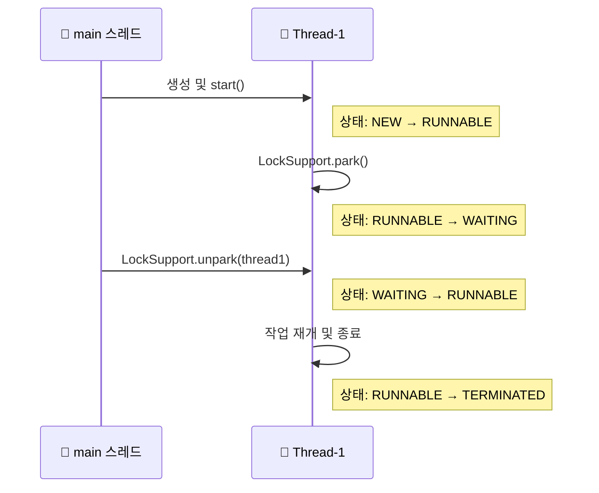

# LockSupport

## 소스 코드
```java
public class LockSupportMainV1 {

    public static void main(String[] args) {
        Thread thread1 = new Thread(new ParkTask(), "Thread-1");

        thread1.start();

        // 잠시 대기하여 Thread-1이 park 상태에 빠질 시간을 준다.
        sleep(100);

        log("Thread-1 state: " + thread1.getState());
        log("main -> unpark(Thread-1)");

        LockSupport.unpark(thread1); // 1. unpark 사용
        
        //thread1.interrupt(); // 2. interrupt() 사용
    }

    static class ParkTask implements Runnable {
        @Override
        public void run() {
            log("park 시작");
            LockSupport.park();
            log("park 종료, state: " + Thread.currentThread().getState());
            log("인터럽트 상태: " + Thread.currentThread().isInterrupted());
        }
    }
}
```

## 🧵 LockSupport 스레드 상태 전이:


## 🔍 핵심 개념 정리  
### ✅ LockSupport 주요 기능

| 메서드                  | 상태 전이 설명                          |
|-------------------------|------------------------------------------|
| park()                  | 현재 스레드를 WAITING 상태로 전환         |
| parkNanos(nanos)        | 지정된 시간 동안 TIMED_WAITING 상태 유지 |
| unpark(Thread thread)   | 대상 스레드를 RUNNABLE 상태로 복귀시킴    |


### 🧠 왜 unpark(thread)는 매개변수가 있을까?
- `park()` 는 자기 자신을 대기 상태로 전환 → 실행 중이므로 직접 호출 가능
- `unpark(thread)` 는 대기 중인 스레드를 깨우는 작업 → 해당 스레드는 실행 중이 아니므로 `외부에서 호출` 해야 함

### 🔁 인터럽트로 깨우기
- `thread.interrupt()` 를 호출하면 `park()` 상태의 스레드도 깨어남
- 이때 스레드의 인터럽트 상태는 true로 설정됨

### 📌 실행 결과 비교

| 호출 방식       | 상태 전이                   | 인터럽트 상태 |
|----------------|-----------------------------|----------------|
| unpark()       | WAITING → RUNNABLE          | false          |
| interrupt()    | WAITING → RUNNABLE          | true           |


## 🎯 요약
- LockSupport는 synchronized의 한계를 보완하는 세밀한 스레드 제어 도구
- park()로 스레드를 대기시키고, unpark() 또는 interrupt()로 깨울 수 있음
- 스레드 간 통신과 상태 전이를 명확하게 제어할 수 있어 고급 동시성 프로그래밍에 적합

---

