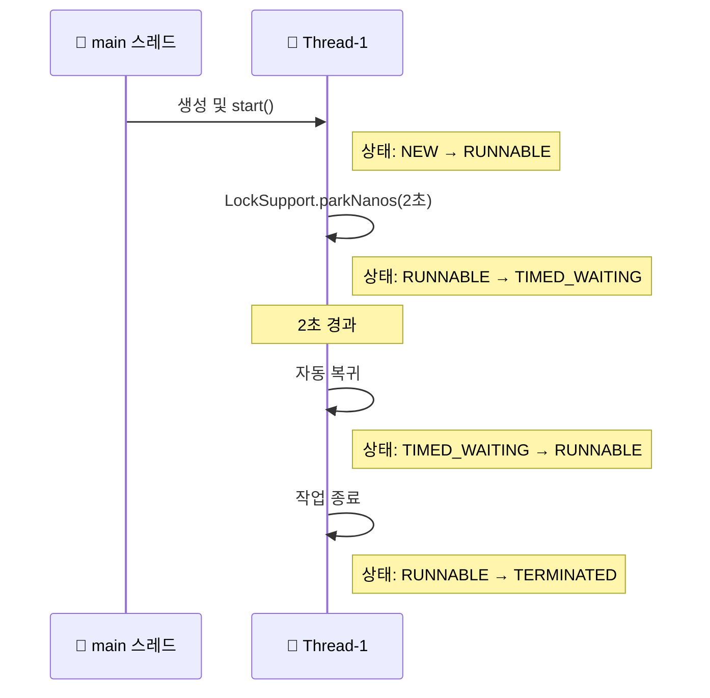

# LockSupport parkNanos

## 소스 코드
```java
public class LockSupportMainV2 {
    public static void main(String[] args) {
        Thread thread1 = new Thread(new ParkTask(), "Thread-1");
        thread1.start();
        // 잠시 대기하여 thread1이 park 상태에 빠질 시간을 준다.
        sleep(100);
        log("Thread-1 state: " + thread1.getState());
    }

    static class ParkTask implements Runnable {
        @Override
        public void run() {
            log("park 시작, 2초 대기");

            LockSupport.parkNanos(2000_000000); // parkNanos 사용

            log("park 종료, state: " + Thread.currentThread().getState());
            log("인터럽트 상태: " + Thread.currentThread().isInterrupted());
        }
    }
}
```

## 🧵 LockSupport.parkNanos() 상태 전이:



## 🔍 단계별 설명과 예제
### 1️⃣ 스레드 생성 및 시작
```java
Thread thread1 = new Thread(new ParkTask(), "Thread-1");
thread1.start();
```
- Thread-1은 NEW 상태에서 RUNNABLE 상태로 전이됨

### 2️⃣ 시간 대기 시작
```java
LockSupport.parkNanos(2000_000000); // 2초 대기
```
- 스레드는 2초 동안 TIMED_WAITING 상태로 진입
- CPU 스케줄링에서 제외됨

### 3️⃣ 자동 복귀
- 2초가 지나면 스레드는 자동으로 RUNNABLE 상태로 복귀
- 외부에서 unpark() 호출 없이도 깨어남

### 4️⃣ 작업 종료
```java
log("park 종료, state: " + Thread.currentThread().getState());
```
- 스레드는 작업을 마치고 TERMINATED 상태로 전이됨

## 📌 상태 비교 요약

| 스레드 상태       | 발생 조건 또는 대표 메서드                          |
|------------------|----------------------------------------------------|
| BLOCKED          | `synchronized` 락 대기 중                           |
| WAITING          | `park()`, `join()`, `wait()` 등 조건 없는 대기       |
| TIMED_WAITING    | `parkNanos()`, `sleep()`, `wait(timeout)` 등 시간 제한 대기 |
| RUNNABLE         | 실행 가능 상태 (CPU가 스케줄링하면 실행됨)          |
| TERMINATED       | 작업 완료 후 종료된 상태                            |


## ✅ LockSupport의 장점

| 메서드                | 설명                                           |
|-----------------------|------------------------------------------------|
| `park()`                | 스레드를 무기한 대기 상태(WAITING)로 전환       |
| `parkNanos(nanos)`      | 지정된 시간 동안만 대기(TIMED_WAITING) 후 자동 복귀 |
| `unpark(Thread)`        | 특정 스레드를 깨워 실행 가능 상태(RUNNABLE)로 전환 |


## 🔒 synchronized vs LockSupport

| 항목               | synchronized                          | LockSupport                                 |
|--------------------|----------------------------------------|----------------------------------------------|
| 대기 상태           | BLOCKED                                | WAITING / TIMED_WAITING                      |
| 상태 전이 방식       | 락 해제 시 자동 RUNNABLE 전환           | unpark() 또는 시간 경과로 RUNNABLE 전환       |
| 인터럽트 대응       | 불가능 (BLOCKED 유지)                   | 가능 (인터럽트 시 RUNNABLE로 복귀)           |
| 시간 제한 대기       | 불가능                                  | 가능 (`parkNanos()` 사용)                    |
| 제어 수준           | 고수준 (자동 락 관리)                   | 저수준 (직접 상태 제어 필요)                 |
| 대표 메서드         | `synchronized`, `wait()`                | `park()`, `parkNanos()`, `unpark()`          |


## 🧠 결론
- LockSupport는 스레드 상태를 직접 제어할 수 있는 저수준 도구
- parkNanos()를 사용하면 무한 대기 없이 시간 제한된 대기가 가능
- 하지만 직접 락 기능을 구현하려면 스레드 큐, 우선순위, 상태 관리 등 복잡한 로직이 필요
- 자바는 이를 해결하기 위해 ReentrantLock 같은 고수준 동기화 도구를 제공함

---

