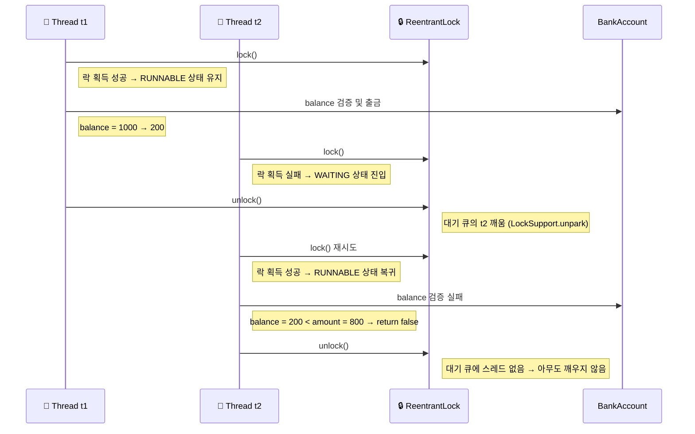

# ReentrantLock 활용

## 소스 코드
```java
public class BankAccountV4 implements BankAccount {

    private int balance;
    private final Lock lock = new ReentrantLock();
    
    public BankAccountV4(int initialBalance) {
        this.balance = initialBalance;
    }

    @Override
    public boolean withdraw(int amount) {
        log("거래 시작: " + getClass().getSimpleName());
        lock.lock(); // ReentrantLock 이용하여 lock을 걸기
        try {
            
            log("[검증 시작] 출금액: " + amount + ", 잔액: " + balance);

            if (balance < amount) {
                log("[검증 실패] 출금액: " + amount + ", 잔액: " + balance);
                return false;
            }

            log("[검증 완료] 출금액: " + amount + ", 잔액: " + balance);
            sleep(1000);

            balance = balance - amount;
            log("[출금 완료] 출금액: " + amount + ", 변경 잔액: " + balance);

        } finally {
            lock.unlock(); // ReentrantLock 이용하여 lock 해제
        }
        log("거래 종료");
        return true;
    }
    
    @Override
    public int getBalance() {
        lock.lock(); // ReentrantLock 이용하여 lock 걸기
        try {
            return balance;
        } finally {
            lock.unlock(); // ReentrantLock 이용하여 lock 해제
        }
    }
}
```

## 🔐 ReentrantLock 출금 흐름: 시퀀스 다이어그램



## 📘 단계별 동작 설명
### 1️⃣ 락 획득과 임계 영역 진입
- t1이 먼저 lock.lock()을 호출하여 락을 획득
- t1은 RUNNABLE 상태로 임계 영역을 실행
- 출금 검증 후 balance = 1000 → 200으로 변경

### 2️⃣ 락 대기와 상태 전이
- t2가 lock.lock()을 호출하지만 락을 획득하지 못함
- 내부적으로 LockSupport.park()가 호출되어 WAITING 상태로 진입
- ReentrantLock은 대기 큐에 t2를 등록하여 관리

### 3️⃣ 락 해제와 대기 스레드 깨움
- t1이 lock.unlock()을 호출하여 락을 반납
- 내부적으로 LockSupport.unpark(t2)가 호출되어 t2를 깨움
- t2는 RUNNABLE 상태로 복귀하여 락 획득을 재시도

### 4️⃣ 검증 실패와 종료
- t2가 락을 획득하고 임계 영역에 진입
- balance = 200이므로 출금 실패 → return false
- finally 블록에서 lock.unlock() 호출
- 대기 큐에 스레드가 없으므로 추가적인 깨움 없음

## ✅ 핵심 요약

| 개념 또는 동작                  | 설명                                                              |
|-------------------------------|-------------------------------------------------------------------|
| lock() → WAITING              | 락을 획득하지 못한 스레드는 WAITING 상태로 진입                   |
| ReentrantLock 내부 동작       | `LockSupport.park()`로 대기 큐에서 스레드 관리                    |
| 락 해제 후 스레드 깨움        | `LockSupport.unpark(thread)`로 대기 중인 스레드를 깨움            |
| 메모리 가시성 확보            | `volatile` 없이도 `Lock` 사용 시 JMM에 따라 가시성 보장됨         |
| 예외 안전성 확보              | `finally` 블록에서 `unlock()` 호출하여 락 반납 보장               |


## 🧠 추가 팁
- ReentrantLock은 synchronized보다 더 세밀한 제어가 가능
- tryLock()이나 lockInterruptibly()를 활용하면 시간 제한이나 인터럽트 대응도 가능
- 공정성 모드(new ReentrantLock(true))를 사용하면 대기 순서대로 락 획득 가능

---
