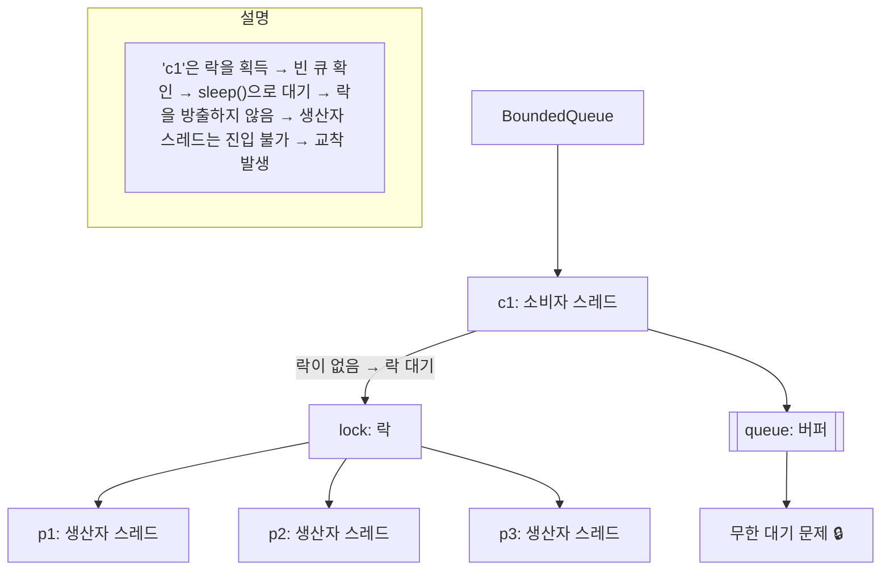

# 교착 상태에 빠지는 원인

## 소스 코드
```java
public class BoundedQueueV2 implements BoundedQueue {

    private final Queue<String> queue = new ArrayDeque<>();
    private final int max;

    public BoundedQueueV2(int max) {
        this.max = max;
    }

    public synchronized void put(String data) {
        while (queue.size() == max) {
            log("[put] 큐가 가득 참, 생산자 대기");
            sleep(1000);
        }
        queue.offer(data);
    }

    public synchronized String take() {
        while (queue.isEmpty()) {
            log("[take] 큐에 데이터가 없음, 소비자 대기");
            sleep(1000);
        }
        return queue.poll();
    }

    @Override
    public String toString() {
        return queue.toString();
    }
}
```
## 🧠 핵심 구조 요약
### 🔧 클래스: BoundedQueueV2
```java
public synchronized void put(String data)
```

- 큐가 가득 찼을 때 sleep()을 통해 생산자 스레드가 대기
- 큐에 빈 공간이 생길 때까지 반복적으로 확인
```java
public synchronized String take()
```
- 큐가 비어 있을 때 sleep()을 통해 소비자 스레드가 대기
- 큐에 데이터가 생길 때까지 반복적으로 확인

### 🔁 동작 방식 요약

| 메서드 | 조건 | 대기 방식     | 락 점유 여부 | 문제점 요약               |
|--------|------|---------------|--------------|---------------------------|
| put()  | 큐가 가득 참 | sleep(1000) | ✅ 점유 중   | 소비자가 접근 불가 → 교착 |
| take() | 큐가 비어 있음 | sleep(1000) | ✅ 점유 중   | 생산자가 접근 불가 → 교착 |

### 🧠 핵심 포인트
- sleep()은 락을 해제하지 않기 때문에, 다른 스레드가 임계 영역에 진입할 수 없습니다.
- 결과적으로 put()과 take() 모두 락을 점유한 채 대기하며, 다른 스레드가 BLOCKED 상태가 됩니다.
- 이 구조는 생산자-소비자 간 협력이 불가능한 설계로, 교착 상태를 유발합니다.


## ⚠️ 문제점 분석
### ❌ 문제 상황: 생산자 먼저 실행
- producer3는 큐가 가득 찼기 때문에 sleep()을 반복하며 대기
- consumer1~3은 큐에 데이터가 있음에도 BLOCKED 상태
- 이유는 take()가 큐에서 데이터를 꺼내는 순간에도 다른 스레드가 락을 잡고 있어서 접근 불가
### 🔍 원인
- put()과 take()가 모두 synchronized로 정의되어 있어 모니터 락을 공유
- producer3가 put()에서 sleep() 중에도 락을 잡고 있어, take()가 진입하지 못함
- 결과적으로 소비자 스레드가 BLOCKED 상태가 되고, 생산자도 계속 sleep()만 반복

### 실행 흐름 요약 (생산자 먼저 실행)
```
[producer1] → data1 넣음
[producer2] → data2 넣음
[producer3] → 큐 full → sleep 반복
[consumer1~3] → BLOCKED (락 진입 실패)
```

## 🧩 결론
- BoundedQueueV2는 sleep() 기반의 폴링 방식으로 동기화 구현
- 하지만 synchronized와 sleep() 조합은 락을 해제하지 않기 때문에 스레드 간 협력이 어려움

## 🧠 핵심 문제 요약

| 구성 요소         | 동작 방식                     | 문제 상황            |
|------------------|-------------------------------|----------------------|
| BoundedQueueV2   | put(), take() → synchronized  | 락 점유 상태에서 진입 제한 |
| sleep()          | 락을 잡은 채로 대기           | 다른 스레드 진입 불가     |
| 소비자/생산자 스레드 | sleep() 중 → 락 점유          | 나머지 스레드 BLOCKED     |

## 🔍 핵심 포인트
- put()과 take()는 synchronized로 보호된 임계 영역
- sleep()은 락을 해제하지 않기 때문에, 대기 중인 스레드가 임계 영역에 진입할 수 없음
- 결과적으로 락을 가진 스레드가 아무 작업도 하지 않으면서 시스템 전체를 멈추게 함

---

## 🔍 소비자 먼저 실행 시 문제 흐름
- consumer1이 take()에 진입 → 큐가 비어 있음 → sleep()으로 대기  
    → 락을 잡은 채로 TIMED_WAITING 상태
- consumer2, consumer3는 take()에 진입하려다 락을 못 잡고 BLOCKED
- 이후 producer1~3이 put()에 진입하려다 역시 BLOCKED
- 결과적으로 consumer1만 계속 sleep() 반복하며 락을 점유 → 나머지 스레드는 모두 멈춤


---

## 🔍 생산자 먼저 실행 시 문제 흐름
- producer1, producer2가 데이터를 넣음 → 큐가 가득 참
- producer3가 put()에 진입 → 큐가 가득 참 → sleep()으로 대기
    → 락을 잡은 채로 TIMED_WAITING 상태
- 이후 consumer1~3가 take()에 진입하려다 BLOCKED
- producer3는 계속 sleep() 반복하며 락을 점유 → 소비자 진입 불가

### ⚠️ 핵심 원인
```java
while (queue.size() == max) {
    log("[put] 큐가 가득 참, 생산자 대기");
    sleep(1000); // 락을 잡은 채로 대기
}
```
- sleep()은 스레드를 잠시 멈추지만 락은 해제하지 않음
- synchronized 블록 안에서 sleep()을 쓰면 다른 스레드가 진입할 수 없음
- 결과적으로 락을 가진 스레드가 깨어나기 전까지 시스템 전체가 멈춤

### 📊 sleep

| 메서드   | 락 해제 여부 | 다른 스레드 진입 가능 | 협력 가능성 | 교착 위험 |
|----------|---------------|------------------------|---------------|------------|
| sleep()  | ❌ 해제 안 함 | ❌ 불가능              | ❌ 없음        | ✅ 높음     |

## 🧩 결론
- BoundedQueueV2는 sleep() 기반의 폴링 방식이라 락을 해제하지 않아 교착 상태 발생

## 🧠 문제 핵심 요약

| 스레드 그룹 | 동작 방식           | 결과 상태                  |
|-------------|---------------------|-----------------------------|
| p3          | put() → sleep()     | 락 점유 → 큐 full → 대기 반복 |
| c1, c2, c3  | take()              | 락 진입 불가 → BLOCKED      |
| 전체 시스템 |                     | p3가 락을 점유한 채 대기 중  |

## 🔍 핵심 포인트
- p3는 큐가 가득 차서 sleep()으로 대기하지만 락을 해제하지 않음
- c1, c2, c3는 큐에 데이터가 있음에도 락을 못 잡아 BLOCKED
- 결과적으로 모든 스레드가 멈춘 상태로 무한 대기

## 🔄 교착 상태 흐름
- 1. p3 → 큐 full → sleep() → 락 점유
- 2. c1 → 큐에 데이터 있음 → take() 진입 시도 → BLOCKED (락 없음)
- 3. p3 → 깨어남 → 큐 여전히 full → 다시 sleep()
- 4. c1~c3 → 계속 BLOCKED
- 5. p3 → 계속 락 점유 → 소비자는 진입 불가 → 큐는 절대 비워지지 않음

## ⚠️ 왜 문제가 생겼는가?
- synchronized는 락을 잡은 스레드만 임계 영역에 진입 가능
- sleep()은 락을 해제하지 않음
- 따라서 p3가 sleep() 중에도 락을 계속 점유
- 소비자 스레드는 락을 못 잡아 큐에 접근 불가
- 큐는 비워지지 않음 → p3는 계속 대기 → 무한 루프


## 🔚 결론
- BoundedQueueV2는 sleep() 기반의 폴링 방식이라 락을 해제하지 않아 교착 상태 발생


---

##  🧠 핵심 문제 요약: 소비자 먼저 실행 시

| 스레드 그룹              | 동작 방식           | 결과 상태                         |
|--------------------------|---------------------|------------------------------------|
| consumer1 (c1)           | take() → sleep()    | 락 점유 → 큐 비어 있음 → 대기 반복 |
| consumer2, consumer3     | take()              | 락 진입 불가 → BLOCKED             |
| producer1, producer2, p3 | put()               | 락 진입 불가 → BLOCKED             |
| 전체 시스템              |                     | c1이 락을 점유한 채 무한 대기 중    |

## 🔍 핵심 포인트
- c1은 락을 잡고 sleep()으로 대기 → 다른 스레드는 진입 불가
- c2, c3, p1~p3는 모두 BLOCKED 상태
- 큐는 비어 있고, 채울 수 있는 생산자는 진입 불가
- 결과적으로 모든 스레드가 멈춘 상태로 무한 대기


## 🔄 교착 흐름 요약
- 1. c1 → take() 진입 → 큐 비어 있음 → sleep() → 락 점유
- 2. c2, c3 → take() 진입 시도 → BLOCKED (락 없음)
- 3. p1~p3 → put() 진입 시도 → BLOCKED (락 없음)
- 4. c1 → 1초마다 깨어나서 큐 확인 → 여전히 비어 있음 → 다시 sleep()
- 5. c1은 락을 계속 점유 → 나머지 스레드는 진입 불가 → 큐는 절대 채워지지 않음

## ⚠️ 왜 문제가 생겼는가?
- synchronized는 락을 잡은 스레드만 임계 영역에 진입 가능
- sleep()은 락을 해제하지 않음
- 따라서 c1이 sleep() 중에도 락을 계속 점유
- 생산자 스레드는 락을 못 잡아 큐에 접근 불가
- 큐는 채워지지 않음 → c1은 계속 대기 → 무한 루프


## 🔚 결론
- BoundedQueueV2는 sleep() 기반의 폴링 방식이라 락을 해제하지 않아 교착 상태 발생

---

# 🧠 문제 요약: 락을 가진 채로 대기하면 생기는 교착

## 🔒 핵심 개념
- 임계 영역(Critical Section): 여러 스레드가 공유 자원(버퍼)에 접근할 때 동기화를 위해 사용하는 보호 구역
- 락(Lock): 임계 영역에 진입하기 위한 열쇠
- sleep()의 문제: 락을 가진 채로 아무 작업 없이 대기 → 다른 스레드는 진입 불가 → 교착 발생

## 🔄 교착 흐름 설명
- 소비자 스레드 c1이 락을 획득하고 임계 영역에 진입
- 큐가 비어 있어 c1은 sleep()으로 대기 → 락을 점유한 채 아무 작업도 하지 않음
- 생산자 스레드 p1, p2, p3는 큐에 데이터를 넣고 싶지만 락을 못 잡아 BLOCKED
- 큐는 비어 있고, 채울 수 있는 생산자는 진입 불가
- c1은 계속 깨어나서 큐를 확인하지만, 여전히 비어 있음 → 다시 sleep() 반복
- 모든 스레드가 멈춘 상태로 무한 대기

## ✅ 해결 아이디어
**락을 가지고 대기하는 스레드가 대기하는 동안 다른 스레드에게 락을 양보할 수 있다면, 이 문제를 쉽게 풀 수 있다.**

## 🔧 해결 방법: wait() / notifyAll() 사용
- wait()은 락을 반납하고 대기 → 다른 스레드가 임계 영역에 진입 가능
- notifyAll()은 대기 중인 스레드에게 알림 → 다시 락을 획득하고 작업 수행

## 🧩 시각적 다이어그램


다이어그램은 다음 구조를 보여줍니다:
- c1이 락을 잡고 큐를 확인 → 비어 있음 → sleep()으로 대기
- p1, p2, p3는 락을 얻지 못해 BLOCKED
- 큐는 비어 있고, 채울 수 있는 생산자는 진입 불가
- 결과적으로 모든 스레드가 멈춘 상태로 무한 대기

## 🔚 결론
- sleep()은 락을 해제하지 않기 때문에 교착 상태를 유발
- wait()은 락을 해제하고 협력적 동기화를 가능하게 함
- 생산자-소비자 문제에서 Object.wait() / Object.notifyAll()은 필수적인 해결 도구

---

