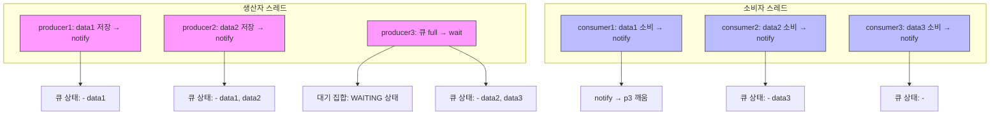
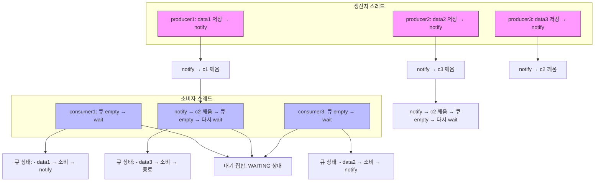

# 생산자 우선 실행

## 생산자 우선 실행 흐름


## 🔁 실행 흐름 요약: 생산자 먼저 실행

| 단계       | 동작 내용                              | 이벤트 또는 상태 변화           |
|------------|----------------------------------------|----------------------------------|
| p1, p2     | data1, data2 생산 후 큐에 저장          | 큐 채움, notify() 호출           |
| p3         | 큐 full → wait() 호출                   | WAITING 상태로 대기              |
| c1         | data1 소비 → notify()로 p3 깨움         | p3 깨어남, c1 종료                |
| p3         | data3 저장 → notify() 호출              | 큐 상태 갱신, p3 종료             |
| c2, c3     | data2, data3 소비                       | 모두 정상 종료                   |

## 🧠 핵심 요점
- p3는 큐가 가득 차면 wait()으로 대기 → 락을 반납하고 대기 집합에 등록
- c1이 데이터를 소비하면 notify()로 p3를 깨움 → 스레드 간 협력 발생
- p3는 깨어나서 data3을 저장하고 다시 notify() 호출 → 소비자 깨움
- c2, c3는 남은 데이터를 소비하고 종료 → 모든 스레드 정상 종료


## 🔧 핵심 동작 분석
### 🔒 락과 대기 집합
- wait() 호출 시 스레드는 락을 반납하고 WAITING 상태로 전환
- 해당 객체의 **대기 집합(wait set)** 에 등록됨
- notify() 호출 시 대기 집합에서 하나의 스레드가 깨움 대상이 됨

### 🔄 락 재획득과 실행 흐름
- 깨어난 스레드는 즉시 실행되지 않음 → 락을 다시 획득해야 함
- 락을 획득하면 wait() 이후의 코드부터 실행됨
- 이로 인해 스레드 간 협력이 자연스럽게 이루어짐

## ✅ 최종 결과
| 스레드 그룹 | 동작 결과                     | 상태 |
|-------------|-------------------------------|--------|
| p1, p2, p3  | 데이터 정상 생산 및 저장 완료 | TERMINATED |
| c1, c2, c3  | 데이터 정상 소비 완료         | TERMINATED |

### 🧠 핵심 요점
- 모든 생산자 스레드는 큐에 데이터를 성공적으로 저장하고 종료
- 모든 소비자 스레드는 큐에서 데이터를 성공적으로 소비하고 종료
- wait() / notify() 덕분에 스레드 간 협력이 원활하게 이루어짐
- 교착 없이 모든 스레드가 정상 종료

## 🧠 결론
- wait() / notify() 덕분에 락을 반납하고 협력적 대기가 가능해짐
- 생산자-소비자 간 최적 타이밍에 스레드가 깨어나며 교착 없이 동작
- BoundedQueueV3는 sleep() 기반의 V2보다 훨씬 안정적이고 효율적

---

# 소비자 우선 실행

## 🧩 소비자 우선 실행 흐름


## 🔁 실행 흐름 요약: 소비자 먼저 실행

| 단계       | 동작 내용                              | 상태 변화 또는 이벤트           |
|------------|----------------------------------------|----------------------------------|
| c1, c2, c3 | 큐 비어 있음 → wait() 호출             | 모두 WAITING 상태로 대기         |
| p1         | data1 저장 → notify()로 c1 깨움         | c1 깨어남                        |
| c1         | data1 소비 → notify()로 c2 깨움         | c2 깨어남                        |
| c2         | 큐 비어 있음 → 다시 wait() 호출         | WAITING 상태로 복귀              |
| p2         | data2 저장 → notify()로 c3 깨움         | c3 깨어남                        |
| c3         | data2 소비 → notify()로 c2 깨움         | c2 깨어남                        |
| c2         | 큐 비어 있음 → 다시 wait() 호출         | WAITING 상태로 복귀              |
| p3         | data3 저장 → notify()로 c2 깨움         | c2 깨어남                        |
| c2         | data3 소비                              | TERMINATED                       |

## 🧠 핵심 요점
- 소비자 스레드가 먼저 실행되면 큐가 비어 있어 모두 wait() 상태로 진입
- 생산자가 데이터를 저장하면 notify()로 소비자를 깨움
- 소비자가 데이터를 소비한 뒤 notify()를 호출하지만, 다른 소비자를 깨우는 경우 큐가 비어 있어 다시 대기
- 이로 인해 소비자 간의 비효율적인 깨우기가 발생
- 결과적으로 모든 스레드는 정상 종료하지만, 중간에 불필요한 wait → notify → wait 사이클이 반복됨

## 🔍 핵심 분석
### 🔄 스레드 깨우기와 락 획득
- notify()는 대기 집합에서 임의의 하나의 스레드만 깨움
- 깨어난 스레드는 락을 획득해야만 실행 가능 → BLOCKED 상태를 거침
- 락을 획득하면 wait() 이후의 코드부터 실행
### ♻️ 소비자끼리의 비효율적 깨우기
- c1이 notify()로 c2를 깨움 → 큐가 비어 있어 다시 wait() 호출
- c3도 notify()로 c2를 깨움 → 같은 결과 반복
- 이 과정은 CPU 자원 낭비와 불필요한 대기 진입을 초래

## ✅ 최종 결과
| 스레드 그룹 | 동작 결과                     | 상태         | 비고                         |
|-------------|-------------------------------|--------------|------------------------------|
| p1, p2, p3  | 데이터 정상 생산 및 저장 완료 | TERMINATED   | notify()로 소비자 깨움       |
| c1, c2, c3  | 데이터 정상 소비 완료         | TERMINATED   | 일부는 비효율적 wait 반복 발생 |

## 🧠 핵심 요점
- 모든 생산자 스레드는 데이터를 정상적으로 큐에 저장하고 종료
- 모든 소비자 스레드는 데이터를 정상적으로 소비하고 종료
- notify()는 임의의 스레드 하나만 깨우기 때문에, 소비자끼리 서로 깨우는 경우 **큐가 비어 있어 다시 wait()** 하는 비효율이 발생
- 결과적으로 교착 없이 정상 종료되지만, 중간에 불필요한 깨어남과 재대기가 반복됨

## 🧠 결론
- BoundedQueueV3는 wait() / notify()를 통해 교착 없이 협력적 동작을 구현
- 하지만 notify()는 소비자끼리의 비효율적 깨우기 문제를 내포
- 해결책으로는 notifyAll()을 사용하여 모든 대기 스레드를 깨우는 방식이 더 효율적일 수 있음

---
# wait() / notify() / notifyAll() 방식의 한계와 구조적 문제
Object.wait() / notify() / notifyAll() 방식의 한계와 구조적 문제를 시각적으로 flowchart와 함께 단계별 설명입니다.

## 🧩 Flowchart: notify() / notifyAll()의 한계
```mermaid
flowchart TD
    subgraph 대기 집합
        C1[consumer1: WAITING]
        C2[consumer2: WAITING]
        C3[consumer3: WAITING]
        P1[producer1: WAITING]
        P2[producer2: WAITING]
        P3[producer3: WAITING]
    end

    P0[producer0: data0 저장 → notify] --> 대기 집합
    C0[consumer0: data0 소비 → notify] --> 대기 집합

    subgraph notify() 호출 결과
        N1[임의 스레드 깨움 → 예측 불가]
        N2[같은 종류 스레드 깨어남 → 비효율 발생]
    end

    subgraph notifyAll() 호출 결과
        NA1[모든 스레드 깨어남]
        NA2[락 획득 경쟁 → BLOCKED]
        NA3[필요 없는 스레드도 깨어남 → 비효율]
        NA4[기아 문제 해결 가능]
    end

    대기 집합 --> N1
    N1 --> N2
    대기 집합 --> NA1
    NA1 --> NA2 --> NA3 --> NA4
```

## 🔍 단계별 설명
### ① notify()의 구조적 한계
- 대기 집합은 하나: 생산자, 소비자 스레드가 모두 같은 공간에서 대기
- notify() 호출 시 임의의 하나만 깨움 → 어떤 스레드가 깨어날지 예측 불가
- 예시:
    - 생산자가 notify() → 또 다른 생산자가 깨어나면 큐가 가득 차서 다시 대기
    - 소비자가 notify() → 또 다른 소비자가 깨어나면 큐가 비어 있어 다시 대기
- 결과: 같은 종류 스레드끼리 깨우는 비효율 발생

#### ② 스레드 기아 문제
- notify()는 특정 스레드를 지정할 수 없음
- 특정 스레드(예: p1)가 계속 선택되지 않으면 기아(starvation) 발생
- 예시:
    - c1~c5가 반복해서 깨어나고 다시 대기
    - p1은 계속 대기 상태로 남아 실행되지 않음

### ③ notifyAll()의 장점과 단점

| 항목           | 장점                                      | 단점                                      |
|----------------|-------------------------------------------|-------------------------------------------|
| 스레드 기아 방지 | 모든 대기 스레드를 깨워 기아 상태 예방 가능 | 불필요한 스레드까지 모두 깨어남            |
| 실행 보장       | 필요한 스레드가 결국 실행될 수 있음         | 락 경쟁 증가 → BLOCKED 상태 다수 발생      |
| 안정성          | 교착 없이 시스템이 안정적으로 종료됨        | CPU 자원 낭비 가능성 있음                  |
| 예측 가능성     | 모든 스레드가 깨어나므로 흐름이 명확함      | 스레드 간 우선순위 제어 불가능             |

## 🧠 핵심 요점
- notifyAll()은 스레드 기아(starvation) 문제를 해결할 수 있는 강력한 도구
- 하지만 비효율적인 깨어남과 락 경쟁으로 인해 성능 저하가 발생할 수 있음
- 상황에 따라 notify()와 notifyAll()을 적절히 선택하는 것이 중요

---

## ✅ BoundedQueue 구현체 요약

| 버전             | 동기화 방식         | 특징 요약                                   | 문제점 요약                              |
|------------------|---------------------|---------------------------------------------|-------------------------------------------|
| BoundedQueueV1   | 없음                | 단순 큐 자료구조, 스레드 제어 불가          | 데이터 손실, null 반환                    |
| BoundedQueueV2   | synchronized + sleep() | 임계 영역에서 락 점유한 채 대기             | 교착 상태 발생, 모든 스레드 BLOCKED       |
| BoundedQueueV3   | synchronized + wait()/notify() | 락 반납 후 대기 가능, 스레드 협력 가능 | notify()의 비효율, 기아 가능성 존재       |

## 🧠 핵심 요점
- V1: 스레드 동기화가 없기 때문에 큐가 가득 차거나 비어 있을 때 예외 상황 발생
- V2: sleep()으로 대기하지만 락을 해제하지 않아 교착 상태 발생
- V3: wait()으로 락을 반납하고 대기 → 스레드 간 협력 가능. 하지만 notify()는 임의 선택이라 비효율 발생


## 🧠 결론
- wait() / notify()는 자바의 기본 동기화 메커니즘으로 협력적 대기를 가능하게 함
- 하지만 단일 대기 집합 구조와 임의 선택 방식 때문에 비효율과 기아 문제가 발생
- notifyAll()은 기아를 막을 수 있지만, 불필요한 스레드까지 깨어나면서 자원 낭비
- 궁극적으로 이 문제를 해결하려면 스레드 역할별로 분리된 대기 집합이 필요함

---
