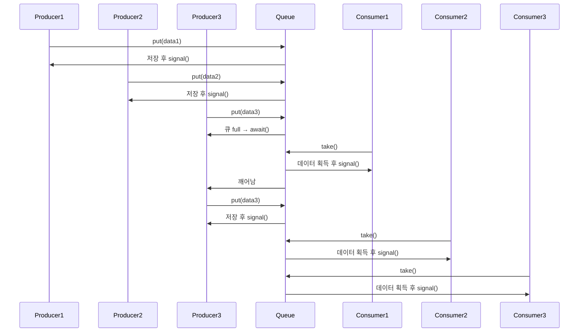
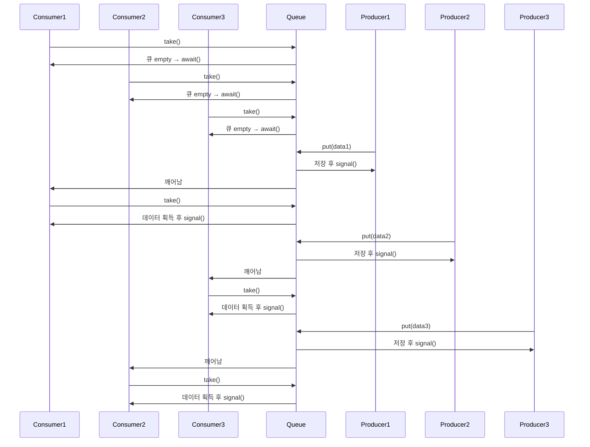

# 현재 소스의 단계적 개선

아래는 BoundedQueueV4의 구조와 동작을 시퀀스 다이어그램과 함께 단계적으로 정리한 내용입니다.  
이 구조는 ReentrantLock과 Condition을 활용한 동기화된 생산자-소비자 큐를 설명합니다.

## 소스 코드
```java
public class BoundedQueueV4 implements BoundedQueue {
    private final Lock lock = new ReentrantLock();
    private final Condition condition = lock.newCondition();
    private final Queue<String> queue = new ArrayDeque<>();
    private final int max;

    public BoundedQueueV4(int max) {
        this.max = max;
    }
    
    public void put(String data) {
        lock.lock();
        try {
            while (queue.size() == max) {
                log("[put] 큐가 가득 참, 생산자 대기");
                try {
                    condition.await();
                    log("[put] 생산자 깨어남");
                } catch (InterruptedException e) {
                    throw new RuntimeException(e);
                }
            }
            queue.offer(data);
            log("[put] 생산자 데이터 저장, signal() 호출");
            condition.signal();
        } finally {
            lock.unlock();
        }
    }

    public String take() {
        lock.lock();
        try {
            while (queue.isEmpty()) {
                log("[take] 큐에 데이터가 없음, 소비자 대기");
                try {
                    condition.await();
                    log("[take] 소비자 깨어남");
                } catch (InterruptedException e) {
                    throw new RuntimeException(e);
                }
            }
            String data = queue.poll();
            log("[take] 소비자 데이터 획득, signal() 호출");
            condition.signal();
            return data;
        } finally {
            lock.unlock();
        }
    }

    @Override
    public String toString() {
        return queue.toString();
    }
}
```
## 🎯 핵심 개념 요약

| 개념           | 대응 또는 설명                          |
|----------------|------------------------------------------|
| ReentrantLock  | `synchronized`의 명시적 락 대체           |
| Condition      | `wait()` / `notify()`의 명시적 대기 공간 |
| put()          | 큐가 full이면 `await()`, 저장 후 `signal()` |
| take()         | 큐가 empty이면 `await()`, 소비 후 `signal()` |
| 대기 공간 분리 | 생산자/소비자용 `Condition`을 따로 분리 가능 |

## 🧠 요점 정리
- ReentrantLock은 더 유연한 락 제어를 제공
- Condition은 스레드 대기 공간을 명시적으로 관리할 수 있게 해줌
- put()과 take()는 각각 반대편 스레드만 깨우는 방식으로 개선 가능
- 대기 공간을 분리하면 불필요한 깨어남 방지로 성능 향상


## 🧵 Mermaid 시퀀스 다이어그램: 생산자 먼저 실행



## 🧵 시퀀스 다이어그램: 소비자 먼저 실행


## ⚠️ 현재 소스의 구조적 문제 요약

| 항목                     | 설명                                                                 |
|--------------------------|----------------------------------------------------------------------|
| Lock                     | `ReentrantLock` 1개 사용 → 락 제어는 명시적이지만 대기 공간은 공유됨     |
| Condition                | `Condition` 1개만 사용 → 생산자와 소비자가 같은 공간에서 대기함         |
| signal() 호출 대상       | 생산자/소비자 구분 없이 무작위 스레드가 깨어남                         |
| 불필요한 깨어남          | 큐가 full인데 생산자가 깨어나거나, 큐가 empty인데 소비자가 깨어남         |
| 성능 저하                | 깨어난 스레드가 조건 불만족으로 다시 대기 → 반복적인 재대기 발생         |
| 개선 방향                | `Condition notFull`, `Condition notEmpty`로 분리 → 정확한 상대방만 깨움 |    

- 이 문제는 synchronized 방식과 본질적으로 동일한 비효율을 갖고 있으며, ReentrantLock을 사용했지만  
    대기 공간을 분리하지 않았기 때문에 개선 효과가 제한적입니다.


## 🔧 개선 방향: Condition 분리

| 항목        | 설명                                           |
|-------------|------------------------------------------------|
| Condition   | `notFull`, `notEmpty` 두 개로 분리             |
| 생산자 → 소비자 | 데이터 생산 후 `notEmpty.signal()` 호출       |
| 소비자 → 생산자 | 데이터 소비 후 `notFull.signal()` 호출        |

## 🧠 핵심 요점
- notFull: 큐가 가득 찼을 때 생산자 스레드가 대기하는 공간
- notEmpty: 큐가 비었을 때 소비자 스레드가 대기하는 공간
- 각각의 Condition은 정확한 대상만 깨우기 때문에 불필요한 깨어남 방지


## ✅ 다음 단계
- BoundedQueueV5로 개선: Condition notFull, Condition notEmpty 분리
- put() → notFull.await() / notEmpty.signal()
- take() → notEmpty.await() / notFull.signal()

---

# synchronized 빠지고 상대방을 깨우는 방식

synchronized가 빠진 이유와, 왜 상대방만 깨우는 방식이 중요한지를 좀 더 깊이 있게 설명.

## 🔧 왜 synchronized 대신 ReentrantLock을 쓰는가?

| 항목               | synchronized                      | ReentrantLock                          |
|--------------------|-----------------------------------|----------------------------------------|
| 락 제어 방식        | 암묵적                            | 명시적 (`lock.lock()` / `lock.unlock()`) |
| 대기 공간          | `wait()` / `notify()`             | `Condition` 객체로 명시적 분리 가능       |
| 제어 유연성        | 낮음                              | 높음 (공정성, 타임아웃, 인터럽트 지원 등) |
| 대상 스레드 깨우기 | `notify()` → 무작위 스레드        | `condition.signal()` → 정확한 대상만 깨움 |

## 🧠 핵심 요점
- 즉, ReentrantLock은 더 세밀한 제어와 확장성을 제공하며, 특히 생산자/소비자 대기 공간을 분리할 수 있다는 점이 핵심입니다.
    - ReentrantLock은 명시적 락 제어와 분리된 대기 공간을 제공하여 동기화 흐름을 더 세밀하게 제어할 수 있음
    - Condition을 사용하면 생산자/소비자용 대기 공간을 분리하여 불필요한 깨어남을 방지
    - synchronized는 간단하지만 확장성과 성능 면에서 제약이 있음


## 🎯 왜 **상대방만 깨우기** 가 중요한가?
기존 방식 (BoundedQueueV4)에서는 하나의 Condition만 사용하므로 signal()을 호출하면 생산자든 소비자든 무작위로 깨어납니다.  
이로 인해 다음과 같은 문제가 발생합니다:
## ❌ 문제점
- 큐가 가득 찼는데 소비자가 아닌 생산자가 깨어남 → 다시 대기
- 큐가 비었는데 생산자가 아닌 소비자가 깨어남 → 다시 대기
- 결과적으로 불필요한 깨어남과 재대기가 반복되어 성능 저하

## ✅ 해결책
대기 공간을 분리해서 생산자와 소비자가 서로의 상태만 감지하고 깨우도록 하면 됩니다:
```java
private final Condition notFull = lock.newCondition();   // 생산자 대기 공간
private final Condition notEmpty = lock.newCondition();  // 소비자 대기 공간
``
- put()에서 큐가 full이면 notFull.await() → 저장 후 notEmpty.signal()
- take()에서 큐가 empty이면 notEmpty.await() → 소비 후 notFull.signal()  

이렇게 하면 정확한 대상만 깨우기 때문에 불필요한 깨어남이 사라지고, 성능과 응답성이 향상됩니다.

## ✅ 정리: 핵심 차이점
| 항목               | 기존 방식 (synchronized / 단일 Condition) | 개선 방식 (ReentrantLock + 분리된 Condition) |
|--------------------|-------------------------------------------|---------------------------------------------|
| 락 제어             | 암묵적                                    | 명시적                                      |
| 대기 공간           | 하나                                     | 생산자용 / 소비자용 분리                    |
| signal 대상         | 무작위                                    | 정확한 상대방만                              |
| 성능 및 효율성      | 낮음                                     | 높음                                         |

---


