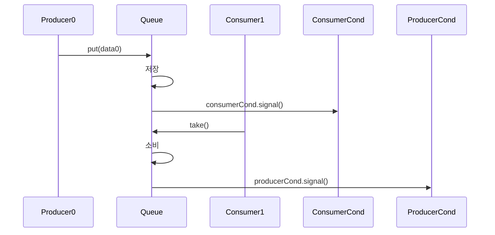
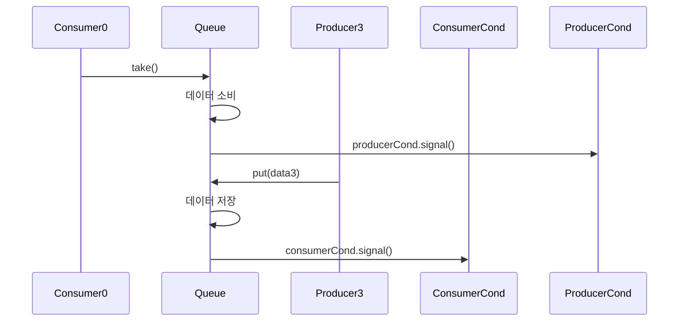

# 🎯 핵심 구조 요약: 생산자 / 소비자 대기 공간 분리

## 소스 코드
```java
public class BoundedQueueV5 implements BoundedQueue {
    private final Lock lock = new ReentrantLock();


    private final Condition producerCond = lock.newCondition();
    private final Condition consumerCond = lock.newCondition();


    private Queue<String> queue = new ArrayDeque<>();
    private final int max;

    public BoundedQueueV5(int max) {
        this.max = max;
    }

    public void put(String data) {
        lock.lock();
        try {
            while (queue.size() == max) {
                log("[put] 큐가 가득 참, 생산자 대기");
                producerCond.await();
                log("[put] 생산자 깨어남");
            }
            queue.offer(data);


            log("[put] 생산자 데이터 저장, consumerCond.signal() 호출");
            consumerCond.signal();

        } catch (InterruptedException e) {
            throw new RuntimeException(e);
        } finally {
            lock.unlock();
        }
    }
    public String take() {
        lock.lock();
        try {
            while (queue.isEmpty()) {
            
                log("[take] 큐에 데이터가 없음, 소비자 대기");
                consumerCond.await();

                log("[take] 소비자 깨어남");
            }

            String data = queue.poll();
            
            log("[take] 소비자 데이터 획득, producerCond.signal() 호출");
            producerCond.signal();

            return data;

        } catch (InterruptedException e) {
            throw new RuntimeException(e);
        } finally {
            lock.unlock();
        }
    }
    @Override
    public String toString() {
    return queue.toString();
    }
}
```

## 🔧 구조 요약

| 구성 요소         | 설명                                                  |
|------------------|-------------------------------------------------------|
| ReentrantLock     | 명시적 락 제어 (`lock.lock()` / `lock.unlock()`)       |
| producerCond      | 생산자 전용 대기 공간 (큐가 full일 때 대기)             |
| consumerCond      | 소비자 전용 대기 공간 (큐가 empty일 때 대기)            |
| put()             | 큐가 full이면 `producerCond.await()` → 저장 후 `consumerCond.signal()` |
| take()            | 큐가 empty이면 `consumerCond.await()` → 소비 후 `producerCond.signal()` |


## 🧵 시퀀스 다이어그램: `생산자 → 소비자 깨움`


## 🧵 시퀀스 다이어그램: `소비자 → 생산자 깨움`


## 🔍 개선 효과
| 항목               | 단일 Condition 방식 (V4)         | 분리된 Condition 방식 (V5)         |
|--------------------|----------------------------------|------------------------------------|
| 대기 공간 개수     | 1개                              | 2개 (`producerCond`, `consumerCond`) |
| signal 대상        | 무작위 스레드                    | 정확한 상대방 스레드만 깨움        |
| 불필요한 깨어남    | 자주 발생                        | 거의 없음                          |
| 성능 및 응답성     | 낮음                             | 높음                               |
| 코드 명확성        | 낮음                             | 높음                               |


## 🔍 Object.notify() vs Condition.signal() 비교
| 항목               | Object.notify()                  | Condition.signal()                  |
|--------------------|----------------------------------|-------------------------------------|
| 대상 스레드 선택   | 무작위 (JVM 구현에 따라 다름)     | 일반적으로 FIFO 순서               |
| 사용 위치          | `synchronized` 블록 내부          | `ReentrantLock`을 가진 스레드만 호출 가능 |
| 대기 공간 분리      | 불가능                           | 가능 (`lock.newCondition()`으로 생성) |

- 이 구조는 생산자와 소비자가 정확히 서로를 깨우는 방식으로 동작하기 때문에,  
    불필요한 깨어남 없이 효율적이고 깔끔한 동기화를 구현할 수 있습니다.
