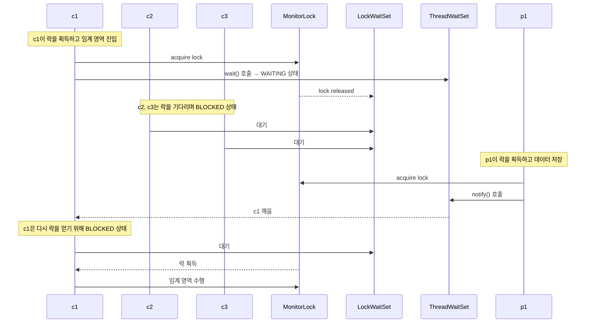
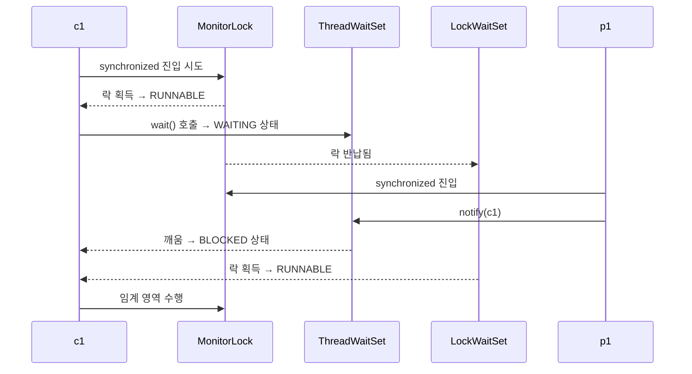

# synchronized 대기 상태 정리
아래는 synchronized의 두 가지 대기 상태와 자바의 락/스레드 대기 집합 구조를 정리한 내용입니다.  
흐름을 기반으로 시퀀스 다이어그램도 함께 구성했습니다.

## 🔒 synchronized의 두 가지 대기 상태

| 구분        | 상태     | 설명                         |
|-------------|----------|------------------------------|
| 락 대기     | BLOCKED  | 모니터 락을 얻기 위해 대기     |
| 조건 대기   | WAITING  | `wait()` 호출 후 조건 대기 집합에서 대기 |

## 🧠 핵심 요약
- `BLOCKED`: 다른 스레드가 synchronized 블록을 점유 중일 때, 락을 얻기 위해 락 대기 집합에서 대기
- `WAITING`: wait() 호출 시 스레드 대기 집합으로 이동하며 락을 반납

## 🧠 자바 객체의 내부 구조
자바의 모든 객체는 다음 3가지 요소를 내장하고 있습니다:
- 모니터 락: synchronized 블록 진입을 제어
- 락 대기 집합: 모니터 락을 기다리는 BLOCKED 스레드들
- 스레드 대기 집합: wait() 호출 후 대기 중인 WAITING 스레드들

## 🧵 시퀀스 다이어그램: 소비자 스레드의 대기 흐름

## 🔁 대기 흐름 요약

| 단계               | 설명                                               |
|--------------------|----------------------------------------------------|
| c1 → wait()        | `c1`이 락을 획득한 후 `wait()` 호출 → WAITING 상태 |
| c2, c3 → BLOCKED   | `c2`, `c3`는 락을 얻지 못해 락 대기 집합에서 BLOCKED |
| p1 → notify(c1)    | `p1`이 락을 획득하고 `notify()` 호출 → `c1` 깨움     |
| c1 → BLOCKED       | `c1`은 다시 락을 얻기 위해 락 대기 집합으로 이동     |
| c1 → RUNNABLE      | 락을 획득한 `c1`이 임계 영역 수행 가능 상태로 전환   |

## 🧠 흐름 요약
- `WAITING` 은 스레드 대기 집합에서의 대기
- `BLOCKED` 는 락 대기 집합에서의 대기
- `RUNNABLE` 은 락을 획득하고 임계 영역을 수행할 수 있는 상태

## 🔐 2중 대기소 개념

| 대기소 구분     | 상태     | 설명                                       |
|----------------|----------|--------------------------------------------|
| 1차 대기소     | BLOCKED  | 모니터 락을 얻기 위해 락 대기 집합에서 대기 |
| 2차 대기소     | WAITING  | `wait()` 호출 후 스레드 대기 집합에서 대기  |

## 🧠 핵심 요약
- `BLOCKED` : 락을 얻지 못한 스레드는 락 대기 집합에서 대기
- `WAITING` : wait() 호출 시 락을 반납하고 스레드 대기 집합에서 대기
- 스레드는 `WAITING` → `BLOCKED` → `RUNNABLE` 순으로 2중 감옥을 탈출해야 임계 영역을 수행할 수 있음

## ✅ 핵심 정리
- synchronized는 모니터 락을 기반으로 동작
- wait()는 스레드 대기 집합으로 이동하며 락을 반납
- notify()는 스레드 대기 집합에서 스레드를 깨움
- 깨운 스레드는 다시 락 대기 집합으로 이동해 락을 기다림
- 락을 획득해야만 임계 영역 수행 가능

---

# BLOCKED / WAITING

## 🔁 상태 전환은 "바뀌는" 게 아니라 "다른 경로로 진입"

| 상태     | 진입 조건        | 설명                                |
|----------|------------------|-------------------------------------|
| BLOCKED  | synchronized 진입 | 락을 얻지 못한 경우, 락 대기 집합에서 대기 |
| WAITING  | wait() 호출       | 락을 보유한 상태에서 wait() 호출 → 락 반납 후 스레드 대기 집합에서 대기 |

## 🧠 상태 전환 흐름 요약
### 🔹 BLOCKED 상태로 진입하는 시점
- 스레드가 synchronized 블록에 진입하려고 할 때
- 이미 다른 스레드가 해당 객체의 모니터 락을 보유 중이면
    - BLOCKED 상태로 전환되어 락 대기 집합에서 대기
### 🔹 WAITING 상태로 진입하는 시점
- 스레드가 이미 락을 보유한 상태에서 wait() 호출
    - 락을 반납하고 스레드 대기 집합으로 이동
    - WAITING 상태로 전환
### 🔹 WAITING → BLOCKED로 바뀌는 시점
- 다른 스레드가 notify() 또는 notifyAll() 호출
    - WAITING 상태의 스레드가 깨움 신호를 받음
    - 바로 실행되는 게 아니라 락을 다시 얻어야 함
    - 락이 없으면 BLOCKED 상태로 전환되어 락 대기 집합에서 대기

## 🔐 흐름 예시
- 1. c1이 synchronized 블록에 진입 → 락 획득 성공
- 2. c1이 wait() 호출 → WAITING 상태로 전환 (락 반납)
- 3. p1이 synchronized 블록에 진입 → notify(c1) 호출
- 4. c1이 깨움 → 락을 얻기 위해 BLOCKED 상태로 전환
- 5. 락을 획득하면 RUNNABLE 상태로 전환 → 임계 영역 수행

## 🧵 시퀀스 다이어그램: 상태 전환 흐름

## ✅ 핵심 정리
- BLOCKED와 WAITING은 서로 다른 대기 이유를 나타냄
- BLOCKED → RUNNABLE: 락을 획득하면 실행 가능
- WAITING → BLOCKED: notify()로 깨움 → 락을 얻기 전까지 BLOCKED
- 스레드는 `WAITING` → `BLOCKED` → `RUNNABLE` 순으로 2중 대기소를 통과해야 임계 영역을 수행할 수 있음

---

