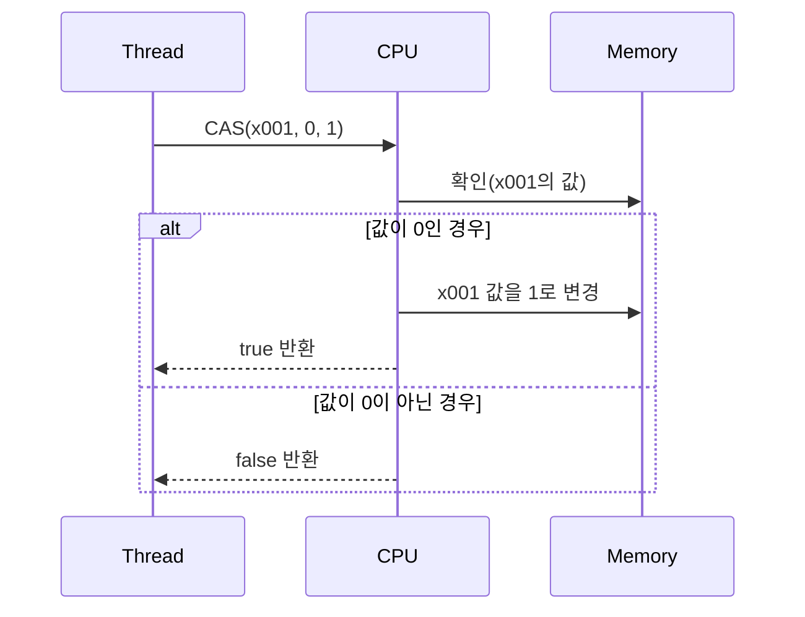

# CAS 
아래는 CAS(Compare-And-Swap) 연산의 동작 원리를 시퀀스 다이어그램으로 시각화한 내용과 함께,  
핵심 개념을 정리한 설명입니다.

## 📊 CAS(Compare-And-Swap) 연산 동작 원리


## 🧠 CAS 연산 핵심 요약
### 🔧 정의
- CAS (Compare-And-Swap): 메모리의 특정 위치에 있는 값이 기대한 값과 같으면, 새 값으로 원자적으로 교체하는 연산
### 🧬 동작 과정
- 비교(compare): 메모리 주소 x001의 값을 확인
- 교체(swap): 값이 기대한 값이면 새 값으로 변경
- 결과 반환: 성공 시 true, 실패 시 false
### 🛠️ 예시 코드
```java
AtomicInteger atomicInteger = new AtomicInteger(0);
boolean result = atomicInteger.compareAndSet(0, 1);
```

- compareAndSet(0, 1)은 내부적으로 CAS 연산을 수행
- 현재 값이 0이면 1로 변경하고 true 반환
- 값이 다르면 변경하지 않고 false 반환

## 🔒 CAS vs 락 기반 방식 비교 요약

| 항목               | CAS (Compare-And-Swap)         | synchronized / Lock 기반 방식       |
|--------------------|--------------------------------|-------------------------------------|
| 원자성 보장         | ✅ CPU 명령어로 보장             | ✅ 임계 영역으로 보장                |
| 성능               | 🚀 빠름 (락 없이 수행)           | 🐢 느림 (락 획득/반납 비용 발생)     |
| 스레드 대기         | 없음 (락 프리)                  | 있음 (다른 스레드는 대기)           |
| 교착 상태 위험      | 없음                            | 있음 (잘못된 락 사용 시 발생 가능)   |
| 적용 범위           | 제한적 (단일 값 변경에 적합)     | 광범위 (복잡한 연산에 적합)         |
| 구현 복잡도         | 높음 (재시도 루프 필요할 수 있음) | 낮음 (직관적인 코드 작성 가능)       |
| 대표 API           | `compareAndSet()`              | `synchronized`, `ReentrantLock`     |

## 🧠 핵심 요약
- CAS는 CPU가 제공하는 원자적 명령어로 락 없이도 안전한 연산을 수행하는 고성능 락 프리 기법
- synchronized/Lock은 직관적이고 범용적이지만, 성능과 병목 측면에서 CAS보다 무거울 수 있음
- 실무에서는 AtomicInteger처럼 CAS 기반 API를 활용하면 성능과 안정성을 동시에 확보 가능


## ✅ 결론
- CAS는 CPU가 제공하는 원자적 명령어를 활용해 락 없이 안전한 값 변경을 가능하게 함
- AtomicInteger.compareAndSet()은 CAS 연산을 자바에서 쉽게 사용할 수 있도록 추상화한 메서드
- CAS는 락 기반 방식보다 성능이 우수하지만, 복잡한 연산에는 여전히 락이 필요할 수 있음

---

