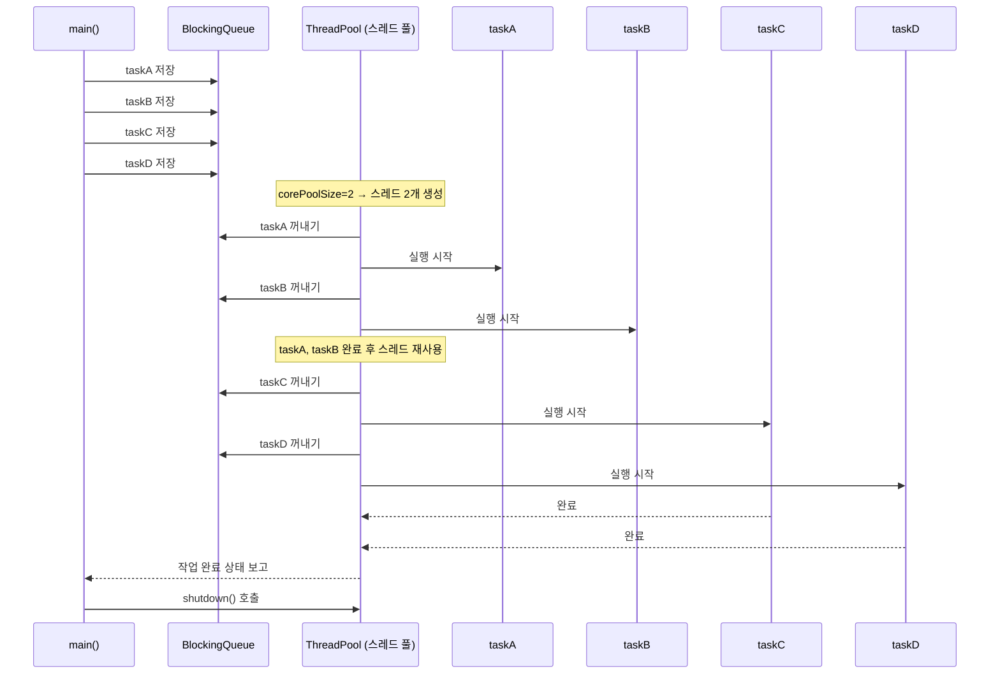

# ThreadPoolExecutor

아래는 자바의 ThreadPoolExecutor 구조와 실행 흐름을 시퀀스 다이어그램으로 시각화한 내용과 함께, 핵심 개념을 정리한 요약입니다.

## 🎯 ThreadPoolExecutor 실행 흐름



### 🧠 핵심 요약
### ✅ 스레드를 직접 사용할 때의 문제점

| 항목               | 설명 요약                                                   |
|--------------------|--------------------------------------------------------------|
| 성능 문제           | 스레드 생성 시 메모리 할당, 시스템 콜 등으로 비용이 큼         |
| 관리 문제           | 스레드 수 제한, 종료 처리, 인터럽트 등 복잡한 관리 필요       |
| `Runnable` 제약     | 반환값 없음, 예외 처리 불편 → 결과 수집 및 오류 추적 어려움    |

#### 🧠 핵심 포인트
- 스레드는 생성 비용이 크고, 직접 관리하기 어렵다
- Runnable은 단순하지만 실행 결과를 직접 받을 수 없고, 예외 처리도 제한적
- 실무에서는 이런 문제를 해결하기 위해 Executor 프레임워크를 사용하여 스레드 풀과 작업 관리를 효율화함


### ✅ 해결책: Executor 프레임워크

| 구성 요소           | 역할 및 기능 설명                                |
|--------------------|--------------------------------------------------|
| `Executor`         | `execute(Runnable)` 메서드로 작업 실행 요청 처리 |
| `ExecutorService`  | `submit()`, `shutdown()` 등 고급 제어 기능 제공   |
| `ThreadPoolExecutor`| 스레드 풀과 작업 큐를 직접 관리하는 핵심 구현체  |
| `BlockingQueue`    | 작업을 안전하게 보관하고 스레드가 꺼내서 처리함   |

#### 🧠 핵심 포인트
- ExecutorService는 실무에서 가장 많이 사용되는 인터페이스로, 스레드 풀 관리 + 작업 제출 + 종료 제어까지 담당
- ThreadPoolExecutor는 스레드 재사용, 작업 큐 처리, 성능 최적화를 위한 핵심 클래스
- BlockingQueue는 생산자-소비자 문제 해결을 위한 안전한 작업 저장소


## ⚙️ ThreadPoolExecutor 생성자 구성
```java
new ThreadPoolExecutor(
    corePoolSize,       // 기본 스레드 수
    maximumPoolSize,    // 최대 스레드 수
    keepAliveTime,      // 초과 스레드 생존 시간
    TimeUnit.MILLISECONDS,
    new LinkedBlockingQueue<>() // 작업 큐
);
```

## 📊 실행 상태 로그 예시

| 항목             | 설명 요약                                           |
|------------------|------------------------------------------------------|
| `pool`           | 현재 스레드 풀에 존재하는 스레드 수                  |
| `active`         | 현재 작업을 수행 중인 스레드 수                      |
| `queuedTasks`    | 작업 큐에 대기 중인 작업 수                          |
| `completedTasks` | 완료된 작업 수                                       |

### 🧠 활용 팁
- pool과 active를 비교하면 스레드 활용률을 파악할 수 있습니다
- queuedTasks가 많다면 작업이 몰리고 있다는 신호일 수 있습니다
- completedTasks는 전체 처리량을 추적하는 데 유용합니다


## ✅ 결론
- 실무에서는 스레드를 직접 생성하지 않고 Executor 프레임워크를 사용해야 함
- ThreadPoolExecutor는 스레드 재사용, 작업 큐 관리, 자원 최적화를 모두 해결
- ExecutorService를 통해 반환값 처리, 예외 관리, 스레드 종료 제어까지 가능

---

# ThreadPoolExecutor 사용법 샘플 코드

아래는 앞서 설명한 구조와 흐름을 기반으로 한 ThreadPoolExecutor 사용법 샘플 코드입니다.  
스레드 풀을 생성하고, 작업을 제출하고, 상태를 모니터링하는 기본 흐름을 담았습니다.

## ✅ ThreadPoolExecutor 사용법 샘플
### 📦 1. 작업 정의: RunnableTask
```java
package thread.executor;

import static util.MyLogger.log;
import static util.ThreadUtils.sleep;

public class RunnableTask implements Runnable {
    private final String name;
    private final int sleepMs;

    public RunnableTask(String name, int sleepMs) {
        this.name = name;
        this.sleepMs = sleepMs;
    }

    @Override
    public void run() {
        log(name + " 시작");
        sleep(sleepMs); // 작업 시간 시뮬레이션
        log(name + " 완료");
    }
}
```


### 🧾 2. 상태 출력 유틸리티: ExecutorUtils
```java
package thread.executor;

import java.util.concurrent.ExecutorService;
import java.util.concurrent.ThreadPoolExecutor;

import static util.MyLogger.log;

public abstract class ExecutorUtils {
    public static void printState(ExecutorService executorService) {
        if (executorService instanceof ThreadPoolExecutor poolExecutor) {
            int pool = poolExecutor.getPoolSize();
            int active = poolExecutor.getActiveCount();
            int queuedTasks = poolExecutor.getQueue().size();
            long completedTask = poolExecutor.getCompletedTaskCount();
            log("[pool=" + pool + ", active=" + active +
                ", queuedTasks=" + queuedTasks +
                ", completedTasks=" + completedTask + "]");
        } else {
            log(executorService.toString());
        }
    }
}
```


### 🚀 3. 실행 코드: ExecutorBasicMain
```java
package thread.executor;

import java.util.concurrent.ExecutorService;
import java.util.concurrent.LinkedBlockingQueue;
import java.util.concurrent.ThreadPoolExecutor;
import java.util.concurrent.TimeUnit;

import static thread.executor.ExecutorUtils.printState;
import static util.MyLogger.log;
import static util.ThreadUtils.sleep;

public class ExecutorBasicMain {
    public static void main(String[] args) throws InterruptedException {
        
        ExecutorService es = new ThreadPoolExecutor(
            2, 2, 0,
            TimeUnit.MILLISECONDS,
            new LinkedBlockingQueue<>()
        );

        log("== 초기 상태 ==");
        printState(es);

        es.execute(new RunnableTask("taskA", 1000));
        es.execute(new RunnableTask("taskB", 1000));
        es.execute(new RunnableTask("taskC", 1000));
        es.execute(new RunnableTask("taskD", 1000));

        log("== 작업 수행 중 ==");
        printState(es);

        sleep(3000);

        log("== 작업 수행 완료 ==");
        printState(es);

        es.shutdown(); // 자바 19 이상이면 es.close()도 가능
        log("== shutdown 완료 ==");
        printState(es);
    }
}
```


## 📊 실행 흐름 요약

| 단계               | 설명 요약                                                   |
|--------------------|--------------------------------------------------------------|
| 초기 상태           | 스레드 풀 생성 직후, 스레드 없음 (`pool=0`, `active=0`)       |
| 작업 제출           | `taskA` ~ `taskD` 작업이 큐에 저장됨                          |
| 스레드 생성         | `corePoolSize`만큼 스레드 생성 (예: 2개)                      |
| 작업 실행           | 생성된 스레드가 큐에서 작업 꺼내 실행 (`active=2`)            |
| 작업 완료           | 스레드는 다시 대기 상태로 전환, 큐에서 다음 작업 처리         |
| 종료 처리           | `shutdown()` 호출 → 스레드 풀 종료, 스레드 제거 (`pool=0`)    |

### 🧠 핵심 포인트
- ThreadPoolExecutor는 작업이 들어올 때만 스레드를 생성하며, corePoolSize까지만 유지
- 작업이 많아지면 큐에 대기하고, 스레드가 재사용되며 처리
- shutdown() 또는 close()를 호출하면 스레드 풀이 안전하게 종료

---

# 메소드 정리

## ✅ ExecutorService 주요 메서드 요약
| 메서드                  | 설명                                                                 |
|-------------------------|----------------------------------------------------------------------|
| `execute(Runnable)`     | 작업을 실행하지만 반환값 없음. 단순 실행용                           |
| `submit(Callable)`      | 작업을 실행하고 `Future` 객체로 결과를 반환                          |
| `shutdown()`            | 더 이상 작업을 받지 않고, 현재 작업이 끝나면 종료                     |
| `shutdownNow()`         | 현재 실행 중인 작업을 중단하고 즉시 종료 시도                         |
| `awaitTermination()`    | 모든 작업이 완료될 때까지 대기                                         |
| `invokeAll()`           | 여러 `Callable` 작업을 동시에 실행하고, 모든 결과를 `Future`로 반환     |
| `invokeAny()`           | 여러 `Callable` 중 가장 먼저 완료된 하나의 결과만 반환                 |


## 🧪 샘플 예제: 주요 메서드 사용
```java
import java.util.Arrays;
import java.util.List;
import java.util.concurrent.*;

public class ExecutorServiceSample {
    public static void main(String[] args) throws Exception {
        ExecutorService executor = Executors.newFixedThreadPool(2);

        // 1. execute(Runnable) - 반환값 없음
        executor.execute(() -> System.out.println("Runnable 실행"));

        // 2. submit(Callable) - 결과 반환
        Future<String> future = executor.submit(() -> {
            Thread.sleep(500);
            return "Callable 결과";
        });
        System.out.println("submit 결과: " + future.get());

        // 3. invokeAll(List<Callable>) - 모든 작업 결과 반환
        List<Callable<String>> tasks = Arrays.asList(
            () -> "작업1",
            () -> "작업2",
            () -> "작업3"
        );
        List<Future<String>> results = executor.invokeAll(tasks);
        for (Future<String> result : results) {
            System.out.println("invokeAll 결과: " + result.get());
        }

        // 4. invokeAny(List<Callable>) - 가장 빠른 하나의 결과만 반환
        String fastest = executor.invokeAny(tasks);
        System.out.println("invokeAny 결과: " + fastest);

        // 5. shutdown() - 정상 종료
        executor.shutdown();
        if (executor.awaitTermination(3, TimeUnit.SECONDS)) {
            System.out.println("모든 작업 종료 완료");
        } else {
            System.out.println("작업 종료 대기 시간 초과");
        }
    }
}
```

## 🧠 핵심 포인트
- execute()는 단순 실행용이며 결과를 받을 수 없음
- submit()은 Future를 통해 결과와 예외를 처리할 수 있음
- invokeAll()은 병렬 작업을 모두 기다리고 결과를 수집
- invokeAny()는 가장 빠른 하나의 결과만 반환
- shutdown()과 awaitTermination()은 안전한 종료를 위한 필수 절차

---


---

