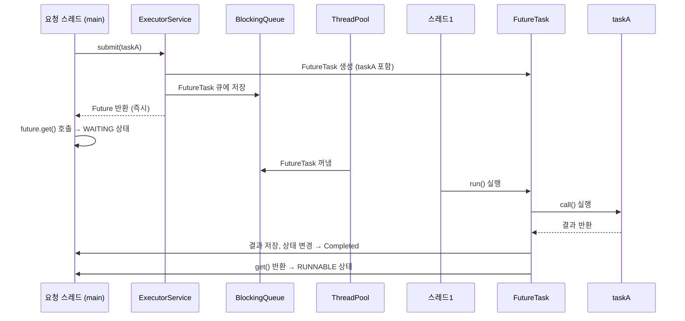
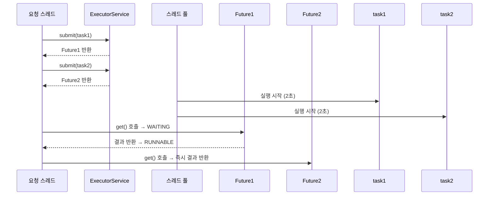

# Future 사용

## ✅ Runnable의 불편함

| 항목             | 설명 요약                                                   |
|------------------|--------------------------------------------------------------|
| 반환값 없음       | `run()`은 값을 반환하지 않음 → 결과를 얻으려면 `join()` 후 멤버 변수 조회 필요 |
| 예외 처리 제한    | `run()`은 체크 예외를 던질 수 없음 → 내부에서 try-catch로 처리해야 함         |
| 결과 수집 복잡    | 실행 결과를 외부에서 수집하려면 멤버 변수 + 스레드 종료 대기 + 값 조회 필요     |

## 🧠 핵심 포인트
- Runnable은 단순 실행에는 적합하지만, 비동기 결과 처리에는 불편함이 많음
- 실무에서는 Callable과 Future를 통해 값 반환 + 예외 처리 + 결과 수집을 간편하게 처리하는 방식이 선호됨


## 🔧 Runnable 사용 예시
```java
MyRunnable task = new MyRunnable();
Thread thread = new Thread(task);
thread.start();
thread.join(); // 스레드 종료 대기
int result = task.value; // 결과 수집
```
- value 필드에 결과 저장
- main 스레드는 join()으로 대기 후 결과 조회
- 구조가 복잡하고, 예외 처리도 제한적

## ✅ 해결책: Callable + Future

| 구성 요소         | 설명 요약                                                   |
|------------------|--------------------------------------------------------------|
| `Callable<V>`     | `call()` 메서드에서 결과값 `V`를 반환할 수 있음               |
| `Future<V>`       | 비동기 작업의 결과를 조회하거나 예외, 취소 여부를 확인할 수 있음 |
| `submit(Callable)`| `ExecutorService`에 작업을 제출하고 `Future`로 결과를 받음     |

### 🧠 핵심 포인트
- Callable은 Runnable과 달리 값 반환 + 예외 처리 가능
- Future는 작업 완료 여부 확인, 결과 조회, 예외 처리, 취소까지 지원
- submit()을 통해 Callable을 실행하면 비동기 결과를 안전하게 수집할 수 있음


## 🔁 구조 비교

| 항목             | Runnable                          | Callable<V>                          |
|------------------|-----------------------------------|--------------------------------------|
| 반환값           | ❌ 없음                            | ✅ `V` 타입의 값 반환 가능             |
| 메서드 이름       | `run()`                           | `call()`                             |
| 예외 처리         | ❌ 체크 예외 던질 수 없음           | ✅ 체크 예외 던질 수 있음              |
| 결과 수집 방식    | `join()` 후 멤버 변수로 수집        | `Future.get()` 으로 직접 수집 가능     |
| 사용 목적         | 단순 실행                          | 결과 반환이 필요한 비동기 작업         |

### 🧠 핵심 요약
- Runnable은 단순한 작업 실행에 적합하지만, 결과나 예외를 다루기엔 불편
- Callable은 값 반환 + 예외 처리 + Future 연동이 가능해 실무에서 훨씬 유용
- ExecutorService.submit(Callable)을 통해 Future로 결과를 안전하게 수집 가능


## 🧪 Callable + Future 예시
```java
ExecutorService executor = Executors.newSingleThreadExecutor();

Callable<Integer> task = () -> {
    Thread.sleep(2000);
    return new Random().nextInt(10);
};

Future<Integer> future = executor.submit(task);
Integer result = future.get(); // 결과 대기 및 수집
System.out.println("result = " + result);

executor.shutdown();
```
- submit()으로 작업 제출
- get()으로 결과 수집 (예외 발생 시 처리 가능)
- 코드가 훨씬 간결하고 안전함

## 소스 코드
```java
public interface Callable<V> {
    V call() throws Exception;
}
```
```java
public class CallableMainV1 {
    public static void main(String[] args) throws ExecutionException, InterruptedException {
        
        ExecutorService es = Executors.newFixedThreadPool(1);
        Future<Integer> future = es.submit(new MyCallable());

        Integer result = future.get();
        log("result value = " + result);

        es.close();
    }

    static class MyCallable implements Callable<Integer> {
    
        @Override
        public Integer call() {

            log("Callable 시작");
            sleep(2000);
            
            int value = new Random().nextInt(10);
            
            log("create value = " + value);
            log("Callable 완료");
            
            return value;
        }
    }
}
```

## 📊 실행 결과 예시
```
[pool-1-thread-1] Callable 시작
[pool-1-thread-1] create value = 4
[pool-1-thread-1] Callable 완료
[main] result value = 4
```
- 스레드 풀의 스레드가 Callable 작업을 실행
- 결과는 Future를 통해 main 스레드가 수집


## 🧠 결론
- Runnable은 단순하지만 결과 수집과 예외 처리에 한계
- Callable과 Future는 비동기 작업의 결과와 예외를 안전하게 처리할 수 있는 구조 제공
- 실무에서는 ExecutorService와 함께 Callable을 사용하는 것이 훨씬 효율적이고 안정적
- Callable은 값 반환 + 예외 처리 + Future 연동이 가능해 실무에서 훨씬 유용
- ExecutorService.submit(Callable)을 통해 스레드 풀 기반의 고성능 비동기 처리가 가능

## ✅ Executor 프레임워크의 강점

| 항목               | 설명 요약                                                   |
|--------------------|--------------------------------------------------------------|
| 스레드 직접 생성 불필요 | `Thread` 객체 없이 작업 제출만으로 실행 가능                    |
| 결과 수집 간편        | `Future.get()`으로 결과를 바로 조회 가능                         |
| 예외 처리 유연        | `Callable`은 체크 예외를 던질 수 있어 예외 처리에 유리             |
| 코드 구조 간결        | 복잡한 동기화 없이 깔끔한 비동기 처리 가능                         |
| 스레드 풀 관리 자동화 | 스레드 재사용, 큐 관리, 종료 처리까지 자동으로 관리됨               |

### 🧠 핵심 요약
- Executor 프레임워크는 스레드 생성, 실행, 종료, 결과 수집까지 모든 과정을 자동화
- 개발자는 작업만 정의하고 제출하면 되며, 복잡한 멀티스레드 코드를 직접 작성할 필요 없음
- 실무에서는 ExecutorService와 Callable을 함께 사용하여 안정적이고 효율적인 병렬 처리를 구현함


## ❓ 왜 Future를 반환할까?
- Future는 작업이 완료되었는지 여부를 확인하고, 결과를 기다릴 수 있는 구조를 제공
- future.get()을 호출하면:
    - 작업이 완료된 경우 → 즉시 결과 반환
    - 작업이 진행 중인 경우 → 현재 스레드는 블로킹 상태로 대기
    - 즉, Future는 비동기 작업의 상태와 결과를 안전하게 관리하기 위한 핵심 인터페이스

## 🧠 결론
- Runnable은 단순 실행에는 적합하지만, 결과 반환과 예외 처리에는 한계
- Callable과 Future는 비동기 작업의 결과 수집과 예외 처리를 간결하고 안전하게 처리할 수 있음
- ExecutorService.submit(Callable)을 통해 스레드 풀 기반의 고성능 비동기 처리가 가능

---

# ✅ Future 핵심 정리

## 🔍 개념 요약

| 항목             | 설명 요약                                                   |
|------------------|--------------------------------------------------------------|
| `Future`         | 미래에 완료될 작업의 결과를 담는 객체                        |
| `submit()`       | 작업을 제출하고 즉시 `Future` 객체를 반환 (논블로킹)         |
| `future.get()`   | 작업 결과를 조회하는 블로킹 메서드                            |
| `FutureTask`     | `Future`의 대표 구현체, 내부에 `Callable` 작업 포함           |
| `get()`          | 작업이 완료되면 결과를 반환, 완료 전에는 대기 (블로킹)        |

### 🧠 핵심 포인트
- Future는 작업의 미래 결과를 표현하는 객체로, 비동기 처리의 핵심
- submit()은 작업을 큐에 넣고 즉시 Future 반환
- get()은 작업이 완료될 때까지 **대기(블로킹)** 하며, 완료되면 결과 반환
- 내부적으로는 FutureTask가 작업 실행과 결과 저장을 담당


### 🧠 왜 Future가 필요한가?
- submit()에서 결과를 직접 반환하면 작업 완료까지 대기해야 함
- Future는 작업을 제출한 즉시 반환되며, 필요할 때 결과를 조회할 수 있음
- 이를 통해 비동기 처리와 병렬 실행이 가능해짐

### 🧭 Future 동작 흐름 (시퀀스 다이어그램)



## 📊 상태 변화 요약
| 단계               | 상태 변화 설명                                               |
|--------------------|--------------------------------------------------------------|
| `submit()` 호출     | `Future` 객체 즉시 반환 → 상태: `Not completed`             |
| 작업 실행 시작       | `FutureTask.run()` → 내부에서 `Callable.call()` 실행         |
| `Future.get()` 호출 | 요청 스레드는 결과를 기다리며 `WAITING` 상태로 진입         |
| 작업 완료           | `Future` 상태: `Completed normally`, 결과 저장됨             |
| `get()` 반환        | 요청 스레드가 `RUNNABLE` 상태로 복귀, 결과 수신              |

### 🧠 핵심 흐름 요약
- submit()은 즉시 Future 반환 → 요청 스레드는 자유롭게 다음 코드 실행 가능
- get()은 작업 완료 전까지 블로킹 → 결과가 준비되면 반환
- Future는 작업의 상태와 결과를 안전하게 관리하는 비동기 도구


## ✅ 결론
- Future는 비동기 작업의 결과를 안전하게 관리하는 핵심 도구
- submit()은 즉시 반환되며, 작업은 스레드 풀에서 실행
- get()은 작업이 완료될 때까지 블로킹되며, 완료되면 결과를 반환
- 실무에서는 Future를 통해 병렬 처리, 작업 추적, 예외 관리를 효율적으로 수행


# Future의 올바른 사용법

아래는 Future의 활용 목적, 올바른 사용법, 그리고 잘못된 사용법을 실제 코드 흐름과 함께 정리한 내용입니다.  
ExecutorService와 Callable을 활용한 병렬 처리의 핵심을 이해하는 데 도움이 됨.

## ✅ 1. Runnable 방식: 직접 스레드 관리
```java
Thread thread1 = new Thread(task1);
Thread thread2 = new Thread(task2);
thread1.start();
thread2.start();
thread1.join(); // 결과 대기
thread2.join(); // 결과 대기
int sumAll = task1.result + task2.result;
```
- 직접 스레드 생성 및 관리
- 결과는 result 필드에 저장 → join() 후 수집
- 단점: 스레드 관리 복잡, 예외 처리 불편, 반환값 구조 비직관적

## ✅ 2. Callable + Future 방식: ExecutorService 활용
```java
Future<Integer> future1 = es.submit(task1); // 비동기 요청
Future<Integer> future2 = es.submit(task2); // 비동기 요청
Integer sum1 = future1.get(); // 결과 대기
Integer sum2 = future2.get(); // 결과 대기
int sumAll = sum1 + sum2;
```

- submit()은 즉시 Future 반환 → 요청 스레드는 자유롭게 다음 작업 가능
- get()은 결과가 필요할 때만 블로킹
- 장점: 코드 간결, 결과 반환 직관적, 예외 처리 가능

## 🔁 비교: Future vs 직접 반환

| 항목                     | `Future` 사용 방식                          | 직접 반환 방식 (가정)                     |
|--------------------------|---------------------------------------------|-------------------------------------------|
| 작업 요청 방식            | `submit()` 후 즉시 `Future` 반환 (논블로킹) | `submit()` 호출 시 결과 반환 (블로킹)     |
| 병렬 처리 가능 여부       | ✅ 여러 작업을 동시에 요청 가능              | ❌ 작업 순차 요청 → 병렬 처리 불가능       |
| 요청 스레드 상태          | 작업 요청 후 자유롭게 다음 코드 실행 가능   | 작업 요청 후 결과 받을 때까지 대기         |
| 전체 처리 시간            | ✅ 병렬 처리로 시간 단축 가능 (예: 2초)      | ❌ 직렬 처리로 시간 증가 (예: 4초)         |
| 코드 유연성               | `get()` 호출 시점 조절 가능                 | 결과 즉시 필요 → 유연성 낮음              |

### 🧠 핵심 요약
- Future는 작업 요청과 결과 수집을 분리함으로써 병렬 처리와 코드 유연성을 제공
- 직접 반환 방식은 결과를 즉시 받아야 하므로 병렬 처리 불가능
- 실무에서는 Future를 통해 비동기 작업을 동시에 요청하고, 필요할 때 결과를 수집하는 방식이 효율적


##  ❌ 잘못된 Future 사용 예
### 예1: 요청 후 즉시 get() 호출
```java
Future<Integer> future1 = es.submit(task1);
Integer sum1 = future1.get(); // 2초 대기
Future<Integer> future2 = es.submit(task2);
Integer sum2 = future2.get(); // 또 2초 대기
```
- 총 4초 소요
- 병렬 처리의 이점을 활용하지 못함

### 예2: submit().get() 바로 연결
```java
Integer sum1 = es.submit(task1).get(); // 2초 대기
Integer sum2 = es.submit(task2).get(); // 또 2초 대기
```
- 위와 동일하게 직렬 처리처럼 동작

### ✅ 올바른 Future 사용 예
```java
Future<Integer> future1 = es.submit(task1); // 비동기 요청
Future<Integer> future2 = es.submit(task2); // 비동기 요청
Integer sum1 = future1.get(); // 2초 대기
Integer sum2 = future2.get(); // 즉시 반환 (이미 완료됨)
```

- 총 2초 소요
- 두 작업을 동시에 요청 → 병렬 처리 성공


###  ✅ 올바른 Future 사용 흐름
```java
Future<Integer> future1 = es.submit(task1); // 비동기 요청
Future<Integer> future2 = es.submit(task2); // 비동기 요청

Integer sum1 = future1.get(); // 작업1 결과 대기 (2초)
Integer sum2 = future2.get(); // 작업2 결과 즉시 반환 (이미 완료됨)

int total = sum1 + sum2; // 두 결과의 합 계산
```

- task1과 task2는 동시에 실행되므로 병렬 처리가 됩니다.
- future1.get()은 작업1이 끝날 때까지 블로킹되지만,
- future2.get()은 이미 작업2가 끝났기 때문에 즉시 반환됩니다.
- 따라서 sum1 + sum2는 두 작업의 결과를 더한 최종 합계가 맞습니다.

## 🧠 핵심 포인트
- Future.get()은 작업이 완료된 시점에만 블로킹되므로, 병렬로 작업을 요청한 뒤 결과를 순차적으로 수집하면 효율적입니다.
- sum1 + sum2는 정상적으로 두 작업의 결과를 더한 값입니다.

## 🧠 핵심 요약

| 항목             | 설명 요약                                                   |
|------------------|--------------------------------------------------------------|
| `Future`         | 미래에 완료될 작업의 결과를 담는 객체                        |
| `submit()`       | 작업을 제출하고 즉시 `Future` 반환 (논블로킹)                |
| `get()`          | 작업 결과를 조회하는 블로킹 메서드                            |
| `submit()` + `get()` | 작업을 동시에 요청하고, 필요할 때 결과를 수집 가능            |
| `get()` 시점 조절 | 여러 작업을 먼저 요청한 뒤, 결과를 순차적으로 수집 가능         |

### 🧠 핵심 포인트
- Future는 비동기 작업의 결과를 나중에 받을 수 있게 해주는 객체
- submit()은 즉시 반환되므로 요청 스레드는 자유롭게 다음 작업 가능
- get()은 작업이 완료될 때까지 블로킹되며, 결과를 안전하게 수집
- 여러 작업을 동시에 요청하고, 필요할 때만 결과를 수집하는 구조가 병렬 처리의 핵심


## 🧭 시각적 흐름

## 🔧 주요 기능 정리

| 메서드/속성              | 설명 또는 반환값                                      |
|--------------------------|--------------------------------------------------------|
| `get()`                  | 작업 완료까지 블로킹 대기 후 결과 반환                  |
| `get(timeout, unit)`     | 지정된 시간 내 결과 대기, 초과 시 `TimeoutException` 발생 |
| `cancel(true/false)`     | 작업 취소 시도 (`true`: 인터럽트, `false`: 인터럽트 없음) |
| `isCancelled()`          | 작업이 취소되었는지 여부 확인 (`true` 또는 `false`)     |
| `isDone()`               | 작업이 완료되었는지 여부 확인 (`true` 또는 `false`)     |
| `state()` (Java 19~)     | `RUNNING`, `SUCCESS`, `FAILED`, `CANCELLED` 중 하나 반환 |

### 🧠 핵심 포인트
- get()은 결과 수집용 블로킹 메서드이며, 예외 발생 시 ExecutionException으로 감싸져 전달됨
- cancel()은 작업 중단을 시도하며, 실행 중인 작업에 인터럽트를 걸 수 있음
- state()는 Java 19부터 도입된 기능으로, 작업의 현재 상태를 명확하게 표현함

---

### 🧪 예제 1: 작업 취소
```java
Future<String> future = es.submit(new MyTask());
Thread.sleep(3000); // 작업 중간에 취소 시도
future.cancel(true); // 실행 중인 작업에 인터럽트
```

### 결과
```
작업 중: 0
작업 중: 1
작업 중: 2
인터럽트 발생
Future는 이미 취소 되었습니다.
```
- cancel(true) → 실행 중인 작업에 Thread.interrupt() 발생
- get() 호출 시 → CancellationException 발생

### 🧪 예제 2: 취소하지만 인터럽트 없이
```java
future.cancel(false); // 실행 중인 작업은 계속 진행
```

### 결과
```
작업 중: 0
작업 중: 1
작업 중: 2
작업 중: 3
...
작업 중: 9
Future는 이미 취소 되었습니다.
```
- cancel(false) → 작업은 계속 진행되지만 Future는 취소 상태
- get() 호출 시 → 여전히 CancellationException 발생

### 🧪 예제 3: 예외 처리
```java
Future<Integer> future = es.submit(() -> {
    throw new IllegalStateException("ex!");
});
Integer result = future.get(); // 예외 발생
```

### 결과
```java
ExecutionException: java.lang.IllegalStateException: ex!
cause = java.lang.IllegalStateException: ex!
```
- 작업 중 예외 발생 시 → ExecutionException으로 래핑되어 get()에서 던져짐
- getCause()로 원본 예외 확인 가능

## 🧠 핵심 요약

| 항목                     | 설명 요약                                                   |
|--------------------------|--------------------------------------------------------------|
| `get()`                  | 작업 완료까지 대기 후 결과 반환 (블로킹)                     |
| `ExecutionException`     | `get()` 호출 시 작업 중 예외 발생 시 감싸서 던지는 예외        |
| `cancel(true/false)`     | 작업 취소 시도 (`true`: 인터럽트, `false`: 인터럽트 없음)     |
| `isDone()`               | 작업이 완료되었는지 여부 확인 (`true`/`false`)               |
| `isCancelled()`          | 작업이 취소되었는지 여부 확인 (`true`/`false`)               |
| `state()` (Java 19~)     | `RUNNING`, `SUCCESS`, `FAILED`, `CANCELLED` 중 하나 반환       |


## 🧠 추가 팁
- get()은 정상 결과 또는 예외를 반환하므로 항상 try-catch로 감싸는 것이 안전합니다.
- cancel(true)는 작업 중단을 시도하며, InterruptedException을 유발할 수 있습니다.
- state()는 Java 19부터 도입된 기능으로, 작업의 현재 상태를 명확하게 파악할 수 있습니다.


## ✅ 실무 팁
- Future.get()은 결과뿐 아니라 예외도 전달하므로 반드시 try-catch로 감싸야 안전합니다.
- cancel(true)는 작업 중단을 시도하지만, 실제 중단 여부는 작업 코드가 InterruptedException을 처리하는지에 따라 달라집니다.
- get(timeout, unit)은 무한 대기를 방지할 수 있어 안정적인 시스템 설계에 유용합니다.

----

