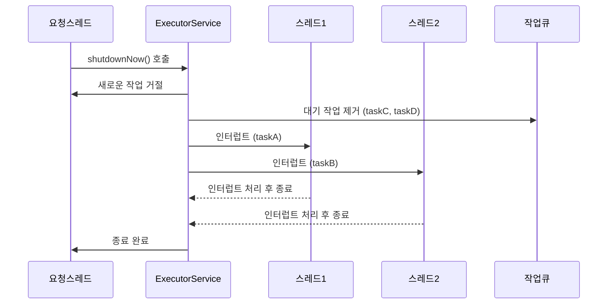

# ExecutorService shutdown / shutdownNow 전체 흐름 요약
## ✅ Graceful Shutdown (shutdown())
- 새로운 작업은 거절
- 이미 제출된 작업은 모두 완료
- 큐에 대기 중인 작업도 실행
- 모든 작업 완료 후 자원 정리

## ❌ Immediate Shutdown (shutdownNow())
- 새로운 작업은 거절
- 큐에 있는 작업은 제거 후 반환
- 실행 중인 작업은 인터럽트 발생
- 큐에 있던 작업은 실행되지 않음
- 자원 정리

## 🧠 관련 메서드 요약

| 메서드             | 설명                                                             |
|--------------------|------------------------------------------------------------------|
| `shutdown()`         | 새로운 작업은 거절하고, 이미 제출된 작업은 모두 완료 후 종료     |
| `shutdownNow()`      | 실행 중인 작업에 인터럽트 발생, 큐에 있는 작업은 제거 후 반환     |
| `isShutdown()`       | shutdown 또는 shutdownNow가 호출되었는지 여부 확인               |
| `isTerminated()`     | 모든 작업이 완료되어 Executor가 완전히 종료되었는지 확인         |
| `awaitTermination()` | 지정된 시간 동안 모든 작업 완료를 기다림 (블로킹 메서드)         |
| `close()`            | Java 19부터 지원, shutdown() 호출 후 일정 시간 지나면 shutdownNow() 자동 호출 |


## 📊 시퀀스 다이어그램 (shutdownNow)



## ✅ 실무 팁
- 서버 종료 전 shutdown() → awaitTermination() 조합으로 안정적 종료
- 긴급 상황에는 shutdownNow() 사용, 단 작업 중단에 따른 부작용 고려
- 작업이 인터럽트에 반응하도록 설계 (Thread.interrupted() 체크 등)


## ✅ 1. shutdown() 테스트 코드 (우아한 종료)
```java
import java.util.concurrent.*;
import static java.lang.Thread.sleep;

public class GracefulShutdownTest {
    public static void main(String[] args) throws InterruptedException {
        ExecutorService executor = Executors.newFixedThreadPool(2);

        Runnable task = () -> {
            String name = Thread.currentThread().getName();
            System.out.println(name + " 작업 시작");
            try {
                sleep(2000); // 작업 시간
            } catch (InterruptedException e) {
                System.out.println(name + " 인터럽트 발생");
            }
            System.out.println(name + " 작업 완료");
        };

        executor.submit(task);
        executor.submit(task);
        executor.submit(task); // 큐에 대기

        executor.shutdown(); // 우아한 종료 요청
        System.out.println("shutdown() 호출됨");

        if (!executor.awaitTermination(5, TimeUnit.SECONDS)) {
            System.out.println("작업이 시간 내에 완료되지 않음");
        } else {
            System.out.println("모든 작업 완료");
        }
    }
}
```

### 🕒 예상 출력 흐름
```
작업 시작 → 작업 완료 (모든 작업 실행됨)
shutdown() 호출됨
모든 작업 완료
```


## ❌ 2. shutdownNow() 테스트 코드 (즉시 종료)
```java
import java.util.concurrent.*;
import static java.lang.Thread.sleep;

public class ImmediateShutdownTest {
    public static void main(String[] args) throws InterruptedException {
        ExecutorService executor = Executors.newFixedThreadPool(2);

        Runnable task = () -> {
            String name = Thread.currentThread().getName();
            System.out.println(name + " 작업 시작");
            try {
                sleep(5000); // 긴 작업
            } catch (InterruptedException e) {
                System.out.println(name + " 인터럽트 발생");
            }
            System.out.println(name + " 작업 종료");
        };

        executor.submit(task);
        executor.submit(task);
        executor.submit(task); // 큐에 대기

        sleep(1000); // 작업이 시작되도록 잠시 대기
        System.out.println("shutdownNow() 호출됨");
        java.util.List<Runnable> pending = executor.shutdownNow(); // 즉시 종료 요청

        System.out.println("큐에서 제거된 작업 수: " + pending.size());

        if (!executor.awaitTermination(5, TimeUnit.SECONDS)) {
            System.out.println("작업이 시간 내에 종료되지 않음");
        } else {
            System.out.println("모든 작업 종료");
        }
    }
}
```

### 🕒 예상 출력 흐름
```
작업 시작 → 인터럽트 발생 → 작업 종료
shutdownNow() 호출됨
큐에서 제거된 작업 수: 1
모든 작업 종료
```


## 🧠 핵심 차이 요약

| 메서드         | 새로운 작업 거절 | 대기 중 작업 처리 | 실행 중 작업 처리 | 반환값                          |
|----------------|------------------|-------------------|-------------------|----------------------------------|
| shutdown()     | ✅ 거절함         | ✅ 모두 실행함     | ✅ 완료될 때까지 기다림 | void                             |
| shutdownNow()  | ✅ 거절함         | ❌ 제거됨          | ❗ 인터럽트 발생       | List<Runnable> (제거된 작업 목록) |


## 🔍 설명 요약
- shutdown()은 우아한 종료 방식으로, 이미 제출된 작업은 모두 실행 후 종료됩니다.
- shutdownNow()는 즉시 종료 방식으로, 대기 중인 작업은 제거되고 실행 중인 작업은 인터럽트됩니다.

---


