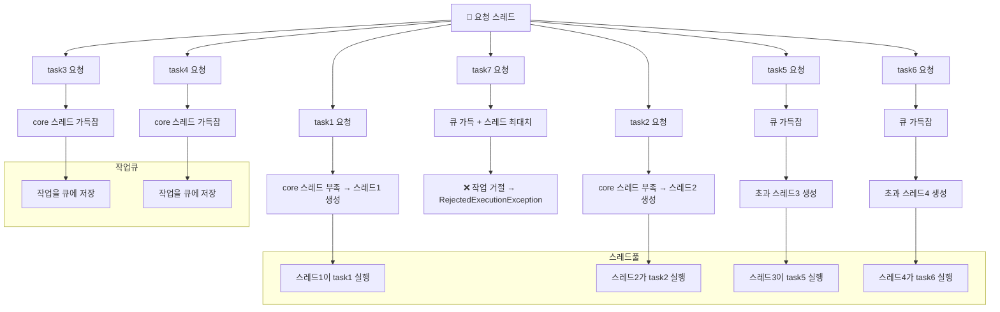
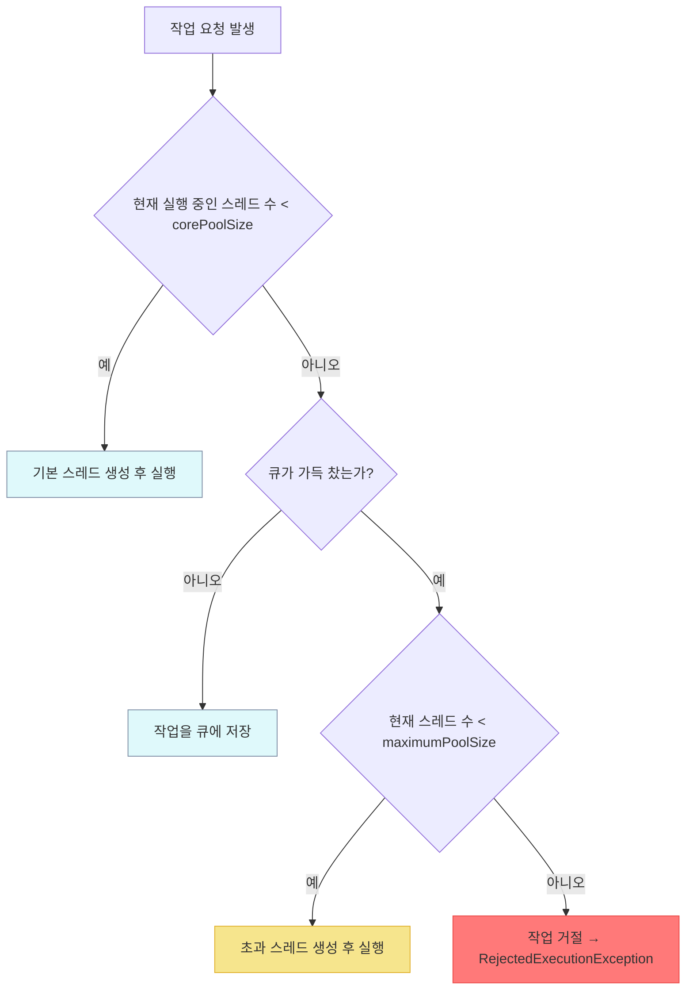

# Executor 스레드 풀 관리

## 코드

```java
public class PoolSizeMainV1 {
    public static void main(String[] args) throws InterruptedException {
        BlockingQueue<Runnable> workQueue = new ArrayBlockingQueue<>(2);
        
        ExecutorService es = new ThreadPoolExecutor(2, 4, 3000, TimeUnit.MILLISECONDS, workQueue);
        printState(es);
        
        es.execute(new RunnableTask("task1"));
        printState(es, "task1");
        
        es.execute(new RunnableTask("task2"));
        printState(es, "task2");
        
        es.execute(new RunnableTask("task3"));
        printState(es, "task3");
        
        es.execute(new RunnableTask("task4"));
        printState(es, "task4");
        
        es.execute(new RunnableTask("task5"));
        printState(es, "task5");
        
        es.execute(new RunnableTask("task6"));
        printState(es, "task6");

        try {
            
        } catch (RejectedExecutionException e) {
            log("task7 실행 거절 예외 발생: " + e);
        }
        sleep(3000);

        log("== 작업 수행 완료 ==");
        printState(es);
        
        sleep(3000);
        log("== maximumPoolSize 대기 시간 초과 ==");
        printState(es);
        es.close();
        
        log("== shutdown 완료 ==");
        printState(es);
    }
}

```

## 🧵 스레드 상태


## ✅ 흐름 요약

| 요청된 작업 수 | core 스레드 상태     | 큐 상태           | 처리 방식                         |
|----------------|----------------------|-------------------|-----------------------------------|
| 1~2            | 부족                 | 비어 있음         | core 스레드 생성 후 즉시 실행     |
| 3~4            | 가득참               | 여유 있음         | 큐에 작업 저장                    |
| 5~6            | 가득참               | 가득참            | 초과 스레드 생성 후 즉시 실행     |
| 7 이상         | 가득참               | 가득참            | 작업 거절 (RejectedExecutionException) |


## 🔍 설명
- corePoolSize=2, maximumPoolSize=4, workQueue=2 기준
- 초과 스레드는 긴급 상황에서만 생성되며, 일정 시간 후 자동 제거됨
- 큐와 스레드가 모두 가득 차면 더 이상 작업을 받을 수 없어 예외 발생


## ✅ 샘플 코드: 스레드 풀 동작 시뮬레이션
```java
import java.util.concurrent.*;

public class ThreadPoolExecutorDemo {
    public static void main(String[] args) throws InterruptedException {
        // 큐 크기: 2, core 스레드: 2, 최대 스레드: 4
        BlockingQueue<Runnable> queue = new ArrayBlockingQueue<>(2);
        ThreadPoolExecutor executor = new ThreadPoolExecutor(
            2, 4, 3000, TimeUnit.MILLISECONDS, queue
        );

        // 작업 생성
        for (int i = 1; i <= 7; i++) {
            final int taskId = i;
            try {
                executor.execute(() -> {
                    String name = Thread.currentThread().getName();
                    System.out.println(name + " → task" + taskId + " 시작");
                    try {
                        Thread.sleep(1000); // 작업 시간
                    } catch (InterruptedException e) {
                        System.out.println(name + " → task" + taskId + " 인터럽트 발생");
                    }
                    System.out.println(name + " → task" + taskId + " 완료");
                });
            } catch (RejectedExecutionException e) {
                System.out.println("task" + taskId + " 거절됨: " + e);
            }
        }

        // 작업 완료 대기
        Thread.sleep(4000);
        System.out.println("== 작업 완료 후 상태 확인 ==");
        System.out.println("Pool size: " + executor.getPoolSize());
        System.out.println("Active count: " + executor.getActiveCount());
        System.out.println("Queue size: " + executor.getQueue().size());
        System.out.println("Completed tasks: " + executor.getCompletedTaskCount());

        // 종료
        executor.shutdown();
    }
}
```

## 🧪 실행 흐름 요약

| 작업 번호 | 처리 조건                          | 처리 방식                         |
|-----------|------------------------------------|-----------------------------------|
| task1     | core 스레드 부족                   | 스레드1 생성 후 즉시 실행         |
| task2     | core 스레드 부족                   | 스레드2 생성 후 즉시 실행         |
| task3     | core 스레드 가득참                 | 큐에 저장                         |
| task4     | 큐 여유 있음                       | 큐에 저장                         |
| task5     | 큐 가득참                          | 초과 스레드3 생성 후 즉시 실행    |
| task6     | 큐 가득참                          | 초과 스레드4 생성 후 즉시 실행    |
| task7     | 큐 가득 + 최대 스레드 수 도달      | 작업 거절 → RejectedExecutionException |


## 🔍 로그 예시
```
pool-1-thread-1 → task1 시작
pool-1-thread-2 → task2 시작
pool-1-thread-3 → task5 시작
pool-1-thread-4 → task6 시작
task7 거절됨: java.util.concurrent.RejectedExecutionException
...
pool-1-thread-1 → task3 시작
pool-1-thread-3 → task4 시작
```

- 이 코드는 ThreadPoolExecutor의 내부 동작을 실시간으로 확인할 수 있는 예제

---

# 🚀 스레드 미리 생성하기란?
- 서버가 고객 요청을 받기 전에 스레드를 미리 생성해두는 전략
- 목적: 초기 요청 시 스레드 생성 지연을 줄여 응답 속도 향상
- 특히 응답 시간이 중요한 시스템에서 유용

## 🔧 사용 메서드: prestartAllCoreThreads()

| 객체 타입           | 메서드 사용 가능 여부         |
|---------------------|-------------------------------|
| ThreadPoolExecutor  | ✅ prestartAllCoreThreads() 사용 가능 |
| ExecutorService     | ❌ 직접 사용 불가               |
| ExecutorService     | ✅ 다운캐스팅 후 사용 가능 → (ThreadPoolExecutor) |

## 🔍 핵심 요약
- ExecutorService는 인터페이스이므로 prestartAllCoreThreads()를 직접 제공하지 않음
- ThreadPoolExecutor로 캐스팅하면 해당 메서드를 사용할 수 있음
- 이 메서드는 corePoolSize만큼 스레드를 즉시 생성하여 초기 요청 지연을 줄이는 데 유용


## 📄 샘플 코드 요약
```java
ExecutorService es = Executors.newFixedThreadPool(1000); // corePoolSize = 1000
printState(es); // 초기 상태: pool=0

ThreadPoolExecutor poolExecutor = (ThreadPoolExecutor) es;
poolExecutor.prestartAllCoreThreads(); // core 스레드 1000개 미리 생성

printState(es); // 이후 상태: pool=1000
```

### 🕒 로그 출력 예시
```
12:33:34.971 [main] [pool=0, active=0, queuedTasks=0, completedTask=0]
12:33:35.117 [main] [pool=1000, active=0, queuedTasks=0, completedTask=0]
```

- 첫 번째 로그: 스레드 풀 생성 직후 → 스레드 없음
- 두 번째 로그: prestartAllCoreThreads() 호출 후 → 1000개 스레드 생성 완료

## ✅ 정리

| 항목               | 설명                                       |
|--------------------|--------------------------------------------|
| 대상 클래스        | ThreadPoolExecutor                         |
| 사용 목적          | core 스레드를 요청 전에 미리 생성           |
| 사용 메서드        | prestartAllCoreThreads()                   |
| ExecutorService에서 사용 | ❌ 직접 사용 불가 → ✅ 다운캐스팅 필요       |

## 🔍 핵심 포인트
- ThreadPoolExecutor만 해당 메서드를 제공
- 초기 요청 지연을 줄이고 빠른 응답을 위한 전략
- 실시간 처리나 고성능 서버에 적합

---

# 🧠 Executor 전략 개요
Java의 Executors 클래스는 3가지 기본 스레드 풀 전략을 제공합니다:

| 전략 메서드               | 사용되는 큐 타입         |
|---------------------------|--------------------------|
| newSingleThreadExecutor() | LinkedBlockingQueue      |
| newFixedThreadPool(n)     | LinkedBlockingQueue      |
| newCachedThreadPool()     | SynchronousQueue         |

## 🔍 전략별 특징 요약
- newSingleThreadExecutor()
    - 단일 스레드만 사용
    - 작업은 순차적으로 처리됨
    - 큐는 무제한 (LinkedBlockingQueue)
- newFixedThreadPool(n)
    - 고정된 스레드 수
    - 큐는 무제한
    - 안정적인 자원 관리에 적합
- newCachedThreadPool()
    - 요청마다 새로운 스레드 생성
    - 유휴 스레드는 일정 시간 후 제거
    - 큐 없이 바로 실행 (SynchronousQueue)


## 🔧 고정 풀 전략 (newFixedThreadPool(n))
### ✅ 특징
- 스레드 수 고정: corePoolSize = maximumPoolSize = n
- 큐 무제한: LinkedBlockingQueue 사용
- 자원 예측 가능: CPU, 메모리 사용량 안정적
- 초과 스레드 없음: 요청이 많아도 스레드 수는 늘어나지 않음
```java
ExecutorService es = Executors.newFixedThreadPool(2);
// 내부적으로는 아래와 같음
new ThreadPoolExecutor(2, 2, 0L, TimeUnit.MILLISECONDS, new LinkedBlockingQueue<>())
```
### 🧪 실행 흐름 예시

| 작업 번호 | 처리 방식                     | 상태 요약                        |
|-----------|-------------------------------|----------------------------------|
| task1     | 스레드1에서 즉시 실행          | pool=1, active=1, queue=0        |
| task2     | 스레드2에서 즉시 실행          | pool=2, active=2, queue=0        |
| task3     | 큐에 저장됨                    | pool=2, active=2, queue=1        |
| task4     | 큐에 저장됨                    | pool=2, active=2, queue=2        |
| task5     | 큐에 저장됨                    | pool=2, active=2, queue=3        |
| task6     | 큐에 저장됨                    | pool=2, active=2, queue=4        |

### 🔍 흐름 설명
- corePoolSize = 2 → 스레드 2개까지만 즉시 실행
- 이후 작업은 모두 무제한 큐에 저장됨
- 스레드 수는 절대 증가하지 않음
- 큐에 작업이 계속 쌓이면 → 처리 지연 발생 가능
- 스레드 수는 고정 → 추가 요청은 모두 큐에 쌓임
- 큐에 작업이 많아도 스레드 수는 늘어나지 않음

### ⚠️ 주의 사항
#### 📌 장점
- 자원 관리가 안정적: CPU, 메모리 사용량 예측 가능
- 서비스 초기나 일반 상황에 적합
#### 📌 단점
- 사용자 증가 시 병목 발생 가능
- 갑작스런 요청 폭증 시 응답 지연
- 큐가 무제한이므로 요청이 계속 쌓이면 처리 지연 심화

### 📉 실무 시나리오
#### 상황 1: 점진적 사용자 증가
- 서비스가 성공하면서 사용자 증가
- 스레드 수는 고정 → 처리 속도는 일정
- 큐에 작업이 계속 쌓여 응답 지연 발생
#### 상황 2: 갑작스런 요청 폭증
- 이벤트나 마케팅으로 사용자 급증
- CPU, 메모리는 여유 있지만 요청은 처리되지 않음
- 큐에 수만 건 쌓이고, 처리 지연 심각

## ✅ 결론

| 상황                     | 전략 선택             | 결과 요약                                   |
|--------------------------|------------------------|----------------------------------------------|
| 갑작스런 요청 폭증 발생   | newFixedThreadPool 사용 | CPU, 메모리는 여유 → 작업은 큐에만 쌓임       |
| 큐 무제한                | 작업 처리 지연 심각     | 사용자 응답 지연 → 서비스 품질 저하           |
| 스레드 수 고정           | 처리 속도 제한          | 요청 증가에 유연하게 대응 불가                |
| 해결 방향                | 전략 재검토 필요        | 동적 확장 가능한 전략 또는 큐 제한 설정 고려  |

## 🔍 핵심 메시지
- newFixedThreadPool은 안정적이지만 확장성이 부족
- 갑작스런 요청 증가 시 병목 현상 발생
- 실무에서는 캐시 풀 전략, 큐 제한, 또는 모니터링 기반 확장이 필요할 수 있음

---

# 캐시 풀 전략 (newCachedThreadPool)
new ThreadPoolExecutor(
    0,                      // corePoolSize 없음
    Integer.MAX_VALUE,      // 초과 스레드 무제한
    60L, TimeUnit.SECONDS,  // 초과 스레드 생존 시간
    new SynchronousQueue<>() // 저장 공간 없는 큐
)

## ✅ 특징 요약

| 항목               | 설명                                      |
|--------------------|-------------------------------------------|
| 기본 스레드 없음    | corePoolSize = 0                          |
| 최대 스레드 무제한 | maximumPoolSize = Integer.MAX_VALUE       |
| 생존 시간 설정     | keepAliveTime = 60초 (예제에서는 3초)     |
| 큐 타입            | SynchronousQueue (저장 공간 없음)         |
| 처리 방식          | 요청 즉시 초과 스레드 생성 후 실행        |
| 유휴 스레드 관리   | 일정 시간 대기 후 자동 제거                |

## 🔍 핵심 요약
- 빠르고 유연한 처리가 가능하지만, 자원 과다 사용 위험도 존재
- 실무에서는 모니터링 및 제한 설정과 함께 사용하는 것이 안전

## 🧪 실행 흐름 예시

| 작업 번호 | 처리 방식                     | 스레드 상태 변화                     | 큐 상태 |
|-----------|-------------------------------|--------------------------------------|---------|
| task1     | 초과 스레드1 즉시 생성 후 실행 | pool=1, active=1                     | 없음    |
| task2     | 초과 스레드2 즉시 생성 후 실행 | pool=2, active=2                     | 없음    |
| task3     | 초과 스레드3 즉시 생성 후 실행 | pool=3, active=3                     | 없음    |
| task4     | 초과 스레드4 즉시 생성 후 실행 | pool=4, active=4                     | 없음    |
| 작업 완료 | 모든 작업 1초 내 완료          | pool=4 → active=0                    | 없음    |
| 3초 후    | 생존 시간 초과 → 스레드 제거   | pool=0, active=0                     | 없음    |

## 🔍 흐름 설명
- SynchronousQueue는 저장 공간이 없어 모든 작업은 즉시 실행
- 요청 수만큼 초과 스레드가 즉시 생성
- 작업 완료 후 유휴 상태로 전환
- 생존 시간(예제에서는 3초) 초과 시 스레드 자동 제거


## ⚠️ 주의 사항
### 📌 장점
- 요청 수에 따라 스레드 수 자동 조절
- 빠른 응답 처리 가능
- 자원이 허용하는 한 최대 성능 발휘
### 📌 단점
- 스레드 수 무제한 → 자원 초과 위험
- 갑작스런 요청 폭증 시 시스템 과부하 가능
- CPU, 메모리 사용량 급증 → 장애 발생 가능

## 📉 실무 시나리오
### 상황 1: 점진적 사용자 증가
- 스레드 수와 자원 사용량이 함께 증가
- 자원 한계에 도달하면 시스템 증설 필요
### 상황 2: 갑작스런 요청 폭증
- 스레드 수 수천 개 생성 → CPU 100%, 메모리 포화
- 시스템 전체 느려짐 → 다운 가능성 높음

## ✅ 결론 요약

| 상황                     | 전략 선택             | 결과 요약                                       |
|--------------------------|------------------------|--------------------------------------------------|
| 요청 수 급증              | newCachedThreadPool 사용 | 빠른 처리 가능, 스레드 수 자동 증가              |
| 자원 사용량 증가          | 무제한 스레드 생성 가능  | CPU, 메모리 과부하 → 시스템 다운 위험             |
| 유휴 스레드 관리          | 생존 시간 후 자동 제거   | 요청 감소 시 스레드 수도 자연스럽게 감소         |
| 실무 적용 시 고려사항     | 자원 모니터링 필수       | 제한 설정, 경고 임계치, 장애 대비 전략 필요       |

## 🔍 핵심 메시지
- newCachedThreadPool은 유연하고 빠르지만, 자원 통제 없이는 위험할 수 있음
- 실무에서는 반드시 모니터링 + 제한 정책과 함께 사용해야 안정적 운영 가능

---

# 🔧 사용자 정의 풀 전략
```java
new ThreadPoolExecutor(
    100,                     // corePoolSize: 일반 스레드
    200,                     // maximumPoolSize: 긴급 스레드 포함
    60, TimeUnit.SECONDS,    // 초과 스레드 생존 시간
    new ArrayBlockingQueue<>(1000) // 큐 사이즈 제한
)
```

## ✅ 전략 구성 요약

| 상황       | 처리 방식                                      | 결과 요약                          |
|------------|------------------------------------------------|------------------------------------|
| 일반       | 기본 스레드(100개) + 큐(1000개)                | 안정적 처리                        |
| 긴급       | 초과 스레드(최대 100개) 추가 투입              | 빠른 처리, 자원 사용 증가          |
| 과부하     | 큐 + 스레드 모두 초과                          | 요청 거절 → RejectedExecutionException |

## 🔍 핵심 포인트
- 큐 제한 설정이 중요: 무한 큐 사용 시 초과 스레드가 생성되지 않음
- 자원 모니터링 필수: 긴급 상황 대응은 자원 사용량 증가를 동반
- 거절 전략은 시스템 보호용: 다운 방지를 위한 마지막 방어선


## 🧪 실행 흐름 예시

| 상황     | 작업 수 (TASK_SIZE) | 처리 방식                              | 스레드 수 변화       | 결과 요약                          |
|----------|----------------------|----------------------------------------|-----------------------|------------------------------------|
| 일반     | 1100                 | 기본 스레드 100개 + 큐 1000개 처리     | pool=100              | 안정적 처리, 약 11초 소요          |
| 긴급     | 1200                 | 기본 스레드 100개 + 초과 스레드 100개 | pool=200              | 빠른 처리, 약 6초 소요             |
| 거절     | 1201                 | 큐 + 스레드 모두 초과 → 요청 거절      | pool=200              | task1201에서 RejectedExecutionException 발생 |

## 🔍 흐름 설명
- 일반: 큐가 가득 차지 않음 → 초과 스레드 생성 안 됨
- 긴급: 큐가 가득 차면 초과 스레드 생성 → 처리 속도 향상
- 거절: 큐 + 스레드 모두 한계 초과 → 요청 거절로 시스템 보호


## ⚠️ 실무에서 자주 하는 실수
```java
new ThreadPoolExecutor(100, 200, 60, TimeUnit.SECONDS, new LinkedBlockingQueue());
```

- LinkedBlockingQueue 기본 생성자는 무한 큐
- 큐가 절대 가득 차지 않음 → 초과 스레드가 생성되지 않음
- 결국 기본 스레드만으로 무한 작업 처리 → 병목 발생

## 📉 실무 적용 시 고려사항

| 항목               | 설명                                                           |
|--------------------|----------------------------------------------------------------|
| 자원 예측 가능성     | 기본 스레드 수와 큐 크기를 설정해 CPU, 메모리 사용량을 예측 가능     |
| 긴급 대응 유연성     | 초과 스레드 설정으로 갑작스런 요청 증가에 빠르게 대응 가능             |
| 요청 거절 전략       | 최대 스레드 + 큐 초과 시 요청 거절 → 시스템 보호                    |
| 큐 제한 설정         | 반드시 `ArrayBlockingQueue` 사용 → 초과 스레드 유도 가능               |
| 무한 큐 주의         | `LinkedBlockingQueue` 기본 생성자 사용 시 초과 스레드가 생성되지 않음   |
| 자원 모니터링 필수   | 초과 스레드 사용 시 CPU, 메모리 사용량 급증 가능 → 모니터링 필요       |

## 🔍 핵심 메시지
- 안정성과 유연성을 동시에 확보하려면 큐 제한 + 초과 스레드 + 거절 정책이 조화롭게 설계되어야 함
- 실무에서는 무한 큐 설정 실수가 자주 발생하므로 반드시 `ArrayBlockingQueue` 를 명시적으로 설정해야 함

## ✅ 결론
사용자 정의 풀 전략은 다음을 만족합니다:
- 일반 상황: 안정적 운영
- 긴급 상황: 빠른 대응
- 과부하 상황: 요청 거절로 시스템 보호
이 전략은 실무에서 가장 현실적인 대응 방식을 제공하며, 반드시 큐 제한 + 자원 모니터링과 함께 설계해야 합니다.


일반 → 긴급 → 거절 단계로 이어지는 구조를 시각적으로 표현했습니다.

## 🧭 사용자 정의 풀 전략 흐름

### 🔍 설명
- C, E: 일반 상황 처리 (기본 스레드 또는 큐 저장)
- G: 긴급 대응 (초과 스레드 생성)
- H: 과부하 상황 → 요청 거절
---

# ⚙️ Executor 예외 정책 개요
- 문제 상황: 생산자(요청)가 많고 소비자(스레드)가 처리하지 못할 때
- 필요성: 시스템 과부하 방지, 사용자 알림, 개발자 로그 확보
- 적용 시점: 큐가 가득 차고, 초과 스레드도 생성 불가할 때

## ✅ ThreadPoolExecutor 예외 정책 종류

| 정책 이름             | 예외 발생 여부               | 처리 방식 설명                                | 관련 클래스/인터페이스         |
|----------------------|------------------------------|-----------------------------------------------|-------------------------------|
| AbortPolicy          | ✅ RejectedExecutionException | 작업 거절 시 예외 발생 (기본 정책)             | RejectedExecutionHandler      |
| DiscardPolicy        | ❌ 없음                       | 작업을 조용히 버림                            | RejectedExecutionHandler      |
| CallerRunsPolicy     | ❌ 없음                       | 요청한 스레드가 직접 작업 수행                | RejectedExecutionHandler      |
| 사용자 정의 정책      | 선택 가능                     | 개발자가 직접 거절 처리 로직 구현 가능         | RejectedExecutionHandler 구현체 |

## 🔍 핵심 요약
- 모든 정책은 RejectedExecutionHandler 인터페이스를 기반으로 동작
- 기본 정책은 AbortPolicy이며, 예외를 통해 거절 상황을 명확히 알림
- 실무에서는 상황에 따라 로깅, 재시도, 속도 조절 등 다양한 전략을 조합해 사용하는 것이 중요


## 🔍 정책별 예시 및 특징
### 1. AbortPolicy
```java
new ThreadPoolExecutor(1, 1, 0, TimeUnit.SECONDS, new SynchronousQueue<>(), new AbortPolicy())
```
- 큐 없음, 스레드 1개
- 두 번째 작업부터 예외 발생
- 예외를 잡아 사용자에게 알림 가능
### 2. DiscardPolicy
```java
new ThreadPoolExecutor(1, 1, 0, TimeUnit.SECONDS, new SynchronousQueue<>(), new DiscardPolicy())
```
- 거절된 작업은 조용히 무시됨
- 예외 발생하지 않음 → 로그 남기지 않으면 인지 어려움
### 3. CallerRunsPolicy
```java
new ThreadPoolExecutor(1, 1, 0, TimeUnit.SECONDS, new SynchronousQueue<>(), new CallerRunsPolicy())
```

- 거절된 작업을 요청한 스레드가 직접 실행
- 생산 속도 자동 조절 효과
- main 스레드가 직접 작업 수행

### 4. 사용자 정의 정책
```java
new ThreadPoolExecutor(1, 1, 0, TimeUnit.SECONDS, new SynchronousQueue<>(), new MyRejectedExecutionHandler())
```
```java
class MyRejectedExecutionHandler implements RejectedExecutionHandler {
    static AtomicInteger count = new AtomicInteger(0);
    public void rejectedExecution(Runnable r, ThreadPoolExecutor executor) {
        log("[경고] 거절된 누적 작업 수: " + count.incrementAndGet());
    }
}
```

- 거절된 작업 수를 로그로 기록
- 예외 대신 모니터링, 경고, 재시도 등 유연한 대응 가능

## 🧠 실무 전략 선택 가이드

| 전략 유형             | 추천 상황                                      | 특징 요약                                      |
|------------------------|------------------------------------------------|------------------------------------------------|
| 고정 스레드 풀 전략     | 트래픽이 일정하고 안정성이 중요한 서비스         | 자원 예측 가능, 안정적 운영, 큐 무제한          |
| 캐시 스레드 풀 전략     | 성장 중인 서비스, 빠른 요청 처리 필요             | 빠른 처리, 유연한 확장, 자원 과부하 위험         |
| 사용자 정의 풀 전략     | 다양한 상황 대응, 예외 처리 및 자원 보호 필요      | 일반+긴급+거절 단계 구성, 큐 제한, 자원 보호 가능 |

## 🔍 전략 선택 팁
- 초기 서비스: 고정 풀 전략으로 안정성 확보
- 트래픽 증가 예상: 캐시 풀 전략으로 빠른 대응
- 복합 상황 대응: 사용자 정의 전략으로 세분화된 제어

## 📌 최적화에 대한 조언
- 지나친 사전 최적화는 낭비: 사용자가 없는 기능에 리소스 투자 금물
- 현재 상황에 맞는 최적화가 중요
- 모니터링 기반 대응: 문제가 생기면 그때 개선
- 예측 가능한 성장: 대부분의 서비스는 점진적 확장

## 🛡️ 핵심 메시지
백엔드 개발자는 시스템 자원을 적절히 활용하면서도, 최악의 상황에서는 적절한 거절을 통해 시스템을 보호해야 한다.  
적절한 거절은 서버에도, 우리의 삶에도 필요하다.

---


