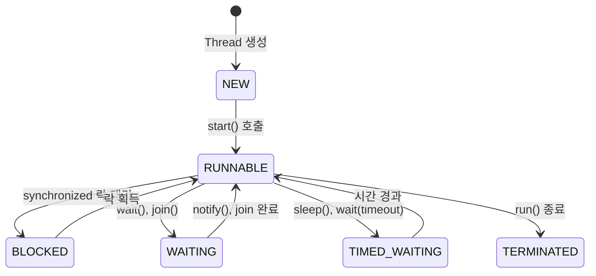

# 🧵 자바 스레드 생명 주기
자바 스레드의 생명 주기는 여러 상태로 나뉘며, 각 상태는 스레드가 생성되고 실행되며  
종료되기까지의 과정을 나타냅니다.  
아래에 상태별 설명, 상태 전이 흐름, 그리고 다이어그램을 함께 정리.

## 🔹 자바 스레드 주요 상태 요약

| 상태           | 진입 조건 또는 관련 메서드               |
|----------------|------------------------------------------|
| NEW            | `new Thread(...)` → 아직 `start()` 미호출 |
| RUNNABLE       | `start()` 호출 후 실행 준비 또는 실행 중   |
| BLOCKED        | `synchronized` 락을 기다릴 때             |
| WAITING        | `wait()`, `join()` 등 무기한 대기         |
| TIMED_WAITING  | `sleep()`, `wait(timeout)`, `join(timeout)` 등 시간 제한 대기 |
| TERMINATED     | `run()` 종료 또는 예외 발생               |

### 🔸 BLOCKED, WAITING, TIMED_WAITING은 자바에서 공식적으로 구분되지만, 설명 편의상 "일시 중지 상태"로 묶어 설명하기도 합니다.


## 🔁 자바 스레드 상태 전이 흐름

| 상태 전이 단계                                 | 관련 메서드 또는 조건             |
|------------------------------------------------|-----------------------------------|
| `NEW → RUNNABLE`                               | `start()` 호출                    |
| `RUNNABLE → BLOCKED / WAITING / TIMED_WAITING` | `wait()`, `sleep()`, `join()` 등 |
| `BLOCKED / WAITING / TIMED_WAITING → RUNNABLE` | 락 획득, 대기 완료, 시간 경과 등 |
| `RUNNABLE → TERMINATED`                        | `run()` 메서드 종료               |

## 🧪 코드 흐름 예시
```java
Thread thread = new Thread(new MyRunnable(), "myThread");
log("state1 = " + thread.getState()); // NEW
thread.start();
Thread.sleep(1000);
log("state3 = " + thread.getState()); // TIMED_WAITING
Thread.sleep(4000);
log("state5 = " + thread.getState()); // TERMINATED
```
- MyRunnable 내부에서는 sleep()을 통해 TIMED_WAITING 상태를 유도하고, 실행 종료 후 TERMINATED 상태로 진입합니다.

## 📊 스레드 생명 주기



## ✅ 핵심 요약
- 스레드는 NEW → RUNNABLE → TERMINATED가 기본 흐름
- 중간에 BLOCKED, WAITING, TIMED_WAITING 상태를 거칠 수 있음
- Thread.getState()를 통해 현재 상태를 확인 가능
- Thread.sleep()은 TIMED_WAITING 상태를 유도하며, InterruptedException을 반드시 처리해야 함

---

