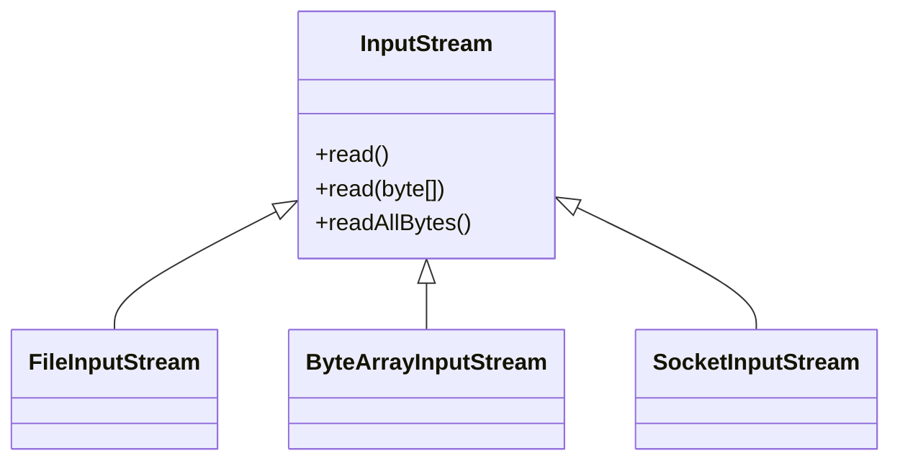
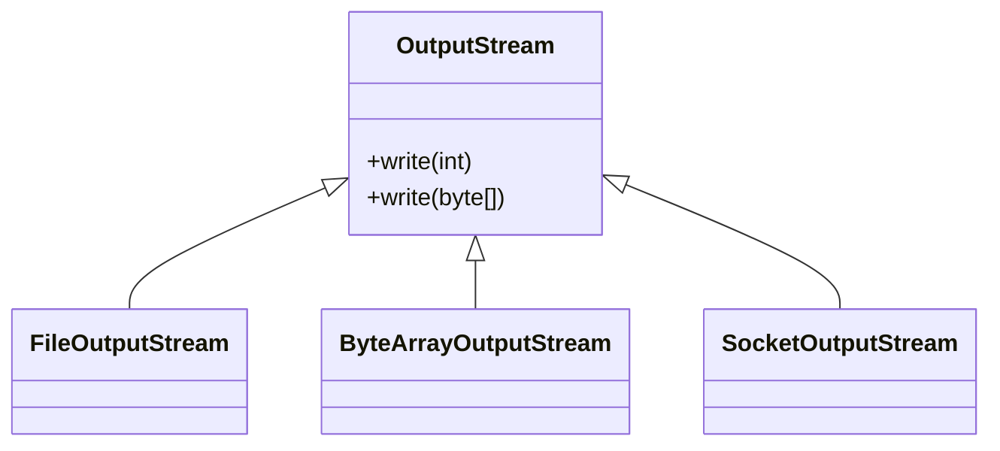

# 📦 자바 스트림 입출력 정리 문서

## 🧠 기본 개념

| 구분           | 설명                                      | 예시 클래스               | 비고                         |
|----------------|-------------------------------------------|----------------------------|------------------------------|
| `출력 스트림`     | 자바 → 외부로 데이터를 보내는 통로         | FileOutputStream 등        | write() 메서드 사용          |
| `입력 스트림`     | 외부 → 자바로 데이터를 가져오는 통로       | FileInputStream 등         | read() 메서드 사용           |
| `단방향 스트림`   | 입력과 출력은 각각 독립적인 방향으로 흐름  | InputStream / OutputStream | 양방향 아님                  |
| `byte 단위 처리`  | 스트림은 기본적으로 1byte씩 데이터를 처리  | 모든 바이트 기반 스트림    | 문자 인코딩에 주의 필요      |
| `스트림 추상화`   | 다양한 입출력 장치에 일관된 방식 제공      | 콘솔, 파일, 네트워크 등    | 상속 구조로 확장 가능        |


## 📌 주요 동작 설명

| 메서드                  | 설명                                                   | 비고                         |
|-------------------------|--------------------------------------------------------|------------------------------|
| `FileOutputStream(path)`  | 지정한 경로에 파일을 생성하고 byte 데이터를 출력         | 파일이 없으면 자동 생성됨     |
| `write(int)`              | 1byte 단위로 숫자(0~255)를 파일에 저장                  | ASCII 문자 저장 가능          |
| `write(byte[])`           | byte 배열 전체를 한 번에 출력                           | 대량 데이터 출력에 유리       |
| `FileInputStream(path)`   | 지정한 경로의 파일에서 byte 데이터를 읽어옴              | 파일이 없으면 예외 발생       |
| `read()`                  | 파일에서 1byte씩 읽고, EOF에 도달하면 -1 반환           | 반복문으로 전체 읽기 가능     |
| `read(byte[], o, l)`      | 배열에 원하는 크기만큼 데이터를 읽어옴                  | 부분 읽기, 버퍼 활용 가능     |


## ➕ append 옵션
```rust
new FileOutputStream("temp/hello.dat", true);
```
| 옵션 값 | 동작 방식                          | 사용 목적                         |
|---------|-----------------------------------|-----------------------------------|
| true    | 기존 파일 끝에 이어서 데이터 저장 | 로그 누적, 기존 내용 유지         |
| false   | 기존 파일 내용 덮어쓰기           | 새로 저장, 초기화된 파일 생성     |
| 기본값 | false                              | 명시하지 않으면 덮어쓰기 수행됨  |

## 📄 반복문으로 파일 끝까지 읽기
```java
int data;
while ((data = fis.read()) != -1) {
    System.out.println(data);
}
```
- read()는 int를 반환 → 0~255 범위의 byte + EOF(-1) 표현 가능
- 파일 끝까지 반복적으로 읽을 때 유용

## 📦 배열로 읽고 쓰기
```java
byte[] input = {65, 66, 67};
fos.write(input); // 한 번에 쓰기

byte[] buffer = new byte[10];
int readCount = fis.read(buffer, 0, 10); // 부분 읽기
```
| 항목             | 설명                                                   | 예시 코드                            |
|------------------|--------------------------------------------------------|--------------------------------------|
| `byte[] 쓰기`       | 배열 전체를 한 번에 파일에 출력                         | fos.write(input);                    |
| `byte[] 읽기`       | 지정한 크기만큼 배열에 데이터를 읽어옴                  | fis.read(buffer, 0, 10);             |
| `반환값 (readCount)` | 실제로 읽은 바이트 수 (파일 크기보다 작을 수 있음)     | readCount = 3                        |


## 📊 부분 읽기 vs 전체 읽기

| 방식               | 특징                                                   | 적합한 상황                         | 주의사항                         |
|--------------------|--------------------------------------------------------|-------------------------------------|----------------------------------|
| `read(byte[])`       | 지정한 크기만큼 반복적으로 읽기 가능                   | 대용량 파일 처리, 메모리 제어 필요 | 반복 루프 필요                   |
| `readAllBytes()`     | 전체 데이터를 한 번에 읽기                             | 작은 파일, 테스트용                 | 큰 파일은 OutOfMemoryError 위험 |
| `read(buffer, o, l)` | 버퍼의 특정 위치부터 원하는 길이만큼 읽기 가능         | 부분 처리, 스트림 조작              | offset과 length 정확히 지정 필요 |

## 🧠 InputStream / OutputStream 구조

### 📘 InputStream
- 추상 클래스
- 주요 메서드: read(), read(byte[]), readAllBytes()
- 하위 클래스: FileInputStream, ByteArrayInputStream, SocketInputStream

#### 📘 InputStream 클래스 구조


### 📘 OutputStream
- 추상 클래스
- 주요 메서드: write(int), write(byte[])
- 하위 클래스: FileOutputStream, ByteArrayOutputStream, SocketOutputStream

#### 📘 OutputStream 클래스 구조

### 🧪 메모리 스트림 예제
```java
ByteArrayOutputStream baos = new ByteArrayOutputStream();
baos.write(new byte[]{1, 2, 3});
```
```java
ByteArrayInputStream bais = new ByteArrayInputStream(baos.toByteArray());
byte[] result = bais.readAllBytes();
System.out.println(Arrays.toString(result)); // [1, 2, 3]
```
- 파일 없이 메모리에서 직접 입출력
- 테스트나 스트림 데이터 확인용으로 유용

## 🖥️ 콘솔 스트림 및 자바 스트림 추상화 정리
### 📌 콘솔 스트림 예제
```java
PrintStream printStream = System.out;
byte[] bytes = "Hello!\n".getBytes(UTF_8);
printStream.write(bytes);       // OutputStream 기능
printStream.println("Print!");  // PrintStream 고유 기능
```

### ✅ 실행 결과
```
Hello!
Print!
```

## 🔍 핵심 개념

| 항목             | 관련 클래스        | 설명                                      |
|------------------|--------------------|-------------------------------------------|
| `System.out`       | PrintStream        | 자바 시작 시 자동 생성되는 콘솔 출력 스트림 |
| `PrintStream`      | OutputStream       | OutputStream을 상속받은 출력 스트림 클래스 |
| `write(byte[])`    | OutputStream       | 바이트 배열을 출력하는 기본 기능           |
| `println(String)`  | PrintStream        | 문자열을 출력하고 줄바꿈하는 편의 기능     |


## 🧠 자바 스트림 추상화의 장점

| 항목       | 설명                                                       | 예시 또는 관련 요소               |
|------------|------------------------------------------------------------|-----------------------------------|
| 일관성     | 모든 입출력 작업에 대해 동일한 인터페이스 사용 가능         | read(), write()                  |
| 유연성     | 다양한 데이터 소스에 대해 동일한 방식으로 처리 가능         | 파일, 네트워크, 메모리 등         |
| 확장성     | 새로운 스트림 타입을 쉽게 추가 가능                         | BufferedStream, DataStream 등     |
| 재사용성   | 스트림 클래스들을 조합하여 복잡한 입출력 처리 가능          | Buffered + Data + Object 조합     |
| 에러 처리  | 표준화된 예외 처리 방식으로 안정적인 코드 작성 가능         | IOException, try-catch 구조       |


## 🧱 스트림 클래스 구조

| 추상 클래스     | 설명                                      | 주요 하위 클래스 예시                          | 비고                         |
|------------------|-------------------------------------------|------------------------------------------------|------------------------------|
| `InputStream`      | 바이트 기반 입력 스트림의 추상 클래스     | FileInputStream, ByteArrayInputStream          | read(), readAllBytes() 등 제공 |
| `OutputStream`     | 바이트 기반 출력 스트림의 추상 클래스     | FileOutputStream, PrintStream                  | write(), println() 등 제공    |

- 참고: InputStream과 OutputStream은 자바 1.0부터 제공된 추상 클래스이며, 일부 기본 구현을 포함하고 있어 인터페이스가 아닌 추상 클래스로 설계됨.

---


