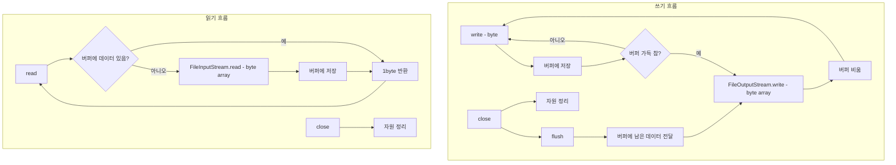

# 🧵 자바 스트림 성능 실험: 1byte 입출력 방식

## ✍️ 예제1 - 1byte 단위 쓰기
```java
public static final int FILE_SIZE = 10 * 1024 * 1024; // 10MB

for (int i = 0; i < FILE_SIZE; i++) {
    fos.write(1);
}
```
- write(1)을 10MB 만큼 반복 → 약 1천만 번 호출
- 파일 생성 시간 측정

### ⏱️ 실행 결과
```
File created: temp/buffered.dat
File size: 10MB
Time taken: 14092ms
```
- M2 맥북 기준 약 14초 소요

## 📖 예제2 - 1byte 단위 읽기
```java
while ((data = fis.read()) != -1) {
    fileSize++;
}
```
- read()를 10MB 만큼 반복 → 약 1천만 번 호출
- 파일 읽기 시간 측정

### ⏱️ 실행 결과
```
File name: temp/buffered.dat
File size: 10MB
Time taken: 5003ms
```
- M2 맥북 기준 약 5초 소요

## 📌 성능 저하 원인

| 원인 구분         | 설명                                                   | 관련 메서드 또는 요소       |
|-------------------|--------------------------------------------------------|-----------------------------|
| 시스템 콜 오버헤드 | write()나 read() 호출 시마다 OS에 명령 전달            | write(), read()             |
| 디스크 처리 지연  | HDD/SSD가 물리적으로 데이터를 처리하는 데 시간 소요     | 저장 장치의 물리적 특성     |
| 호출 횟수 과다    | 1byte씩 처리하면 10MB에 대해 약 1천만 번 호출 발생     | 반복 루프, 단일 바이트 처리 |
- 비유: 화물차가 상품을 1개씩 싣고 1천만 번 왕복하는 것과 같음

## 💡 해결 방향
- 버퍼 사용: 여러 바이트를 한 번에 처리하여 시스템 콜 횟수 줄이기
- BufferedOutputStream / BufferedInputStream 활용 예정

## 🧠 참고 사항
- 실제로 디스크에 1byte씩 쓰는 건 아니며 OS/하드웨어가 내부적으로 최적화함
- 하지만 자바에서 write()/read() 호출이 많으면 시스템 콜 오버헤드는 피할 수 없음
- 따라서 자바 코드에서 호출 횟수를 줄이는 것이 핵심

---

# 🚀 자바 버퍼 기반 입출력 성능 최적화 정리
## 📦 설정 상수
```java
BufferedConst {
    public static final String FILE_NAME = "temp/buffered.dat";
    public static final int FILE_SIZE = 10 * 1024 * 1024; // 10MB
    public static final int BUFFER_SIZE = 8192; // 8KB
}
```

## 📦 BufferedConst 설정
| 상수명        | 설명                                 | 값 또는 단위             |
|---------------|--------------------------------------|---------------------------|
| FILE_NAME     | 생성할 파일 경로                      | "temp/buffered.dat"       |
| FILE_SIZE     | 파일 크기                             | 10MB (10 * 1024 * 1024)   |
| BUFFER_SIZE   | 버퍼 크기 (입출력 성능 향상에 사용됨) | 8KB (8192 byte)           |


## ✍️ 예제1 - 버퍼를 사용한 쓰기
```java
byte[] buffer = new byte[BUFFER_SIZE];
int bufferIndex = 0;

for (int i = 0; i < FILE_SIZE; i++) {
    buffer[bufferIndex++] = 1;
    if (bufferIndex == BUFFER_SIZE) {
        fos.write(buffer);
        bufferIndex = 0;
    }
}
if (bufferIndex > 0) {
    fos.write(buffer, 0, bufferIndex);
}
```

## ✅ 핵심 포인트
- 데이터를 byte[] buffer에 모아서 일정량(BUFFER_SIZE)이 되면 한 번에 write()
- 마지막 남은 데이터도 write(buffer, 0, bufferIndex)로 처리
- 시스템 콜 횟수를 줄여 성능 향상

### ⏱️ 실행 결과
```
File created: temp/buffered.dat
File size: 10MB
Time taken: 14ms
```
- 이전 1byte 쓰기 방식(약 14초)보다 1000배 이상 빠름


## 📖 예제2 - 버퍼를 사용한 읽기
```java
byte[] buffer = new byte[BUFFER_SIZE];
int size;
while ((size = fis.read(buffer)) != -1) {
    fileSize += size;
}
```

### ✅ 핵심 포인트
- read(buffer)를 통해 한 번에 여러 바이트 읽기
- 반복 횟수 감소 → 시스템 콜 감소 → 성능 향상

### ⏱️ 실행 결과
```
File name: temp/buffered.dat
File size: 10MB
Time taken: 5ms
```

## 📊 BUFFER_SIZE에 따른 쓰기 성능 비교

| BUFFER_SIZE (byte) | 시스템 콜 횟수 감소율 | 쓰기 시간 (ms) |
|--------------------|------------------------|----------------|
| 1                  | 없음                   | 14368          |
| 2                  | 약 50% 감소             | 7474           |
| 3                  | 약 67% 감소             | 4829           |
| 10                 | 약 90% 감소             | 1692           |
| 100                | 약 99% 감소             | 180            |
| 1000               | 매우 크게 감소          | 28             |
| 2000               | 매우 크게 감소          | 23             |
| 4000               | 매우 크게 감소          | 16             |
| 8000               | 최적화 수준 도달        | 13             |
| 80000              | 추가 향상 거의 없음     | 12             |

- 결론: 버퍼 크기를 늘릴수록 성능은 향상되지만, 4KB~8KB 수준에서 효율이 포화됨

## 🧠 성능 향상의 원리

| 원리 구분         | 설명                                                   | 관련 요소 또는 메서드       |
|-------------------|--------------------------------------------------------|-----------------------------|
| 시스템 콜 감소     | write()나 read() 호출 횟수를 줄여 OS 호출 비용 절감     | write(), read()             |
| 디스크 I/O 최적화 | 디스크는 보통 4KB~8KB 단위로 처리 → 이 단위에 맞춰 쓰기 | BUFFER_SIZE = 8192          |
| 데이터 일괄 처리  | 데이터를 모아서 한 번에 처리 → 장치 작동 횟수 감소       | byte[] buffer, 버퍼 기반 처리 |

- 비유: 1byte씩 쓰는 건 화물차가 물건 1개씩 1000만 번 왕복하는 것과 같음
- 버퍼는 한 번에 여러 개를 실어 나르는 것과 같아 훨씬 효율적

## ⚠️ 직접 버퍼 관리의 단점
- 버퍼 배열 생성, 인덱스 관리, 남은 데이터 처리 등 코드가 복잡해짐
- 실수로 버퍼를 다 쓰지 않거나, 마지막 남은 데이터를 안 쓰면 데이터 손실 위험

---

# BufferedOutputStream / BufferedInputStream

## 🧵 Buffered 스트림 동작 흐름 (ASCII Mermaid 스타일)


## 📘 핵심 요약 정리

### ✅ BufferedOutputStream
- 기능: 내부 버퍼에 데이터를 모아 한 번에 출력
- 장점: 시스템 콜 횟수 감소 → 성능 향상
- 사용법:
```java
BufferedOutputStream bos = new BufferedOutputStream(fos, BUFFER_SIZE);
bos.write(1); // 1byte씩 쓰지만 내부적으로 모아서 처리
bos.close();  // flush() 자동 호출됨
```
- 주의사항: 반드시 마지막에 연결된 스트림(BufferedOutputStream)을 닫아야 함
### ✅ BufferedInputStream
- 기능: 데이터를 미리 읽어 버퍼에 저장 → read()는 버퍼에서 꺼냄
- 장점: 1byte씩 읽어도 성능 저하 없음
- 사용법:
```java
BufferedInputStream bis = new BufferedInputStream(fis, BUFFER_SIZE);
int data = bis.read(); // 내부적으로 버퍼에서 꺼냄
bis.close();
```

## 📊 성능 비교

| 예제 번호 | 방식                     | 버퍼 사용 방식       | 쓰기 시간 (ms) | 읽기 시간 (ms) |
|-----------|--------------------------|----------------------|----------------|----------------|
| 예제1     | 1byte 직접 처리          | 없음                 | 14000          | 5000           |
| 예제2     | 직접 버퍼 관리           | 수동 byte[] 관리     | 14             | 5              |
| 예제3     | BufferedXxx 클래스 사용  | 자동 버퍼 관리       | 102            | 94             |

## ✅ 요약
- 예제1은 가장 단순하지만 성능이 가장 느림
- 예제2는 직접 버퍼를 관리해 가장 빠르지만 코드가 복잡함
- 예제3은 성능은 다소 떨어지지만 코드가 간결하고 안정적이며 실무에서 가장 많이 사용됨

## 🔒 동기화 이슈
- BufferedXxx 클래스는 멀티 스레드 안전을 위해 동기화 처리됨
- write() 호출 시마다 락을 걸고 푸는 작업이 발생 → 성능 저하 요인
- 싱글 스레드 환경에서는 직접 버퍼를 다루는 방식이 더 빠름

## 🧠 결론
- 일반적인 상황에서는 BufferedXxx를 사용하는 것이 가장 안전하고 효율적
- 성능이 매우 중요한 경우에는 직접 버퍼를 관리하는 방식도 고려할 수 있음
- 스트림 연결 시에는 반드시 마지막 스트림만 닫기 (자동으로 연쇄 close() 처리됨)

---

# 📦 예제4: 전체 바이트 처리 방식 정리
## ✍️ 전체 쓰기

```java
byte[] buffer = new byte[FILE_SIZE];
for (int i = 0; i < FILE_SIZE; i++) {
    buffer[i] = 1;
}
fos.write(buffer);
```

### ✅ 특징
- FILE_SIZE만큼의 배열을 한 번에 생성 후 write()로 전체 저장
- 버퍼를 직접 관리하지 않음
- 코드가 간단하고 직관적

### ⏱️ 실행 결과
```
File created: temp/buffered.dat
File size: 10MB
Time taken: 15ms
```
- 예제2(버퍼 직접 관리)와 거의 동일한 성능


## 📖 전체 읽기
```java
byte[] bytes = fis.readAllBytes();
```

## ✅ 특징
- readAllBytes()로 전체 파일을 한 번에 읽음
- 내부적으로 4KB, 8KB, 16KB 단위로 읽기 처리됨
- 코드가 매우 간결
### ⏱️ 실행 결과
```
File name: temp/buffered.dat
File size: 10MB
Time taken: 3ms
```
- 예제2(버퍼 직접 관리)와 거의 동일한 성능

## 📊 예제별 성능 비교 요약

| 예제 번호 | 방식                     | 버퍼 사용 방식       | 쓰기 시간 (ms) | 읽기 시간 (ms) | 특징                                 |
|-----------|--------------------------|----------------------|----------------|----------------|----------------------------------------|
| 예제1     | 1byte 직접 처리          | 없음                 | 14000          | 5000           | 가장 느림, 시스템 콜 과다               |
| 예제2     | 직접 버퍼 관리           | 수동 byte[] 관리     | 14             | 5              | 가장 빠름, 코드 복잡함                  |
| 예제3     | BufferedXxx 클래스 사용  | 자동 버퍼 관리       | 102            | 94             | 안정적, 동기화로 성능 약간 저하         |
| 예제4     | 전체 바이트 처리         | 전체 배열 한 번에 처리 | 15             | 3              | 간결하고 빠름, 메모리 사용 많음         |

## 🧠 최종 정리

| 상황                          | 추천 방식               | 비고                                       |
|-------------------------------|--------------------------|--------------------------------------------|
| 파일 크기가 작고 간단한 처리 | readAllBytes()           | 코드 간결, 빠름, 메모리 사용 많음          |
| 성능이 중요하고 큰 파일 처리 | 직접 버퍼 관리           | 가장 빠름, 코드 복잡, 메모리 효율적        |
| 일반적인 입출력 작업         | BufferedXxx 사용         | 안정적, 코드 간결, 동기화로 성능 약간 저하 |

- BufferedXxx는 동기화 처리로 인해 약간의 성능 저하가 있지만, 멀티 스레드 환경에서 안전하고 코드가 간결하다는 장점이 있습니다.

---
