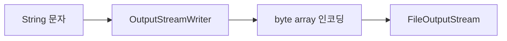
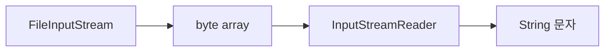
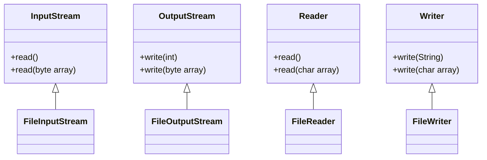

# 📘 자바 I/O 문자 처리 요약

## 1. 스트림과 문자 처리의 기본 개념
- 자바의 스트림은 기본적으로 byte 단위로 작동
- 문자를 스트림에 직접 전달할 수 없기 때문에 문자 → byte 변환 필요
- 변환 방식:
    - `String.getBytes(Charset) → byte[]`
    - `new String(byte[], Charset) → String`

### 샘플 코드
```java
public static void main(String[] args) throws IOException {
    String writeString = "ABC";
    
    // 문자 -> byte UTF-8 인코딩
    byte[] writeBytes = writeString.getBytes(UTF_8);
    System.out.println("write String: " + writeString);
    System.out.println("write bytes: " + Arrays.toString(writeBytes));

    // 파일에 쓰기
    FileOutputStream fos = new FileOutputStream(FILE_NAME);
    fos.write(writeBytes);
    fos.close();

    // 파일에서 읽기
    FileInputStream fis = new FileInputStream(FILE_NAME);
    byte[] readBytes = fis.readAllBytes();
    fis.close();

    // byte -> String UTF-8 디코딩
    String readString = new String(readBytes, UTF_8);
    System.out.println("read bytes: " + Arrays.toString(writeBytes));
    System.out.println("read String: " + readString);
    }
```


## 2. 문자 스트림 보조 클래스
OutputStreamWriter & InputStreamReader
- `OutputStreamWriter`: 문자 → byte 인코딩 후 OutputStream에 전달
- `InputStreamReader`: byte → 문자 디코딩 후 char로 반환

### 흐름도




### 샘플 코드
```java
public static void main(String[] args) throws IOException {
    String writeString = "ABC";
    System.out.println("write String: " + writeString);

    // 파일에 쓰기
    FileOutputStream fos = new FileOutputStream(FILE_NAME);
    OutputStreamWriter osw = new OutputStreamWriter(fos, UTF_8);
    osw.write(writeString);
    osw.close();

    // 파일에서 읽기
    FileInputStream fis = new FileInputStream(FILE_NAME);
    InputStreamReader isr = new InputStreamReader(fis, UTF_8);
    StringBuilder content = new StringBuilder();
    int ch;
    while ((ch = isr.read()) != -1) {
        content.append((char) ch);
    }
    isr.close();
    System.out.println("read String: " + content);
}
```


## 3. FileWriter & FileReader
- FileWriter는 내부적으로 OutputStreamWriter를 상속
- FileReader는 내부적으로 InputStreamReader를 상속
- 생성자에서 파일명과 문자 집합(Charset)을 지정
FileWriter fw = new FileWriter(FILE_NAME, UTF_8);
FileReader fr = new FileReader(FILE_NAME, UTF_8);


### 흐름도


### 샘플 코드
```java
public static void main(String[] args) throws IOException {
    String writeString = "ABC";
    System.out.println("write String: " + writeString);

    // 파일에 쓰기
    FileWriter fw = new FileWriter(FILE_NAME, UTF_8);
    fw.write(writeString);
    fw.close();

    // 파일에서 읽기
    StringBuilder content = new StringBuilder();
    FileReader fr = new FileReader(FILE_NAME, UTF_8);
    int ch;
    while ((ch = fr.read()) != -1) {
        content.append((char) ch);
    }
    fr.close();

    System.out.println("read String: " + content);
}
```


## 4. BufferedReader & BufferedWriter
- 버퍼 기능 제공
- BufferedReader.readLine() → 한 줄 단위로 읽기


### 흐름도
```mermaid
sequenceDiagram
    participant App
    participant BufferedWriter
    participant FileWriter
    App->>BufferedWriter: write("ABC
가나다")
    BufferedWriter->>FileWriter: 내부 버퍼 flush
    App->>BufferedReader: readLine()
    BufferedReader->>FileReader: 한 줄씩 읽기
```

### 샘플 코드
```java
public class ReaderWriterMainV4 {
    private static final int BUFFER_SIZE = 8192;
    public static void main(String[] args) throws IOException {

        String writeString = "ABC\n가나다";
        System.out.println("== Write String ==");
        System.out.println(writeString);

        // 파일에 쓰기
        FileWriter fw = new FileWriter(FILE_NAME, UTF_8);
        BufferedWriter bw = new BufferedWriter(fw, BUFFER_SIZE);
        bw.write(writeString);
        bw.close();

        // 파일에서 읽기
        StringBuilder content = new StringBuilder();
        FileReader fr = new FileReader(FILE_NAME, UTF_8);
        BufferedReader br = new BufferedReader(fr, BUFFER_SIZE);
        String line;
        while ((line = br.readLine()) != null) {
            content.append(line).append("\n");
        }
        br.close();

        System.out.println("== Read String ==");
        System.out.println(content);
    }
}
```


## 5. 기타 보조 스트림
- PrintStream
    - 콘솔 출력처럼 파일에 출력 가능
    - System.out과 동일한 방식 사용
```java
PrintStream ps = new PrintStream(new FileOutputStream("print.txt"));
ps.println("hello java!");
```
### 샘플 코드
```java
public static void main(String[] args) throws FileNotFoundException {
    FileOutputStream fos = new FileOutputStream("temp/print.txt");
    PrintStream printStream = new PrintStream(fos);
    printStream.println("hello java!");
    printStream.println(10);
    printStream.println(true);
    printStream.printf("hello %s", "world");
    printStream.close();
}
```
- DataOutputStream / DataInputStream
    - 자바 기본 타입 저장 및 읽기 지원
    - 반드시 저장한 순서대로 읽어야 함
```java
dos.writeUTF("회원A");
dos.writeInt(20);
dos.writeDouble(10.5);
dos.writeBoolean(true);
```

```java
public static void main(String[] args) throws IOException {

    FileOutputStream fos = new FileOutputStream("temp/data.dat");
    DataOutputStream dos = new DataOutputStream(fos);
    dos.writeUTF("회원A");
    dos.writeInt(20);
    dos.writeDouble(10.5);
    dos.writeBoolean(true);
    dos.close();

    FileInputStream fis = new FileInputStream("temp/data.dat");
    DataInputStream dis = new DataInputStream(fis);
    System.out.println(dis.readUTF());
    System.out.println(dis.readInt());
    System.out.println(dis.readDouble());
    System.out.println(dis.readBoolean());
    dis.close();
}
```

## 6. 스트림 분류 요약
- 기본 스트림
    - 직접 접근 가능
    - 단독 사용 가능
    - 예: FileInputStream, FileOutputStream, FileReader, FileWriter
- 보조 스트림
    - 기본 스트림을 감싸서 기능 확장
    - 단독 사용 불가
    - 예: BufferedReader, OutputStreamWriter, DataOutputStream, PrintStream

### 정리

| 구분       | 설명                             | 사용 가능 여부 | 예시 스트림 종류                                      |
|------------|----------------------------------|----------------|--------------------------------------------------------|
| 기본 스트림 | 파일, 메모리, 콘솔 등에 직접 접근 | 단독 사용 가능 | `FileInputStream`, `FileOutputStream`, `FileReader`, `FileWriter` |
| 보조 스트림 | 기본 스트림을 감싸 기능 확장       | 단독 사용 불가 | `BufferedReader`, `OutputStreamWriter`, `DataOutputStream`, `PrintStream` |


---


